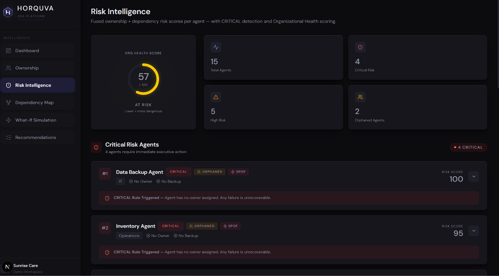
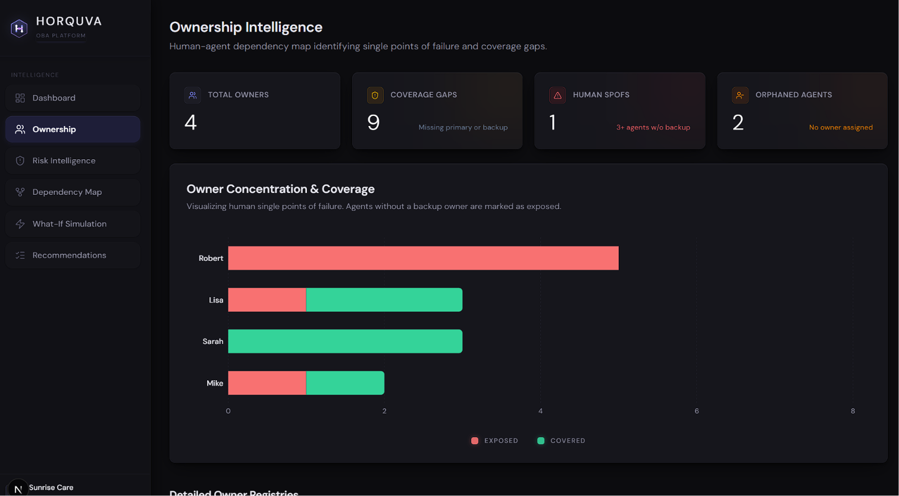
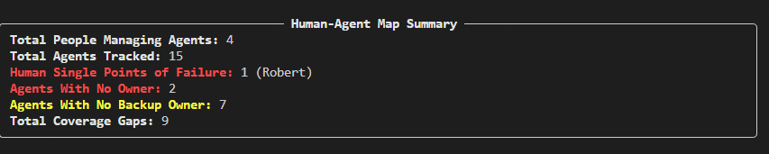
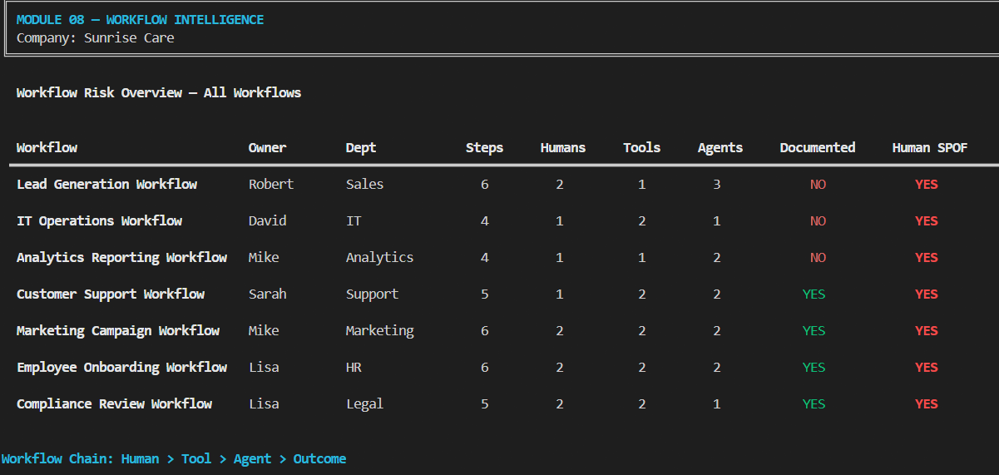
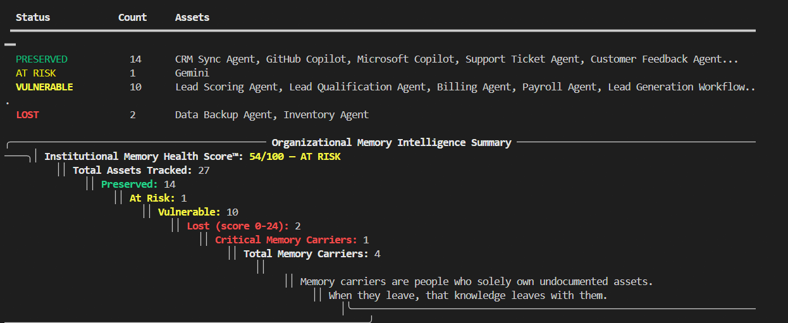

# OBA Core — AI Workforce Intelligence Engine

**Developed by Horquva · MVP Demo · Sunrise Care (Fictional Company)**

OBA Core (Organizational Brain Analysis) is an enterprise-grade intelligence engine that automatically discovers, maps, and analyzes every AI agent operating inside an organization. It answers the three questions no organization can currently answer:

- **Who owns each AI agent?**
- **What breaks — and how badly — if one fails?**
- **What happens to the organization if a key person leaves?**

OBA Core answers all of this in seconds, with full risk scoring, cascade simulation, and prioritized action plans.


<b style="font-size: 16px; font-weight: 800; color: black;">"The only thing that matters: This is actually useful." — Horquva</b>

---

## The Problem We Solve

Organizations are deploying AI agents faster than they can govern them. The result is invisible risk:

- Agents running with no owner, no documentation, no backup
- One person quietly controlling 5+ critical agents — with zero coverage
- Nobody knowing which agent failure cascades into a full department breakdown
- Leadership making decisions with no visibility into their AI infrastructure

**OBA Core makes the invisible visible.**

---

## What Was Built

OBA Core is a full-stack intelligence platform with three layers:

| Layer | Technology | Purpose |
|-------|-----------|---------|
| Intelligence Engine | Python · uv · rich | 20 analytical modules that process org data |
| Backend API | Node.js · Express · Supabase | REST API serving all intelligence data |
| Executive Dashboard | Next.js 16 · TypeScript · Tailwind · Recharts | Interactive visualization for leadership |

---

## Intelligence Modules (20 Total)

### Module 01 — Ownership Intelligence


Analyzes every AI agent across the organization and scores ownership risk.

**What it does:**
- Identifies the primary owner and backup owner for each agent
- Detects fully orphaned agents (no owner assigned whatsoever)
- Flags owner concentration risk — one person controlling too many critical agents
- Calculates a risk level per agent: `LOW / MEDIUM / HIGH / CRITICAL`

**Risk Scoring Formula:**
| Factor | Points Added |
|--------|-------------|
| No owner assigned | +40 |
| No backup owner | +30 |
| Not documented | +15 |
| Agent criticality: critical | +15 |
| Agent criticality: high | +10 |
| Agent criticality: medium | +5 |

**Score → Risk Tier:** `< 20 = LOW` · `20–39 = MEDIUM` · `40–69 = HIGH` · `70+ = CRITICAL`

**Sunrise Care findings:**
- Robert owns 5 agents — zero backups — highest single-owner concentration in the org
- 2 agents fully orphaned: Inventory Agent, Data Backup Agent
- 9 of 15 agents have no backup owner

---

### Module 02 — Dependency Intelligence


Builds a full dependency graph of all AI agents and maps cascade failure paths.

**What it does:**
- Constructs a directed dependency graph: which agents feed into which
- Detects Single Points of Failure (SPOF) — agents whose failure breaks 3+ downstream agents
- Simulates cascade failure: if Agent X goes down, which agents are affected?
- Calculates upstream depth — how deep in a dependency chain each agent sits

**Sunrise Care findings:**
- 4 Single Points of Failure identified across 15 agents
- 6 agents have 3 or more downstream cascade victims
- Onboarding Agent failure → 4 agents immediately break
- Inventory Agent failure → 4 agents immediately break

---

### Module 03 — Risk Intelligence


Fuses ownership risk and dependency data into a single composite risk score per agent, then computes the Organizational Health Score.

**What it does:**
- Combines Module 01 + Module 02 outputs into one unified risk score
- Applies CRITICAL override rule: any orphaned agent OR any SPOF with no backup = CRITICAL regardless of score
- Calculates the **Organizational Health Score (0–100)** — a single number representing how well-governed the organization's AI infrastructure is
- Produces a complete risk breakdown per agent for executive review

**Sunrise Care findings:**
- 5 agents at CRITICAL risk
- 6 agents at HIGH risk
- **Organizational Health Score: 56/100 — AT RISK**

---

### Module 04 — Recommendation Engine


Generates specific, named, prioritized actions based on every risk finding — not generic advice.

**What it does:**
- Reads every risk finding from Module 03 for every agent
- Generates a targeted recommendation per risk: names the agent, names the person, names the exact action
- Prioritizes all recommendations: CRITICAL → HIGH → MEDIUM, then Quick wins first
- Produces a Top 5 Most Urgent Actions list for immediate leadership action
- Calculates how each fix improves the Organizational Health Score

**Sunrise Care findings:**
- 12 actionable recommendations generated
- Top priority: immediately assign owners to Inventory Agent and Data Backup Agent
- Redistribute Robert's 5 agents — single departure would orphan all of them
- Recovery plan provided with projected Health Score improvement per action

---

### Module 05 — What-If Simulation Engine


Simulates every possible disruption scenario and calculates its exact impact on organizational health before it happens.

**What it does:**
- Simulates every owner leaving the organization (one by one)
- Simulates every CRITICAL/HIGH/SPOF agent failing
- Recalculates the Organizational Health Score for each scenario in real time
- Shows before → after risk level for every affected agent
- Ranks all scenarios from most dangerous to least — so leadership knows exactly where fragility lives

**Simulation logic:**
- **Person Leaves** → their agents lose primary ownership (+35 risk each), Health Score recalculated
- **Agent Fails** → failed agent reaches maximum risk (score 170), all cascade victims receive +30 risk penalty

**Sunrise Care findings:**
- **Worst scenario: Robert leaves → Health Score collapses from 56 → 49**
- 5 agents become immediately unmanaged if Robert is unavailable
- Worst agent scenario: Onboarding Agent failure drops Health Score to 47
- Every scenario ranked so leadership can prioritize risk mitigation investment

---

### Module 06 — Human-Agent Dependency Map


Maps every person in the organization to the agents they control and scores human-level coverage risk.

**What it does:**
- Builds a complete ownership tree per person: which agents they own, at what risk level
- Calculates a coverage score per person: what % of their agents have backup owners
- Identifies Human SPOFs: individuals who own 3+ agents with no backup coverage anywhere
- Lists every coverage gap across the organization with exact agent names



**Sunrise Care findings:**
- **Robert = Human SPOF** — 5 agents owned, 0% coverage, all CRITICAL or HIGH risk
- Sarah = 100% coverage — all 3 of her agents have backup owners
- 9 total coverage gaps identified across the organization
- 7 agents have a primary owner but zero backup coverage

---

### Module 07 — AI Tool Intelligence


Audits every AI tool in use across the organization — usage, risk, dependencies, and financial exposure.

**What it does:**

.png)

- Scores every AI tool for risk: ChatGPT, Claude, Gemini, Microsoft Copilot, GitHub Copilot
- Maps tool-to-agent and tool-to-workflow dependencies: if this tool goes offline, what breaks?
- Identifies tools with no backup/alternative and no usage policy
- Shows department-level exposure per tool
- Calculates total monthly AI tool spend across the organization

**Sunrise Care findings:**
- ChatGPT = CRITICAL — 7 users, 4 departments, powers 3 agents, no policy, no backup
- Microsoft Copilot = HIGH — 8 users across all 8 departments, no backup alternative
- 3 of 5 tools have no fallback option assigned
- If ChatGPT access is revoked: Lead Generation, Marketing Campaign, and Customer Support workflows all break simultaneously
- **Total monthly AI tool spend: $1,444**

---

### Module 08 — Workflow Intelligence


Maps every business workflow step by step — Human → Tool → Agent → Outcome — and scores failure risk at each node.

**What it does:**
- Visualizes every workflow as a full sequential chain with named actors at each step
- Scores each workflow for risk: ownership gaps, undocumented status, human SPOF dependency
- Identifies single-node failure points — the one person or tool whose removal collapses the entire workflow
- Surfaces workflows with no runbook, no backup owner, and no recovery path

**Sunrise Care findings:**
- 2 CRITICAL workflows: Lead Generation (Robert, no backup, undocumented) and IT Operations (David, no backup, undocumented)
- All 7 workflows have exactly one human dependency — no workflow survives its owner leaving
- 14 single-node failure points identified across all workflows
- 3 workflows have zero documentation: Lead Generation, IT Operations, Analytics Reporting

---

### Module 09 — Knowledge Risk Intelligence


Maps where critical organizational knowledge is stored — in people's heads — and calculates what disappears if they leave.

**What it does:**

.png)

- Calculates a Knowledge Concentration Score per person (0–100%)
- Identifies sole knowledge holders: people who are the only ones who know how a critical asset works
- Lists every undocumented agent, workflow, and AI tool across the organization
- Maps exactly which assets are unrecoverable if a specific person leaves today
- Surfaces knowledge gaps: assets with no documentation AND no backup owner

**Sunrise Care findings:**
- Robert = CRITICAL knowledge concentration (100%) — sole owner of 5 agents + 1 workflow, all undocumented
- Mike and Lisa = HIGH concentration risk (64% and 54%)
- 13 total undocumented assets across agents, workflows, and tools
- If Robert leaves today: 6 assets are permanently unrecoverable with no documentation and no backup

---

### Module 10 — Organizational Memory Intelligence


Tracks the institutional memory preservation status of every AI asset and calculates how much organizational knowledge would survive a major personnel disruption.

**What it does:**
- Assigns a memory status to every asset: `PRESERVED / AT RISK / VULNERABLE / LOST`
- Calculates the **Institutional Memory Health Score™ (0–100)**
- Identifies critical memory carriers — individuals who are the sole holders of undocumented knowledge
- Flags assets classified as LOST: no owner, no documentation, no recovery path

**Memory Status Definitions:**
| Status | Meaning |
|--------|---------|
| PRESERVED | Documented + backup owner exists |
| AT RISK | Has backup but lacks documentation |
| VULNERABLE | Has documentation but no backup owner |
| LOST | No owner, no documentation — unrecoverable |

**Sunrise Care findings:**
- PRESERVED: 14 assets · VULNERABLE: 10 assets · AT RISK: 1 asset · LOST: 2 assets
- Robert = CRITICAL memory carrier — sole holder of 7 assets, 6 of which are undocumented
- David = HIGH risk — sole carrier of IT Operations Workflow + both IT tools, all undocumented
- **Institutional Memory Health Score: 54/100 — AT RISK**

---

### Module 11 — Predictive Risk Intelligence

Predicts which agents are *likely* to escalate to high/critical risk in the near future and surfaces emerging threats before they happen — an explainable, weighted ML-style risk model.

**What it does:**
- Scores every agent on a forward-looking risk model using current criticality, dependency exposure, owner/backup coverage, AI-tool (platform) health, and critical-workflow membership
- Classifies each agent's predicted threat: `LOW / MEDIUM / HIGH / CRITICAL`
- Flags emerging threats — agents not critical today but predicted to become critical
- Gives a plain-English reason list per agent for full explainability

**Sunrise Care findings:**
- 4 agents predicted at CRITICAL threat, 2 at HIGH, 8 at MEDIUM
- Heavy dependency exposure + missing backups are the top escalation drivers
- Orphaned agents (Inventory, Data Backup) carry the highest predicted risk

---

### Module 12 — Organizational Forecasting Intelligence

Forecasts the future state of the organization across Health, Memory, and Continuity, and projects a 30 / 60 / 90 day outlook.

**What it does:**
- **Health Forecast** — will the agent + tool ecosystem degrade?
- **Memory Forecast** — risk of losing institutional knowledge when key owners leave (no backup / no docs)
- **Continuity Forecast** — can workflows keep running under stress (criticality-weighted resilience)?
- Rolls the three forecasts into a single 90-Day Organizational Outlook

**Sunrise Care findings:**
- **90-Day Organizational Outlook: 52/100 — AT RISK**
- Memory is the weakest dimension — knowledge concentrated on a few owners with no backup
- Several critical workflows are fragile (no backup owner, undocumented)

---

### Module 13 — Human-AI Collaboration Intelligence

Analyzes the human side of the AI ecosystem — adoption, dependency concentration, and how effective human-agent pairing really is.

**What it does:**
- **AI Adoption Score** — how broadly the workforce engages with AI tools
- **Human Dependency Score** — whether individuals are over-relied-upon (too many critical agents/workflows on one person)
- **Collaboration Score** — effectiveness of human-agent pairing (documented + backed-up ownership)
- Surfaces the people at highest dependency risk and departments with weak AI coverage

**Sunrise Care findings:**
- **AI Adoption: 100/100** — every named staff member uses at least one AI tool
- **Human Dependency: 54/100** — dangerous concentration (Robert carries the most critical load)
- **Collaboration: 40/100** — most agents still lack documentation or a backup owner

---

### Module 14 — Decision Intelligence

Reconstructs the key organizational decisions encoded in the data, builds a decision trail for each, and scores how sound each decision was — answering *why* a decision was made, *what influenced it*, and *was it the right call*.

**What it does:**
- Treats every ownership assignment, tool adoption, and workflow setup as an explicit **decision** and rebuilds its **decision trail** (the reasoning chain that led to it)
- Surfaces the **influences** behind each decision: criticality, owner concentration, backup coverage, documentation, fallback availability
- Scores **Decision Quality** per decision: `GOOD / ACCEPTABLE / POOR / HARMFUL`
- Computes a single org-wide **Decision Quality Index (0–100)** so leadership can see whether the org's past decisions are sound, mixed, or weak
- Generates a targeted fix for every poor or harmful decision

**Decision Quality Scoring (start 100, penalties applied):**
| Factor | Penalty |
|--------|---------|
| Asset left with no owner (orphaned) | −65 (ownership) / −50 (workflow) |
| No backup owner chosen | −25 |
| Deployed without documentation / runbook | −15 to −20 |
| Owner already concentrates 5+ agents | −20 |
| Critical asset/tool/workflow with no backup or fallback | −15 to −20 |
| Critical tool adopted with no fallback selected | −30 |

**Score → Quality Tier:** `80+ = GOOD` · `55–79 = ACCEPTABLE` · `30–54 = POOR` · `< 30 = HARMFUL`

**Sunrise Care findings:**
- 27 organizational decisions audited across ownership, tooling, and workflows
- 3 HARMFUL decisions — all assigning a **critical agent to Robert with zero backup** (Lead Scoring, Lead Qualification, Billing)
- 8 POOR decisions, including adopting **ChatGPT as a critical tool with no fallback** and leaving Inventory + Data Backup agents unassigned
- **Decision Quality Index: 67/100 — MIXED**

---

### Module 15 — Verification Intelligence

Tracks and verifies every action taken across the organization — by humans, AI agents, or tools — and flags actions that violate ownership or policy rules.

**What it does:**
- Logs every action taken in every workflow with actor type, actor name, and outcome
- Verifies whether each action is policy compliant and properly accountable
- Flags actions performed by known single points of failure (e.g. unbacked owners)
- Produces a full verification record with status: `COMPLETED / FLAGGED / FAILED / PENDING`

**Sunrise Care findings:**
- 36 total actions verified across 7 workflows
- 2 actions flagged — both performed by Robert, due to zero backup coverage
- 2 policy violations identified
- 0 unverified actions

---

### Module 16 — Workflow Orchestration Intelligence

Determines the next step in every workflow, assigns it to the correct actor, and detects collisions where multiple workflows compete for the same human, agent, or tool.

**What it does:**
- Tracks current step and total steps for every active workflow
- Identifies the next actor (human, agent, or tool) responsible for the next step
- Detects collisions — cases where the same actor is required by 2+ workflows simultaneously
- Flags workflows as `BLOCKED` when a collision risk is detected

**Sunrise Care findings:**
- 7 workflows orchestrated
- 17 collisions detected — including ChatGPT shared across 3 workflows, Microsoft Copilot overloaded across 5 workflows, and Lisa required by 2 workflows simultaneously
- All 7 workflows currently flagged `BLOCKED` due to unresolved collisions

---

### Module 17 — Organizational Learning Intelligence

Enables the system to learn from the organization's current state — failure patterns, decision follow-through, and incident exposure — and scores overall learning maturity.

**What it does:**
- **Learn from Failures** — identifies failure-prone assets (undocumented + unbacked + critical) and likely repeat offenders
- **Learn from Decisions** — measures how many known risks are still unmitigated (critical assets without backup / docs)
- **Learn from Incidents** — ranks departments by incident exposure (weakest documentation + backup coverage)
- Computes an overall **Learning Maturity Score**

**Sunrise Care findings:**
- **Learning Maturity: 40/100 — EARLY STAGE**
- Several critical assets show repeatable weakness patterns (undocumented + no backup)
- Departments with the lowest documentation + backup coverage are the most incident-prone

---

### Module 18 — Organizational Continuity Intelligence

Scores every asset on its ability to survive a major disruption (a key person leaving or a tool going offline), identifies exactly what must be protected, and produces concrete continuity plans — answering *what survives*, *what fails*, and *what must be protected*.

**What it does:**
- Assigns a **Continuity Score (0–100)** to every agent, workflow, and AI tool — the likelihood it survives a major disruption
- Classifies each asset: `SURVIVES / DEGRADED / FAILS / LOST`
- Builds a **Continuity Risk Map** at the department level — average continuity and at-risk counts per department
- Identifies **what must be protected**: critical/high assets that would Fail or be Lost
- Generates a **Continuity Plan** per must-protect asset (assign owner, name backup, document + store runbook, select fallback)
- Computes the org-wide **Organizational Continuity Score (0–100)**

**Continuity Status Definitions:**
| Status | Meaning |
|--------|---------|
| SURVIVES | Owned, backed up, and documented — recoverable |
| DEGRADED | Partial coverage — survives but with disruption |
| FAILS | Missing backup or documentation — does not survive cleanly |
| LOST | No owner, no backup, no documentation — unrecoverable |

**Sunrise Care findings:**
- 27 assets assessed — 12 SURVIVES · 3 DEGRADED · 10 FAILS · 2 LOST
- 2 assets classified LOST: **Data Backup Agent (0/100)** and **Inventory Agent (2/100)**
- **IT department is the most fragile — 18/100 average continuity**
- 10 critical/high assets flagged as **must be protected**, each with a generated continuity plan
- **Organizational Continuity Score: 63/100 — AT RISK**

---

### Module 19 — Governance Intelligence

Scores how well every asset is governed — owner accountability, documentation, and policy coverage — and builds a department-level governance heatmap with gap detection.

**What it does:**
- Assesses each entity (agent, tool, workflow) for governance: owner assigned, documented, policy coverage, policy freshness
- Scores each entity 0—100 and classifies it `HEALTHY / WARNING / AT RISK / CRITICAL`
- Builds a governance heatmap and detects governance gaps ranked by severity
- Computes an org-wide Governance Score

**Sunrise Care findings:**
- **Governance Score: 47/100 — AT RISK**
- No formal governance policies cover most assets — ownership and documentation gaps dominate
- High-criticality, undocumented, unbacked assets are the worst governance offenders

---

### Module 20 — Accountability Intelligence

Builds RACI-style accountability links for every asset — who is Responsible, Accountable, Consulted, Informed — maps responsibility chains, and scores accountability coverage.

**What it does:**
- Derives accountability links (Responsible / Accountable / Consulted / Informed / Decision Authority) for each entity
- Builds responsibility chains and detects weak structures (e.g. same person Responsible *and* Accountable)
- Scores each entity and computes an org-wide Accountability Score

**Sunrise Care findings:**
- **Accountability Score: 76/100 — WARNING**
- 13 entities carry accountability links, but **7 have the same person Responsible and Accountable** — no separation of duties
- Only 4 unique people appear across all responsibility chains — heavy concentration

---

### Intelligence Platform Foundation (Phase 2)

The shared data + intelligence backbone that powers the Governance and Accountability modules and standardizes how every pillar reads organizational data.

**What it provides:**
- **Organizational Data Models** — typed entities for agents, tools, workflows, policies, accountability links, and governance gaps
- **Intelligence Pipeline** — normalizes raw org data into a single comparable entity surface and derives policies + accountability links
- **Governance Data Framework** — reusable governance scoring, heatmap, and gap-detection logic
- **Intelligence Storage Layer** — persists pillar analyses and a queryable intelligence index

---

### Organizational Intelligence Engine — Five Pillars Integration (Phase 2)

The platform foundation that connects every individual module into one unified system. Instead of reading 14 separate reports, leadership gets a single integrated view built on three layers — **Intelligence Logic** (shared signals derived from every asset), **Intelligence Relationships** (how one weakness drags others down), and **Intelligence Scoring** (one comparable score per dimension) — rolled up across the **Five Pillars**.

**The Five Pillars:**
| Pillar | Code | What it measures |
|--------|------|------------------|
| Domain Intelligence | DI | Is the organization mapped — ownership, dependencies, documented domain? |
| Memory Intelligence | MI | What knowledge is retained vs. trapped in one person's head? |
| Operational Intelligence | OI | Can day-to-day operations absorb a person or tool going down? |
| Organizational Continuity Intelligence | OCI | What survives a major disruption (criticality-weighted)? |
| Governance Intelligence | GI | Accountability and compliance — owners, backups, documentation? |

**How it works:**
- **Intelligence Logic** — flattens agents, workflows, and AI tools into one comparable asset surface and derives shared signals (ownership, backup, documentation, dependency and criticality coverage)
- **Intelligence Scoring** — scores each pillar 0–100 (`STRONG / MODERATE / WEAK / CRITICAL`) and rolls them into one **Organizational Intelligence Score**
- **Intelligence Relationships** — flags when a weak pillar drags another (e.g. weak Memory → weaker Continuity), so leadership fixes the root cause instead of the symptom

**Rating bands:** `80+ = STRONG` · `60–79 = MODERATE` · `40–59 = WEAK` · `< 40 = CRITICAL`

**Sunrise Care findings:**
| Pillar | Score | Rating |
|--------|-------|--------|
| Domain Intelligence (DI) | 81/100 | STRONG |
| Memory Intelligence (MI) | 53/100 | WEAK |
| Operational Intelligence (OI) | 41/100 | WEAK |
| Organizational Continuity Intelligence (OCI) | 56/100 | WEAK |
| Governance Intelligence (GI) | 55/100 | WEAK |

- The domain is well-mapped (ownership on 25/27 assets), but **Memory, Operational, Continuity and Governance are all weak** — knowledge lives in people's heads, not documents
- 4 dragging relationships detected — **MI→OCI, OI→OCI, GI→DI, GI→OCI** — weak governance and memory are the root cause pulling continuity down
- **Organizational Intelligence Score: 57/100 — WEAK**

---

## Architecture Layers (Phase 3 — Ontology · Relationship · Reasoning · Truth · Context · Voice)

These six architecture layers turn 20 independent modules into one coherent Organizational Brain. Until now every module could form its own opinion about the same entity, which created overlap and contradiction (e.g. Dependency and Accountability both reasoning about ownership). With Phase 3, **modules no longer make decisions — they generate signals**, and a single Truth Layer reconciles those signals into one authoritative answer with confidence, evidence, and freshness.

```
Ontology  →  Relationship  →  Modules emit signals  →  Reasoning  →  Truth  →  Context + Voice
(what exists) (how connected)    (20 perspectives)        (insight)   (one truth)  (executive + voice access)
```

### Architecture Layer A1 — Ontology Layer — *Defines what exists*

The formal vocabulary of the Organizational Brain. Every entity is registered here, under a defined type, before any module is allowed to reference it. This guarantees all 20 modules talk about the same entities in the same language.

- **Entity types defined:** Human · Team · AI Agent · System · Workflow · Knowledge
- **Relationship vocabulary defined:** `owns` · `depends_on` · `governs` · `collaborates_with`
- Tacit (undocumented) knowledge is promoted into explicit **Knowledge** entities so it becomes visible and trackable.

**Sunrise Care:** 55 entities registered across 6 types — 8 Human, 9 Team, 15 AI Agent, 5 System, 7 Workflow, 11 Knowledge.

### Architecture Layer A2 — Relationship Layer — *Defines how everything connects*

The graph the Brain navigates when reasoning about the organization. It maps every connection between entities using the ontology's relationship vocabulary, then surfaces the most connected nodes (hubs) — the structural pressure points.

| Relationship | Count |
|--------------|-------|
| owns | 25 |
| depends_on | 43 |
| governs | 14 |
| collaborates_with | 56 |

**Sunrise Care:** 138 relationships mapped. Biggest hubs — **Robert (29 connections)**, Lisa (28), Sarah (24) — confirming structural over-concentration around a few people.

### Architecture Layer A3 — Reasoning Layer — *Turns signals into understanding*

Raw module signals are just facts ("no backup", "undocumented"). The Reasoning Layer connects related signals into **insight** — the *so what* and the *why* — with an explicit reasoning chain, so leadership sees conclusions, not just data points.

- Detects patterns: knowledge concentration, single-point-of-failure cascades, compound risk (undocumented **and** no backup), and systemic documentation gaps.
- Every insight carries a step-by-step reasoning chain and the evidence behind it.

**Sunrise Care:** 16 insights generated (9 CRITICAL, 7 HIGH). Top conclusion — *Robert is a structural single point of failure*, reasoned from ownership + documentation + backup signals.

### Architecture Layer A4 — Truth Layer — *One organizational truth*

The authority layer. Every module's view of an entity arrives as a **signal**; the Truth Layer combines them, resolves disagreements, and produces one determined truth per entity — each carrying:

- **Confidence** — how strongly the modules agree (disagreement caps confidence).
- **Evidence** — the full signal trail behind every verdict (auditability).
- **Freshness** — Fresh / Aging / Stale, based on documentation and backup coverage.

**Sunrise Care findings:**
| Metric | Result |
|--------|--------|
| Entities reconciled | 27 |
| Signals combined | 135 |
| CRITICAL truths determined | 4 |
| HIGH truths determined | 9 |
| Contradictions resolved into a single truth | 18 |
| Trust Score (avg confidence across the Brain) | **75%** |

- Example reconciliation — *Inventory Agent*: Risk/Knowledge/Continuity signals say HIGH, but Ownership/Dependency say LOW → Truth Layer resolves to **HIGH at 60% confidence** and flags the contradiction with its full evidence trail, instead of letting modules silently disagree.

### Architecture Layer A5 — Context Intelligence Layer — *Real-time executive context*

Packages live organizational context per scope (department/team) so every Executive Avatar interaction is situationally aware instead of generic. Each package carries the scope's assets, owners, tools, and active risk items.

**Sunrise Care:** 9 context packages built across 22 assets, surfacing 10 active risk items. Highest-pressure scope right now: **Sales**.

### Architecture Layer A6 — Voice Agent Context Layer — *Semantic foundation for voice*

The layer that lets a Voice Agent understand *which* entity a person means (entity + alias resolution) and answer organizational questions in natural language, grounded in the ontology.

**Sunrise Care:** 35 voice-resolvable entities with 76 name aliases mapped, and 9 ready-to-answer intents — e.g. *"Who owns the Lead Scoring Agent?"* → resolves the entity → *"Robert — and there is no backup owner, so it is a single point of failure."*

---
## Executive & Network Intelligence Modules (21–35)

These 13 modules extend the 20 core modules above. They run on the extended organizational dataset (now including history, incidents, decisions, external entities, and knowledge areas) and will re-validate against the production dataset when the backend delivers it.

### Module 21 — Executive Avatar Intelligence

A single executive-facing persona that answers leadership questions directly from the Organizational Brain, instead of making executives read 20 separate reports.

**What it does:**
- Accepts plain leadership questions ("What is my biggest risk?", "Who is overloaded?")
- Pulls the answer live from ownership, risk, and continuity signals
- Always names the specific entity and person behind each answer
- Acts as the conversational front-door to every other module

**Sunrise Care findings:**
- Biggest risk surfaced: a critical agent with no backup owner
- Most overloaded person: Robert (heaviest ownership concentration)
- 4 executive questions answered directly from live data

---

### Module 22 — Voice Intelligence Engine

Turns spoken questions into answers by classifying intent and resolving the entity against the ontology.

**What it does:**
- Classifies each spoken question into an intent: `ownership / risk / status / general`
- Resolves which entity the speaker means (e.g. "the Payroll Agent")
- Returns a natural-language answer grounded in real data
- Produces a short spoken daily summary for voice playback

**Sunrise Care findings:**
- 4 voice queries resolved across ownership, risk, and status intents
- Example: *"Is the Payroll Agent a risk?"* → "Yes — owned by Lisa, no backup, undocumented."

---

### Module 23 — Executive Briefing Intelligence

Auto-generates the daily "top things to know" by pulling the most important signal from across the whole Brain.

**What it does:**
- Surfaces the top unresolved single points of failure
- Highlights the most overloaded owner
- Reports the latest incident and its lesson
- Tracks the documentation trend over time and flags pending decisions

**Sunrise Care findings:**
- 5-point executive briefing generated automatically
- Documentation trend: 28% → 35% over 4 months (still below safe levels)
- Flags critical no-backup agents as the #1 item every day

---

### Module 24 — Decision Support Intelligence

Turns raw risk findings into a prioritized "what to do next" queue, and reviews how past decisions turned out.

**What it does:**
- Converts every risk into a concrete decision with impact, effort, and urgency
- Prioritizes the queue: critical no-backup and undocumented assets first
- Reviews the decision log for choices that went negative, mixed, or are still pending
- Gives leadership a ranked action list instead of a wall of risks

**Sunrise Care findings:**
- 19 prioritized decisions queued
- Top action: assign a backup owner to the highest-criticality unprotected asset
- Flags past decisions (e.g. "defer backup-owner assignment") for revisit

---

### Module 25 — Organizational Health Intelligence

A single composite health index across all resilience dimensions, with a trend direction from historical snapshots.

**What it does:**
- Scores four dimensions: Documentation, Continuity (backups), Ownership spread, Critical safety
- Combines them into one Organizational Health Index (0–100)
- Uses the monthly history to determine whether things are improving or declining
- Classifies overall state: `CRITICAL / WARNING / STABLE`

**Sunrise Care findings:**
- **Organizational Health Index: 46/100 — WARNING**
- Trend: **improving** (risk index falling month over month)
- Weakest dimension: backup coverage

---

### Module 26 — Executive Memory Intelligence

Remembers what leadership should not forget — recurring patterns, lessons from past incidents, and decisions that went wrong.

**What it does:**
- Detects recurring incident patterns (the same failure type happening again)
- Surfaces lessons attached to every critical incident
- Flags decisions that turned out negative
- Identifies "hero dependency" — one person repeatedly resolving incidents

**Sunrise Care findings:**
- 4 memory items surfaced from 6 recorded incidents
- Recurring outages flagged as a pattern, not one-offs
- Hero-risk detected: a single person resolving multiple incidents

---

### Module 27 — Executive Context Intelligence

Ranks "what matters right now" so leaders focus on the most urgent context first.

**What it does:**
- Pulls open incidents, critical SPOFs, pending decisions, and weak metrics into one feed
- Scores each item by urgency: `CRITICAL / HIGH / MEDIUM / LOW`
- Sorts the feed so the most pressing context is always on top
- Gives the Executive Avatar its situational awareness

**Sunrise Care findings:**
- 16 context items ranked by urgency
- Critical single points of failure rank at the top of the "what matters now" feed

---

### Module 28 — Universal Dependency Graph

Builds one dependency graph across the entire organization — agents, tools, workflows **and** people — not just agent-to-agent links.

**What it does:**
- Connects every entity type into a single directed graph
- Computes each node's blast radius (how many things depend on it)
- Finds the longest dependency chain in the organization
- Becomes the shared graph that Modules 34 and 35 reason over

**Sunrise Care findings:**
- 39 nodes connected by 58 dependency edges
- Longest dependency chain: 6 hops deep
- Highest blast-radius nodes are the most dangerous to lose

---

### Module 29 — Organizational Relationship Intelligence

Scores the *health* of every ownership/backup relationship, not just whether it exists.

**What it does:**
- Rates each relationship 0–100 based on backup presence and documentation
- Classifies each as `healthy / at risk / fragile`
- Counts fragile, single-link relationships that would break on one departure
- Tracks reciprocal backup links between people

**Sunrise Care findings:**
- Average relationship strength: 72/100
- 9 fragile relationships (single owner, no backup or docs)

---

### Module 30 — Knowledge Concentration Intelligence

Pinpoints where critical knowledge is dangerously concentrated in too few people.

**What it does:**
- Measures how much critical knowledge each person holds
- Calculates the organization's **bus factor** (how few people hold 50% of critical knowledge)
- Reports the share held by the single most critical person
- Flags critical knowledge areas with only a single holder

**Sunrise Care findings:**
- **Bus factor: 2** — losing 2 people removes half of critical knowledge
- Top person holds 40% of all critical knowledge
- 4 critical knowledge areas have a single holder

---

### Module 31 — Organizational Ecosystem Intelligence

Maps the full ecosystem — internal tools plus external vendors and platforms — and measures external dependency exposure.

**What it does:**
- Links external entities (OpenAI, Anthropic, GitHub, Supabase, Stripe, Slack) to the internal assets that rely on them
- Counts how many internal assets each external entity ultimately supports
- Flags critical external dependencies that have no alternative
- Surfaces external single points of failure outside the company's control

**Sunrise Care findings:**
- 6 external entities mapped against 5 internal tools
- 3 critical external dependencies identified

---

### Module 34 — Hidden Dependency Intelligence

Surfaces indirect couplings that no single module can see on its own.

**What it does:**
- Detects transitive dependencies (A → B → C means A silently depends on C)
- Finds shared-resource coupling (assets sharing the same tool fail together)
- Finds shared-owner coupling (assets joined only through one person)
- Exposes second-order risk that looks safe in any single view

**Sunrise Care findings:**
- 18 hidden dependencies discovered across transitive, shared-resource, and shared-owner types
- Reveals couplings that ownership or dependency views alone would miss

---

### Module 35 — Organizational Network Intelligence

Applies network science to reveal who actually holds the organization together and where it bottlenecks.

**What it does:**
- Builds the people network from shared tools and backup relationships
- Computes centrality to find the most connected people
- Identifies the primary bottleneck through whom information flows
- Flags weakly-connected or isolated people

**Sunrise Care findings:**
- Primary bottleneck (highest centrality): **Robert**
- Confirms structural over-reliance on a small core of people

---

> The remaining advanced modules (Autonomous Advisor, Brain Core Logic, etc.) are intentionally **not** built yet — scope stops here.

---
## Demo Results Summary


| Metric | Result |
|--------|--------|
| Total Agents Analyzed | 15 |
| CRITICAL Risk Agents | 5 |
| HIGH Risk Agents | 6 |
| Single Points of Failure (Agent) | 4 |
| Human Single Points of Failure | 1 (Robert) |
| Robert's Agents (zero backups) | 5 → all CRITICAL |
| Worst Scenario: Robert Leaves | Health Score: 56 → 49 |
| Organizational Health Score | **56/100 — AT RISK** |
| Institutional Memory Health Score | **54/100 — AT RISK** |
| Actionable Recommendations Generated | 12 |
| Total Coverage Gaps | 9 |
| Total Undocumented Assets | 13 |
| Total Knowledge Gaps | 15 |
| Total Monthly AI Tool Spend | $1,444 |
| Total Actions Verified (Module 15) | 36 |
| Total Workflow Collisions Detected (Module 16) | 17 |
| Total Decisions Audited (Module 14) | 27 |
| Decision Quality Index (Module 14) | **67/100 — MIXED** |
| Assets That Must Be Protected (Module 18) | 10 |
| Organizational Continuity Score (Module 18) | **63/100 — AT RISK** |
| Predicted Critical Threats (Module 11) | 4 |
| 90-Day Organizational Outlook (Module 12) | **52/100 — AT RISK** |
| AI Adoption / Human Dependency / Collaboration (Module 13) | 100 / 54 / 40 |
| Learning Maturity (Module 17) | **40/100 — EARLY STAGE** |
| Governance Score (Module 19) | **47/100 — AT RISK** |
| Accountability Score (Module 20) | **76/100 — WARNING** |
| Organizational Intelligence Score (Engine — Five Pillars) | **57/100 — WEAK** |
| Ontology Entities Registered (Layer A1) | 55 across 6 types |
| Relationships Mapped (Layer A2) | 138 |
| Reasoning Insights Generated (Layer A3) | 16 (9 CRITICAL) |
| Contradictions Resolved by Truth Layer (Layer A4) | 18 |
| Brain Trust Score (Layer A4) | **75%** |
| Context Packages Built (Layer A5) | 9 scopes |
| Voice-Resolvable Entities (Layer A6) | 35 (76 aliases) |
| Decision Queue (Module 24) | 19 prioritized |
| Organizational Health (Module 25) | **46/100 — WARNING (improving)** |
| Universal Dependency Graph (Module 28) | 39 nodes · 58 edges |
| Knowledge Bus Factor (Module 30) | **2** |
| Hidden Dependencies Found (Module 34) | 18 |

---
## How to Run

### 1 — Python Intelligence Engine

Runs all 20 modules in sequence and prints full analysis to the terminal.

```bash
# Install dependencies (requires uv)
uv sync

# Run all 20 modules
uv run main.py
```

> This project uses [uv](https://github.com/astral-sh/uv) as the Python package manager.
> All dependencies are declared in `pyproject.toml` and locked in `uv.lock`.

---

### 2 — Backend API (Node.js + Express + Supabase)

```bash
cd backend

# Install dependencies
npm install

# Start the server
node index.js
```

Server starts on **`http://localhost:3000`**

#### All API Endpoints

| Endpoint | Module | Description |
|----------|--------|-------------|
| `GET /api/agents` | 01 | All agents with ownership, risk level, and metadata |
| `GET /api/ownership` | 01 | Owners mapped to their agents with risk scores |
| `GET /api/dependencies` | 02 | Full dependency graph with cascade relationships |
| `GET /api/risks` | 03 | Composite risk score breakdown per agent |
| `GET /api/dashboard` | 03 | Executive summary: health score, critical counts, orphan count |
| `GET /api/human-agent-map` | 06 | Person → agents ownership tree with coverage scores |
| `GET /api/tools` | 07 | All AI tools with user counts and risk levels |
| `GET /api/tool-intelligence` | 07 | Tool risk analysis with department exposure |
| `GET /api/tool-impact` | 07 | Impact simulation: what breaks if a tool goes offline |
| `GET /api/workflows` | 08 | All workflows with step chains and risk scores |
| `GET /api/knowledge/intelligence` | 09 | Knowledge concentration scores per person |
| `GET /api/knowledge/impact` | 09 | Asset loss mapping per person departure |
| `GET /api/knowledge/gaps` | 09 | All undocumented assets with no backup |
| `GET /api/memory` | 10 | Institutional memory status per asset |
| `GET /api/simulations/employee-leaves` | 05 | Health Score impact when a person leaves |
| `GET /api/simulations/agent-fails` | 05 | Health Score impact when an agent fails |
| `GET /api/simulations/platform-down` | 05 | Health Score impact when a tool goes offline |
| `GET /api/simulations/workflow-disruption` | 05 | Health Score impact when a workflow breaks |
| `GET /api/predictive-risk/summary` | 11 | Predicted risk counts: critical, high, medium, emerging |
| `GET /api/predictive-risk/agents` | 11 | Per-agent predicted risk escalation with classification |
| `GET /api/predictive-risk/critical` | 11 | Only agents predicted to reach CRITICAL risk |
| `GET /api/predictive-risk/emerging` | 11 | Emerging threats detected before failure |
| `GET /api/predictive-risk/agent/:name` | 11 | Predicted risk detail for a single agent |
| `GET /api/forecast/summary` | 12 | 30/60/90-day organizational outlook summary |
| `GET /api/forecast/health` | 12 | Forecasted organizational health trajectory |
| `GET /api/forecast/memory` | 12 | Forecasted institutional memory trajectory |
| `GET /api/forecast/continuity` | 12 | Forecasted continuity / survival trajectory |
| `GET /api/forecast/outlook` | 12 | Overall organizational outlook score |
| `GET /api/collaboration/adoption` | 13 | AI adoption across the workforce |
| `GET /api/collaboration/dependency` | 13 | Human dependency concentration |
| `GET /api/collaboration/score` | 13 | Human-AI collaboration effectiveness score |
| `GET /api/collaboration/people` | 13 | Per-person collaboration profile |
| `GET /api/collaboration/departments` | 13 | Per-department collaboration breakdown |
| `GET /api/decisions/index` | 14 | Decision Quality Index |
| `GET /api/decisions/all` | 14 | All reconstructed decisions with quality scores |
| `GET /api/decisions/harmful` | 14 | Decisions scored as HARMFUL |
| `GET /api/decisions/trail/:id` | 14 | Full decision trail for one decision |
| `GET /api/decisions/recommendations` | 14 | Decision-improvement recommendations |
| `GET /api/verification/summary` | 15 | Total counts: completed, flagged, violations |
| `GET /api/verification/actions` | 15 | All tracked actions (human / agent / tool) |
| `GET /api/verification/flagged` | 15 | Only flagged / non-compliant actions |
| `GET /api/verification/actor/:name` | 15 | Verification record for a single actor |
| `GET /api/orchestration/summary` | 16 | Total counts: running, blocked, collisions |
| `GET /api/orchestration/workflows` | 16 | All workflow orchestration states |
| `GET /api/orchestration/collisions` | 16 | Detected actor collisions across workflows |
| `GET /api/orchestration/blocked` | 16 | Workflows currently blocked by shared resources |
| `GET /api/learning/summary` | 17 | Learning Maturity Score summary |
| `GET /api/learning/failures` | 17 | Failure patterns analyzed across the org |
| `GET /api/learning/decisions` | 17 | Learning signals derived from past decisions |
| `GET /api/learning/incidents` | 17 | Incident exposure history |
| `GET /api/learning/departments` | 17 | Per-department learning maturity |
| `GET /api/continuity/score` | 18 | Organizational continuity score |
| `GET /api/continuity/assets` | 18 | Asset survival: SURVIVES / DEGRADED / FAILS / LOST |
| `GET /api/continuity/risk-map` | 18 | Continuity risk map across assets |
| `GET /api/continuity/must-protect` | 18 | Critical assets that must be protected |
| `GET /api/continuity/plans` | 18 | Generated continuity plans for critical assets |
| `GET /api/governance/score` | 19 | Governance score |
| `GET /api/governance/assets` | 19 | Per-asset governance status |
| `GET /api/governance/heatmap` | 19 | Governance heatmap by department |
| `GET /api/governance/gaps` | 19 | Ownership and documentation gaps |
| `GET /api/governance/offenders` | 19 | Worst governance offenders |
| `GET /api/accountability/score` | 20 | Accountability score (RACI model) |
| `GET /api/accountability/entities` | 20 | RACI entities: Responsible / Accountable / Consulted / Informed |
| `GET /api/accountability/chains` | 20 | Accountability chains across the org |
| `GET /api/accountability/issues` | 20 | Accountability gaps and conflicts |

#### Environment Setup

```bash
# Copy the template
cp backend/.env.example backend/.env
```

Fill in your Supabase credentials in `backend/.env`:

```
SUPABASE_URL=your_supabase_project_url
SUPABASE_KEY=your_supabase_secret_key
PORT=3000
```

> `.env` is git-ignored and must never be committed to version control.

---

### 3 — Executive Frontend Dashboard

```bash
cd frontend

# Install dependencies
npm install

# Start the dev server
npm run dev
```

Dashboard runs on **`http://localhost:3001`**

Also accessible on your local network at **`http://<your-ip>:3001`**

---

## Project Structure

```
OBA-Core-Horquva/
│
├── data/
│   └── sunrise_care.json                      # Demo dataset (120 employees, 15 agents)
│
├── modules/
│   ├── __init__.py
│   ├── ownership_intelligence.py              # Module 01 — Ownership Intelligence
│   ├── dependency_intelligence.py             # Module 02 — Dependency Intelligence
│   ├── risk_intelligence.py                   # Module 03 — Risk Intelligence
│   ├── recommendation_engine.py               # Module 04 — Recommendation Engine
│   ├── whatif_simulation.py                   # Module 05 — What-If Simulation
│   ├── human_agent_map.py                     # Module 06 — Human-Agent Map
│   ├── ai_tool_intelligence.py                # Module 07 — AI Tool Intelligence
│   ├── workflow_intelligence.py               # Module 08 — Workflow Intelligence
│   ├── knowledge_risk_intelligence.py         # Module 09 — Knowledge Risk Intelligence
│   ├── organizational_memory_intelligence.py  # Module 10 — Organizational Memory
│   ├── predictive_risk_intelligence.py        # Module 11 — Predictive Risk Intelligence
│   ├── organizational_forecasting_intelligence.py # Module 12 — Organizational Forecasting
│   ├── human_ai_collaboration_intelligence.py # Module 13 — Human-AI Collaboration
│   ├── decision_intelligence.py               # Module 14 — Decision Intelligence
│   ├── verification_intelligence.py           # Module 15 — Verification Intelligence
│   ├── workflow_orchestration_intelligence.py # Module 16 — Workflow Orchestration
│   ├── organizational_learning_intelligence.py # Module 17 — Organizational Learning
│   ├── organizational_continuity_intelligence.py # Module 18 — Organizational Continuity
│   ├── governance_intelligence.py             # Module 19 — Governance Intelligence
│   ├── accountability_intelligence.py         # Module 20 — Accountability Intelligence
│   ├── data_models.py                         # Phase 2 — Platform Foundation: data models
│   ├── intelligence_pipeline.py               # Phase 2 — Platform Foundation: pipeline
│   ├── governance_data_framework.py           # Phase 2 — Platform Foundation: governance framework
│   ├── storage_layer.py                       # Phase 2 — Platform Foundation: storage layer
│   └── organizational_intelligence_engine.py  # Phase 2 — Organizational Intelligence Engine
│
├── backend/
│   ├── index.js                               # Express server — all routes registered here
│   ├── supabase.js                            # Supabase client initialization
│   ├── package.json                           # Node.js dependencies
│   ├── .env.example                           # Environment variable template
│   └── routes/
│       ├── agents.js                          # /api/agents
│       ├── ownership.js                       # /api/ownership
│       ├── dependencies.js                    # /api/dependencies
│       ├── risks.js                           # /api/risks
│       ├── dashboard.js                       # /api/dashboard
│       ├── humanAgentMap.js                   # /api/human-agent-map
│       ├── tools.js                           # /api/tools
│       ├── toolIntelligence.js                # /api/tool-intelligence
│       ├── toolImpact.js                      # /api/tool-impact
│       ├── simulations/
│       │   ├── employeeLeaves.js              # /api/simulations/employee-leaves
│       │   ├── agentFails.js                  # /api/simulations/agent-fails
│       │   ├── platformDown.js                # /api/simulations/platform-down
│       │   └── workflowDisruption.js          # /api/simulations/workflow-disruption
│       ├── workflows/
│       │   ├── index.js                       # /api/workflows
│       │   ├── intelligence.js
│       │   ├── failures.js
│       │   └── spof.js
│       ├── knowledge/
│       │   ├── intelligence.js                # /api/knowledge/intelligence
│       │   ├── impact.js                      # /api/knowledge/impact
│       │   └── gaps.js                        # /api/knowledge/gaps
│       ├── memory/
│       │   └── memory.js                      # /api/memory
│       ├── predictive/
│       │   └── predictiveRisk.js              # /api/predictive-risk (Module 11)
│       ├── forecast/
│       │   └── forecast.js                    # /api/forecast (Module 12)
│       ├── collaboration/
│       │   └── collaboration.js               # /api/collaboration (Module 13)
│       ├── decisions/
│       │   └── decisions.js                   # /api/decisions (Module 14)
│       ├── verification/
│       │   └── intelligence.js                # /api/verification (Module 15)
│       ├── orchestration/
│       │   └── orchestration.js               # /api/orchestration (Module 16)
│       ├── learning/
│       │   └── learning.js                    # /api/learning (Module 17)
│       ├── continuity/
│       │   └── continuity.js                  # /api/continuity (Module 18)
│       ├── governance/
│       │   └── governance.js                  # /api/governance (Module 19)
│       └── accountability/
│           └── accountability.js              # /api/accountability (Module 20)
│
├── frontend/
│   ├── app/
│   │   ├── layout.tsx                         # Shell: persistent sidebar navigation
│   │   ├── globals.css                        # Design system, tokens, dark theme
│   │   ├── page.tsx                           # Screen 1: Executive Dashboard
│   │   ├── ownership/page.tsx                 # Screen 2: Ownership Intelligence
│   │   ├── risk/page.tsx                      # Screen 3: Risk Intelligence
│   │   ├── map/page.tsx                       # Screen 4: Dependency Map
│   │   ├── simulation/page.tsx                # Screen 5: What-If Simulation
│   │   └── recommendations/page.tsx           # Screen 6: Recommendations
│   ├── components/
│   │   ├── layout/
│   │   │   ├── Sidebar.tsx                    # Navigation sidebar (6 routes)
│   │   │   └── Topbar.tsx                     # Top navigation bar
│   │   ├── dashboard/
│   │   │   ├── KpiStrip.tsx                   # Key metrics strip
│   │   │   ├── Heatmap.tsx                    # Agent risk heatmap
│   │   │   ├── RiskSplit.tsx                  # Risk tier distribution chart
│   │   │   └── AgentTable.tsx                 # Full agent data table
│   │   ├── ownership/
│   │   │   ├── OwnershipOverview.tsx          # Ownership summary panel
│   │   │   ├── ConcentrationBar.tsx           # Owner concentration bar chart
│   │   │   ├── OwnershipList.tsx              # Per-owner agent list
│   │   │   ├── HumanDependencyRisks.tsx       # Human SPOF indicators
│   │   │   ├── DependencyPipeline.tsx         # Dependency pipeline view
│   │   │   └── OrgRelationshipMap.tsx         # Org-level relationship map
│   │   ├── risk/
│   │   │   ├── RiskHeader.tsx                 # Risk page header with health score
│   │   │   ├── OrgHealthBanner.tsx            # Org Health Score banner
│   │   │   ├── CriticalRiskPanel.tsx          # CRITICAL agents panel
│   │   │   └── RiskScoreTable.tsx             # Full risk score table
│   │   ├── map/
│   │   │   ├── FlowCanvas.tsx                 # Interactive dependency flow diagram
│   │   │   ├── CustomNodes.tsx                # Custom node renderers
│   │   │   ├── DependencyKPIs.tsx             # Dependency KPI cards
│   │   │   └── DependencyTable.tsx            # Dependency data table
│   │   ├── simulation/
│   │   │   ├── SimulationDashboard.tsx        # Simulation control panel
│   │   │   ├── ScenarioRanking.tsx            # Scenarios ranked by impact
│   │   │   └── ImpactSummary.tsx              # Before/after impact summary
│   │   └── recommendations/
│   │       ├── RecommendationHeader.tsx       # Recommendations page header
│   │       ├── Top5Urgent.tsx                 # Top 5 urgent actions
│   │       ├── RecommendationList.tsx         # Full recommendations list
│   │       └── DemoSummary.tsx                # Final demo summary panel
│   ├── lib/
│   │   ├── data.ts                            # Server-side JSON data loader
│   │   ├── graph.ts                           # Graph traversal and cascade logic
│   │   ├── risk.ts                            # Risk scoring utilities
│   │   ├── simulation.ts                      # What-If scenario engine (TS)
│   │   └── recommendations.ts                 # Recommendation generation logic
│   └── types/
│       └── index.ts                           # TypeScript type definitions
│
├── Images/                                    # All module output screenshots
├── main.py                                    # Runs all 20 Python modules in sequence
├── pyproject.toml                             # Python project dependencies
└── uv.lock                                    # Locked Python dependency versions
```

---

## Full Tech Stack

| Layer | Component | Technology |
|-------|-----------|-----------|
| Intelligence Engine | Core Logic | Python 3.13 |
| Intelligence Engine | Package Manager | uv |
| Intelligence Engine | Terminal Output | rich |
| Intelligence Engine | Data Format | JSON |
| Backend | Server Framework | Node.js + Express 5 |
| Backend | Database | Supabase (PostgreSQL) |
| Backend | DB Client | @supabase/supabase-js |
| Backend | Environment | dotenv |
| Frontend | Framework | Next.js 16 (Turbopack) |
| Frontend | Language | TypeScript |
| Frontend | Styling | Tailwind CSS v4 |
| Frontend | Charts | Recharts |
| Frontend | Icons | Lucide React |
| Both | Version Control | GitHub |

---

## Module Engineering

| Module | Name | Lead Engineer |
|--------|------|---------------|
| Module 01 | Ownership Intelligence | Huzaifa |
| Module 02 | Dependency Intelligence | Huzaifa |
| Module 03 | Risk Intelligence | Huzaifa |
| Module 04 | Recommendation Engine | Kamran |
| Module 05 | What-If Simulation Engine | Kamran |
| Module 06 | Human-Agent Dependency Map | Kamran |
| Module 07 | AI Tool Intelligence | Huzaifa |
| Module 08 | Workflow Intelligence | Huzaifa |
| Module 09 | Knowledge Risk Intelligence | Kamran |
| Module 10 | Organizational Memory Intelligence | Kamran |
| Module 11 | Predictive Risk Intelligence | Tahir |
| Module 12 | Organizational Forecasting Intelligence | Tahir |
| Module 13 | Human-AI Collaboration Intelligence | Tahir |
| Module 14 | Decision Intelligence | Kamran |
| Module 15 | Verification Intelligence | Anusha |
| Module 16 | Workflow Orchestration Intelligence | Anusha |
| Module 17 | Organizational Learning Intelligence | Tahir |
| Module 18 | Organizational Continuity Intelligence | Kamran |
| Module 19 | Governance Intelligence | Huzaifa |
| Module 20 | Accountability Intelligence | Huzaifa |
| Phase 2 | Intelligence Platform Foundation | Huzaifa |
| Phase 2 | Organizational Intelligence Engine (Five Pillars Integration) | Kamran |
| Layer A1 | Ontology Layer (Defines What Exists) | Huzaifa |
| Layer A2 | Relationship Layer (Defines How Everything Connects) | Huzaifa |
| Layer A3 | Reasoning Layer (Turns Signals Into Understanding) | Kamran |
| Layer A4 | Truth Layer (One Organizational Truth) | Kamran |
| Layer A5 | Context Intelligence Layer (Real-Time Executive Context) | Huzaifa |
| Layer A6 | Voice Agent Context Layer (Semantic Foundation for Voice) | Huzaifa |
| Module 21 | Executive Avatar Intelligence | Huzaifa |
| Module 22 | Voice Intelligence Engine | Huzaifa |
| Module 23 | Executive Briefing Intelligence | Huzaifa |
| Module 24 | Decision Support Intelligence | Kamran |
| Module 25 | Organizational Health Intelligence | Kamran |
| Module 26 | Executive Memory Intelligence | Kamran |
| Module 27 | Executive Context Intelligence | Kamran |
| Module 28 | Universal Dependency Graph | Huzaifa |
| Module 29 | Organizational Relationship Intelligence | Huzaifa |
| Module 30 | Knowledge Concentration Intelligence | Kamran |
| Module 31 | Organizational Ecosystem Intelligence | Huzaifa |
| Module 34 | Hidden Dependency Intelligence | Huzaifa |
| Module 35 | Organizational Network Intelligence | Huzaifa |
---
***Built by Horquva Engineering · MVP Release · 2026***
