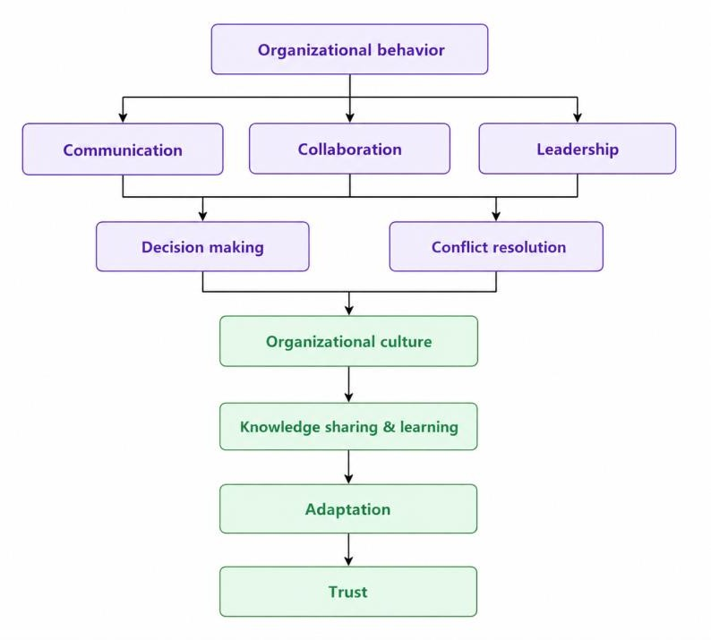
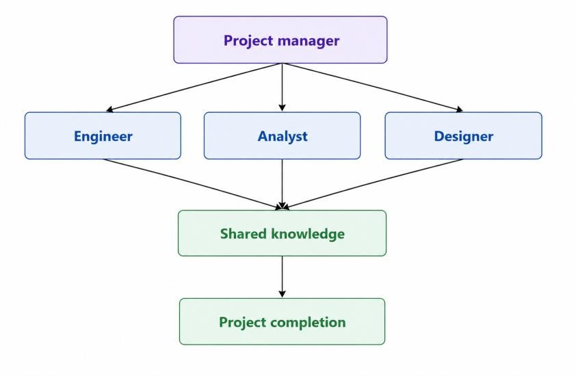
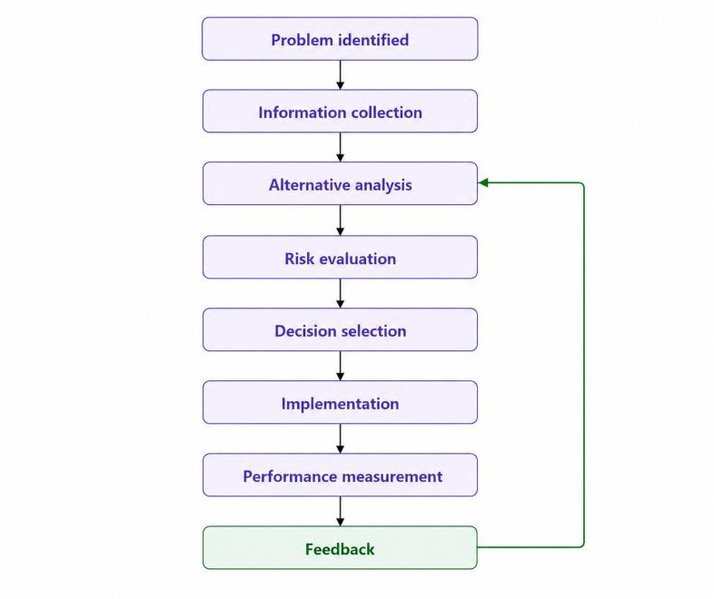
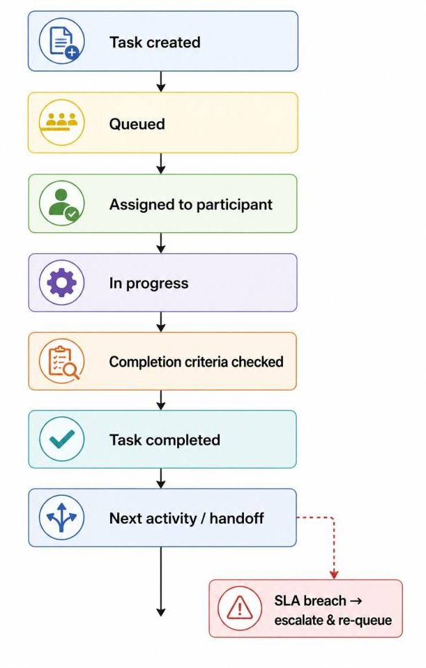
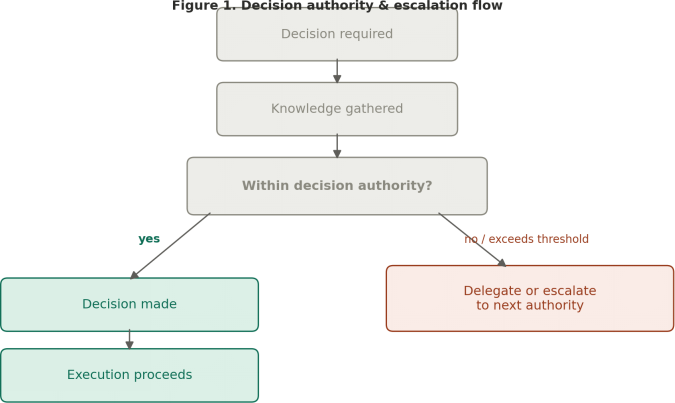
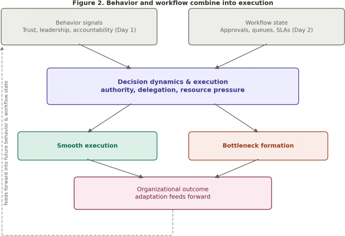

ARCTURUS V1.0 · INDIVIDUAL ENGINEERING BOOK · WEEK 2, DAY 1

Organizational Behavior Model Behavior & Workflow Platform - Day 1 Deliverable

**_Prepared by Javeria Rafhan_**

#### Executive summary

The Organizational Behavior Model defines how synthetic enterprise participants interact, collaborate, communicate, make decisions, resolve conflicts, and adapt to changing organizational conditions within Arcturus.

Rather than treating organizations as static structures, this model recognizes that real organizations are shaped by human interactions, relationships, and behavioral dynamics. By modeling these behaviors scientifically, Arcturus can simulate realistic organizational outcomes, test hypotheses, and validate recommendations before they affect real enterprises.

This document establishes the constitutional foundation for all behavior-related simulation capabilities within the Behavior & Workflow Platform. It defines twelve core behavioral concepts, explains how they emerge from individual agent interactions, describes how they influence each other, and provides measurable indicators for scientific validation.

All definitions are aligned with Arcturus' mission of science before assumption, validation before intelligence, and reproducible experimentation.

---
_The full behavioral chain, from individual agents through to high organizational performance - the overview this model builds toward._

#### Introduction

###### Purpose

The purpose of this Organizational Behavior Model is to provide a scientifically grounded, reusable framework for simulating realistic organizational dynamics within Arcturus. It serves as the behavioral foundation upon which all workforce simulations, scenario experiments, and validation activities are built.

###### Scope

This model covers: individual agent properties (roles, traits, skills, goals); behavioral concepts that define how agents interact; emergence patterns (how individual behaviors lead to organizational outcomes); measurement frameworks for scientific validation; and alignment with Arcturus constitutional engineering principles.

---

_. A representative workflow execution cycle within the platform - from business goal through task assignment, execution, and quality check, to business objective completion._

###### Key principles

| **Principle**                  | **Description**                                                                                  |
| ------------------------------ | ------------------------------------------------------------------------------------------------ |
| Science before assumption      | Every behavior must be defined based on research and evidence, not  intuition.             |
| Systems before scenarios       | Behaviors are modeled as reusable systems, not one-off scenarios.                                |
| Validation before intelligence | Behaviors must be measurable and testable before influencing  organizational intelligence. |
| AI assists, humans engineer    | AI may support research and drafting; engineers approve all behavioral  definitions.       |

#### Individual agent properties

Every organizational participant (agent) in Arcturus possesses the following core properties that influence their behavior.

###### Role

| **Role type** | **Description**                                                | **Example**                 |
| ------------- | -------------------------------------------------------------- | --------------------------- |
| Executive     | Sets strategy, makes high-level  decisions               | CEO, Director               |
| Manager       | Oversees teams, allocates  resources, resolves conflicts | Team Lead, Project Manager  |
| Specialist    | Performs specific tasks requiring  expertise             | Engineer, Analyst, Designer |
| Support       | Enables others to perform their  work                    | HR, Admin, IT Support       |

###### Personality traits

| **Trait**     | **Description**               | **Behavioral impact**                        |
| ------------- | ----------------------------- | -------------------------------------------- |
| Analytical    | Prefers data-driven decisions | Slower decisions, higher accuracy            |
| Collaborative | Enjoys working with others    | High communication, team-  oriented    |
| Decisive      | Makes quick choices           | Fast decisions, may skip  consultation |
| Cautious      | Avoids risk                   | Slower execution, fewer errors               |
| Innovative    | Seeks new approaches          | Adaptable, open to change                    |

###### Skills

| **Skill category** | **Examples**                       |
| ------------------ | ---------------------------------- |
| Technical          | Coding, data analysis, engineering |
| Communication      | Writing, presenting, listening     |
| Leadership         | Mentoring, motivating, delegating  |
| Problem-solving    | Critical thinking, creativity      |
| Interpersonal      | Empathy, negotiation, teamwork     |

###### Goals

| **Goal type**  | **Description**                    |
| -------------- | ---------------------------------- |
| Individual     | Personal career objectives         |
| Team           | Shared team performance targets    |
| Organizational | Alignment with enterprise strategy |

| Project | Specific project deliverables |
| ------- | ----------------------------- |

#### Core behavioral concepts

Twelve core behavioral concepts define how agents interact within Arcturus. Together they form the foundation of organizational behavior, from individual-level communication up to organization-wide culture and trust.

---
_Overview of how the twelve core behavioral concepts (Sections 4.1-4.12) build on one another, from communication, collaboration, and leadership up through organizational culture, knowledge sharing, adaptation, and trust._

- 1. Communication

**Definition:** Communication is the exchange of information, ideas, feedback, and instructions between organizational participants. In Arcturus, this includes all formal and informal interactions that enable coordination, decision-making, and relationship-building.

**Why it matters:** Without realistic communication, simulations cannot model how work actually flows through organizations. Delays, misunderstandings, information overload, and communication breakdowns all significantly affect organizational outcomes.

**How it emerges:** One-to-one interactions (messages, emails); one-to-many interactions (announcements, meetings); many-to-many interactions (group discussions); formal channels (reports, documentation); and informal channels (casual conversation, instant messaging).

| **Metric** | **Description** |
| ---------- | --------------- |

| Communication frequency | Number of messages per hour/day                   |
| ----------------------- | ------------------------------------------------- |
| Communication volume    | Amount of data exchanged                          |
| Response time           | Time between message and reply                    |
| Information clarity     | Measured by task success rate after communication |
| Channel usage           | Which channels are used most frequently           |

- 1. Collaboration

**Definition:** Collaboration is the process where multiple organizational participants work together toward a shared goal, sharing resources, knowledge, responsibility, and accountability.

**Why it matters:** Real organizations do not operate in silos. Collaboration enables complex tasks to be broken down, distributed, and completed efficiently, and creates collective intelligence that exceeds individual capabilities.

**How it emerges:** Task interdependencies; shared objectives; resource sharing; coordination mechanisms (sync-ups, shared dashboards, joint planning); and trust between participants.

| **Metric**                    | **Description**                                     |
| ----------------------------- | --------------------------------------------------- |
| Cross-functional interactions | Number of interactions across different teams/roles |
| Collaboration frequency       | How often agents work together on shared tasks      |
| Task completion time          | Time to complete collaborative vs. individual tasks |
| Output quality                | Quality of collaborative deliverables               |
| Participant satisfaction      | Self-reported satisfaction with collaboration       |

---
_A simple collaboration structure: a project manager coordinating engineer, analyst, and designer roles, whose combined work builds shared knowledge and drives project completion_

- 1. Leadership

**Definition:** Leadership is the ability to guide, influence, motivate, and direct organizational participants toward achieving goals. It can be formal (organizational authority) or informal (expertise, respect, trust).

**Why it matters:** Leadership shapes organizational culture, drives decision-making, resolves conflicts, and determines how effectively teams execute work.

**How it emerges:** Formal authority; informal authority; decision-making responsibility; mentoring and coaching; and setting vision and direction.

| **Metric**               | **Description**                              |
| ------------------------ | -------------------------------------------- |
| Directives issued        | Number of decisions or instructions given    |
| Team performance         | Output quality and speed under a leader      |
| Engagement levels        | Team morale, retention, satisfaction         |
| Adaptability             | How quickly the team responds to change      |
| Conflict resolution rate | How effectively the leader resolves disputes |

- 1. Accountability

**Definition:** Accountability is the obligation of an individual to accept responsibility for their actions, decisions, and outcomes, and to be transparent about their performance.

**Why it matters:** Accountability drives performance, builds trust, and ensures organizational goals are met. Without it, tasks are delayed, quality suffers, and no one owns problems.

**How it emerges:** Clear role assignments; performance reviews; consequences (rewards/corrective action); transparency in reporting; and a culture that expects responsibility.

| **Metric**           | **Description**                                                     |
| -------------------- | ------------------------------------------------------------------- |
| Task completion rate | Percentage of tasks completed on time                               |
| Error rate           | Frequency of mistakes or rework                                     |
| Deadline adherence   | Whether commitments are met                                         |
| Reporting frequency  | How regularly progress is communicated                              |
| Escalation rate      | How often issues are escalated due to lack of  accountability |

- 1. Ownership

**Definition:** Ownership is a personal sense of responsibility, pride, and commitment toward a task, project, or decision - treating the outcome as a personal success or failure.

**Why it matters:** Ownership drives initiative, quality, and innovation. Organizations with high-ownership cultures outperform those where people simply do their job.

**How it emerges:** Clear assignment; autonomy; recognition; consequences; and empowerment (resources and authority to act).

| **Metric**       | **Description**                                     |
| ---------------- | --------------------------------------------------- |
| Initiative taken | Number of proactive actions (unsolicited solutions) |
| Bias for action  | Speed of response to issues without being told      |
| Extra effort     | Willingness to go beyond minimum requirements       |

| Attention to detail | Quality of work, thoroughness         |
| ------------------- | ------------------------------------- |
| Personal investment | Emotional engagement with the outcome |

- 1. Knowledge sharing

**Definition:** Knowledge sharing is the process of transferring expertise, skills, information, insights, and lessons learned between participants or across the organization - both explicit knowledge (documents) and tacit knowledge (experience).

**Why it matters:** Knowledge sharing prevents reinvention, reduces errors, accelerates learning, and builds organizational capability. Hoarding creates silos and inefficiency.

**How it emerges:** Formal training; documentation; mentoring; peer-to-peer coaching; post-mortems; and a culture that encourages asking questions.

| **Metric**                 | **Description**                      |
| -------------------------- | ------------------------------------ |
| Documents created/accessed | Volume of knowledge artifacts        |
| Training attendance        | Participation in learning activities |
| Mentoring hours            | Time spent on coaching               |
| Error reduction            | Fewer repeated mistakes over time    |
| Response to questions      | Speed and quality of peer support    |

- 1. Organizational learning

**Definition:** Organizational learning is the process by which the organization as a whole continuously improves its capabilities, processes, knowledge, and performance based on experience, feedback, and evidence.

**Why it matters:** Organizational learning turns individual experience into institutional capability, allowing the organization to adapt, innovate, and improve. Without it, organizations repeat mistakes and stagnate.

**How it emerges:** Analyzing past projects (retrospectives); collecting feedback; updating processes; institutionalizing successful practices; experimenting; and a culture of curiosity.

| **Metric**              | **Description**                               |
| ----------------------- | --------------------------------------------- |
| Performance improvement | Positive trends in key metrics over time      |
| Process updates         | Frequency of process improvements implemented |
| Cycle time reduction    | Faster completion of repeated tasks           |
| Knowledge retention     | How much learning is preserved after turnover |
| Failure rate reduction  | Fewer errors or failures over time            |

---
_The organizational learning loop: experience feeds performance review and lessons learned, which build the knowledge repository and improve processes, raising organizational performance and generating new experience._

- 1. Conflict resolution

**Definition:** Conflict resolution is the process by which disagreements, disputes, or tensions between participants are identified, addressed, and resolved constructively.

**Why it matters:** Conflict is inevitable. Unresolved conflict damages relationships and productivity; effective resolution restores trust and can lead to better outcomes through constructive debate.

**How it emerges:** Clashing priorities; personality differences; communication breakdowns; disagreement over decisions; escalation paths; and mediation.

| **Metric**                    | **Description**                                 |
| ----------------------------- | ----------------------------------------------- |
| Resolution time               | Time taken to resolve conflicts                 |
| Unresolved count              | Number of open conflicts                        |
| Satisfaction after resolution | How satisfied participants are with the outcome |
| Recurrence rate               | How often the same conflict returns             |
| Escalation rate               | Frequency of conflicts moving up the chain      |

---
_. The conflict resolution flow: from conflict occurring and being identified, through discussion and negotiation, to an agreement decision that resolves the conflict or escalates it, ultimately improving the relationship._

- 1. **Decision making**

**Definition:** Decision making is the process of selecting a course of action from multiple alternatives based on available information, organizational goals, constraints, and stakeholder input.

**Why it matters:** Every organizational outcome results from decisions. How decisions are made affects speed, quality, accountability, and buy-in.

**How it emerges:** Authority delegation; data collection; consultation; analysis of alternatives and risks; voting or consensus; risk assessment; and approval mechanisms.

| **Metric**          | **Description**                                  |
| ------------------- | ------------------------------------------------ |
| Decision time       | Time from problem identification to decision     |
| Decision quality    | Outcome success rate                             |
| Stakeholder count   | How many people are involved/consulted           |
| Reversal rate       | How often decisions are overturned               |
| Implementation rate | How often decisions are successfully implemented |

---

_The decision-making feedback cycle: problem identification through information collection, alternative analysis, risk evaluation, decision selection, implementation, and performance measurement, with feedback looping back into alternative analysis._

- 1. Organizational culture

**Definition:** Organizational culture is the shared values, beliefs, behavioral norms, rituals, and unwritten rules that characterize how work gets done - the personality of the organization.

**Why it matters:** Culture drives everything: communication, decisions, conflict resolution, and how innovation is encouraged or stifled. It is often the difference between success and failure.

**How it emerges:** Leadership behavior; reward and recognition; historical successes and failures; social interactions; policies and practices; and organizational stories and symbols

| **Metric**         | **Description**                                 |
| ------------------ | ----------------------------------------------- |
| Employee surveys   | Self-reported culture perceptions               |
| Observed behaviors | Actual patterns of interaction                  |
| Retention rate     | How many people stay vs. leave                  |
| Innovation rate    | Frequency of new ideas or approaches            |
| Value alignment    | Consistency between stated and actual behaviors |

- 1. Adaptation

**Definition:** Adaptation is the ability of an organization to adjust its behaviors, structures, processes, or strategies in response to changing conditions, new information, or unexpected events.

**Why it matters:** Organizations that adapt survive and thrive; those that resist change fail. Adaptation enables resilience, innovation, and long-term sustainability.

**How it emerges:** Sensing changes in the environment; recognizing performance gaps; experimenting at small scale; implementing successful changes; measuring impact; and iterating.

| **Metric**      | **Description**                                   |
| --------------- | ------------------------------------------------- |
| Response speed  | How quickly the organization reacts to change     |
| Success rate    | Percentage of adaptations that achieve their goal |
| Flexibility     | Ease of pivoting or reallocating resources        |
| Resilience      | Ability to recover from setbacks                  |
| Innovation rate | Frequency of new approaches adopted               |

- 1. Trust

**Definition:** Trust is the belief that organizational participants will act reliably, honestly, competently, and in the best interest of the organization and each other - the foundation of all effective relationships and collaboration.

**Why it matters:** Trust reduces the cost of coordination, accelerates decision-making, and enables delegation. Without it, monitoring increases and collaboration breaks down.

**How it emerges:** Consistent delivery on promises; transparent communication; fair treatment; long-term relationships; demonstrated competence; and integrity.

| **Metric**             | **Description**                          |
| ---------------------- | ---------------------------------------- |
| Dependability          | Reliability of meeting commitments       |
| Delegation willingness | How often agents delegate based on trust |
| Collaboration quality  | How well teams work together             |
| Retention              | People stay where they trust leadership  |
| Honesty perception     | Self-reported trust levels (surveys)     |

---
_The trust feedback loop: reliable actions build trust, which drives more collaboration and better results, producing greater confidence that reinforces trust further._

#### Behavior interactions

Behaviors do not exist in isolation - they influence each other in complex ways. Understanding these interactions is essential for realistic simulation.

###### Interaction matrix

| **Behavior A**      | **Behavior B**          | **How they interact**                                                                                                     |
| ------------------- | ----------------------- | ------------------------------------------------------------------------------------------------------------------------- |
| Trust               | Collaboration           | High trust increases willingness to collaborate effectively;  collaboration builds trust                            |
| Communication       | Conflict resolution     | Clear communication prevents conflicts; poor communication causes them; conflict resolution  improves communication |
| Decision making     | Accountability          | Clear decisions enable accountability; vague decisions  diffuse accountability                                      |
| Leadership          | Organizational culture  | Leadership style shapes culture;  culture limits or enables leadership                                              |
| Knowledge sharing   | Organizational learning | Sharing knowledge enables  learning; learning encourages more sharing                                               |
| Trust               | Knowledge sharing       | People share more when they trust  each other; sharing builds trust                                                 |
| Ownership           | Accountability          | Ownership drives accountability; accountability encourages  ownership                                               |
| Communication       | Collaboration           | Good communication enables collaboration; collaboration  improves communication skills                              |
| Leadership          | Decision making         | Leadership drives major decisions; decision-making reputation defines  leadership                                   |
| Adaptation          | Organizational learning | Adaptation requires learning;  learning enables adaptation                                                          |
| Trust               | Leadership              | Trusted leaders are more effective;  good leadership builds trust                                                   |
| Conflict resolution | Trust                   | Resolving conflicts builds trust; trust  makes resolution easier                                                    |

###### Feedback loops

| **Loop type**                  | **Description**                                       |
| ------------------------------ | ----------------------------------------------------- |
| Positive loop (virtuous cycle) | Trust → Collaboration → Success → Trust (reinforcing) |

| Positive loop (virtuous cycle) | Knowledge sharing → Learning → Better performance  → More sharing       |
| ------------------------------ | ----------------------------------------------------------------------------- |
| Negative loop (vicious cycle)  | Poor communication → Conflicts → Low trust → Worse  communication       |
| Negative loop (vicious cycle)  | Low accountability → Poor decisions → More oversight  → Lower ownership |

_Figure 1 (source document). The four feedback loops above - two positive (virtuous) cycles and two negative (vicious) cycles - illustrate how trust, collaboration, knowledge sharing, communication, and accountability reinforce or undermine each other over time_

#### Emergence model

This model explains how individual agent properties lead to organizational behavior through interactions.

###### The emergence pyramid

Organizational behavior emerges bottom-up: individual agent properties (role, traits, skills, goals) drive interaction patterns (communication, collaboration, conflict resolution, decision making), which in turn produce system-level organizational behavior (culture, learning, adaptation, trust).

---

_The emergence pyramid in practice: individual agents (role, skills, goals, personality) produce individual interactions, which combine into communication, collaboration, and decision making, forming organizational behavior patterns that shape culture, trust, and learning - ultimately driving organizational performance._

###### Emergence process

- Individual agents - each participant has unique properties (role, personality, skills, goals).
- Interactions - agents interact through communication, collaboration, and other patterns.
- Emergent patterns - repeated interactions produce patterns (e.g., culture, trust, norms).
- Feedback - emergent patterns influence future individual behavior (e.g., culture shapes new employees).

###### Example: trust emergence

**Individual level:** Agents have different reliability histories. **Interaction level:** Agents deliver on commitments repeatedly. **Emergent pattern:** A shared expectation of reliability - trust. **Feedback:** Trust enables more delegation, strengthening reliability.

###### Example: culture emergence

**Individual level:** Leaders demonstrate certain values. **Interaction level:** Rewards and recognition reinforce behaviors. **Emergent pattern:** Shared expectations and norms - culture. **Feedback:** Culture influences how new agents behave.

#### Measurement framework

Every behavior must be measurable for scientific validation.

| **Category**  | **Examples**                               |
| ------------- | ------------------------------------------ |
| Quantitative  | Frequency, time, volume, completion rate   |
| Qualitative   | Satisfaction, clarity, trust perception    |
| Observational | Behavioral patterns, interactions observed |
| Outcome-based | Success rate, quality, speed               |

###### 7.2 Summary measurement table

| **Behavior**  | **Primary metric**            | **Secondary metric** |
| ------------- | ----------------------------- | -------------------- |
| Communication | Frequency                     | Response time        |
| Collaboration | Cross-functional interactions | Task completion time |

| Leadership              | Team performance           | Engagement levels      |
| ----------------------- | -------------------------- | ---------------------- |
| Accountability          | Task completion rate       | Error rate             |
| Ownership               | Initiative taken           | Extra effort           |
| Knowledge sharing       | Documents created/accessed | Error reduction        |
| Organizational learning | Performance improvement    | Process updates        |
| Conflict resolution     | Resolution time            | Satisfaction           |
| Decision making         | Decision time              | Quality rate           |
| Culture                 | Survey scores              | Retention rate         |
| Adaptation              | Response speed             | Success rate           |
| Trust                   | Dependability              | Delegation willingness |

#### Alignment with Arcturus constitution

This Organizational Behavior Model adheres to all Arcturus constitutional engineering principles.

| **Principle**                       | **How this model aligns**                                                                        |
| ----------------------------------- | ------------------------------------------------------------------------------------------------ |
| Science before assumption           | All behaviors are defined based on established  research and are measurable for validation |
| Platforms before features           | This is a reusable behavior platform, not a one-time  scenario                             |
| Systems before scenarios            | Behaviors are modeled as reusable systems, not  isolated examples                          |
| Shared ontology                     | All behavioral concepts share the same constitutional  definitions                         |
| Validation before intelligence      | Every behavior has measurable indicators for scientific  validation                        |
| Digital twins represent reality     | Behaviors are designed to mirror real organizational  dynamics                             |
| AI assists, humans engineer         | AI supports research; engineers approve all definitions                                          |
| Governance enables scientific trust | All definitions are versioned, auditable, and traceable                                          |
| Continuous learning                 | The model is designed to evolve through  experimentation                                   |
| One platform, one standard          | This model follows the same constitutional standards  as all other platforms               |

#### References

Academic references

###### Academic references (explored via AI)

Schein, E. H. (2010). Organizational Culture and Leadership. Jossey-Bass.

Kotter, J. P. (2012). Leading Change. Harvard Business Review Press.

Nonaka, I., & Takeuchi, H. (1995). The Knowledge-Creating Company. Oxford University Press. Edmondson, A. C. (2018). The Fearless Organization. Wiley.

Senge, P. M. (2006). The Fifth Discipline. Currency.

###### Horquva internal references

Arcturus v1.0 Constitutional Platform Architecture Arcturus Core Principles (Section 3, Platform Specification) AI Engineering Policy (Section 5, Platform Specification) Definition of Done (Section 6, Platform Specification)

# Week 2- Day 2

## Executive Summary

This document defines the constitutional Workflow Architecture for the Behavior & Workflow Platform. It establishes how work actually moves through a synthetic enterprise - as business processes made of activities and tasks, carried out by participants, governed by approvals, dependencies, business rules, and service levels, and routed through queues and escalations until completion.

Where Day 1 defined how organizational participants behave toward one another, Day 2 defines the operational scaffolding that behavior runs on: the repeatable structures through which work is requested, assigned, executed, checked, and completed. Together, the two form the full behavioral and operational foundation the Scenario and Simulation Runtime platforms will build on in later weeks.

This model favors reusable, technology-independent abstractions over one-off process diagrams, so that the same workflow architecture can represent a hiring process, a purchase approval, an incident escalation, or a product launch without redesign.

##### Introduction

- 1. Purpose

To provide a scientifically grounded, reusable framework for modeling how organizational work executes - independent of industry, company size, or specific software tooling - so that Arcturus can simulate realistic execution paths, bottlenecks, delays, and outcomes.

- 1. Scope

This document covers: the structural building blocks of a workflow (processes, activities, tasks, participants); the governance mechanisms that control execution (approvals, handoffs, dependencies, business rules); the operational mechanisms that determine speed and pressure (SLAs, queues, escalations); and completion criteria that define when work is truly done. It does not implement a workflow execution engine - that is the responsibility of the Simulation Runtime & Experiment Platform in a later phase.

- 1. Key Principles

| **Principle**                            | **Description**                                                                                                                                                |
| ---------------------------------------- | -------------------------------------------------------------------------------------------------------------------------------------------------------------- |
| Systems before scenarios                 | Workflow abstractions must be reusable engines,  not one-off business scenarios.                                                                         |
| Shared ontology before individual models | Every workflow object (task, participant, approval) reuses the same constitutional definitions as the  Behavior Model and the wider Enterprise ontology. |
| Validation before intelligence           | Workflow outcomes (cycle time, SLA breaches, bottlenecks) must be measurable before they  inform organizational intelligence.                            |
| Architecture drives implementation       | This specification defines structure only; no execution engine or scenario-specific workflow is  built in Week 2.                                        |

##### Workflow Architecture Overview

A workflow in Arcturus is a structured, repeatable path that organizational work follows from initiation to completion. Every workflow is composed of the same constitutional building blocks, regardless of what real-world process it represents:

| **Layer**         | **Role**                                                                                                |
| ----------------- | ------------------------------------------------------------------------------------------------------- |
| Business Process  | The top-level, named operation being modeled (e.g.,  "Employee Onboarding", "Purchase Approval"). |
| Activity          | A meaningful phase within the process, grouping  related tasks (e.g., "Background Check").        |
| Task              | The smallest unit of executable work, assigned to a  single participant or agent.                 |
| Participant       | The workforce entity or agent responsible for a task,  approval, or decision.                     |
| Governance layer  | Approvals, handoffs, dependencies, and business  rules that control how work is allowed to move.  |
| Operational layer | SLAs, queues, and escalations that determine timing,  prioritization, and pressure.               |
| Completion layer  | Explicit completion criteria that define when a task,  activity, or process is considered done.   |

This layered structure lets Arcturus represent any business process - regardless of domain - using the same reusable vocabulary, satisfying the constitutional principle of one platform, one scientific standard.

## Core Workflow Concepts

- 1. Business Processes

**Definition:** A Business Process is a named, end-to-end sequence of activities that produces a defined organizational outcome (e.g., onboarding an employee, approving a purchase, resolving a support ticket).

**Why it matters:** Processes are the unit organizations actually manage and measure. Without a formal process abstraction, Arcturus cannot represent how real enterprises structure recurring work.

**Structure:** Every process has a trigger (what starts it), an owner (who is accountable for the outcome), an ordered or conditional set of activities, and a defined end state.

- 1. Business Processes

**Definition:** A Business Process is a named, end-to-end sequence of activities that produces a defined organizational outcome (e.g., onboarding an employee, approving a purchase, resolving a support ticket).

**Why it matters:** Processes are the unit organizations actually manage and measure. Without a formal process abstraction, Arcturus cannot represent how real enterprises structure recurring work.

**Structure:** Every process has a trigger (what starts it), an owner (who is accountable for the outcome), an ordered or conditional set of activities, and a defined end state.

| **Attribute** | **Description**                                                                 |
| ------------- | ------------------------------------------------------------------------------- |
| Trigger       | The event that initiates the process (request,  schedule, external event) |
| Owner         | The role or participant accountable for the process  outcome              |
| Activities    | The ordered or conditional set of phases that make  up the process        |
| End state     | The defined outcome that marks process completion                               |

- 1. **Activities**

**Definition:** An Activity is a meaningful phase within a business process that groups one or more related tasks under a shared purpose (e.g., "Interview Scheduling" within a hiring process).

**Why it matters:** Activities let Arcturus reason about a process at a mid-level of granularity - useful for measuring where time is spent without tracking every micro-task individually.

**Structure:** Activities may run sequentially, in parallel, or conditionally (only triggered under certain business rules), and always belong to exactly one parent process.

- 1. Activities

**Definition:** An Activity is a meaningful phase within a business process that groups one or more related tasks under a shared purpose (e.g., "Interview Scheduling" within a hiring process).

**Why it matters:** Activities let Arcturus reason about a process at a mid-level of granularity - useful for measuring where time is spent without tracking every micro-task individually.

**Structure:** Activities may run sequentially, in parallel, or conditionally (only triggered under certain business rules), and always belong to exactly one parent process.

- 1. Tasks

**Definition:** A Task is the smallest unit of executable work within an activity, assigned to a single participant or agent, with a defined start, duration, and outcome.

**Why it matters:** Tasks are where individual behavior (from the Day 1 Organizational Behavior Model) actually meets workflow execution - every behavioral signal (response time, accountability, decision latency) is observed at the task level.

| **Attribute** | **Description**                                                     |
| ------------- | ------------------------------------------------------------------- |
| Assignee      | The participant or agent responsible for completing  the task |
| Inputs        | Information or artifacts required before the task can  start  |
| Outputs       | Information or artifacts produced when the task is  completed |
| Duration      | Expected or actual time to complete the task                        |

- 1. Participants

**Definition:** A Participant is any workforce entity or agent who performs, approves, or is otherwise responsible for a task, activity, or process outcome.

**Why it matters:** Workflows are meaningless without the people who execute them. Participants connect the Workflow Architecture directly to the Synthetic Workforce & Agent Platform and to the behavioral properties defined in the Day 1 model.

**Structure:** A participant may hold one of several roles within a workflow: performer (executes the task), approver (authorizes progression), reviewer (checks quality), or escalation contact (receives issues that exceed normal handling).

- 1. Approvals, Handoffs & Dependencies

**Definition:** Approvals are checkpoints requiring explicit authorization before work can proceed. Handoffs are transfers of task ownership from one participant to another. Dependencies are constraints that require one task or activity to complete (or reach a state) before another can begin.

**Why it matters:** These three mechanisms are the primary source of realistic delay, coordination overhead, and bottleneck formation in simulated organizations - without them, every workflow would execute instantly and unrealistically.

| **Mechanism** | **Governs**                                  | **Typical Failure Mode**        |
| ------------- | -------------------------------------------- | ------------------------------- |
| Approval      | Whether work is authorized to  proceed | Approval delay, rejection loops |

| Handoff    | Transfer of ownership between  participants | Context loss, dropped tasks |
| ---------- | ------------------------------------------------- | --------------------------- |
| Dependency | Required completion order  between tasks    | Blocking, cascading delay   |

- 1. Business Rules

**Definition:** Business Rules are conditional logic statements that determine how a workflow behaves under specific circumstances (e.g., "purchases over \$10,000 require two approvals").

**Why it matters:** Real organizations rarely follow a single fixed path. Business rules let the same workflow definition branch realistically based on context, without requiring a separate process for every variation.

- 1. Service Level Agreements, Queues & Escalations

**Definition:** A Service Level Agreement (SLA) is a defined time expectation for completing a task or process stage. A Queue is an ordered backlog of work waiting for a participant or resource to become available. An Escalation is the routing of a task to a higher authority or different participant when an SLA is breached or normal handling fails.

**Why it matters:** These mechanisms introduce time pressure and organizational constraint into simulations - the primary drivers of realistic bottleneck formation, prioritization behavior, and stress-conditioned decision making

| **Mechanism**   | **Description**                                                            |
| --------------- | -------------------------------------------------------------------------- |
| SLA             | Maximum allowed time for a task, activity, or  process stage         |
| Queue           | Backlog ordering: FIFO, priority-based, or skill-based  routing      |
| Escalation path | Defined chain of who is notified/reassigned when an  SLA is breached |

- 1. Completion Criteria

**Definition:** Completion Criteria are the explicit, testable conditions that must be true for a task, activity, or process to be considered finished.

**Why it matters:** Without explicit completion criteria, "done" becomes subjective, and simulations cannot reliably measure cycle time, quality, or process success. This mirrors the constitutional Definition of Done applied at the workflow level.

- 1. Worked Example: Employee Onboarding

To make the abstractions in Sections 4.1-4.8 concrete, the table below traces a single instance of each constitutional building block through one real workflow: provisioning IT access for a new employee.

| **Constitutional Concept** | **Instance in This Example**  |
| -------------------------- | ----------------------------- |
| Process                    | Employee onboarding           |
| Activity                   | IT setup                      |
| Task                       | Create email account          |
| Participant                | IT administrator              |
| Approval                   | IT manager                    |
| Completion                 | Employee receives credentials |

This single trace shows how the same six constitutional layers apply whether the workflow is a hiring process, a purchase approval, or an incident escalation - only the instances change, never the structure.

---
_Employee onboarding traced through the six constitutional workflow layers._

### Reusable Workflow Patterns

Rather than modeling every business process from scratch, Arcturus reuses a small set of patterns that recur across nearly all enterprise operations. Each named business process is expressed as a composition of these patterns.

| **Pattern**        | **Description**                                                     | **Example Use**                                  |
| ------------------ | ------------------------------------------------------------------- | ------------------------------------------------ |
| Sequential process | Activities execute strictly one  after another                | Employee onboarding steps                        |
| Parallel process   | Multiple activities execute  simultaneously, then synchronize | Background check + equipment  provisioning |
| Approval chain     | Work passes through an ordered  sequence of approvers         | Multi-level purchase approval                    |
| Conditional branch | Business rules route work down  different paths               | Expense routing based on  amount           |

| Escalation path        | Work reroutes to a different  participant after an SLA breach       | Support ticket escalation |
| ---------------------- | ------------------------------------------------------------------------- | ------------------------- |
| Queue-based assignment | Work waits in a backlog until a  qualified participant is available | Ticket queue, task pool   |
| Rework loop            | Work returns to an earlier activity  when a quality check fails     | Document revision cycle   |

### Workflow Lifecycle

Every task in Arcturus moves through the same constitutional lifecycle, regardless of which business process it belongs to.

---
onstitutional task lifecycle. If completion criteria fail or an SLA is breached, the task escalates and re-enters the queue rather than silently stalling.

### Approval s Escalation Flow

Approval-gated activities follow a consistent branching pattern: work proceeds on approval, or routes to escalation on rejection or timeout, without ever being modeled as a dead end.

===
_Approval decisions either proceed on time or escalate to the next authority - both paths rejoin the same downstream workflow._

### Alignment with Arcturus Constitution

| **Principle**                            | **How This Model Aligns**                                                                                                        |
| ---------------------------------------- | -------------------------------------------------------------------------------------------------------------------------------- |
| Systems before scenarios                 | Seven reusable patterns (Section 5) replace the need  for bespoke process diagrams per scenario                            |
| Shared ontology before individual models | Participants, tasks, and approvals reuse the same entity definitions as the Behavior Model and  Enterprise ontology        |
| Validation before intelligence           | Every workflow stage exposes measurable state (SLA status, queue position, completion criteria) for  scientific validation |
| Digital twins represent reality          | The task lifecycle (Section 6) is designed to mirror real operational state transitions, not an idealized  happy path      |
| AI assists, humans engineer              | AI supported research and drafting; engineers approve all workflow definitions per the Definition  of Done                 |

### 6\. Cross-Platform Dependencies

| **Platform**                               | **Relationship to This Model**                                                                                 |
| ------------------------------------------ | -------------------------------------------------------------------------------------------------------------- |
| Behavior & Workflow Platform (Day 1 model) | Supplies the behavioral signals (response time, accountability, decision latency) observed at each  task |
| Synthetic Workforce & Agent Platform       | Supplies the participants who fill performer,  approver, reviewer, and escalation roles                  |
| Scenario Platform                          | Will configure specific business processes as  compositions of the reusable patterns in Section 5        |

| Simulation Runtime & Experiment Platform | Will execute the workflow lifecycle and record SLA, queue, and completion metrics as experiment  output |
| ---------------------------------------- | ------------------------------------------------------------------------------------------------------------- |

# WEEK 2-DAY3

##### Executive summary

This document defines the constitutional Organizational Execution Model for the Behavior & Workflow Platform. It describes how synthetic enterprises actually make decisions and get work done under real-world pressure - who has the authority to decide, how that authority is delegated and escalated, how teams coordinate across boundaries, how resources get allocated under scarcity, and how organizations adapt when conditions change.

Day 1 defined how participants behave toward one another. Day 2 defined the operational structures work moves through. Day 3 connects the two: it explains how behavioral signals (trust, leadership, accountability) and workflow mechanics (approvals, queues, SLAs) combine, moment to moment, into the decisions and execution patterns that determine whether a synthetic enterprise runs smoothly or breaks down under load.

This model gives Arcturus the ability to simulate not just what an organization does, but how well it holds up - where bottlenecks form, how authority gets exercised under pressure, and how the organization adapts before, during, and after strain.

##### Introduction

###### Purpose

To provide a scientifically grounded, reusable framework for modeling how organizations execute decisions and adapt under changing conditions - independent of industry or specific tooling - so that Arcturus can simulate realistic organizational resilience, strain, and recovery.

###### Scope

This document covers: decision authority and how it is delegated or escalated; cross-team collaboration and knowledge flow required to make informed decisions; task ownership and resource allocation under scarcity; how bottlenecks and constraints emerge; and how decision-making itself adapts under pressure. It does not implement a decision engine or scenario-specific execution logic - that responsibility belongs to the Simulation Runtime & Experiment Platform in a later phase.

#### Key principles

| **Principle**            | **Description**                                                                                    |
| ------------------------ | -------------------------------------------------------------------------------------------------- |
| Systems before scenarios | Decision dynamics are modeled as reusable execution  mechanics, not scenario-specific rules. |

| Shared ontology before individual models | Decision authority, ownership, and resources reuse the same participant and task definitions established  in Days 1 and 2. |
| ---------------------------------------- | -------------------------------------------------------------------------------------------------------------------------------- |
| Validation before intelligence           | Bottleneck formation, decision latency, and adaptation must be measurable before they inform  organizational intelligence. |
| Digital twins represent reality          | Execution modeling must reflect real organizational strain and recovery, not an idealized frictionless  organization.      |

##### Core decision & execution concepts

###### Decision authority

**Definition:** Decision Authority is the formally or informally granted right of a participant to make a specific type or scope of decision without requiring approval from others.

**Why it matters:** Without defined authority, every decision would require universal consensus or arbitrary control - neither reflects how real organizations actually operate.

**How it's structured:** Authority is scoped by decision type, resource or impact threshold, and organizational level. A participant's authority derives from formal role or from informally earned trust and expertise (see Day 1: Leadership, Trust).

| **Attribute**       | **Description**                                                    |
| ------------------- | ------------------------------------------------------------------ |
| Scope               | The kinds of decisions this authority covers                       |
| Threshold           | The resource or impact limit within which authority  applies |
| Source              | Formal role-based authority vs. informally earned  authority |
| Override conditions | When a higher authority can override the decision                  |

###### Delegation

**Definition:** Delegation is the deliberate transfer of decision-making authority or task ownership from one participant to another, to distribute workload or leverage expertise.

**Why it matters:** No single participant can make every decision at scale. Effective delegation is a hallmark of high-functioning organizations and connects directly to Day 1's Leadership, Trust, and Ownership behaviors.

**How it's structured:** Triggered by capacity constraints, expertise gaps, or organizational growth. Requires clear scope definition, and the delegator typically retains ultimate accountability even after transferring execution.

| **Metric** | **Description** |
| ---------- | --------------- |

| Delegation depth     | Number of levels below the original decision owner |
| -------------------- | -------------------------------------------------- |
| Delegation frequency | How often authority is transferred                 |
| Reversal rate        | How often delegated decisions are pulled back      |
| Outcome quality      | Decision quality after delegation vs. before       |

###### Escalation paths

**Definition:** Escalation Paths are defined routes through which a decision or issue moves to higher authority when it exceeds current decision authority, breaches an SLA, or requires additional expertise.

**Why it matters:** Connects directly to the workflow-level escalation mechanics defined in Day 2, but applied specifically to decisions - ensuring no decision stalls inde

| **Trigger**         | **Typical route**                                                     |
| ------------------- | --------------------------------------------------------------------- |
| Authority exceeded  | Routed to the next formal authority level                             |
| SLA breach          | Routed per the escalation path defined in Day 2                       |
| Unresolved conflict | Routed to a mediating leader (see Day 1: Conflict  Resolution)  |
| Missing expertise   | Routed to a subject-matter specialist, regardless of  hierarchy |

###### Cross-team collaboration

**Definition:** Joint decision-making and execution involving participants from multiple teams or functions, required when a decision or task spans organizational boundaries.

**Why it matters:** Real decisions rarely stay within one team. Cross-team dynamics introduce coordination overhead and competing priorities, and are typically the single greatest source of bottleneck risk in real organizations.

| **Metric**                     | **Description**                                   |
| ------------------------------ | ------------------------------------------------- |
| Coordination overhead          | Time spent aligning across teams vs. executing    |
| Conflicting priority frequency | How often teams' priorities collide               |
| Joint decision cycle time      | Time to reach a decision involving multiple teams |
| Handoff quality                | Completeness and clarity of cross-team handoffs   |

###### Knowledge flow

**Definition:** The movement of information, context, and expertise required for a decision, from where it originates to where the decision is actually made.

**Why it matters**: Decisions made without adequate knowledge flow are a leading cause of poor outcomes and rework. This concept extends Day 1's Knowledge Sharing behavior into the decision-making process itself.

| **Metric** | **Description** |
| ---------- | --------------- |

| Information latency | Time for relevant knowledge to reach the decision  maker |
| ------------------- | -------------------------------------------------------------- |
| Knowledge gap rate  | Share of decisions made without needed information             |
| Source diversity    | Number of distinct sources informing a decision                |

###### Task ownership

**Definition:** The explicit assignment of accountability for a task's completion and outcome to a single participant, even when the work itself is distributed.

**Why it matters**: Prevents diffusion of responsibility. Builds directly on Day 1's Ownership and Accountability behaviors, and is critical for simulating who is genuinely answerable for an outcome.

| **Metric**              | **Description**                                 |
| ----------------------- | ----------------------------------------------- |
| Ownership clarity index | Single clear owner vs. diffuse/shared ownership |
| Reassignment frequency  | How often ownership changes hands               |
| Orphaned task rate      | Share of tasks with no clear accountable owner  |

###### Resource allocation

**Definition**: The process of assigning limited organizational resources - people, budget, time, tools - to competing tasks, decisions, and priorities.

**Why it matters**: Resource scarcity is the primary driver of prioritization behavior, trade-offs, and bottleneck formation in real organizations.

| **Metric**                    | **Description**                                               |
| ----------------------------- | ------------------------------------------------------------- |
| Utilization rate              | How fully allocated resources are being used                  |
| Allocation conflict frequency | How often competing demands exceed available  resources |
| Reallocation speed            | How quickly resources shift when priorities change            |

###### Bottleneck formation

**Definition:** The emergence of a constraint point where work accumulates faster than it can be processed, causing systemic delay that extends beyond the local task.

**Why it matters:** Bottlenecks are a key realistic organizational failure mode. Simulations must capture them as an emergent property of authority, resource, and dependency constraints - not as random, unexplained delay.

**How it forms**: Typically emerges when decision authority is overly centralized, resources are under-allocated relative to demand, or task dependencies create long serial chains. Bottlenecks propagate both upstream (blocked inputs) and downstream (delayed outputs).

| **Indicator**                | **Description**                                       |
| ---------------------------- | ----------------------------------------------------- |
| Queue length growth          | Backlog increasing faster than it clears              |
| Cycle time variance          | Growing unpredictability in how long work takes       |
| Escalation rate spike        | Sudden rise in issues being escalated                 |
| Resource utilization ceiling | A resource operating consistently at or near capacity |

###### Organizational constraints

Definition: Structural, policy, or resource limits that bound what decisions and actions are possible within an organization at a given time (e.g., budget ceilings, headcount, regulatory requirements, approval thresholds).

Why it matters: Constraints shape adaptive behavior. Simulations without realistic constraints will show organizations behaving with unrealistic flexibility.

| **Constraint type** | **Description**                                                           | **Typical response when**  **approached**       |
| ------------------- | ------------------------------------------------------------------------- | ----------------------------------------------------- |
| Hard constraint     | Cannot be exceeded under any  circumstance (e.g., regulatory limit) | Work blocks or reroutes entirely                      |
| Soft constraint     | Can be exceeded with escalation or  approval (e.g., budget ceiling) | Triggers Decision Authority /  Escalation Paths |

###### Adaptive decision making

Definition: The capacity of decision-making processes to adjust their pattern - speed, centralization, information requirements - in response to changing organizational conditions such as urgency, risk, or resource pressure.

Why it matters: Static decision models cannot capture how real organizations tighten or loosen their decision processes under stress. This directly extends Day 1's Adaptation behavior into the execution layer.

| **Metric**                   | **Description**                                                                 |
| ---------------------------- | ------------------------------------------------------------------------------- |
| Adaptation trigger frequency | How often conditions force a change in decision  pattern                  |
| Decision speed change        | How much faster/slower decisions are made under  pressure                 |
| Reversion rate               | How often the organization returns to normal process  after strain passes |

##### Decision authority & escalation flow

Every decision in Arcturus follows the same constitutional path: check authority, act if in-scope, or route to the appropriate escalation target if not - without ever leaving a decision unresolved.

_A decision either proceeds within existing authority, or is delegated/escalated to the next appropriate authority - it is never left unresolved._

---
###### Worked example: customer refund request

A customer refund request begins with a support agent. If the refund amount exceeds the agent's authority threshold, the decision is escalated to the team manager. Resource constraints or missing financial approval may delay execution, creating a bottleneck. Once approved, execution proceeds and the outcome contributes to future organizational learning.

---
_Worked example - a refund request follows the same authority-check and escalation pattern as Figure 1, with resource/approval availability determining whether a bottleneck forms before execution._

##### How behavior and workflow combine into execution

Decision dynamics are where Day 1's behavioral signals and Day 2's workflow mechanics meet. Neither alone determines whether an organization executes smoothly - it is their combination, under real resource and authority constraints, that produces either smooth execution or bottleneck formation.

---
_Behavior and workflow converge into decision dynamics, which resolves into either smooth execution or a bottleneck; the resulting outcome adapts future behavior and workflow state (Day 1's Adaptation and Organizational Learning)._

| **Principle**                            | **How this model aligns**                                                                                                  |
| ---------------------------------------- | -------------------------------------------------------------------------------------------------------------------------- |
| Systems before scenarios                 | Decision authority, delegation, and escalation are  modeled as reusable mechanics, not scenario-specific rules       |
| Shared ontology before individual models | Decision dynamics reuse the same participant, task,  and behavioral definitions from Days 1 and 2                    |
| Validation before intelligence           | Bottleneck indicators and decision metrics (Sections 3.8, 3.10) are explicitly measurable for scientific  validation |
| Digital twins represent reality          | Bottleneck formation and adaptive decision making are modeled as emergent, not idealized,  organizational behavior   |
| AI assists, humans engineer              | AI supported research and drafting; engineers approve  all execution definitions per the Definition of Done          |

##### 7\. Cross-platform dependencies

| **Platform**                                               | **Relationship to this model**                                                                                                 |
| ---------------------------------------------------------- | ------------------------------------------------------------------------------------------------------------------------------ |
| Behavior & Workflow Platform (Day 1 & Day 2  models) | Supplies the behavioral signals and workflow state that  combine into decision dynamics (Section 5)                      |
| Synthetic Workforce & Agent Platform                       | Supplies the participants who hold decision authority,  delegate, and escalate                                           |
| Scenario Platform                                          | Will configure specific constraint conditions (Section 3.9) to produce different execution outcomes from the  same model |
| Simulation Runtime & Experiment Platform                   | Will execute decision flows and record bottleneck, escalation, and adaptation metrics as experiment  output              |

# WEEK-2 DAY4

##### Executive summary

This document is the Day 4 deliverable for the Behavior & Workflow Platform: a structured engineering review of the complete Behavior & Workflow Platform specification produced across Days 1-3 (Organizational Behavior Model, Workflow Architecture & Business Processes, and Decision Dynamics & Organizational Execution).

The review verifies that the specification is complete, internally consistent, and architecturally compliant with the frozen Arcturus v1.0 Constitutional Platform Architecture, and confirms it is ready to be handed off to the Scenario Platform and Simulation Runtime & Experiment Platform owners for Week 3.

**Result:** the specification passes all seven review criteria. Two documentation gaps identified during review - a missing worked example and the absence of a standardized process-notation diagram - were closed during this review cycle rather than deferred, so the package below reflects the corrected, final state.

##### Review scope & methodology

**Scope:** this review covers the Behavior & Workflow Platform specification as a whole, with particular focus on the Day 3 Decision Dynamics & Organizational Execution deliverable, since decision dynamics is where the Day 1 behavior model and Day 2 workflow architecture are exercised together and where inconsistencies are most likely to surface.

**Methodology**: a structured, checklist-based engineering review against the seven criteria defined in the Week 2 sprint plan for Day 4 - behavior model completeness, workflow consistency, organizational dynamics, decision models, documentation quality, cross-platform compatibility, and architectural compliance. Per the AI Engineering Policy, AI was used to run this checklist review and surface gaps; final acceptance remains the responsibility of the platform owner.

##### Review & handoff workflow

The review followed the same never-leave-it-unresolved principle established in the Day 3 decision model: findings are either closed within the review cycle or explicitly routed back for revision before sign-off.

![](data:image/png;base64,iVBORw0KGgoAAAANSUhEUgAAAoQAAAJ3CAYAAAANsUD4AAAABmJLR0QA/wD/AP+gvaeTAAAACXBIWXMAAA7EAAAOxAGVKw4bAAAgAElEQVR4nOydd3wUdf7/X+/ZlrbpIQ1TSAiB9EAgiIAighXwsIAnFjzrNT1Pvfa9wzu/v7OdeufZxfYVUUEsdASkt5AESSeNUBII6ckm2Taf3x9h102yu5lsys5u5vV45DGbmc/z8/nMe977mfe85zOzxBjj8ZMIABOwhMRITB92sMxQWJt9LSsro08++YgBRIwxRtSzDA0NxS9/+StoNBrMmXMVeXl5sW+++Y5CQ0PFYEez9Ho9Pf/8P1l3d3ev/qekpNLy5csFt/Pss6uYTqcjAEypVFJQUBBLTk7GjBnZ8PT0HPH9OX36NN57710AoDlz5rKFCxeOqs9u2bKZ/vCHZ1hGRiZ9/PEno+azubm5tGvXTtbZqUFYWDjmzbuWEhISbPbVaDSylSvvp/z8PPbiiy/R9dffMCr+19XVxe644zaqqalhH3/8f8jIyBiQ4XmerV37Gb3//vusqakRvr6+2Lx5K8rLT9Fzzz3HampOk9FoZG+++TbNmjVr1L9PjY2NNH/+PObl5Y31679CeHh4P6a4uIhWrfobq6ysJL1ez1588SX67rvv2IED+/HnP/8Fd965bET6NkRmqGOlKMZmiRE/I7/8T99C9pZ9P7s6Y1meCSwrMb2XjjAYZFlBx7i+/iK+++474jgOYWHhJJNx4HmGmJhoAgCVSoV77rkXSqWSvLy8HG5npBij0YgtWzZTd7cW4eFh5rI+Pj6Damfz5k3U1dWF4OBgUigUaGhoIIPBgJSUFLz44sssMjJSSN8c8gutVovnn/8n9u/fxziOQ0hICC1cuHDY27HHxMZOwL333kcRERG22GH32UOHDtKvf/0rGI08hYQEM41GQ93d3UhISOjL92J5ngdjjBiz2Y7ddh1hiHraNRqNgpm2tjZ67bVX0d3djUWLFlNERAQUCgXeeOMNVFSUU1bWdCQlJVFkpFWbO7I/g/YLnueJMWaVYYzRe++9i5KSEkpLS0N6egbFxMQCYMQYw2XM3cZZ0YzNY4QZbb8YVkYOSZLcUIGBgfjoo4/h5+cHAOA4DjKZDEajEYGBgVAoFOA4DgBgMBiQk5OD6uoqJCZOhqenB44cOYLIyEgsWLAQZ8+exc6d3yMwMBC33LIIALBt21ZcvHgRc+dejQkTJuDIkcMoKSlBUlIS1Go18vLyMGvWVYiJiUFzcxOOHctBff1FhIaGITs7G76+vnb7HxV1Bdau/cL8v0wmc8gOf/zjnzBz5pWoqqrCs8/+DSdPnsSqVX/FO++8ByJCRUUFyspK0dTUBJVKhcTEyUhKSgLHcfj887XQ6/W45ZZFCAwMBABs374NtbW1mD17NuLjJ1ptc+PG75CbexyRkeNRV1drt3/FxUU4evQorrjiCsTHT8SRI4cxZUoSUlNT0dHRgdzc4zh79iz8/f0xY0Y2goODYTAYsHbtZyDisHjxYvj6+oIxhk2bNqKhoQHXXDMPSqUSgYGB8PX1M7dlMBhQXFyM4uIiAEBm5lTEx8eD4zicOHEC+fl5mDJlCmbMyEZ1dTX27PkBSUlJmD59hvn/8ePHY/7860DU9zwB5ObmQqfT4dprr8U//vEc2ts70N3dLfhYGY1G5OXlobi4GPHx8cjKyoJMJgPP8ygoKEBVVSXa29vh7e2N1NQ0xMXFgeM46HQ6rF+/DlqtFjfffDMKC4tQW3seU6dOw6RJk0BEYIzh0qVL2LdvL5RKJbKypvdr31QmJ+cYmpqaMG7cOMyYMQN+fv5obW3FJ598jO7ubigUCowfPx7jxoVi69YtqKqqAgBERkYiJCQEwcEhvepta2vDV1+th4+PDxYvXgK5XI41az6Fp6cnFi1afNnXPgfPG7F06W3w9vZGV1cXjh/PQU1NDby8vJCRkYmYmBgQEbq6OrFhwwbodDrccssi5OYeR0dHB66++ppe7fI8j+3bt+HChQuIioqCRqNBaWkpACA8PAIhISEICendV8s+5+TkoLb2PPz8/JCVNR1hYWEAgJ07d+LcubPm7/6xY0dRVFSEq6++BrGxsTh69CiKi4uQkZGB9PQMq/VLkiRGydE7jWi6orC3hJsxfdOokBjBTF92MAwNkTGpXxnGGAOIlEolU6lUBABExIgI3d3deOWVf5GXlxebP/868vT0ZG+//Ra9887bDADJZHI2ceJEKi4uwqxZs9iCBQtRXV2NV175FyUkJLCbbrqZiIh9/vlays3NZaGhYTRhwgS2a9cu+uyzNZgwYQKrq6uDVqvFq6++Rq2treypp56k2tpaxnEc8TzP4uPj6d//fp1FR0db3R/GGLt06RI9/fRTTCaTUVZWFvvZz5YOygY8zzMApFQqmVqtprS0NPb008/gwQd/gSNHjuD06WpERESyX//6V3T+/DnzrWmO4+iuu37Onn76GTpx4gTbvHkTOI7DihX3QKPpwP/+73Osu7ub5s692urxqa2tZa+//h/cdNNN6OrqNgWENo9pfn4+vfzySywiIgKdnZ1oa2vD448/gYAAf/bEE49TaWmp2W6hoaH08suvsIyMDNq9ezc7fjwH48aFYOHC69HQ0ID//d/nGBHRwoXXs/z8PHr55ZdYZuZUuummm5jBYKD/+Z+/sC1bNptsA4VCgV/96tfs/vtXUmNjI3vllX/RzJkz2fTpM2jbtq3szTffoFmzZrFp07Joy5Yt7O2336T771+J665b0G8/GGOUmprGAFBOznFWU3MGycnJDABdzsIxi6De6vH69NNPqLS0lBmNRiIi/O1vz7KlS5eitbUVd999FwFgREQ8zzOlUkl/+tOf2dKlt5FWq2VvvPEGtbQ0Y8uWzay0tBSMMXh6etLq1R+y1NRUOn/+HLv//vuorq6OcRxHV1xxBWtvb+/lS4cPH8YzzzxFzc3NZpuHh0fQv//9b+bp6UXvvfcuA0A6nQ5vvvkGi4mJAcfJ0NjYQDzPs2+//YYUCgWbP/868vHxMe+fp6cnvfvuOzAajSw7eyYYY3jxxRfIw8ODzZx5JRkMevbCC/+kqKgodtttt9OlS5fYb3/7azp58iQzBbMqlQq///1TWL78LqbRdNLrr/+HaTQa2rx5Mzt1qowiIiLZ1VdfQ4wxxhgPxnisWbMGL730AmJjY9lrr/2H/vSnP7Jz584Rz/Ns+/ZttGvXTjZjRjbxPGM8z5u/UpWVlfjtb3/NampqzMdHrVazVauepQULFrLCwgJ6//33mEajwWOP/RIffvgBDhw4gK6uLvbII4/SBx+sZocOHaRXX/23GMZZR5gRG5vHACP2c7Zdhrv8j+kPApcS474MBsFYLkebsbl/REQNDZdw9dVzKD09FenpqfSXv/y5F0OXUzy1tbW0evX7kMlk9I9/PIcNGzYQwMBxHF0u048x/c9xXL//W1pa6NVXX6OtW7dTWlo6/v73Z+nixYt4/PEnaPv27/HII49SZWUlXn31FZvHSy6XU2BgIC5evEgHDuzHCy88T7///e9weU6gVabvsm/fAFBs7ATy8/MnAFRVVQ2FQkGrVj2L1177Nz333P/DY4/9kpRKJdavX0cXL17EsmXLSalU0jfffE0Gg4GOHj2KlpYWysjIQGxsbL/6e070z5O3tw/95jePU1972etrc3MzPfXUM7Rjx0664YYb8cor/6KysjIsW7actm3bgb/9bRU1Njbiuef+TjzP42c/+xkREW3ZspkAYN++fdBoNDRz5pWIiIjoZ4OtW7dg06aNNGnSJKxf/xV9+eU6+Pr64c0336Dy8nJMnZpJcrkclZWV1NLSgvz8PFIoFDh16hS1t7cjLy+XAGD69BlW9+PMmRq88MI/ycPDAx0d7fSb3/wKZWVlBACLFt2C+fPnUVNTk93jxXEybNjwDd17731gjNE333xNjDHy8vKi//73TfzrX6/Q3//+HFasuIf0ej0+/vgj6urq6lXHxIkJtHnzVpo9ezZ1d3fDZJ/33nuPLly4gGnTsmjjxk24776V1NzcbLIRaTQaeu65f1BLSwseeeRR2rp1O26//Q66cKEOzz//TwoPD8eXX64nAFCr1bRx42b69NM19NFHH1NsbCw4jqMXXngRO3fuotDQ0F77p1AoMHXqNOrq6qLS0hLKy8sluVwOrVZLJSXFyM3tsW1qahp5eXnhrbfeoIKCAmRlZdGmTZvphRdeJKORp5dffglnz57t9V2MiYmhTZu24PXX/2uxnmjt2rX08ssvUkJCAt599z2KiYnBW2+9TampaeA4jv78579g587d1JMhJuqxAxFjjF588QXU1NTQwoXXY9u2HfS73z2Jjo4OeuGF59Hc3ExZWdPBcRzl5eWRRqOhsrIyUigUyMvLpba2NpSXnyKFQoHMzEx3GGcdYUbzfCUxw8g4csvYMnoeLUYoL2bGFi82xi3k5eWFpUtvg4eHBwDGEhMnW7VDSUkxDAYDYmJisGDBQnh5eeGmm25GcXHxoG3H8zybM2cOXXXVbBARu3DhAp05UwOe57F69fv46KMPYTAYAAB5eXkwGo2QyWS9fEmhUNCaNWsRGhoKjuNw/HgOHnvsURw+fBjl5aeQlJQMOOizRqORjEYDGGNMoZBTa2sr3n33bZw4cQJ6vd5cUCaT4dKlS0hLS2NJSclUVFSIvLw89v333xNjDIsXL7F6y3TXrl3Yt28fXn75XwgMDERPplaYDSdPnoxFixaB4zhmNBopLy8PALBx40Zs27YVpvluNTVnUF9fj9mz5yAoKAg5OTmor6/Htm1bQURYtGix1fqPHz8OoCf788ADK8EYg0ajgdFoREHBSSxZcisSExNRVFSEoqIiVFZW4oYbbsSmTRtx8uRJVFVVQi6XIyMj3Wr9r7/+Os6ePYu//vVv6OzsxCuv/AuPP/4bPP30Mzh79gyysrLg7+9v1wa33norJkyYgOzsbHz00Yesvb2NDAYD6upq8fLLL+LcuXNm/wGApqYm8y1coMf/7r57BUVFRSEtLQMHDhxAc3Mz9Ho9SkpKAAA333wLoqNjEBwcgrfffhMXLlxgAKi+vh5nz56BTCbDXXf9HIGBgVi+/C6sX78O5eXl6OjoME+/AIgFBPiTn58/eJ5nMpmMAMDHxwcBAYFW92369Cy2d+8eysvLg0bTwVJSUqipqQl5eXlobW0FAGRlZUGv1+PHH08CABYvXsKio2MoNDQM7777DquqqqLCwkJkZWWZ63344YcRFRUFAGhsbARjjHV0tNPHH38EX18/9sYbb5kCVPj6qqFQ9JzyvL19zNMgLMUYY6bg/847lyEyMhLLl9+Ft956E5cuXcKZMzVIS0uDSqVCdXU1CgoKUF9fz2699VY6ePAgCgpO4tKlS0hOTh5wWogkAFI8MZqMLd4sV5lDKHRnrV3djDQjSYTy9vbGQw89BH//ALvlTIGNxUR09Nw+6l+G53nwPA8iQnt7u9X6AgICTeXNCUaZTI5Zs2bBx0dtLufh4QGe52E6mZqaAoCoqChzmxkZmbicTUFbW1uvclY+291V01wrpVJJkyYlYs+eH5CTk4Po6Bj84x/PQalU4NFHH0FbWxt43giZTEZ33HEH/vznE/jii89x+PAhjBs3DtnZM6028OOP+TAajfjXv/6F1157FRcvXgQArF+/DrW1tXjxxZdsds7f3988p/Oy8QAA06ZNRUjIOPN6uVwGuVyOgIAAzJ07Fxs2bMC3336D48dzMH78eEydOtVq/aa6e4KldFiOh5GRkeA4DpmZU1FYWIhNmzaiubkZt912G374YTe+/fYbNDY2IiUlFd7ePlbrLy8vB8dxiImJRWZmJhobG/HRRx/id7/7HQDgzjuX99o/a7r84JB5vqjJJb/44nOcPn0aM2deid/+9nG0tbXioYcexOWHUXrVoVb7mO3UUwcDEfXyYZMu3zkHYLJ37++Cqawlb0WC/C89vScDe/ToURARXXnlTLS3d+Dw4cNgrOc7NW1alkVfAJ5n/fz8p6Rvj/oGoEREcrkc3t4+aG1twebNm3DfffcPaHtLmcqa9t/SzkQEtVqNyZMn4+TJk/j222/g7e2NpUtvw5YtW/Dtt98A6PneOjrvV9KIS8zxhFNjEMtvibX7y/bWDzdjT0KZvnMmRoMRqtGy45hnWN+zpB0mKSkJSqUSZ8+eZVu2bEZxcRE2bdrYCwgMDGQAcOHCBeTmHsemTRvNE+n7yuK8yUJCQhAXNwE8b0RQUDBWrFiBu+76OdLS0jB+/HhTZqeX/+XkHMNLL72I/Pw8VFdX4c0334BOp4NarcYVV1wBAHjvvXfZvffeg2+++dqmDUxqampCdXU1vvjic/bSSy8CABYtWsTCwsLQ1dXzwINKpYRa7YPDhw9bBp0AwObOvRqRkZHYsWM72tvbMWfOXAQEWA+y4+LiMWfOXBYXF4eYmFhzgOPv74/LT/ta7WvPnL6fDCeTycwPPSiVSrZs2TKsWHEPsrOz4e8fgODgYABgN998CziOw9tvvwWDwYBrr50PtVpttZ3p06eDMcZ0Oh2uu24B7r//AVx//fXw9fVFbOwEEBGbNi0LRIQdO7bD29sbU6YkISkpie3atROMsV6ZKZN9TB8mTpwInufx1ltvoKysjF155ZXw9w+AwaBHcHAwpk2b1o+xZwNLdXV1MQDw9PSESqXC999/31ORVT8312HeJpfLkZycDAD49tuvWWlpKTZs2ICGhktmaty4cYiJiWZGoxEffvgBKisr8cknHwMAJk1KtJftEjQWTpw4kQUEBKCiohwVFRUsPT0TGRkZqKysQHV1NcaPH4/w8DBcvtUKAPjqq/WstLQUmzZtxOnTp5mnpyeSk1PstsMYYx4envj73/+OgIAA/Oc//8a6dev6Bc6W4vmfNnIcZz7Oa9Z8isrKCvbxxx9Bq9UiLCwMUVHRAICsrOmM53l8//0OpKSkIDFxMnx8fLBr1y4wxti0adOsBdGiHTPdkLEnMccTTo1BLDOEtiLOvuuFRLOOMPbqcHdGiB1HixG6TbQM9R+JbdokLCwcDz/8CP7739fp2WdXQS6XIykp+fIcwp7rpUmTJlFaWjp+/PEEHnroQYwbNw7jxo3DhQsXejXC9U5fEMdx+OtfV+Gpp57EZ5+twWefrTH1z/S+s359Mxp5fPbZGvzf/31iXunl5YXHH/8dxo/vCQhrak5TXl4usrOzB7IP/va3v5rrViqVuOOOO/Hkk78nAJg7dy4++ugDnDp1CrfeugRpaWnw9vaGRqMxM35+frj55kV45523CACWLLF+u7hn261YsuRW88Y//OEZ2rx5E+bPvw6PP/6Ezb72tRsAPPHE73D+/Hns3LmTdu7cad44c+aV5nIpKamIj49HaWkpFAqF5e3ifu0sWLAQOTk5tGHDV3jkkYfA8zw4joO/vz+WLVsOAJSWlgqVygPd3V1ISkqGSqXC1KnT6MiRIyAiawGhuZ3f/vZxnD59Gjk5ObjzztuJ53nm6emJiIhInDt3Fs8993f8858vwPSQ0wA26OXDixYtoc2bN2P37l3YvXsXrrpqdr8ytuxo0i9+8SAOHTqIkydP0u23L0V0dDQCAgLQ3NxMQI+P/fWvq+ipp57Exx9/hI8//ggAMH78ePzxj38y35a20q6g8c/T05NSUlKxe/cuEDFKT09Hc3MzlEoltFrt5Ux4TxuPPPIoyspKkZeXR7ffvhQA4OHhQc888wdERESgsbHRZjumviUmTsarr75GjzzyMF544Z/w8PDALbfcbJXhuN7789RTz+D8+fP44Yfd+OGH3QT0XNT88Y9/Nt/2nzYti95//z3o9XpMnTqNPDw8kJSUhP3790OlUlFGRqbV7tmxm8uNs8PESPGEOJie21oWV5liu98tMe7HjHi7dXW12LdvPzw9PbBw4fVQqVS9yul0Ovb11xtIoVDg+utvgJeXFzQaDSoqylFVVY3ExESsX/8lPv/8c3b77XfQqlXPAgDr6OiggwcPgOd5zJgxA/n5J9DQcAnZ2TMRHR2N3NxcVFSUs0mTEik9Pb1XmxqNBj/+eAJ1dXXw8vJCQsIkREVFWWYIzfvD8zxduHABJSXFaG5uhq+vL9LTMxASEmIOxI4ePcpOn66m5ORkJCUlW7XbV1+th8FgABFBoVAgODiYTZqUSMHBweA4jqHnu49Lly7hyJEj8PHxxvTpM/DDD7vR1dWNefPmITg4mAGgH3/8EXfdtYxNmTKFPv30M5NNBzw+R44cYTU1p2ny5MlITU2zWvjUqVPIz89jkZGRdDnQMfNarRaFhYWoqTkNhUKBuLh4xMXF9Tqmx48fR0VFBVOr1bRw4ULI5T3XuDU1NThy5DCCg4Nx7bXzAQBGo5HV1Jym4uJiaLVaFhk5nqZMmQK1Wm1+NcuWLZvR0dGBhIRJyMjIwNmzZ3Ho0EHI5XIsWLAQarXapv91d3cjPz8PtbW1UKvVLDU1jWQyDrt372ZERLNnz0F4eHgvhud5/PDDbjQ0NGDmzCsRFRWFCxcuYO/ePczX148WLlwIjuPY6dPVlJ+fj/DwcCQlJWPLls1QKJS48cYbwXEcNm/eBJ1Ox2666Wby8fFBSUkxO3nyJEVFRWPmzJ4ne1tbWy/viwLTp2fh4MFD6OhoZ9deey1dflUMa21tpby8XPNrZzIzp8LLywtEBI1Gg02bNkKpVLIbb7yJTMdh27at1Nraijlz5iA8PMKmXxQUFFBxcRFUKg+2ePFi0ul02L59G7q6upCWlo7ExERzYb1ej5Mnf2Q1NTXk6emFjIx0FhoaRj2vnenC1q1boNfrsXjxksvzhHvs/9133zKFQkELFiyEt7c3y8vLo/LyU/D09MR11y3A4cOHcOnSJWRnZyM6OgYAsG/fXlZXV0dTp05FfPxEBoC6urpw4sQJ1Naeh6+vH6ZOnYqAgADzd7C9vZ3t2LGdDAYDZs68kkVFRdGJEydQVlYKb29v3HTTzbYyhGN2bJYY8TM0wO21gSodScadNVo2FDNjk2OMoaOjHTWnT6O2rhZtra2mF+iCgTGC7QlNNhphZKd/Bw8dQnt7OyIiIlBfX4/jx4/DaDSy225bSpMSJg1bO64mo9GIU+UVOHnyR5w6dYrNmTOb5s6ZK5h3xB6OMYP3CQyzz9orN1r9G0Xbua1GYnyxjV3OyhDB08sL48aFIiam54EfG/MPnT42uzDjzho2Gw41IHS5CHgMMLZ4sTFWuY6ODmzZvBGHDh1EZ6cGfn5+8PXz+2mANM2SH8b+NTY2oqSkDK2tLZDJ5IiICEdsTAxT+6rFeoxHhdHrtGzX7r3E8zzi4iawhIkTibgBsdH38xHwiWHgfirHwECj/j0UlS9JjG2eMYauzk40NTWB5xkSEhLws6W3Izo6pq9bu3tAKLbjNeYYRwJCSe4tpw06LS0tePWVl9DW3obr5s9HUnIyfHx8eg2Kpt/3daAtSW4qR3zCUT8SylmWk3xWUl9Z8wmDwYDqqirs2bMHVVXVeOTRx5Cenmk5/rljQChJRLL3lDEbYL3EuCfTV0NhhK4Hz/Psgw/eg9FowG9+8xvMyM5mtp4YNVfW52LG9L+t9RLjnkxfDYURun4wfXWEcRXbS8zw+axcLkf8xIls5QMP4KrZV+Gdt99EQ8Mlp4/NduofDsZVzotjgrEMCPtG9mRjvbUyYmHIxueRZPpKYmxvs8mcOlVGxUWFuP2OO+Dn52d+WtBeZqXvtrHCWP7vCGOrXYkRvt5e/RIz/D47lvxcJpNhwYIFGDduHDZv2kh24shRGZvt1C8xbhZPCH9bp2vIXgQ8nIykYRRjDMeOHUVsbCwiIyOd3R3Ry152QpIkMcoRnx3Lfq5QKJCdnY2Cgh9x+ecJJTlXYyKecCQgtBdliokRyjvC2OLdgRl18TyPMzWnMWHChEH9ooBQ2bsyd3XGVfo5koykHon5GDnis+7s50I0IS4Ozc3NaGtrHYnqxSIxnwvHXDwhhwtGsZJGXI74hKN+xHQ6HVpaWhAUHGz3FwXMwBjLFkgaWI74hKN+NFoZLsnP3VsDHV/Tby03XLqEsLBwM+ZIUw4wo92WJBFIjsFHl8xFGKG8I4wtXmIc4BjjYTQaoVQqB3x7CGOj80SpqzCu0k93YAbDScfINiPZUBgjl8t7fsdcpzNjGOWxWWLGVjzhbnMInZHilTREXX4mz4FXyY1NDfVWmiRJoy1n3DJ2CxFBSrqJQmMinnDktTPWyoiFccbj230lMba32WSEvrpBYuzfihTC2GpXYoSvt1e/xAy/z0p+bh3rs+y73h4jdL29+iXGzeIJR147M9THqiVG3ExfDYURut7tXnkhMaPH9NVQGKHrB9NXRxhXsb3EOM9nMUpjs536h4NxlfPimGAcuWVsLwKWGOcztvgxqwGusgdkhPISM3qMu0vyWfdjJFmVmM+lY44Z6hxCe1cIQ2XsRbOuzgiVI4ykYdYAV+lDYuxlGsTECNVoMZLsS/JZ8fm5pAElxRNOjifszSEUopFkRBM1jwAjVO7G2K5siBkRV2XEnNEQm62cwYihD2JjXMVn3cLPed7pY7OD9YmNcZXYwKnxhL05hLbkKlGzxLhQ9lLKaEiMo4xQDXdWR/JZiRlxhuOcPjY7WJ+Yz3ESY4MRkiHsu15INOsIY68Od2eE2HG0GKHbhpWxdfVs76paKCMka+AIY68OibFv0+FkhG5zJWakfFby88ExI+Wzghn7GULRjueDYKR4QhwMA4RlCO1Fn8PJ2JOYI22hGi07uiRj64rZ3pW0sxl7El2mQQRZOGcfL4kZW34uVGK2/QAZQtGO5yJg7EnM8YRTYxBXeTG1mCNtSZL6yZWyIEIYSZKsSfJZSS4oMccTTo1BHAkIR2tOg6tE586wx0gybqeRzHzYYsScORlJxhY/kow7Ssz2FrP/ST7rcpLiCRHFIBx6Ik3THwQuJcZ9GQyCsVwOiTFd2Q+0NH02SSgrMe7LWPqFI740WozY7Sgxo2MJZi8AACAASURBVMcM1pcA543NDjBsEAyTGPEwcvSPFGmAZd/Prs5YlmcCy0pM76UjDCw/m66yB1r2/Swx9hkA1NTUhO7ubho3bhzkcrn5JDMYmw8Ho9VqqaurCwEBAQQAXV1d1NraCm9vbzIYDPDy8oJKpRpyO91dXaTV6eDv72+THez+tLa2kqenJ5RKpSCGMcbE7BdiZLq6uog3GuGjVo+I/7k44+g4O+Sx2UFGaB3uxliWF+s52yYjhyRJkkSlbVu34tSpU1AolVAqlRgXEoLpM2Zg3Lhx6HNOHVAFBQXYvWsXwiMikJ2djba2NiQnJ49Qz+3r9OnTKCosxNLbboOmowOrV69GcHAwUlJTUVxcjKmZmYiLjx90vRUVFfDy8kJkZKT5/+rTp7Fo0aJh6XdXZyc+X7sWd69YAaVSiTWfform5mbI5XKoVCpERkZiRnY2/Pz8hqU9azIYDNi6dSvOnT0LuUKBBx980G75jo4ObPzuO7S3t4OIEBcfj7lz5kAmH/qQr9PpcPLkSWRmZkImkzlcT2VlJVQqFcaPHw8AaG1txbZt27BixQrIh6GfkiRJGpzk6J3uNV1R2FvCzRjL8iZJjDCmLzsYxvJ4mTI25syKrSUAy9sosFfWVZmWlhaWmppK2TNnMq1WS2WlpWz1++/TvffdxyIjI6nv3aTL9TDGGAEw1csAUGlpKZt11VU0depUdurUKeTk5CApKQmMMRBRvz5ZqcNUFjzPC2ZMnKmvRESTJk1iCQkJxBhj9ZcukUKhYMuWLyciYklJSb2CXRv1mv2EiMztFBcVITgkBOHh4YyIKDklhSUlJw/YR9P+9N3Wd/9OnjxJkZGRzMfHhxhjqK+vZwuvv54mTJjAOjs7KTc3l7337rv00MMPM19fX1N76HuMTXY01WvaH47jrPWxl18AoPDwcBYeHk7btm61+l2xZBQKBa6+5hry9fVlOq2W1q79jPn6+tLUqVOtMn19iYiI5/l+tici6urqwt49e1hycjJUKhU4jjOXtTw+lrYnIsvboCAiKikuZr5+fhQREcGIiMLCwpiM46iqqsrsJ+ijgb5PY4ExHQ+BS0cYGiJj0lhkxH7Otss4csu4b3mJcS+GCSxruXSE6dU308lpoGXfz4NlXYEBQDK5HB4eHuTh4YHpM2ZQU3Mz9u7dS3fddRe+3rCBurVadGo08Pb2xo033YT169ZRd3c3dDodpaSk4Nr58+nYsWMoKiykqspKFJw8SS0tLWhqasIbb7yB+Ph43HDDDeY+MMaw8bvvqLKyEgqlkuRyOR566CEqLy/H9m3b4O/vj+aWFqiUSlq2fDn8/f2pvb0dX2/YQC0tLWCMUXJKCubNm0cAcOTIERw5fBhyhQIqpZKW33UXampq6ER+Pm648Ub65uuv0dDQQG+88QZuuflm2rN3L7Kzs5GYmIja8+fx7bffkl6vB8dxdPU112DKlCn0xRdfoKmpifQ6HYJDQui2225Dc3Mz8vLzmUqpRF5eHs2bNw9arZYqystxx513UkdHB7766itqaW6GkedpamYmZs+ZQ0TEVv3tb8jMzKTaujpoOjpo6dKlmBAX1+/45OXl4frrrzcfJ47jSKFQmI/P/Pnzqba2Fsdzcmjetddi7969VFxczPR6Pck4DnfceSeCg4Np9fvvY/bs2UicPBlERN9+8w38/P0pKysLn61ZQ52dnZDJ5RQbG4sbb7yxl2vI5XJMmzaNamtrBfmSSqVCeHg4GGPEGINcriCdVtuvLGOMdmzfjuKSEnBECA0Nxc+WLiWVSoW33nyTFi1ejCuuuIJ0Oh3++/rrtPKBB7B7925qaGjAe+++C7VajftXrsSLL7xAEydOxMX6etJ0dGDBwoWUmpqKiooK2rd3L1Y+8AAREXKOHcOZM2cwa9Ys5J84QRwRfvzxR7r66quRkpJCU5KSkJ+fTwkJCS73vR0MYwr0BtmOU8ZmB5nB1iExImAcyctbRs+jxQjlxczY4sXGuJ0ssyGjxQjlhTLR0dEoKioyY3qdju65917IZDIGgO5esQIcx0Gr1eKD1auRmpqKGTNm4HR1NRImTUJ6ejo7deoUHTp0CPfdd18/v+jo6EBpaSke++Uv4enpCZ1OB+rJwlFDQwOW33UXCwgIoB9++AHbtm7FncuWYeN33yElNRUpKSkwGAz4YPVqTEpIgMFoxMEDB/CLBx9karWa9Ho9FAqFua3AwEAsWrQIu3btwi8efLAnM7h3LwCA53m2Zs0auuHGG5GYmAjGmCmTh8WLF0OhUMCg12PL1q3Iz89HdnY2MjMyEBwSgpkzZ4KIkJ+fb25r165d8Pfzw89//nN0dXXhnbffRnRMDKKjo6HRaJA4eTJuWbQIxUVF2LVrF2JiY8FxP718QavVorWtDf4BATaPIREhOjoa58+dAwDMmDEDs2bNgtFoRHFxMbZv24a7V6zA9BkzcPTYMSROnozOzk6UV1TggQceQPmpU/Dy8sL9K1cC6Lk9DAe+u339R6PR4P8++QStra0ICQnBtKysfkxZaSkrLy+nhx9+GEqlEuvWrcP+/fsxf/58m+3MmzePVVdV0YMPPWSa80lanQ7jQkOxeMkSNDY24v333sOECRN6dc9if1hoWBhlpKfD188PV111lTk7HB4ejj0//NBvf4b7+ySEH0lGkllSPCGiGMRVJmoI3Vl7VyojxUiS1E9CTxCW5ewxjDFLp6NJiYlQqVQAQBqNBps3bcKlS5cAAI2NjWhoaEBoWJjpFiU4jiMiAqEnw9W3fm9vb4wLDcXnn3+O6KgoJCUnIzw8nAAgMjISwcHBICIkJSXh008/hdFoRGVlJRobG3H40CEAQHt7OxobG9HU3IyJEyfCz88PRNRvnhkRgS4HXZbBl6kOnU6HhISEXvPIDAYDDh48iPJTp8AYQ1tbGxRyeU8g8dM+9rPb6epqLFq8GHK5HGq1GrETJuDs2bOIjo6Gt7c3YmJiIJPJEDl+PNra2ky3uM3S6XQgYMA5babbwQBwqqwMR44cgcFggF6vNwe1CQkJ2LF9O1pbW1FZUYGwsDD4+/uDj4rC3r178eUXXyA6JgapqammYzug9Ho99u7Zg86uLoAxgAhZWVkIDw+Hl5cXfvHgg+ju7sZ3332HwoICZE6d2ouvqanBxIQEeHt7AwDSUlNx+PBhu22abM5xnNmXFHI5pkyeDLlcjtDQUPio1WhoaOiF9a6CLH3TvEGpVEKr1f5UyBIQICkwkyRAYo4nnBqDWI5ytqJMe9HncDL2JLZIe7j3wdm2dzpjmntkbb2tQd7WttFi7Gk4MxqMMVRXV5sfmgDA5HK5mTl8+DApFAo88ItfQKVS4cMPPgDP8/3awWX7WmuH4zjcc889qK+vx+nTp/HB6tV46OGHGQDS92SsAABGoxEyjjOfyG+/4w4EWGTP5HI5O3ToEOn1eqs7CxvH2LReLpPBaDSa+2/qa01NDcpKS3HvfffBx8cHe/fsYS2trQRrFVr4mUwuh+FyXxhjzKDXk/xygNongGTMSlWmDJi1/bGY54XT1dWInTABer0eGzduZPevXImwsDDU1dXhiy++AGMMnp6eSE5OZnm5uVRWVoZr588HESEoKAiPPPoou3DhAhUVFeGdt9/Gk7//fb92rLXPcRwlJCTA8hj5+vqaGblcDh8fH8TGxKC4uBgZmZm96pLJ5dB2d5vr0xsMZHrwhIjALh8Ho9EIg9Fo0wY8z8N4eTtjDAa9HnKZDDzPm44lA0C6HjvaHAe6u7vh5eXVb78d+T4JlZjHmMs/Xedy47kIGHsSczzh1BjEkZ+uExLNOsLYq8PdGSF2HC1G6LZhZWwNlPYGd6GMkEyDI4y9OobKGPR6dHV1oampCQcPHMCPJ05g7ty55qKWDAHo1mqh0+lQUlKCyspKq+14eHigrb0dnZ2d/QKcjo4OlJeXw9vbG3FxcVAoFOju7iYAqD1/HoWFhdTW1oa9e/YgKTkZHMchc+pU7Pz+e3R0dECn06GyshJdXV00efJklFdUoKysjDQaDc6cOdOT9RFgey9vbwoPD8eePXvQ1taGxsZGMmWadDoddDod6urqkJOTY2Y8PT3R2NCA7u5uU1Bi3paakoI9e/agubkZ1dXVVFVVhfiJE612w9pKpVJJQcHBaLicfTVJp9Ohu7ubLl26hC1btqC5uRnTpk0DADDGSNvdjba2NvPtT5NmZGfTvn370NXVhZiYGJjsW19fT8HBwYiPj0eHRtOrPyb7tLa2oq2tDTzPo7m5GV1dXSSTyRAVHY24uDjExcVRXFwcvL29ceHCBTpz5gw0Gg3qamuRc/w4YmJj+/nl5MmTqbCoCGfOnEFTUxPt37cPqampAIBxoaEoKCxER0cHcnNz0dbaCgBQKZVk0OvR0tICnU5nCtiwb/9+tLW14ccTJ8AYQ8i4cQgKCsKFCxdQf/EiXbx4EXm5ueZ98/TyQmNjI7q6uszB5LmzZxEbG9vPL5zxHbRXx6gx7v/TdVI8IQ6GAEC2atWqVZdXiDkClpjRvdoYKcaaSK/XY9eu79nkyZMpNDR0YGAIWQNXYC5cvIjS0lKcPHkSlRUVUHl4YPHixQgOCQERof7iRRYYGEghISFgjLGw8HCqrq7G8ZwcEBEix49HeEQEAgMDceHCBYSEhCAwMJB5e3tTS3MzDuzfz1paWykuLs7cD71ejyOHDyMnJwflp05h+owZmDJlCmtsbKTWlhbIZTJ24OBBCo+IwLx58yCXyzFhwgR0dHTg0MGDKCwogFarRfzEiczX15eio6Nx9MgRlnv8OLW2tSE+Ph7d3d3o7u5GfHw8ujo70drWZponyOrq6igiIgJ+fn5s8pQpVFlZicOHD6O6qgqR48cjKioKOq0WBw4cQENDA5KSk5lKpaLo6GgEBQWhsKCAjh07BrVaDZVKBaPBgNgJExA5fjy6urpwYP9+nD9/nt1w441kyrRWVVVReno6ZDIZ9Ho9LtTVmYNdS8k4DiUlJZiSlAQAOHPmDJUUF6Pg5El2uqaGQkJCsGjxYvj4+EAmkyEoKAj79+9HVWUlpaamQqvTISkpiTiOg4eHByspKaHUtDTzHLuW1lbs37cPucePo76+HrcsWgR/f/9+frHhq69QXFIClUqFouJiGA0GREdHW/WltrY2tn//fsrNzcXp6mqkpacjOzu7X0yuVqtZcFAQHThwAMXFxSwjI4OmTZsGIsIV48ejsLAQ+fn5CAsNhUKhQGJiIry8vJhMLqf9+/ahrKyMpaWl0eFDh5CSkoL9+/ahoaEBt/7sZ/Dz84OHhwfUvr7Y88MP7OLFiz1THZRKFhMbSwEBASgpLsbRY8fg7e2NkJAQ7NixA7Ouugr+/v4u970dCeb7HTvYtKzpFBFhvjswqmOzjfqGk3GV8+KYYGw91i600pFk3FlifqhkNI8vA3rmwP3lz89gya23IiUlxT4wSpO+R4sRu8rKynDo4EHcd//9orXhSDM6nQ6frVmDny1dCrVa7fDJn+d5dHR04M033sBjv/wlfH19h6V/o81Y0wvPP4+HHn641/SBwer8+fM4cOAAbr/9dqvzQUdDYrP7H/7wBzz88KOYOjULcMLY7EaMO2vYbDjUb91gg8nBMMzGZ3dghMoRRtIwy4GLJsGMZTkxMjKZDAqlUkjxQdU9VGY0pVQqceeyZfD09BxSPYWFhfhg9WpcddVVUKvVw9Q76xptn1WpVLZmBNhk+io4OBhLliwxB4PO+G4Ildh91kUlxRNOjiccecpYDPe7JWbw/JiVIxkQMcxfEgMTHx+P+J5fDxFV30ZbpmBwKHFAamqqeX7eQHI1n338iSeG3E7fJ6vF/t0YLCPJqsR8Lh1zjGWGsO9IxwZYLzHuyfTVUBih6/tdcZv+t3clLpSxlzWQGNdn+moojND1g+mrI4yr2F5inOezGKWx2U79w8G4ynlxTDD2njImG+utlRELYy8CHimmryTG9jabTN+rbNP/9q6+xypjLzshhLHVrsQIX2+vfokZfp+V/Nw61mfZd709Ruh6e/VLjJvFE86ZuTtyshcBDycjSZLTZC87IUmSGOWIz0p+LklEGhPxhCMBob0oU0yMUN4RxhbvDozbaYCrbJdmXKWfI8lI6pGYj5EjPuvOfi7JLDGfC8dcPCGHC0axkkZcjviEo35kmjsDy6VdQMoWSOojR3zCUT8arQyX5OfuLSHH10qRUR+bR6ktSSKQHIOPLpmLMEJ5RxhbvMQ4yJkusge62GZMXO8JczbjKv10B2YwnHSMbDOSDYUzfYo4ZWyWmEHxLh1PuNscQmekeCVJGlUN9VaaJEmjLWfcMpYkaRg1JuIJR147Y62MWBhnPL7dVxJje5tNRuirGyTG/q1IIYytdiVG+Hp79UvM8Pus5OfWsT7LvuvtMULX26tfYtwsnnDktTP2ImCJcX2mr4bCCF3vdq+8kJjRY/pqKIzQ9YPpqyOMq9heYpznsxilsdlO/cPBuMp5cUwwjtwythcBS4zzGVv8mNUAV9kDMkJ5iRk9xt0l+az7MZKsSszn0jHHDHUOob0rhKEy9qJZV2eEyhFG0jBrgKv0ITH2Mg1iYoRqtBhJ9iX5rPj8XNKAkuIJJ8cT9uYQCtFIMqKJmkeAESp3Y6yKCGAOXGgPNYsiBkbMGQ2x2coZjBj6IDbGVXzW1f2cMQbeaGREg87bDHfGUsznFDGf510unrA3h9CWXCVqlhgXyV7KOBk8VB7U1dk5uA6IONMgMe6f1ZGycBIzkoxOqwVjjDw9PYVU36upwQIjUJ+Yz3ESY4MRkiHsu15INOsIY68Od2eE2HG0GKHbho1RKJXw9/dn9fX1/QE7V9W2tvVdLyRr4Ahjrw6JsW/T4WSEbnMlZqR8VvLzwTEj5bNCmEsNDWCMsZCQEJtdH+R6MTJSPCEOhgHCMoT2os/hZOxJzJG2UI2WHV2O4TgOCQmT6NSpUzAYDL0BO1fStraNFmNPYso0DAcjVGI+XhIztvxcqMRoe8YYykpLER4eTmq1r01skOvHEmNPYo4nnBqDuMqLqcUcaUsaBs3InomLFy+ipKQEDkzPEZ1cKQsihJEkyZoknx0ZdXZ24vDhw5iWNQNKpdLZ3XE3iTmecGoM4khAOJIRuS1GzNG5M+wxkoxTFBERiWvmXYuv1q/H6dOnh7Xukcx82GLEnDkZScYWP5KMO0rM9haz/7mDz3Z2dmLtZ59BJpNh4cIb4OZfCSmeEFEMQowxvk8hJmDZt2KJGZuMJTtYph9rMOjpww9Xs2NHj1BGRgZLz8igkJAQ5u3tTRzHMfT4K+szQIrNJhIzygxjzHRSHnWfFbA/LmNHiXEOwxgjrVbLWlpa6FRZGTt46BB5eHiwxx9/ksLDI4bqs44wQ23PKXaUmKEz5ECK3VSBuzDOaFNibHAGgwEnTuRj167vcfZMDfR6PWRyubnQ5YBwUG1JjHPadDdmMJxlOTHvk5gZZ7TpLMZoNAIgBAUFIWv6DMy/9jr4qNX9MDhxbJaYQUvM/bTKSAGhc9qUmAE4nufR0tyMltYWtLW1XR4wAVM6aJDNMGCsM85oc5SYYfQJ3mjEJ598iPnzF2D8FVFWQQjzdYtyIradqBlntDn6DBHBy8sT/v4BCAwMsjdnUBRjs8SIrs1hY+TonUYUknaEmzHWAmKJEcb0ZQfDkD2G4zgWGBREgUFBruRLYmbE7kujxdj1WYNezz7//DOaODGBTUlKHpTPWqnfFfxCzIzYfUnMzIiNzQIYk8YiI3a/sMvILXbccqeFLCXGPRkmsKzl0hFmsH2zxgy2DolxT0aMPstsMIOpo68kxn2YwfqfI8xo+LktZrB1SIwIGEeeMrYWZY40I5QXM2OLFxvjjpJ81r393B0lZnuL2f8kn3UtST4rIj93lfcQWotsByo3WowkSdYkZp+V/FzScEnyWUmuJjH7rFP93JGfrhOyzRHGnsQWaQ/3Pjjb9hIztnxW8nOJGey2oTKSz0rMaDL2JGafdaqfO/LTdUKiWUcYe3W4OyPEjqPFCN3mSozks+JgJJ91vs9Kfj44RhqbXdPP7dUhMTZsKiRD2FeuEjVLjPOuNhyRdKUnMY4yQiX5rMS4MiNUkp9LjEOMkAyhPY0kI4aoeaQYoXI3Rgx9EBsj+ay4GTH0QWyMq/is5OfDIzH3W8y+5HI+O9SHSqQrB9e60pPkmCQ/Fy7Jz8UhyWfF5+eS7EvyWSf7rCMBoatEzWOVscWPZQ3VdmI7xhLj/pJ81v0YSf0l5uM15hh7cwjZAOslxj2ZvhoKI3S9vfqHg3EV20uM5LPWykmM+zF9Jfm5xDidsTeHkGyst1ZGLIy9CHikmL6SGNvbXMmXxMxIPiv5rKsx0tgsLkboenv1S4yb+ayrvJhaqOxFwMPJSJLkTEk+K8nVJI3NklxZY8JnhzqHUMyMUN4RxhbvDow7Ssz2Hi0/H842xcZI6pGYj5E0NkuyJjEfozHns3K4YBQracTliE846kej2ZYk99Ww+RFjA1Y1WtkCyc/dW6PlE9LYLEmQ5Bh8dMlchBHKO8LY4iVGnG25M+Mq/RQ1U15+CiXFReB5Ht3dXTh06CAqKsrhHxCAWbNmQyaTDbYt6RjZZiQbipsZzbZchRkTPisfZCVilzNSvJIkjbYknx1mlZaWYMOG9eb/DxzYBwCIiYlFdvaVlgGhJMckjc2SXFljwmcdee2MtTJiYZzx+HZfSYztba7kS2JmJJ8dZmbu3GuYt7d3v/Xzr1vAlErlQO0M1K7ESGOz2Bih6+3VLzFu5rOOvHZmqI9VS4y4mb4aCiN0vb36h4NxFdtLjJN8Vq1W0/z5C3qtCw+PQHb2TMlnJWYkmL6SxmaJcTrjyFPG9iJgiXE+Y4sfyxqq7cR2jCVmmEVEuPba66BWq83/33TzLZDJnDarRvJZ92Mk9ZeYj9eYY4Y62tm7QhgqYy+adXVGqBxh3EKMMXRqNNB0atDR0QGj0WjaAieYRfJz4XKCnw+fTyQmTkFOzlGo1WoEBgahoqJ8WOp1giSfFZ+fW6+ICJ6envDx8YGPj48zL0KcLclnneyzxH56x4LQUdWynMRIzGCYAevgeR7l5aewa+f3qKg4hfb2djDGQNRTjOd5xnEc9f1sT44wjDFGlxsdSYZnjHEmxuKzKBiLfbDct5FkRvKY9mIE2qCvhB5jW+Uc8guR+WxvhjGOG9s+65CfW+wP66kEHh4eiIiIRHb2lZh11WyoVCrTZlGMzRLj/oxlQChJEuDYADIcgw6MRiO++GItdu/6HpMmTUJ6ejrCwsOhVqvBcT2zG4QOvpLGjhz0iWHxWYHlnJLWluQaYoyhu7sbjY2NKC0pwfHjxzFuXCh+/ZsnEBQU1KsonDQ2j3BbkkQiIRnCvuuFDHSOMPbqcHdGiB3djelXx4YN62nnzh1YvmwZJk+ZAo7j+p3sLf+3FQiMFmOvDomxb1NXZITaxDSmWivnbJ+V/HxwzGj7H2MMLS0tWPPpp9Dp9fjLX1YxDw8Pp4/NLsjYq0NibNjU3lPGA60fbsaehDJk4/NIMkI1WnZ0SebixYu0fdsWLF68GFOSkswZQXsDuq1to8XYk1DGspyYGaES8/GSmLHl50IlJtsTEQICAnD3ihVoa23F7t07nT42uyhjT2KOJ5wagzjylLEzJPS2NrPxeSQZScOgY0cPIyAgAOnp6XBgTBedTFmiwZQTMyNJkjVJPjsy8vPzQ/bMmThy+BB0Op2zu+NuEnM84dQYxJGAcCQjcluMmKNzZ9hjJJlRF2MMJSXFSJg0CXL58D9hN5KZD1uMmDMnI8nY4keScUeJ2d5i9j938VkiwpQpU1Bbex7t7W3DXb2YJMUTIopBOPREmqY/CFxKjPsyGARjuXSY0el0aGpqYqGhoeZtpiv9vkvTZ5PslbVcSoz7MpZ+MZjlaDNit6PEjB4jxJdCQkJgNBpZQ0MDAOeMzQ4ybBAMkxjxMHL0jxRpgGXfz67OWJZnAstKTO+lI4xJZDQaodNpydvb23IujdVl38/2ykqMddZ00hmrDBGRI8xgbM1Y74cGxOoXYmZcwZdGkvHw8IBcLieNRgPA4XF2SGPzEBihdbgbY1lerOdsm4yrzCGU5MZijIGxn941KEmSJEljXUQE4jgwxju7K5LGiBy5ZQw3Y/qWlxjhjOVySIzQ2y6mz4O5VSMx/cuPVcaaHUeLseyvxIjLL8TMmIriJ/VdN9BytBk2hpm+5V2KceSWsbU0jsS4D8MElh3W2xKDud0ylFtPEuN+jOmkKZQhEv8tY1exvcQ4xgzW/wC3vWXcz44S4zzGkVvGbOAiw84I5cXM2OLFxridLK/IR4sRyrsbY4sfScYdJWZ7i9n/JJ91OUnxhIhiEFeZQ2gtsh2o3GgxkiT1k7UMwkDlxMxIkmRNks9KckGJOZ5wagxiGRDaijLtRZ/DydiT2CLt4d4HZ9ve6Yytq2x7V9/OZuxJbFmQoTJCJebjJTFjy8+FSsy2Zzzv9LHZRRl7EnM84dQYxJGfrhMSzTrC2KvD3RkhdhwtRui2YWVsXdnbu+IXygjJNDjC2KtDYuzbdLgYo9GI4uJilJeXg+d5we00NDSgoKAATU1NgpmBtp0/fx4FBQXQaDT9mLq6OhQUFKC9vZ0AoLSkBKUlJTAajVbrGimftccYDAYqKChAVVWVNXRQ7bgLMxI+OyiG45w+No8wI8UT4mAIEJYh7CtXiZolxnlXG4OvzM2yE85iGGM4dOgQXnj+efzpj3/Es6tW4a0330RzczMDgKKiIqxft46dOXNmRPqWn5/P1q9bhwsXLoyKDbRaLdZ8+im+/vprc3AlpJ3CwkJ8+MEHKCstFdLcgPUBwKGDB/HhBx+grq6uX9ljR4/iww8+wNmzZxkAbNq0CZs2bYJer7db944dO/DV+vXMYDAMqj+O2L6zs5OtX7cO+/bu01hSJQAAIABJREFUHdF2JGYQjP0MoU3MAWa46xPzOU5ibDCWvxPmyD3pkWTEEDWPFCNU7sbYrsyBuT/uwAx3RuP8+fPY8NVXGD9+PJbceiv0ej2qqqqg0+moq6sLZaWlOHToEIWEhMDT0xN+fn7QarXo7u6Gn58fujo7QRwHmUyGzs5O8vX1hUqlQkdHh7mMUqkEYwxarRYajQZEBB8fHxgMBhQXFVFubi6uiIqCjOMQEBiI9vZ2GI1GBAQEQCaToampCYwxBAQEwGg0oqWlhVQqFRQKBTQdHQgMCgIRoaurC52dnVDI5VD7+oLjeq5fGWNoa2sjo9EIpVI5oL30ej3a29vBGCNPT094enr22t7R0QGtVgtfX18oFApzG93d3dBoNJDL5fC1aB/oCUQ1HR3EAHh7e0OlUvVrt7m5GQaDAWq1utfhA4A7ly0DAHP/TfsKACqVCl5eXmhtbcXxnBw0NTXRzCuvhIeHB/z9/fv1o62tDZ6eniAiaLVa+Pv7g4jIdMyUSiXUajWICG1tbeYyCoXCZH/I5XL4+PjQ/StXwsPDw1y/0WjsOX4GA7y8vU3tUHNzM3ijEQGBgWQwGNDS0gLvy9vb2tqg1+kQEBgImUw2oM/akjMYoRo1xn6G0CbmADPc9YmNcZXYwKnxxFB/OJYJacRBxrKcuzFC5QgjaZjFWO9XiAwnY1luOJjGxkbwPA+1ry9iYmLg7++PK6+8EgDYkSNH6ODBg+B5nm3cuJE2bdqERx59FMeOHkVOTg6mTJmCmpoaJE6eDH8/P3z//ffs/pUrKS0tDdu2bsXhw4fx6GOPIT4+Hrm5udi+bRtaW1shk8mQkZmJoKAg5ObmMgC07ssvASI8+eST+Pzzz3Gpvh6/f+opBAYG4q0334RWq8XTzzyDxsZGvPbqqywyMpJ4nkd9fT2e/fvfkZubiz0//ICOjg7IFQqkpaVhyZIlUCqV2Lt3L3bs2AHG85g4caLdzOCZM2fw9YYNqK2tBQCEh4fjkUcfNW8vKCjAzp070drWhonx8Vj5wAOQy+U4duwYdmzfjvb2dsjlckyZMgW33X47VCoViouKsGnTJjQ0NIDjOEycOBH3r1xpeYBQUFCAz9euRUREBO67//5+/Vr9/vsAgGf+8AfU1dXhs88+Q1trKziOg4eHB1Y+8AC2bd2Kyz9bhldfeQVBQUF4/IknegVsFRUVWP3++4iJiUFraysA4LePP46jR46wAwcOUFdXF5RKJaZlZeGWW25BzrFj2Lx5M35+992YOnUqqqqq8O4772DmlVfi2muvZf/5978pPj4ej/3yl2hra8OXX3yBqqoqGAwG+Pv7Y9HixUhKSmLffP01lZWV4fdPPcXqL16k999/H7Nnz8aixYuxevVqtLW14emnn4aXl9eI+PlIMULlCCNpQEnxhJPjCUcCQleJmscqY4sfsxrq1byYMxp9mdjYWPj7+6OosBBFhYXw9fXF5MmTccuiRZSamorz587h0KFDdOONNyJx8mQEBQXh2NGjAHqyQQ/84hdQqVTIy80F1zs7Yf5cf/Ei1n35JTw8PXHvfffBx9sbHRoNoqOjUXv+POXn5+NnS5ciNjaWgoODB9wfjuOoqakJt99xB/z9/elCXR02fvcdJsTF4Z5770VxURF27tyJsNBQJKekYMvmzfBRq7F8+XKcqanByZMnrdar0+nw+dq1qK+vx+LFixEbG4uGxsZeGbYOjQY/v/tubN2yBWVlZThTUwNPLy9s+OorREZGYsU996CiogJbNm9GyLhxmDlzJtauXQuj0Yg7ly3DuJAQNDU1wfIwFBYW4siRI4iLi8OKe+7pFcBZ04kTJ9DS3Iy7V6xAYGAg6i9ehJeXFy297Ta88/bbaGpqwq9//Wt4eHrazIjWX7qEn//85+Tl5YXTp09j69atlJqWhnnXXINjx45h3969uOKKK5CekYGdO3ciNzcXU6dOxYn8fCIiTJs2rdcxZoxh48aNKC4uxm23346wsDCsX7cOn61Zg7/8z//QxIkTUVBQgHPnztG5c+cgl8tRVVWFzs5O1NXWIjExsVcmVgzfDWczkqxKzOfSMcdYBoR9o0fT/7bWS4x7Mn01FEboetOcGssTEiPq/4LfvozlNluMvayBuzFqtZo9+fvf04kTJ1h1VRWVl5fj6NGjUKlUbMmtt5KPWg2e55l/QABFRESYDgoDQHOvvprFxMSY6+J5noExczum43P23DlotVqWnZ1NU6ZM6dW+t7c3A0CBgYEICwvre+wYAOJ75kX12p+4uDhKT08HALZ/3z4yGo2oKC/HfysqzExFZSUFBQfDYDAgYeJEFh8fTxEREdixY4elW5ht0tLSwpqammhcaCiumj0bANj4K67o5UtTMzMxYcIEREVHs8rKSurQaNDQ2Ai9Xo+amhr89/XXzX2trKjAhAkToNFokJKSgszMTEZEdEVUVC877tu3j/n7+2P5XXfB09MTfaaL9fseTZkyhfLy8tiXX3xBISEhiImJQcKkSczX15fkcjkYYyw0LIxMt6Ut/cJUV0pKChITExkR0aZNm8DzPCssKKCiwkIwxsDzPKusrKTMzEyWMGkSlZWW4uLFizjx44/siqgoGj9+PNrb28316fV6nDlzhgGgDV99xYiIeJ4HYwy1tbVsQlwcyWQyVFZUsPPnz1NmZiaKi4tx4v+z997hcVznvf/3ne0djWgkCBIgQBJgE7vYOylKLKq2ilUsy5IlO1ZuHNs3yZM4ye8X39w0x5KoWLYsW7Jk2SqW2ElTEkVSYgFAgmCvIMECkujAomybc/8AsVossIvZPrN7vs+DZ4GZ+Zz3zJkvzrxz5szskSPM4/HQmJIS2f1vyInxVzAGCe6bg5QfDUYp58WUYILNIaQAywfbRi4MBfg9loy/OBN4XUDGv6Ps+zvY1XeqMr5/+69rb28nl8uFOXPm0Jw5c3C0uhpvvvkm2m8/3dq3cd8TubeXEQDodDpvWSqVCoIgUHdPD9xuN27duund3mQyQRAEamxshMfjIZVKBafTCZ1O562Pb/kqQYDH44HT6aSO9nZ0dnaS70gXEZG2lwVjDEaTCQAwbvx4zJo5k0AEp9PZO//v9mhbe3s7iaIIu90O/wcu+uqg0+lIrVaj025HZ2cnzGYzuVwu77w24Ks5fEL/pBYAUFxcjLnz5hERweVyQaPRwKDX986DbGmBy+kkrU4Hp9MJjUbjbcdx48bR2bNn2caNG/HQQw9Bre53I2bA/9GoUaPwwx/+kJqbm3H27Fls37YNJAhYv349QITbicKA/fM99r5zGPuOz5QpUzBp8mQAgMPhoL65hTNnzsTxY8fw4YcforurCzOmT+9rk37H32gwEBFh/b33ktVqBRhDe0cHsrOzodPpkJ6ejjNnzlBrayvuWbMG58+fxxdffkkAUFJSItmz4fhcCuOvZGMQp745SPmcSbJ8ItI5hHJTvO7fc3ElTMFGJ65fv4633nwTeXl5MJvNuHr1KgRBQFlZGQAgIyMDRIRdu3bh7JkzWLtu3aAxCkaOBBFh544dOHL4MK5cuepdN3r0aBQVFeH06dPY8MorMBqNsNpseOihh5CekQEA2LplC6oqK/HIo4+isLAQly5dwjtvvw0Qwe3xINijIOPHj0deXh7OnzsH0eOBWq3GrYYGzJs7F7Nmz8bw4cNx9uxZvPbaa+i02/1H4LyyWq2YPn069u7di5d+/nPk5uaip6dn0Dl9viouLvbWmQQBWq0WjQ0NmDZtGsrLyzG+rAwnjh/HSy+9hPT0dBARnnjySS+/aNEi5ObmYs+ePVCrVLj/gQeCxtu3bx+O1dQgLT0drS0tAADT7bl3mRkZuFFfj9+88QZGjR6NVatWBS0LAKZMmYIv9u3DiRMn0N3dDRCh4dYt3HXXXd79y8rKwrmzZ2E0GjFh4sQBZahUKsybNw/vvvsuPv/8c+Tn5aGrqws3b97EnDlzIAgCCgsLUVVVBYvFguHDh2PEiBGoqamBLS0Nw4YN61depHP7+Jw9rgQrJfIJ1U9+8pOfhMiEs4OJYKTy4TCB+GRg4h7L5XLh0093Ydz48cjJyRkaCPHEEM6JRCmMP282m5GVmQlBEMAYQ35+PpYvX45JkyeDiHD76WJSCQIElQqlpaVwOhwwGAwYX1bmHR0bNmwYrDYbNGo1SktLMXbcODIaDL0PnKSlYeKkSUhLS4PIGExGI8rLyzFs2DDk5ORAq9VCpVKBBIEmTJiAwlGjoNFqodPpMHfuXJhNJmRnZ2PcuHEAgO6uLoweNQoje5NQ0mq1mDRpEswWC1xuNwwGAyZMmICJkybBZDKhrKwMJAjQ63SYv2ABNBoNhufnU0lpab/5gUSEktJS5A8fDiKCSq1GSWkpCgsL0dPTAyKiktJSZGZmouv208Rjx41DVlYWJk2aBIvVCrfLBb1ej/Hjx2PKHXf01YWGZWWBMQadTofxZWXIy8uDvbMT+tt/T5kyBYIgkN1uh8lohE6vJ61Gg7HjxsFqtaK5uRk5OTkYN24czGYzRFGE2+2GzWbD7DvvxNy5c6FSqaigoACCIHif5C4uLu7nBZfTCafTieLiYuTn5xMAGAwGTJo8GQa9Hm63G2aTCZMnT0ZZeTm0Wi3UajV0Oh10Oh3uuOMOKiktBRFBFEW0tbWhcNQoFBUVIS8vD2NKSnrvPTGG7OxszJs/H9nZ2UREvaOSjKGsrAwlJSXQaDQQBAETJ05EUVFRv3mVwTwbjs9D5eXGSOV27dqF6dNnID9/uBcLJ1QYTLxiyflcmHL5hPdL3rm4biuWT3oNynV2duLv/vZHWH/vvZg4yGhFP4CPFHD5KRxPhOujeI1ucZ8nt6Qe3x//+Md49tnvYNq0GUAC+uY4xeKSicL5LuNwEshEMFL5cJhAfDIwSadwLnqUwiilnrFkuHol52MUjmeT2edcXsn5XJhy+UQ4CaGclYghXi6uuCrSW2lcXPFWIm4Zc3FFUSmRTwT76joWYPlg28iFCZadx4rxF2cCrwvI+F9l9/0d7Oo7VZlgIydSmEBxOSN9ebDyORN9z3KfD475ffovD8ZIXR6sfM4kWT4RzmtnIn2smjPyZvwVCSN1ecJe08KZyBlRFPHZZ5+ho6MDa9eupZaWFtT3fjNIPyZ/+HC6/VRuVOvWp66uLmzauBF6vZ7WrV8f1ms/pC4fqq6MMXby5ElUVFRg9qxZGHv7AZpI2/7EiROorKykO2fPRunYscH2jw4cOIArdXVYs3Yt9Hq9IryUKoy/wmEQp745SPnRYJRyXkwJJpzXzjCfwnx/54w8mEB8yoqxyCb1S+VTlbl69Sp27tiBFStXgojYxQsXaOOmTWCiyEgQqLurCx6Px/t1adGoWyCpNRqo1PJ4m5YgCNCo1aDbTz6/++67OFZTg+e+8x0UFBQEZQO1g3+ZQRiWl5tLH7z/PrJzcrBw4cIh48jBS8nMcA0qOZ9LU46JtOcM559AKhMsm1U6I1W8k5GBwunspTLBRhrkxATTgf37AQCTe19tQ5OnTPGOiDkcDvz85z8HGMOYMWMGsG2trTh48CBl5+TAaDSi7vJlLFy0CKIo4ty5c7h54waMJhPKy8thtVpx7tw5XLx4EVOmTEFOTg6cTif27tkDk9mMyZMnIyMjA1qNxlt+S0sLzpw5A7vdjry8PJSWlkKtVqO6uhoNDQ1YsGABGGPYu3cvRhYUYNz48Th27Bhu3LiB2bNnw2Kx9Kuvx+PBpUuXcOXKFRCA0UVFGDlyJI4fP476+nqUl5ej7vJlmC0WWCwWZGZlQa/X48zp06irq0N3dzf279+P06dPY968edBqtbh8+TIuX74MlSCgpLQUubm5AICamhrcuHED5eXluHz5MqwWC8w+ZQK9yXhdXR26Ojuh1+tRUlqK7OxsEPV+g0p2djYO7N+POXPmQOPTLpEcb6V4Nto+j5ThGlI8n0hwPhHsq+ukKJaMbLLmGDBSlWxM4MJY0K9oCshEMvInB0bOIxpStnO7XDh37hzS0tKQmZkJxhjTaDSk0WjAGMPJEydg7+jA/AULYLPZBvCtbW3Ytm0bM5lMpNFqoRIEzJg5E++++y7OnT2LzMxMtLe345NPPsGzzz4LQRCwY/t2dHV2svX33ksXL17Epk2bsHTZMjidTnz6yScwm82YO28e6urq8OvXX4fD4YDVakVDQwObOnUqff3hh3Hz5k3s3LEDo0aNgujxYPu2bSgpLUVJaSn+vHMnmpubB4yqMcbw4Qcf4ODBgzCZTDAYDOz0mTP07W9/GzU1NaiqrMSXX3wBvV6P0tvvN9yxfTvMZjPcLhfaWlvBGGMXL1wgg8GAGTNm4NNPP8Vnn34Km80Gt9uNbdu24dHHHkN5eTlqampwuKoKX+zbxwwGA40dOxZp6enYsX07LBYLCgoKsG3rVty6dQs6nQ6NjY1QqVT49rPPYuTIkUwQBBpdVISDBw7g1q1bGD58+ID2D/V4+2+XbIxUxY3x+5pHqVgYTLTLkxujlNwgoflEsDmEgaSUrJkzChq95KNwymQ6u7rQ3d2N4bdf/gwfXzDG6PM9e6DT6TBnzpyAcQRBIKPRiO+/+CKMRiMdPXoUZ06fRklJCebMnYtLly7h8927sXfvXqxduxZ5eXk4fvw43bV6NaoqK0FEmDVr1oByP/3kE3R0dGDZsmXIHz4cuz/7jI4cOYI5c+eitKQEO3fswIULFyB6PEhLS8OVujrcunULTU1NGD16NHy/Xg8A6uvrsX//fuQPH44XXngBBoOBOjs74ds0d955J1asXAkA2PP5597lCxctQl1dHaqrq+mRRx7ByMJCNDc1Yc/nn8Nms+Gee+6BvbMTmzdtwo7t21FeXu4tdO7cubRi5UowxrB79+5+der7yrj2tjbU19fTyZMncfz4cRQWFhIApKelwePxoLW1ddCEUE5e4swgjCAkvG8Oszw5n+M4E4CRMkLov1xKNhsOE6yMZGektGO8GKnrosoEGiEMdlUdaJ3/cimjBuEwwcpIFabvWzQ8Hs8A5szp0+xGfT1NnToV2dnZQdt+xIgRZDKZwBhjba2tBABXrlzBhx98wIiIrFYruru6oFKpMH3GDGz8+GN29OhROnv2LMaMKcawYcPQ3t7uLQ8AtfSOyGH//v1939zCLBYLdXR0oLy8HDqdDhcvXIDH48GcOXPYJ59+SpUVFeju7kZpaemA/Wm9XV5+fj6MRiMYY8xsNvue5DGmpARA4Kf5fH3e2dkJl8uFjo4OfPTRR4yIyGAwwOl09pVBt8v0/u6rtrY29tovfkGdnZ3Iz8+Hw+FgAKinp8db777j0vf9zdznoTFS+ouYMsFHCGXbn4fA8HxCHgwDQFJGCIMFiiYTTHLOtKUqXu2oSCZQxx2sQ080E0yyG2mIkAkkk8kEm82GxsZGeDweqFQqAnrn2u3ZuxeCIGD+ggUDRg/94/g+JJGblwciQmFhIVbffTepVCo0NTVBr9eDiDB16lRs37aNtm7dCrvdjnvWrOk3StdX7+H5+bh65QoWLlyIsvJyuN1uunbtGkaNGgWVSoXRRUW4cP48BEHA2rVr6dz589i/f793nX8b5ObmQq1W48KFC7h8+TJsNht1tLdjhM8DIgKR9ylj//28/bALtbS0ICMzE1abDSaTCVqtFo88+igZjUbY7Xa0t7X144QAx6GlpYXa29tRXFyMrz/8MPbu3YubN2/2q3ff7eTMzMwB+zPYcQi0LlJGTp4NhUl0HzPECKFs+3MZMMEk53wioTmIPB7HG1pyzrS5uAZISaMgkeyDIAiYOGkS/rxzJ65evYrCwkIAwPXr13H2zBmUlJRgxIgRQ4XqpzFjxmDevHk4ePAgNrzyClQqFTweD9bfey8AwGazYfz48aipqYHFYkF5efmg5Sxbvhz19fXYvn07PvvsM4iiCL3BgLFjxwIASsaMwelTp2CxWJCbl4ei0aNx7uxZpGdkIDs7e0B5GRkZWLNmDXbu3IkNr7wCjUaDgpEj8cwzz0jbr+JiHDl8GO+88w6yc3Lw/PPPY83atdj48cd47Re/gEarhdvlwtSpUzF1kKex/ZWTk4MRI0bgwoUL+Nl//deA7wF3OZ24cPEiho8Y4U0Ioy0lepYr5SXnfCKhOQj/LmMuf8VzEjMD+HcZK12tra34z//4D0yaNAn3P/AAiAhNTU24efMmsrOzkZWVFZDt7u7GpdpaWG22fnPcGGNoampCU1MTVIKArGHDYLPZvCOBzc3NuHHjBswmEwpGjmRERC6XC7W1tVCpVCguLgYAuN1u1NfXo7OzEwaDATk5OdDr9WCMMbvdTleuXIFer0dRURHa2tpw7do1GI1GjBo1atD6MsZYR3s73bx1C0BvUmaxWHD9+nW0t7ejsLDQezu5ubmZbt68idzcXJaRkUGiKKK+vh7tbW1QazQoKiqCSqWC3W5HfX09mCjClpaGYcOGQRAEXLt2rV+ZALztmpeXh/T0dHR3d+Pq1aswGAxIS0tDXV0dMjIykJubi+rqavzurbfw1FNPoXzChGgcaq4oSWo/xr/LmCueIsaY6Ps3vjqowT7BGc74saEyXrazs5P+9m9+yO697z6aMGEC67vlFuizX0WH2JYzsWcAUG1tLWtra6MpU6bIqm7B2FCZUFj/eiWiTS5cuEBdXV2svLycBEFIeNtzJnTmRz/6EXvuuedp2rQZ4faz4TCRsP12kTPKYtS3//DfKNin/+9KZ3y3ZxK35Uz/z3AY+P5ORJI+/X/njDTGd3vfpCZaTFFR0YBjG4s40WD6TrihMqG0dd8J3Z+RWkY0mNvvfex3XBLlv3CYePtC5gwhQX1zmIzUMpKN8d1erufsgMzA191zcXFxcXFxcXGllAT0Zop9P5DwiSRj/LfnjHTG9zMipu+KeajPvt/7xBlpjP/2qcoM1o7xYnzryxl5+ULOTN+m+Er+y4b6jDfDUpjx315RTDi3jP2350xyMUzitlG9LRHK7ZZIbj1xJvmYvpOmVIZI/reMldL2nAmPCdV/QNLeMh7QjpxJHBPOLWM29CZRZ6TycmYC8XJjkk6+V+TxYqTyycYE4mPJJKPk3N5y9h/3rOLE8wkZ5SBKmUM4WGY71HbxYri4BmiwEYShtpMzw8U1mLhnuRQoOecTCc1BfBPCQFlmsOwzmkwwyS3TjvY+JLrtE8oQAYyBYZAL7WBX34HWxYsJJrmNgkTKSJWcjxdnUsvnUiXntu/96rqA535Z9ucyYYJJzvlEQnMQ34QwkOsCzQmINhOsjGRnpLRjvBip66LGEAnQaNTkdLkGWRf4ij/QOv/lUkYawmGClcGZ4G0aTUbqOiUxsfIs93loTKw8K4XxeDwQRZG0Gk3Aqoe4XI4MzyfkwRAgbYTQX0rJmjmTuKuNkKTVamGxWFhzU1NoFZDx6ARnlDUSFI6SbUSNM/JiWlpaIIoiywzyTT+BQoUKxKA8OZ/jOBOAkTJCGEyxZOSQNceKkapkYwaVIAgYUTCSLl26BFEUhwb6KhDGfCG5MXIYBZHCSFWyMXKog9wYpXhW6T6/VFsLm81GNltayKFCBWJQntwYpeQGCc0nIn2ohF85KGQUTs4iIsyYPhPnz5/HrdvfESsn8ZEg6ZLDyB0X92y4jFTF2rNutxuHDh1CWdkE7/dYp4B4PpHgfCKchFApWXOqMoF4WausfAKKiorx/vvvo6urK6plR3o1L+cRjVRlkl3cs8nHSBVjDHv37MHly5dxz5q1SPJ/CTmfS1OOCTaHkA2xnDPJyfgrEkbqcqhUKvb0t55FV2cXXnn5ZRw7doz19PSE9GRe39+BlnMmORl/RcJIXR5KXcNhlNL2nImeZ0VRxNWrV9k777yDHTt24Mknn0Z+/vCE981Byo8Go5TzYkowFMykAcQQ+shTvJhESM7tIWdmUK65qQl/+tP7OHy4CoIgICsrCzabDSqVqg9gFGKsZGMilZz3Tc7MV6gkzrudnPdJKZ4NRzJvD68/RMbQ3dWFxsZG2O12DB8+Avfd/yDKysr9RwcT2jdzJi5K6L4lW0Loy4TccUchJmeiwImiiKamJpw7dwbXr19He1sbPB7PbYAxQsj3UOTcDmEwjMHbBr6/xzKmfJloekJkIg5XVWJMSSnSBp/MH0ZCyD0bnmdTw+dEBIPRiOzsbIwpLsGIghHQaLSJrFs8YymFSYl8Qh1iIQgjcKKYWN6LD8QnA5NwCYKAYcOGYdiwYdEqUs7tHS+fRzOm3Jioye1y4eyZM7h79T0oK5+QyKqEIzkfI943cw0mOR+jlPOsUr66jouLi4uLi4uLK0YKJyEM9RZzohipfDhMID4ZmGSUnNs7Xj6PZky5MVy9kvMx4n0z12CS8zFKOc8m2whhIoZ4ubjiLe5ZLqWJ981cSlZKeDac184Mto1cmGDZeawYf3Em8DoleUnODPcs96zSGN43y4uRujxY+ZxJMs8G++o6GmI5Z5KT8VckjNTlwcqPBqOUtucM9+xg23Em+Rh/cZ9zJuFMpHMIg2WcnEkME4hPZUXadnI7xpxJfnHPJh/DNVByPl4px0Q6hzDYFUKkTLBsVumMVIXDcEVf3OfSxX0uD3HPys/nXMHFPZtgzwabQyhFsWRkkzXHgJGqZGPkUAe5Mdyz8mbkUAe5MUrxLPd5dCTnesvZS4rzbLA5hIGklKyZM8q6QuZXh5wJl5Eq7lnOKJmRKu5zzoTFSBkh9F8uJZsNhwlWRrIzUtoxXozUdUpiuGflwXDPJt6z3OehMbxvVqbPg5XBmQBtKmWEMFj2GU0mmOScaUtVvNqRM9yzsWCkSs7HizOp5XOpknPbcya1PJtQnyvlxdRyzrS5uAaTnD3Lfc4VLXHPcilNcvZsQn0eTkIYrzkNSsnOE9EesWSSUdyzye3zZJSc21vO/uOeVZa4Z2XkcwG9mWbfDyR+ciZ5GYTA+H7Gm5HxyxdoAAAgAElEQVR7O3KGe5Z7ljOBGITA+H4qgZF723MmwDZqDMwUaYhP/9+VzvhuzyRuy5n+n+EwCHFbJXhJzowSvBQvZoBn7XY7tbS0wONxk8fjRkNjA125cgV6vY6ysoaBiEL1LPOro1x9IWdGCV6KFzPAszFkEOK2SvBSvBgleCkgQ4wx3+xeivw7OqUziYjJmfjG4kxiYiqGef+9P2Dz5o0DNsrPH46//4d/gl6vDzWW73aKaQeZMYmIyZn4xko2JhExo8aEc8sYScb4b88Z6YzvZ7wZOXpJzozcvZRQz86cNZsJggBRFBkA7+cdd0xlOp1uUCaMOHL0hZwZuXspoZ6VMSNHL8WLkbuXgjICerPEvh9I/ORM8jIIgfH9jDcj93bkjII8W1AwkqbPmAlBEAgABEEgo9GIlatW990t5p7lTDQZhMD4fiqBkXvbcybANuE8ZcyG3iTqjFRezkwgXm5MMop7Nrl9HrGICKtX3wO1Wu1dtmTJMlgslkRUB5B3e8vZfynj2SQR96yMfK4ebKEMRUNvMmC7eDFcMhRjDG63Gx6PB6FPk42K5OzZJPM5QzSqmpOTiwkTJqK6+ggMBgPmzluAnp6eyKuX3OKeBUAEEAnQarXo//wRlwwlZ88m1Oe+D5UE6lX9l/v+HU0mWBnJzkhpx2RjhiojZIYxhqamJlQcOsDOnDlNzc1NcDgcEEWREfXeCmSMMRqkx/Zf7vt3ICZYGZwJ3qbRZEQmMuH28ZUe5ytP+K7r7u5GR0c7NBoN0tMzwvJFX586WCzp/ouNZ7nPQ2NC8axarYbVakXByEI2Y8ZMKi4eA5VK1Q9DivbNCWCClcGZAG0azlPGXMmtcIZbwh2iiVost9uNbdu2YPOmj2GxWFBSWors7GwYjUYI/Io9qcUARiH6KBzmKzS0zjeCWFwKEQPgcjrR1NyMy5cuoba2FhMnTcbjjz+FzMzMaIZRXN/MpRxJGSH0lxyyWc4ok4lJXFEU8e7v38befXuwdu1aTJ06FWq12nvrRg4jDZxRJhNuGYG2k9v+cSb6jCiKuH79Ot5/7z2IIsNf/eBHSE9PB1Kwb+aMshjfh0rCMU0sGQrwezIwUpVsTEzqcPLkCezZ8zke/vrXMWvWLGg0moDzeMJJAmLJ+G4nZ0aqko2RQx3kxijFs4nyuSAIGDFiBL759NNwu1346KMP+uYxp1zfLCNGKblBQvOJcJ4y9lU4t5ulMizA78nASBW/nT+EGGP4ZNefUTq2FGXl5bGKEfJxkMr4bidnRqrixXAFF/ds4n1utVqx6q67cPDAfrS1toYaIhXF84kE5xPhJIRKyZpTlQnEJ6V6enpw+vQpTJ06FYIwuJ0jHQGQ84hGqjLJLu7Z5GCKi4uh1+tx6vRJKcWmouR8Lk05xvcM6p89siGWcyY5GX9FwkhdHqz8oExjYwM8Hjfy8vK8V+3+V+/BRg04o3zGX5EwUpeHUtdwGKW0PWeCM0ajEekZGbh+/ToQu35Wln2zREYp58WUYILNIaQAywfbRi5MsAw4Voy/OBN4XdR90dHRAY1WC51O571SD3bF7r9OiUyw0QkpTKC4nJG+PFj5nIm+Z5XqcyKCzWrtu2WcUn1zijKKzicinUMoNwXLgKPJcMlEHo8HAhGC9M9Jp2CjE1xcclQ4nk0Wn6tUKng87kRXgysypUQ+EekcQjkzUvlwmEB8MjBJp2BX80pnlFLPWDJcvZLzMQrHs8nscy6v5HwuTLl8ItlGCLm4uLi4uLi4uEJUOAlhOMOgiWDiNcSbbEzSKZzbTUphlFLPWDJcvZLzMUrELWM5M1xeyflcmHL5RLKNECZiiJeLK66K9FYaF1e8lYhbxlxcUVRK5BPhvHZmsG3kwiTi8W1/cSbwupj6ItArIgbbRslMpK/JCBSXM9KXByufM9H3bDL4HCncN6cQo+h8IpzXzkT6WDVn5M34KxJG6vJg5Utm5PTKC87Ej/FXJIzU5aHUNRxGKW3PmZB8EKt+VvZ9cxBGKefFlGAinUMYLOPkTGKYQHzKKtjVvBRGKs+Z+DHJLu7Z5GO4BpWcz6Upx0Q6hzDYFUKkTLBsVumMVIXDcEVZwUZ8ImWCjTTIiZGqeDFyV6L3iXtWfj7nGlI8n0hwPhFsDqEUxZKRTdYcA0aqko1JeB0iHXmJNiPnEQ25tVUiGDnUQW6MUjwrN5+D982JZJSSGyQ0nwg2hzCQlJI1c0ZZo5cxq4NSRic4o6xRHT4Kx5lQGPC+eajtOJNgRsoIof9yKdlsOEywMpKdkdKO8WKkrpMt43/1LmXUIBwmWBmcCd6m0WSkrlMSEyvPcp+HxkTTs+B982DLeT4hD4YB0kYIg2Wf0WSCSc6ZtlTFqx1Tngl2xR5oXThMMMltdEIOo3DRbHvOcJ9HUh+pTJTbUbZ9ZhIywSTnfCKhOYg6jEITIQZpDeC7XbwYLq4BYowxKScn3+2GYjweD27evImrV64wp8tFVosFIwoKWHp6+pChQokT6j5I1bGaGuzatQvzFyzA9OnTo1VsxOrq6sJv3ngDVqsVDz/yCFQqVcBtu7u6QIIAvV6PKDZNP12/fh3v/v73KCsvx6pVq6JSpsfjwa5du3DmzBl43G488OCDKCgoiLjcoTzidrvx+3feQUdHO3vqm0+TWqVC7aVLrKGhgXQ6HUpKSmCz2YYsO1Ge5UpKyTmfSGgOEk5CGMuMPBAj5+w8Ee0RSybpFMuRj0BMtEdBurq68Mc//AHHjh2DWq0ms8UCe0cHAND//y//ArU6+L9yHOdJDcoDQFp6OsaXlSEzM1MyEw+pVSqMHTsWBqNxyCTvH//xH2Gz2fBXP/gBdDpdTOpjNBpRXl5O+fn5IXHB2u7SpUvYsX078vLyMHHiRJhMpiEZKXGk8Ddu3EBrayuJoojjp07hd7/7HdlsNrS1tcFms+F7f/EXSE9PjzhOuEwgPpYMl1c8n5BRDqJG/3vJhK8yz2Cf/gVzJrkYSGT82VAY/yuiUBnv/t2es0N9owODffZrkADbyJnZtHEjHT16lN0xdSo99OCDTKvTwePx4OzZsyAicrvdrKqqiuqvX2cOh4OsNhu7Y8oUysnNZURE77/3HtNqtSgtLcWJkydhNptp7ty5zGw2k91uZ4cOHaKGhgam0WgoOzubzZw5kzQazQAvnT9/np06eZJ6enpYXl4eTZ02jZlMJrp58yb79JNPaGRhISP0JgGr774ber3eux8Oh4O1NDdTT08PA0CffPIJu3XzJs2aPZsdP34cTBRx55w5yM7OJsYYa2xspOojR1hzSwuZTSY2c9YsysrKYna7naoqK9mtW7dgMBhQPmECioqKwBhjO3fsoJbWVjZz5kyqqalhKkGgOXPnsszMTOrp7mYVlZVUf/06U6lUyMrKwoyZM5kgCNTS0sKcLhcxxlhnZydVVFSwmzdvkkatZtnZ2XTH1Kns8927ye12o729nb333ns0LCuLrVy1itra2tjhqiq61dDALBYLzZg+nQ3LziaXy8W2bN5MgkqFkpISdvLkSZiMRsxfsICMRiMDQHWXL7Njx49TV2cnS8/IoLlz5zK3y0VNzc3MarOhzx5nTp+m06dPM7fbTaNGjWJT7riDVCoV6+jooIqKCtbY0EBarZbl5uZi2vTp0Gg0Xi81NTXRju3bGAASRZG1t7eTWq1mXV1dVFVZyerr66HT6TC+rAwlJSUEgO3Yvp3a2tvZunXrSKfTsY0bN5LL6WTr772XWpqb2a5PPkFBQQG0Wi0u1dbSyMJCNmPGDBIEgfX09NAX+/axtrY2GjtunPd/EwAKCgrwt3/3d0hLS6P3/vhHdvDgQbp+/TpLT0+X/f9guAwS28+Gw0Stbw6xjpxJMKPGVwfSd6Ngn/6/K53x3Z5J3JYz/T/DYRDitgGPcd8VeqBP/9+VxjgcDjp16hS0Wi3ddddd0On1aGxsJJfLhfT0dLhcLoiiSJWVldBoNKQSBBw7dowOHTyI77/4IqWlpeHw4cPkdDpx/vx5aLUadvFiLS7V1tI3n34aGzdupMNVVX3JAM6dPUtlZWXIyMjw1osxxioqKvD+e++RzWZDZmYmHTp0CEeOHKFnvv1t3E5McPToUcrNy4PVYoHH42G++9HQ0EAVFRXIzc2l8ePH48yZM3T+3DnUXrpENqsVtbW1OH/+PPurH/wA165do9deew0Oh4OKRo/GrZs3KTcvDyaTiV599VU0NjRQcXExTp85g88//5w98eSTmDhxIp08eRJXrlyhS7W1MJvNVFtbi7orV+iFF17Ark8+od2ffYbRo0eTVqtlZ86cQUlpKVktFhw+fJgyMjOxYsUK2rp1Kw7s308lJSUgQaBz585hTEkJudzuvgSNnE4nXG43tbe3Y8Mrr5DdbkdhYSGdPnUKBw8coO88/zzS0tKouroaHR0dOHvmDKlUKly5cgUddjseeOABOnLkCP7w7ruk1WpROGoUXbl6FRPKy8nhcKDi0CGAMZo9ezY+//xzbN60CXl5eaTX63Hw4EG6XFeH++67jz76059w7NgxGlNSAiaKOH/+PI0vK0NaWprXS6IowuX2EACIjJHT5UJPTw+9+/vfo66uDsXFxdTS0oJ9+/bhgQcfxMyZM+nEiRO4efMm3X07qa85ehQ9PT20dt06dNjtqKyooJqjRzF8xAg0NzXh4MGDZDAYMHHiRPrDu++ipqaGCgsLceXqVWpsbOy7DU9Zw4aBMYb6+nqcPn2abDYb8vPzh/wf6UvAhvp/kiODxPazCe2bU5CJ9/k3qoxS5hBycaWsHA4H3G43VCoVLBYLAOCdt9/GlStXIIoivvn00xg/fjzmzJmD8+fOoau7GwajEU2Njbh69ao3OdDpdHj8iSeQnp6O//7Zz3Du3Dk0NTbC6XRCrVajvLwcuXl5yMjIGHRe1949ewAATzz5JPLz8/Hmb3+LmpoaXLx40Xv7NDc3F88//zw0Go3k/Vu3bh1KS0vxH//+77h67RrcbjcO7N8Pe0cH1q9fj/kLFoAxBrfbjZqaGtyor8esWbPw0Ne+hkuXLuG/f/Yz7Nu7F+Xl5QAAIsL9DzyAwsJC/PSnP8W1q1fhdrvhcjqhun17uGDkSGRlZcFms6Gnu7tffZy3tysrL0d+fr63PdatW4cvv/gCVqsVjz76KHQ6Hfbt3YuGhgaUlJRgTEkJ9Ho9qqurUVFRgeXLlwMAVCoVnnrqKQgqFX76L/+Cq1euwOPx4PPdu+HxePDEk0+iuLgYHo8HAHD1ypV+dfniiy+89dFoNLh16xYO7N+PVatWeY/dhAkTkJubi/T0dK9H+pSdnY3FixfjN2+8gYkTJuCeNWtw6tQpXLp0CRMnTsQTTz6Jmzdv4j/+/d/xxb59mDZtmqTjlp2djeeeew5Hq6vx9ttvo66uDqNGjcKxY8eQnZODZ597Dm63G//3X/8Vbrfby3V2duKXv/wlRFHEk08+OejtYi4urvgrnFvGSDIm3GF8zgxkw73FEA7TpyFvGQPo9yoIKbeE5MQYjUZmMBiopaWF3bp1iwoKCvDYN77BtmzejCNHjgAAnTp1ir39u9+RxWJhY8aMIY1azQCQ0+n0to1Op4PRaIQgCLDZbKirq2M9DgetXbOG2Ww2OnLkMLux7SapVCr2rW99iwpGjuznC3tnJzQaDbNYLERELCMzk0RRZJ2dnaTT6RgAys3LY/7JYIBbZwQmMgCUl5fH1Gp17ygSY/B4PLB3dnrL62O1Wi112u0MAGVkZDAAyMzIABGhq7sbothbHhGx3Nxc0mg0TK1SUbcoMlEUaemyZUyr1dKZs2fY7t27wRjDY9/4BisYMaKfh1avXk1ms5nV1NTQ9m3bmFqtpieefJIVFxf7Hi9ijDG73U6iKLKbN29Sa1sbE4hoWHY2Y4x599NiscBssTCXywWVSgWPx0OiKLKuri4SBIHl5OQQAKZWq7316Gs6t9uN7q4uiKJI1UeOMEEQSG8wMKPRSN3d3Wzd+vW0b+9edriqiq5fvw6dTse+9cwzGD58OPx81q/t+9oxvbf9mMVigUajQVdXF/W1I+sVud1uJoqid3lfG2RnZ0OlUsFgMJAoiszj8VBPTw9jjJHJaGA6nY5UKhUzGo3U3t7ubTq73Y6xpaVUPGYMG11UJPm2rK+XlMT4tf0ADNL7v3gxUeubU5CR+zk7KCPc/qPvBxI/OZO8DEJgfD/jzXjrK+X2jq+Uxmg0Gpo3fz5EUaQ/vPsuTp8+TT09PeRyubxMU1MTiaKIiRMn0tx586BSq/u1GxFRR0cHHTl8mM6fP08XL16ExWKhjIwMXLl6lcrKynD/Aw/SvHnzYLfbqba2Fn71otGjRqG7u5sqKypw+dIlOnHiBLRaLY0YMaJfnED7M+BYkhCQKSoqIgD47NNPqe7yZZw/f56uXbuGwlGjiIhw7Ngxunz5Mu374gtijGFkQQFUKpVveQPa8dq1azS6qAjr199LK1auRHd3N86dPTugza9evYqxY8fSfffdh0WLF5PdbkftxYsEAGq1Gg6nk65evYq2tjYqHDUKKpWK8vPz8fDDD9MjjzyCxYsX04QJE3zbxOvZvjiCINCoUaPgdrtp586duHbtGh0/fhwdHR2+9SG9Xk/Dhw8nAFi6bBk99o1v4P777qOZM2ciIyODrl27hvLycrr/gQcwZ84cam9vp8uXLw/Z9gUFBaRSqXDq5Emqra2likOHyOFwUEFBAdRqNZlMJoiiSCdPnsSBAweoo6MDgiB4y/A/Xn3r0tPTyWw2o77+Bp04cQI1NTXU2Njo3R8iIo/HQy6Xq59n5P4/GAnj1/ZK62fDYSgEhjgjHyacW8a+2XO8GKm8nJlAvNyYpJPvaFy8GKm8VGbevHkgIuzbuxe/fv11JggCaTQajCwsZJmZmZSXl4dDBw/iyy+/xOnTp5GVlTUgjtFopOMnTuDCxx8zrVZLd999NywWC2ovXkRlZSWcTieICCNGjED5hAn+9WFr1q6lrq4u7Nq1Czt27IDJZML6e+9FXl4eLly4ELU2BECzZ89GQ0MDqo8cwcsvvwytVosHH3wQEydNwpo1a7B7925seOWV3lupZWW4a/VqDBXq2rVr+Hz3bjidToiiiJycHNwxdeqA7S5fuoQDBw7A5XKBMYb84cMxYeJEAMC06dNxYP9+/M+rr2LatGl46Gtfw8qVK/Hll19662OxWHD//fcPua/3rFmDnp4eVFZU4NDBg9Dr9Xj+hRf6tYNKpcL9DzyAP7z7Lj784AMwxqDValFUVIQFjOHcuXM4Wl0Np9MJAGzkyJE0bty4IWNn5+Tg/vvvx44dO9j/vPoqCYKAMWPGYO26dRAEAfPmzcO1a9fwwfvvo6i42P+J6n4jhfDpYzQaDe697z786cMP8dabb2LEiBGwWq3oe5AIANrb2tiRI0fIbDZjxowZAesYy/8nKXwsGS6veD4hoxxk0KHvcAqSCZMIybk95MxEJdaxYzV47Rcb8IO//usBc6e8QJKcGBhjcDgcsNvtYKIIrU4Hs9nsfW9ed3c37HY7jEYjGGPo7OyEzWaDXq/H3/zv/w2jyYS//Mu/RHd3NzQaDaxWK4gIbrcbdrsdTqcTgiDAarVCq9UOum+3n7KFx+OB0WiE8farWpxOJ1paWmAwGGC1Wgdtj+7ubrS3t8NsNsNkMqGlpQVOpxNZWVlQqVRoamqC2+1m2dnZRERgjKGjowM9PT3e+vbtq91uR3dXF9RqNSxWK1PfHhFtbm6G2+1GVlYWBEFAY2MjRFHEsGHDIIoi7HY7HA5H321S0uv1EEURTY2NEFQqZGRk9G7X0QHH7fawWCzehMjtdrO2tjZyu93Q6/Ww3X4SuLOz0/uOQrPZDJ1OB8YYmpuaACKWmZlJjLF+cYgIHo8H7e3tcLtc0On1MJvN8LjdaG5pYXq9nvrmcva1u9vthk6ng8VigSAI/seOWa1W8j92ANDT04O2tjaYTCaYzWbv8s7OTtbV1UUqlQpWq9X7+qK+tnc6HLClpaGtrQ2MMWRlZcHlcrHWlhbS3d5/h8OB1tZWGI1G7/9ge3s7nA4HrDYbOjo6IIoiMjMzIQjCoNvHQnL5v3/7d7+DXm/AM9/+Tj8MSd43JwGjFEWtPdRDbTBEsGgywSS3TDva+5Dotk8qJlgHHWhdOEwwxWJEg4ig1+uh0+n85x8SABgMBhgMBu/2vif+vu3UajUyMzP7xVGr1d4HT4baB7VajYyMjAHbarVa5OTkDBgx8pVer2cGg8G7ru9hgj4mMzMTjDHvSB8RwWKxMKvVOqA8k8nEzGZzXxt4l2dkZPSrt+9IqSAIzGazeZm+OIIgIGvYMC+jUqlgu90e/m2gUqm871HsqzcRwWw2e9u7jyEi9D1VS723sPvF6SsvPT29XxxBq0V2dra3fowxplaryb/d+5anfVXXfoxvHL1eD71eP+D4GI1G7zsJfdcRkTex929HjUaD7JwcL6PT6Sjn9t998mVvH1dvfbRabd+8yaCKdIRQquLYX8i2z0xCJpjknE8kNAfxTQgDbei/nIKsi4QJVkayM1LaMV6M1HWyZfw7Y9+/A3Xi4TDBypAb8+hjj5FKpYJarU5Y3aS0fTiM1HVKYmLl2WT3uZw9C943D7ac5xPyYAjo/13GUm8dswC/cyY5GKkKh0lIHXynRUidIpFsTHl5ORs/fjxUKpXs6hYpI1XhMImqg1LanjMh+YD3zcG340yCGd+EMNThx1gzcsiaY8VIVbIxCa9DqLeTYs3IYRRECiNVycbIoQ5yY5TiWbn5HLxvTiSjlNwgofmEMNQGQ4hfOSjrSo8rDPGRIOmSw8gdF/dsuIxUcc/GRDyfSHA+EU5CqJSsOVWZQHzKKtIRADmPaKQqk+zink0+hmtQyflcmnJMsDmEbIjlnElOxl+RMFKXBytfMtN31e5/9R5s1IAzymf8FQkjdXkodQ2HUUrbcyYkH8Sqn5V93xyEUcp5MSWYYHMIKcDywbaRCxMsA44V4y/OBF4XU1/0XakHu2L3X6dEJtjohBQmUFzOSF8erHzORN+zyeBzpHDfnEKMovOJSOcQyk3BMuBoMlxcCVOw0QkuLjkqHM9yn3PJSCmRT0Q6h1DOjFQ+HCYQnwxM0inY1bzSGaXUM5YMV6/kfIzC8Wwy+5zLKzmfC1Mun0i2EUIuLi6uhIuPaHFxcSlN4SSE4XR0iWDiNcSbbEzSKZyTs1IYpdQzlowclYhRIzkfo0TcMpYzw+WVnM+FKZdPJNsIYSKGeLm44qpIb6VxccVbibhlzMUVRaVEPhHOa2cG20YuTCIe3/YXZwKvi7ovfP/jgrzuYcA2SmYifU1GoLickb48WPmcib5nk8HnSLG+OUUZRecT4bx2JtLHqjkjb8ZfkTBSlwcrPygjCAIYY2CMyeqVF5yJH+OvSBipy0OpaziMUtqeM0MzHo8HgkoFxK6flWXfLJFRynkxJZhI5xAGyzg5kxgmEJ90YoyBgcHhcMDhcATbLuR2CDY6wZnEM8ku7tnkYBhjaG9vR5otTUqxqSg5n0tTjlFLLCiQgl0hRMoEy2aVzkhVOEzSq6OjHbUXz+HU6eNoamoEYww3btzAsGHDYhIv2IhPpEywkQY5MVIVL4YruLhn5eHz7u5uNDc3Iy8vP9QQqSieTyQ4nwg2h1CKYsnIJmuOASNVycaEXV7fRXh3Vxfe++NbOH36BMaPn8gef/wZlJVPQPWRI5BycR/pyEu0GbmNaARipCrZGDnUQW6MUjwrB5/XXryI7u5ujBs/HkjSvlkhjFJyg4TmE8Rv0XD5iSH0q49wGEmc2+3CubOnceXKJSxZehfUajVzOp2k0WjQd5F+9Gg1Xt3wEh5/4gmMGzcujGpwKVmMMRbqKE84TLxjcSlbnZ2deHXDBhQVFeNbzzwXjSJl1TdHMRaXTCRlhNB/uZRsNhwmWBnJzkhpx3gxUtfFlOnoaMeB/Xvw+uuvsMOHD2L4iJFQ9U7Mhlar7UsGGQBMnDgJc+fNx1tvvomqykq43e5+ZUkZNfBfrpQRDSUxUto+HEbqOiUxsfIs93loTLievXbtGl7/1a8AEO67/yHvKt/N/IsMVL1gVU8ChucT8mAYEN4IYbyuHJRytSHn9pAzE5ATRRFbNn8Ij+jB1KkzkZ9fALVaHZRxOp3YvOlj7Nq1E1arFaWlpcjOzobRZIJAxBCHUZ1kHgmKW3swJvdjFbLX5dwOcYuTAMXLF7fPoeR0OtHc1ITa2lrU1dVhzJgSfOPxp5CTkzMoBgX2zSnGKEVRaw+lJIRSeTkzgfhUZbwcYwx2eweOVleifMIUpKdnwOVyQa1WD3auChiLMYb6+uuoqDiEM6dP4datW+ju7oIoMkZCiJ18CIzH7YbD4QBjjOn1elKp1ZJ53+2SgQnEx5YRGQlCzOMAYSYMsm67yBi5+Y+JjLndLnK5XNBqdUytUcelPQSBSKVWIyszCyNHFmLa9BkYP77M90J2AAYF9M1JysgtN5BNDsLnEHL5K66dTnd3F1VVHsDRo1UYNboYixevhNFoikosxpj3JxZijKGmphpbt2zG9evXsGzZCixevBRWmy0m8bgGV5gjVnI/UXKFqcuXL2HDKy+hqKgY33z6GWg0mpjHJCLvj0TJOXmKdywumYgYY6Lv3/jqoAb7BGc448eGytCVukts06b3MXzESLrzzgVs2LAcIiI57d+gjMfjYTVHq2njpo9YU2MTLVy0mK1YsYosFkvC68aZ2Ho2AlbObZJ0TEPDLbz085/BbDbTs8+9wGw2m2zqFgYTqe+4zzkjiVHKLeNYMomImbKMx+NBT083TCYz7PYO1tlpp2HDciAIkt+RnrB9crlcOH6sBlu2bEJTUyPmL1iEJYuXwpaW5vuQi6zaO8Exk42JZyzORMh3dLSzVze8TF1dXXjuO99Fbm5uTOIkIRPPWMnGJCJm1M+h8wQAACAASURBVBieECYmZsoxjDE0NTViz55dUKvVWLv2QVnVLxjjcrlw4vgxbNmyCQ0NDZi/YCGWLFmGtK8SwYTVLUzJuZ5yZuIZizNRiNnd3U2//c2vUVt7Ec995wWMHl0UkzhJxsQzVrIxiYgZ1YSQ3zLmTLiMLxtwG7fbxSor9lNV1UE2ceIdNGPmXGYwGCSxidw/j8eDY7dHBK9fu0pLl61gS5YspbS09ITXjTOx9WwMWDm3SVIzLpeLvf/+H+iLffvY8y98j8rKymVTN4lMpL7jPueMJIY/VMLlrz6DRI3ZuvVPaG9vw9KldyErK9t3VC3qsaIhURRx5MhhbNm8EQ0NDVi8eAlWrLwLZrM5lmG5wlc8fSRLz3IFlyiK2PXnnfjww/fw+BNP4c4754b6tp1oK14+4j7nkiyl3DKWysuZCcQnJdPT0wNR9MBoNMHh6IFarfG+WFoO9RtMLpcLx44dxebNm9Dc1MgWLlpCS24/NSzx5CFn/3GfR87EM5ZSGLn5LyDDGMOBA/vx9u/exOrVd2PlqtWy75MSxMQzFvesjPrmgC9Jkpmk7iwF+D2WDJePet8FeA1/3rkZ5RMmY/r0O6HT6RNdraDqSwS3btn81cMiS5bCZhswRzAUydmz3Odc0ZJiPEtEmD37TpjNZvz69V+ita0VDz749bi8loZLVpKzZxPaN/uOEAbKMv2XS8lMw2GClZHsjJR2lD3j8Xhw+PBBVBz6ks2+cz5Nnjzd/wo8Xl6SxLjdbhw/VoPNWzbiRn09W7p0OS1avBTp6elS4wSLyxkFeDZEZqgykpUJVoYimdrai3h1w8sYPboI33z6GabT6ZTgP+5z6UywMjgToE35HEIuf4U9/Lx928e4easeq1atQ05OXkxjhcj0kyh6eucIbtmEhlu3sGTpcixbtgIWiyWSYrkSp3j6KCGe5Yq+Ghsb8NLPfwaj0YjvPP9dWK2yf6E89zlXTCVlhNBfcshmOSNDpuHWDVht6dDpdBLw+NfV5XKhpuYo27TpI2prbcPChYuwZOlyWCyWob4iT/Ztz5mYMYmKy5k4MHa7Ha+++jLraG+n55//HnLz8mRTtzgziYrLGRkxcn6oJJkVrzaMKeN2u1FR8SXUKjWbMXOObK9CnU4nO1ZzlLZu3Yzm5mYsXLQYixYtgS34wyLc5/0lO/8lgIlnLDkzSaXu7m689dZvcP7cOTz73POsuHiMXNud+zx8JpkVtTaMNCFUXAacAkwgPqqMw9GDT3ZtQ0PjTaxZ8wDLyMiSXafjcrlw/HgNNm/6mDU2NtHixUuwaPESpKWlhxpHbseYM4H5WDLxjBUpI7fjJWvG5XLRhx++j717P2fPPfcClZdPGOqBMqV4Vkk+l50vUo3hcwi5/DWkuez2Dnz88R9h0Buw6q51MBpNsup0+uYIbt2yGTdu3MCKlauwePFSWK3WMKrIpQAl44mSK84SRRGf7NqJDz54D994/EnMmTMvlu8q5Akhl+wUbA5h39+BlnMmRZmqygOw2zvY3HmLSa1WB2P8FdO6ulwudvToEdr48Ueso6OdFi5agmXLVsBsNsuyHTkjS8Zfcq4rZ2LAHDx4gN568w2sXLUaq1ffw1QqlWzqFkXGX3KuK2fixMh5DmE4TCIk5/aIGsMYQ3dXFwxGIxhjIKJIv3EkavVzOp2oqTmKrVs2obW1BYsWLcHCRYthtXrnCCquvWMsOe+bnJl4xko2JhEKa98YY3Ty5HG8/qtfYurUafja1x+GRqONehwZM/GMlWxMpEroviVbQhgsA44mE4hPSoYxEVVVB3H2zEk89LXHoVYPeJFrQjqd3qeGq7F1y2Y0Nzdh4aIlWLxoyWDfLKKo9g6RUUo9k4GJZ6xkZhTRN1++VIsNG17GqFGj8ORT34LBYIhJHBky8YylFEYRno2U4XMIufzVzyiMMVQc+gLV1ZVYt/5rgd4vGNdORxRF6p0juAk3btzAypWrsOh2IsiVkuInSq6YqLGxET//7/+EyWSK9rsK5e4j7tkUFE8Iufzl/acWRREHDuzF8ePVeOCBR5GRkTUkE24sKfJ4PKisrGBbt2yk1tY2LFmyFMtXrILRaAwjNFcSSY4nykSMFHDFQF1dnXh1w8tobm7Gd7/3IvLyJL10fyjxhJBLduK3jBU+xBtLxuHowfZtG7Fg4VKkpWVE+519kjmn04mjR6uxZctGtLW2scVLltKiRYthsVilPgWoiPYOk1FKPZOBiWesZGYU1zf39PTg7d+9iVOnTuI7z38XRUXFkc6hljMTz1hKYRTn2XCYZEsIEyE5t0fYt2RF0QO1WuN9gCQGcYbk+hLBbVs3o7W1BQsXLcGiRYuZ1WqjEF8HIev2DoOJVHLeNzkz8YyVbEwiFNV9c7lc+OijD7F3z25865lnMXHi5GR+aE3O9ZMzE6lkkxD6b9D3d6DlnEkQc/3IAXTU17GiRXeTxmhiHfVX6VrVPuSUT0X66FLWWneBGs8cg9pgYsOnzyW1rncydOet6+zGsSpiTGSWvAIaVjoRKq22X9mi6GGffrqDdDod5s9fGun++EtSGW63G0erj7AtWzZRQ8MttnzFKlq4cDFsvXMEFXe8OKMoxl9yritn4sz0vqvwz/jgg/fYY489TnPnzQcRhR3H7ujGlpoKZFvSWEHGMDpcd57dUVBMY7LzQETodPSwLy+coubODozNGcEmFYwmYeDIJPc5Z6LCqH0W+JuEhljOmQQxnQ31+PynPyASBJSueoBOfPgbHH//Daz7n49Q/fYGqvjlv0NrtsDd3UmW/ELc/V/vwGlvx0fPriMwBo3JTN3NjVj9n7/D8GlzvWWLogeffrId9fXXcO99D4dSN38FWheU8XjcqKqqxJYtm9Da0kJLl63A0qXLyWQySY0jy+PFmZgz/oqbZyXGDYdRStunFCMIApavWAlbWhr99re/RnNzE+5Zs44EQQg1DgCg2d6Bv37/DRi0WgIDWrrsZNBqsfPFf4ZFb8TaV/6JLjXeQprRhIb2Vjy78C78y71PQK1ShRRHwjruc85AjdAVLMvkTByYkXcugTl3BM5uex+jF67G5S8/QUbxOJiz81H1xs+QXjgGs174WzSePcEqfvF/6OSf3kJ22RS4ujox6/m/QeGcpSCVGjrLV0/MiaKIA/v3oq6uFl/7+pMwmcwSqhcdOZ1OHK0+gk2bPkZnZycWLer9ijmz2RytbwqQ2t6BGEX4IsWYZBf3rIyZmTNnMYvFQr987X/Q0trCHnnkG6TRDHgdl2QxxrD3h/+K96q+wN999Ba+uHAKl5tu4fyterz09WexbspsPPGb/8Kv9u3EE3cuRfnwwrBjyUyyPcapyAj+C0JUOB23VCZYNqt0RqoGZbRmK8YsX4/6o4dw8bMt6Lheh5IV96GzoR4epxOtdRew6++/g+q3XoLGZIb95lXkTp6J4mVrcey917H5+w9j1z88j7arl7xltrQ04ezZU1i77qG4JYMOhwOHDh3AT3/6z/j979/GjJmz8Pf/8E+4Z81aWCyWWH5tVKjiPpeueDFcwcU9G2Ofjxs3Hi/+5V/h5IkT+OVrr6KzszOMYno1cfgo5FjTUZgxDADQ5XTgYsMNAMDsonGwGoyYWlAEkTFcbm4IO47MxT2b4L7Zd4Qw0ivSaDOyyZpjwEjVoAwRYdw9X0fN73+BAxv+P6j1BhTOWw6N0QSVWs3SRpXQgh/9X6h1enQ3N4AEFZjHg5nP/RgqjRY3j1Xi03/6C5zd/j5yyu8AAJaenklff/gp6PX6iOomRS6XC0ePVmPz5o/Q2tKKpUuXY8HCxcxms8nJf/FiUsKzCmbkUAe5MUrxbEx9TkQ0cmQhfvijv8FLP/8vvPzSz/Dss88jLT095Dia3lvA/VaPzsqBKIrs0KWzlJeWjuortRCIMPJ20hisboHihCm5+S8cRin+S2jfHGwOYSApJWtOasaSOwIj5yzFpT3bMXLuMljyCkBEmPrUi1T5+n9iy4sPQ20wUnfTLcz9y3+G6HFj6/96FMbMbLi6uyB63Mgum4Lr167Abu+g0rFloSSDoeyDVx6PB1VVFd5vFlmx4i7vreFwyguBSfjx4kxMGamK9kgk9yxnkJmZSX/91z/GL36xAf/2b/8H3/vei8gd/F2FIcV5duFd2HKskr7/7mv4yaZ3cKutBc8sWIVxuSMk1y1K4j5PESbYU8YIsFxKNhsOE6yMZGektOMA5tTGd2jvv/0Yy/75f1C0aHXvUlFkrVcuUsPpGjCAZRaPp/TRJQBjaDx7nLXWXSSAIXNMOVxmG/704e+xdNlqVlo6Pqp18/3b5XLhyOEqbNz4Eevu7qJFi5diyZKlMJnMsfIS96w8mYi9lGBmqDKSlQlWRrIzkr3kcDjwzttv4ejRI+y733uRiovHBPsKTQaA7D3d2Hj0ILKtaWzZ+Cl0uekWPjtTgxmjSlGePxIdPd3si/Mnbz9lPJxNGVlMqq8eYOE+V5aX5MwwAMTfQxi54t4eHpcLX/7s73Fp7w7o0zKxdsMH0JmtIcVpbW3BB++/jclTpmPatFkxecmqw+FAdfURbNu6GR0d7ViyZBnmL1jo+0JpOXspmT0bjuTchvE8VnKun5yZRCju7eFyubBp40fYvftTfPObz2DylDsCzYWW+7GSc/2S2bPhKGrtEc5TxomQnDPtuIuIYMkfibH3fA0lK+8PlAwGlNvtws6dmzBqdDGmTZsZ9Yc3XC4XjhypwratW9Da2oolS5dh4cLFcntQJNaSs2cV4XMuRYh71kcajQbr770fFqsVv/rVL/DgQ1/H/PkL4fdaGq7ESs6eTajP+XcZp6B6enpwtLoSd0ydCW3vi6l9FfbVhsfjQVVlBbZu3Yym5iasWrkaCxcugtliCcqFEytEhiu5lYwjJ1wK16FDB/Hb3/waK1aswtp164PdPpYq7nOumIoYY6Lv3/jqoAb7BGeUyTDGyOfN+pHGIQDM5XKhqrKCNm36mHV3d9OSpcvY0qXLyWAwSK1rSPHk0I6cUSwTie+4ZzkTEnP2zGnasOFlNnnKFHrssSeY37sK4+U77nPOSGKSbQ5hOEwiYiaEqb9+FV98uRv33vswVN7XHIQfx+FwoPrIYWzesol1d3XR4iVLsWDBQpjNkm8NK6btkoBJRMxkY+IZizOJiRlVhjGGa9eu4pWXf47hw4fjyae+1fdWhYTXTSaxko1JRMyoMTwhTEzMuDMdHe14749vYerUmZg8ZXqwhG3IOE6nE4cPV2H7ti1o731YhC1cuIhCSAQlx+JM1JhExEw2Jp6xOJOYmDFhmpua8PLL/w2tVotvP/sdZGRkyqZuCY6VbEwiYkY1IeS3jJOccbtcbOPG98hoNLGVq9aGfcvY7XbT4apKtmXLJmppaWYrV62mBQsWMUvvHEGpdRssbjhM3NuRM0nBROI77lnOhM3Y7Xb2y9deRUNDA773Fy8iLy8/Xr7jPueMJIY/VJICOnhgLy5cOIcHHnwUWq1uqM37DOKVy+VCZcUhbNm6CZ32TixbvgJLliyDwWAIyEhUOFy4sbiSV/H0EfcsV9hyOp145523UFVVyb7//f812LsKg4n7nCumUsotY6m8nJlAfMyZ69evwmQyw2ZLCymOw+HAkSNV2LJ5I3p6erB48TIsWLgQJpM5Gk/MhcsphZGb/5Le53Fg4hlLKYzc/Cd7z7rdbmzevJHt+vNOeuqb38LUqdPkNuc6nrG4Z2Xkc6W8h1DqzlKA32PJyFYejweMMeTnD/lVR/3kcDh65whu3wJ7hx3Lli3HvHkLYE6t9whGKjl7Nql8zpVQcc+GKLVajbVr18NiNuM3b7yO9rY2LFy0mL+rMH6Ss2cT6nPfhDBQlhks+4wmE0xyy7SjvQ9Rb3tRFLF3zy5YbWmYOnXWkAxjjNxuNw5XVWLLlk3o6GjH8uWrMH/BQmaxWBLpCzkzwSRnzyaNzznDfR5mfaQyMWl7QRCwZOlyWG02vPnbN9Da1srWrbuXBkkK5ewLOTPBJGfPJtTnvglhoA39l0vJZsNhgpWR7IyUdgyJuXjxHE6dOk7fePzbQzJut4sqDh3C1q2b0d7ehlV33Y2FCxfDaDRKrZvUdYliuGflwUTd5yGuUxITK89yn4fGxMqzRESYMWMWbLY0vLrhJWptbcFjjz2BQd5VGEhy82w4DPesPBgC0G8OoZwzYM6EwHR0tNEf3v0t5i9YysaOLQ/IOJ0OVFVWYtOmj5nL5aIlS5ZiwcJFzGg0kYRbw5HOYQi3DM5wJp5MouJyJkUYxhhu1NfjpZd+hpzcXDz99DMwmy1BmRjULRplcEbhjJwfKklmxbQNt2z+ECq1GitW3MMEQRjAOBw9OFxVhW3btqCrqwvLlq3A3HnzYTab4fNKmpjULQpcsjFKkZzbkHs2vkwyK2Ht3tzchFc3vAwiwrPPPo/MrKxE1S2esbhnI1fU2jDShFBxGXAKMDhz+gRGFo6GwWDsdxXqcrlQVVWBbVu3wN5px7JlKzB//kJY+n/XMO90BjJyO8acCczHkolnLO7Z5GMC8V7Z7Xb8+vXXcOPmDXz3he8jLz/f90G+ZPe53I5XyjH8PYQpILfbjUOHDmLb1s3o6GjHqlWrMX/BIphMpsE2T8ZOhyu5xT3LpTQF9ITT6cTv3/l/7J13fBzF+f/fc/1OvXdLtuTesY1xwwUbbHo1OEAINZAvqd+ELyGEkA5JIAR+EBJ6x/ReDDa44m7jgrstN0m2ert+N78/VCzLuvPpdLrbO+3nZb92NTvvmedmnpt7dnZ292U2blzPj3/yc0pKBp6WCaaeXuBUP49y+VtD2Pa3r3SVURAjpWT5ssXk5ObLgQOHCACn0ynXrV0jPv74Q5wuJ+fMmiNnzJwlzGZzuGzrLMW3o8r0eaazlGyrysQo4/F4+PijD/jss0/kjTfdKsaPn9DVch7Vz1UmpIy/u4yFj/Su8iiFET72e5PprIgwZUcPs23bZsaeMUHY7XY2blzPJx9/iNPp5Jxz5jBlyjTi4uPbbhYJl22BpvsrX2Vi1GcVygSa7q98lVHH5h4xWq2WCy+6hITERPHiC89RX1/HzJnnoNVqQ1VPoOn+yleZGPPZaHkwdaDyFwGHklGUXC4nS5d+ydixZ7JlyxY+/+xTrNZmzmldIxgXF6c+UDq2FPU+q6rPqU+OzT2RRqNhxoxZJCQk0hYUXnrpFZ2DQlXhUZ/w2WACwmA+YCSYQPlgGF98RJhtWzdz6FApW7fuwGazMnfeBW2BYFQ5Yy8q4n3Ui0y02NmbjKoWKbmP+uTY3FMJIRg/fgJJSUk89ugjNDY0cu113+/8rMJolpL7qM/5rHpTSRTL6XSydu1qliz+DKfTzdRpM5g58xyMRmNPig3mrCbYM6Fw1qUqdqVEn+3pTIHq57Gtbvfv8WPH5D//+Q+RmZnJrbfd3vFZhSGtpwec6rNRLiU/h7CnjJIH7h4xdrudDRta1gi63S5mnTOHqVOnERcXH3HbFFpXLDPRYmcsMOGsK5aZmB2be5upra0RT/77cdweD3fc8T+kp2dgt9v5YtFnTJl6NqmpqaGoJ2j7YpjpEz4bawFhJBTyzyalZMOG9aSlpdG//4D2ZIfDLtatW8eizz/FarUyevRoxo4dy4iRY8JmWwiZcNYVa0xPpeTPpmQmnHXFGhMJKbk9gmaampp4/rlnOHr0CHf86E4Wf/kFS5d+xaWXXcGll14einp6ZF8fZ3qqiH42TacMnYGu0rvKoxRG+tjvTaazeszs27eX//7337z26svS5XLhcrlYtWoFf/zD/bzz9htMmTKN393/B6nRePB43GG1rZtMoOn+yleZKPDZGGICTfdXvsrE6NisBCY+Pp7bfng7Q4YMlX/58x/4+uslEmDliuW4XK5A6wk03Z9NKhNjPhvMY2f8LZpUmR4y9XV1PP3UkzgdDnbv3iXefPN1tm3dit1uF3Pnnc/ZZ8/AZDKxffu3wuVyMnzE6FDb1lk9YQJN91d+KBhF9bHKhJzpLNVnVUbpTGd1i9HrDRQWFomvvlpM27PEqqoq2bp1C2ecMU71c5UJignmLmPZobCO+yrTQ8btdvPSyy9QUVEBgNfrlV8tWSwuu/xKZsyYJS0WiwCw222s/mY502fMRqv124WB2hbrCqYdFOMXKtMnpfps7DEh09atW3jllZdONkhKli37mrFjz4imx4wpub/6HHPKGkKXzUrNvp1U7tpCY9khXHYrnJRFSuiet0kppYgiD+1t+WqP+vp6vt28CW+H9tZoNIwbN564OEt7uzc01HP0yCGGDB1xmi9+uPqq+/UEy4XLPomUImBGoDUaScjOl2klw0T6oJEY4hOiaVAORD0NUGKBCWddimHsLid7jpexvnQvB6oqaLDbiNWHU3Tvex855uDBUg4c2H9KHp1Ox+TJU9BotK0MUgTh59HSDqoCbw8hwGIwUZiWwZj8AXJEXqGwGIwn/U61B4Rer1eWLv1UbHj+ERqOlGJJzSAhOw+9pdNDjaWU7QleKdEE0DEd86lMcEzHdo9W20JQr/RKKcLx+brj5xLcDjuNFUdkU9UxYUnLZOT8W+SwS64VGt1pnxemmLNDlQlISrY1pIyUklX7dvD7j15jy5FSki1xFKSmk2C2SE3rdyPQgKNjPpVRHhNNtqpMcIxXSmlzOsSRmiqO1dfKksxc8avzruCi0Weiaz2BEFJK6fV42Pzy42x84V8MnXclg8+7nMTcfrE2w6EqAAUzAxfsDHA46wqXmquOsffrT9j6zkv0nz6Xab96AK3eEGmzYl2xOEMYUUkpWbhuOT9Z+B9mDx/DtZNmMCg7D41Gc3pYVa9IHZtVhUJSSo7UVPHWupW8tW4Fd868iHvmXYVGo2kJCA+u/JIvf3u7PPvnvxeFk2adFAh27uSOf/tygGAYf2XEOhNIO8Yac7oyooHxVYaUksrd2+UXf/ipOOPGnzNy/s3+Tq4iPhMURsZXGdHCnK6MmGG2Hinlgsfu5wdnz+H6yTNPCgSVMGaGi1HSmKmOzYEz3WmTvsoAYvF33/LH917jiWt/JC8ePVFoPG4Xm156jOIZ804JBgH8VeTrWDCMPwXKdMwXLiZQhasdVSbyPiuEIGPQcDHqyh+w7c1ncDTU+c3uY19pTKDyx/g6pjIKYqSU/GvxBwzKyeO6yTP8zgqqY7PKKJHxJyX7bDj9XAjBrGGjmTtqPH///G3hlRJN/eED1JbuYeDsixV7ibg1mu1WvnAxqlT5kCyeMQ9HQx3Hv9vkN5+PfaUxqvqIqpsbWb53O5eNm4y2dW2RL6ljs6pok5J9Ntx+rhGCy8adxa5jR9ldcQRN3cG9aHV6UgpLAiqgNyNyX4ySo/NItEdvMrGoSPmsJSWdxNwCqvZs94v52I9Wxhffm0wsKmLtfbS2GqvTwdDcgq4BBY+z0TI2q2qRGk9E3s/zUtNJi09gW9khNI3lh6U5KUXqjCYJJyJPf9uOUpnYYtqcpDtsJBilt2NbWnxmrmwsPwwnZtu62nb8f7q8KnMqQzeYjttwM0pvRwlwtK5aGnQ6UuLiFfd9ihWGtsbvBhstjNLbXmVOZsx6Aylx8fJwTSU6j8MudCZL++XitsjR17bzfrQzHfO3NZLKBM4IIUQwTHf7Jxp8qStGbzYLj8MOJ2ZiOm877/vL2xOmY34ZYN5YZUSQDN3MG+4+DgnjcDuFVqPBoNNF9PsUDeNfuBghghtn1bFZ9dnTMVqNBqNOL2wuJ5rWVFSpUtUb6hh7qFKlfEnVXVWp6mNqiQE1IGXbXCL0zrSwkpnO+VUmcKartg8X09FeJTOcOOZr27Yv/eQJBdM5f19lOm7DzfR2H/cKE6nv0ynfpT7KdNWOSmY6fsa+xnTOHzUMLVsdCNHyryVC7M60Y5tUJnaYNgcJlBFC+ZclItn2nEg73fYkSmX6/CVjxbS9kr5PscKEa5xVx2aVOR0jpaTt1Xfdfux8x+gyXEygvJIZX7zSmFiUkn2WU2dqop3xxfcmE4tSbHsreZyNlrFZVYuUPDbHGuOL76ioeA9RV5Ht6fKFi1Glqit1w0f8zSIpiVGl6hSpY7OqaJOSfTbSft4eEPqKGP1Fn6Fk/ElpkXaoP0Ok215lIuezKHu2L9QzTr6OqYyyGd+AOjarjAIZf1Kyz0bMz/FK6BAQ+oo4fa0JCDXjr4xYZwJpx3AxgR6LJkbJPkv0zBCGgvFVRk+ZQI9FExNI24eLORlQwJgZLkYdm/vu2NyXGIFGQAAzhJ0VLVGzlFI2Vx/njVsv5tPf3sEn9/yQr/5+D47GBr9M2bdr+fjXt7LkwbvZt/Qz1jz9cMhtW/H//iQrd/t9e0VI6unp2cahNUs5tmPLaZndi96jseIIAB6Xk09+80Ps9bWBVH1aG0LBKNlniZ4ZQiUzgSoYJlI2KLbtlfx96i7T7LDz8GfvyTuef5wfvfAEP3vlKbn54L6I2bb/eAU/e/m/XTJtWn9gDyv3fHcSc9uzj/HjF5+krLY65GsalTQ2bzq4j2W7trXn+9eiD+Ti7ZsBuO3ZxzjWxe/OXz54gzV7d0mr08GtzzxKg80qtx05yD1vvgDA8l3b2Vi6t8e2xQKja9vpxoxGu3qTCUkELCWmhGRm/+YhBIKlD/+WvV9/zPCLFiClxNHUgLO5UZgSkjDEJeCyNok9iz+kaNJMCifNQqs3kDZgEAC2uhp0RhNOaxPS6xVxaZkIjQYhhPC4nFhrqtDodFhS0hFdvAze43IKW20VBksCHqcD6fUCIL1erLVVeN1uLKnpaPWGlnQpsdXVCI/DjiE+AUNcAtaaSgzxiegMRrweD9aaSuLSs3DZrHjdLpASt8MuLGkZLeXWVGGwxGGIT6SlOSSOxnqc1iZMCckY4uIBsFZXCmNCIvaGOoRGgyU1A6/bxZFNq4lLz8KUlEx8RjZCCGx1NXjdbkzJZInoDQAAIABJREFUqUJvMuOyWyldtRhDXDwSiEvLYvz370RvaSnb63ZjrakEIbCkZqDRavG63djqqtHHxeOor8OYmIzBEqco/wsjo4SZu0CYQBVrjBJsUBSjhBmNUDAer5cHPnqTnKRU8fdrbsKkN1DZWE9ZbQ1uj4eqpgaSzBaqmxrJSU7F4/VS1ViPVqMlIzFJCFrG6XprM40OGya9gdS4BDRC0OSwU29tRq/VkRqfgF6rPckeq8OBy+PGi8TudJKRmIReq2sZo90uALxSUtvcKGxOJwkmM4lmC26vhw0H9tLksFOQmkGCycznWzdQkpXDgrOmk5OcitvrFVWN9QghyEhIQisETrebOmsTcUYTddZmUuLisTkd6LU6Gu02MhOSEEJQ2ViPUacnpfW3oXM7Wh0Oapsb0ev0pMUnoNVocLndVDbWo9VoyEhIQqPR4PS4RYPVislgoMFmJT0+EZ1Wy/GGOgw6HalxCQghqG5qxGIw0Gi3AUJkJrbY4ZWSuuYmmp0OEkxmkswWpJRsLN1HZWMDRelZpCckcsnYiSLeZAbA7nLidLs5WluNxWAk2RKHEIL5E6eSHp8okC15AFGYlskNU8/B7fGweu9OkixxpCcktbdLZmIyQgjh9nioamwgKylZET7b3XzdZXSny+BPUkrZXcMCZTrmC5aBtscmaNAajMRn5uJ2OJBScvCbr9j9xftY0tJlU2WFGH/9nbhsVlm9b5dom0WMz8zj6KZvmHzH3Wx85UkcjfUYE5OoP3xAFk6aJYZfvAB7Q51c+f/+JPQtASUphSWMXXAbHc112ax89be7pd4SL7R6PXWH9gPg9XrY+MqT1JbuQW+Ow+t2MfXHv0VvjmPrey9TtnmNTMjKFV63m6k/uY9VTz7I6CtvJGPQcJxNDSz+y6+46O/PcXD1V+z58gMScwqw1lSSXNAfodHiaG6gZv9uZv3fg8RlZFO6agl7vvwAS1oGTZXljP/+j0kvHsKyf95HfFYuGq2O6v27GD3/JjJKhlG99zvqDx+g+Xg5o666iaObvqFy9za8bjf2+hqm/uQ+bHU1NJQdZv/yRVTu3s7Iy69n9VP/YM5vH0FvMvPNkw+2BKxeD5bUDCbe/HOsNVUsuv/HZA4bjXR7aKqqYOZdD2BOSumOK4VNvenntMzKiC72lcYEqnAxqvyr1/ohFGOzEpiqxgbW7NvFBz+7T5oMBgGQnZRCTnIqR2urufPFfzO2cAAer+SOWefz0KfvoNVqaXbYGZyTL++Ydb749tB+HvvyQwakZ2NzObl5+rkYtDp+984r9EvPxOv1Mm/0eCaVDDmp7q93buGtdSspSMugyW7HYjBw/2XXnpRny6EDvL9xNQBldTXcNmMuA7Nz2XRoP80OOw6XkwkDBrF2/26klLy74RtunzWP373zCh6vF5fHQ0ZiEndfeBWHqyu5a+GzjMgvwqjTMXXQcP7z1acMzsmn3tpMclwcaXGJ1DQ38t3RQ/z+8usYmJ17kj07yg7zyOfvkZ2UisfrYf6Z0+ifmc2f3n8dIQTNDgcDs3L4n9kXsO9YOfe/+woj8otostsQQjA4J5/yuhp2lh/hF3MvZWxhMY8seh+bw0GSxcKh6ko5e/gYcfXEs9l+5CBvr1+JRgiO1lZz8/TzGJlfxPoDe2iwNfOS18OVE6bywaY1clRBkThv5Bm4PR7+vfgTzEYDe4+V86NzLmBi8WBeXvkV5448Q47pN6B9/DtQVSFeXLGEey+5mm8PH8Ck01PZWM/5o8fz8Gfv8fRNP8Gg08lNB/eJN9eu4MGrb1TsdyNQBcJ0OyBU4pmeP8Zpa+bA8i9wWpuoPbyfaZdei7OpgW3vvczs3/4TgzlOHN+1la3vvMDMux4QWUNH02/i2RRMmMbB1UtPKj+tZAijr7yRxoqj4uuHf8uQ869k23svi4KJ0ymZPg+vx80Xf/gZTcfLSMjKa+f2L/uchOx8cdZtv8LtsPPRXTcJgNrSPRzbvom5f3gCrcHAN//5G/uWfU7OiHEcWL6ICx58RugMRlpnd/22gd4Sz5Q778Vlbebdn1zDrLsfJKNkmNj0+lMcWrec4ulz2fbuS5x7/2PoTWaO79rKlrefZ9ZdDwCQP34K/SefQ8WOb9n69gv0O/NscsdMJCE7n0GzLwZg4KwLSc4vwlpbxaE1SyldtYRhF8wnbcAgRlx6PZlDR+FxOtttOrJhFW6Xg5l3/RWARb//Kcd2fEtCVh5OazNn3for9CYzKx//M8e2b6Ro8jmBdHO31dOzqd70WaJnhlBpTKyrpzN8vdb20fYb4EsV9bVkJCS1v6KvM+P2eLh91vlkJiazcM1yMhKT+dX5l+PxevnBU/8Uc0eewfoDe5k1dLS4fsqs9nI/27KBkqxc7r7wSjRdXC1qk0Gn575LFiAE/Or1Z1m7fxdZiSdOiscUDiDOaOJQ9XEOVlfy6uqlPLTgZmYOGUmTw87N089t/xxSwvenzuKzLRvQabX8+crv45WS/3nxCbYc2k+CyYLT4+aX8y4nwWxmzb5daDVafn3hVWi1Gi595E/834VXMmXgMN5Zv4pPt244JSD81+fvc9PZ5zKxeDBAexCaZLZwz8VX43S7uf25/8euiqNAywznXRdcgU6j5aanH2Hm0FHcdPYcvti2ic+2bGBsYTEahBiSk8+tM+fSaLeJ6578B+ePnsCI/EIsRiOllcc4WF3JwtXLOPN7g5gzfAzHG+vF7bPOb+mvTSd81ul2c8GYCUwZNIxvDx3g8S8/ZEL/ge1d29FN2naSLfGcPXg4qXEJXHnmVKSUlGTmsGbfLs4eMkJ8tHktF449UzE+29tMe0DYOXps+9tXejQwgEBKPC4HjqYG2VxZIaSU0t5YL+rLDrL0oXtbvBoh4jNzTppVbCsRaHu4p0jpVwyAIT5B4vUKr8tFzYE9snzrBnFg+aKWhtZqpMtmO8m2+qMHSSsZKoUQQm80kVLQXwKi8Vg5SflFaPR6CYiMQSNk9b6dwpKSTuqAwWj1BtnWd51tk61n823b5IL+CCHQW+KkKTFZxKVlIUGaklKEo6kBR2M99UdL5df/uKfl2rEQIiEzt73dUvoVCwBzciouWzNSejtUhfB6vXL5v34vtEYjaQMGA0hbXXXXjthqa33ZQdKLh7ZfQk8fOFQ2lB0SCVl5JGTlojOaADAlpeJsbjr58/no407VKNr/Otnd9vk6n2n6m7lTmcCYzuoJE2h6d2wNhlFM2yvx+xQKJtFsocFmbR9LOzOp8QlkJCRJQJRWHZMj8wuFEAKdVktJVq48UlMlLjnjLP71xQfyjucfF8WZOdx09hzOHjxcbizdK+544XGZl5Iubpw2m3qblYVrlksBoi2QG5ydh06rBWBQdr48WF0pMhNT2m1ZuHoZy3Zvk1MGDhcer5fqpno6qoOt7czB6uMMzS2QGo1GaIChuf0orTrOyPwi8pLTiDeZ2vP2S8tAr2sJARLNFlmckSMAUizx7Cw/cko9lY31lGTlnFRvadUxMSK/EAC9VktJVg5Ha6rJS0mT+SnpwqjTI4QgyRInC9MzhZRSpsTFi5ZLxC2/Y8Py+gmAOKNRpscniqrGBhZt28Ti7ZvltMHDhdPtlrXNTaf89nXeNxsMFGVkSUAUpmfKZodDWJ2ODljXfi47+fml487i5ZVfMTSvQB6srhTjikoU47O9xrTcZSx8riFs+9vXj7ESmY5/t+0bLPGUzLoQrcEoNFotW958ToxZcCvxmbnMvOuB9rVr0uvpwobO9ZwoXrauv07IzmXAoHMpnnF+yzo9r7ftzS/tmeMysmk4elBIKfG6XTQeKwPAkppO07EypNcjhFZH3ZEDIi4ji/jMHBqOHkR63ELo9G0zhOhNZhzNLZezm46ViVaLWrfi5Dbo9En0lnjiMnPErLv/ht5kbv/MXba9bPv0mpbPA7isTaL+aCnn/fEJDJZ46o+UivYl6ELTMYCk7Xp5fHo25ds2tNtff+SgyBwyqmPTntTYJ7d89PmfP4YTn88n08UxX4zwsR8o46telQk83V/5McX01tjc24wvW9u2uSmpJJotrNm3S0wqGdK+dq22qbElPyfG8ZykFHGg8hhSSrxScqSmUmQmJpOekMifr7ieZoedfy/5hA83r+W6yTPFry+aj83lFO9vWM3zK77kV+dfwZ2zL2wJuOLi2XaklEM1lXi8XgRwuLpSDM4e0z6eSylZuWcHt888X4wsKGLJd9+yYk/LjYhCI/BKb8fP2v6Zs5NS+O7oIdFm58Gq45zVOqMnOv0udWyplh+tE6V1vOOgjUkyx1FeV0tafGJ7zpykVA5UHgPAK70crqnigjET2pqvfelU25swOvePRFJadYwpg4bhdLlFTXMjKXHxfLN3B7fMOE+MKyph6Y6tYlXrTTRCo8Hb4X4I0eGz210ujtXXiryUNI7X1wmjTo+pdU1+Z1fo+IdGaIS3ZY5EQEsQXdXUyJtrV3BW8WDiWiYuFOGzvca03mXcozWESlPnCJiOEZwQDL1gPh//3y04m5sYOOtCvv7Hb8gcMko6mxtFXHoWwy68utvrboZfch0rHv09tYf2ozOaaSg7xOQf/Rp960JXgAFnn8eXf/4F6194DJfdhrO5ZcBJGzAYS1omKx//C6akFCp3bWXGL1v2UwpLWPbI/aQUFmOvr+PMm39Ov4nT+fbN56javb09qAxUpsRkBs+5lK///msyBo/C2dxIfEY2wy682ieTUlTCrkXv4bQ2UXz2XOKz8lj7zD8xJSZTfWA32cPPaPkcxYPZ8cmb1JTupv/Uc9v5/PFT2bf0U9Y8/TDS68HrcZM9Yly370BWdYqCWQ+oSlXEdJrZ85Ax3ZFRp+e3lyzgwY/fZMXu7aTEJbDnWBlTBw5l3IlLjQDMHTWO37z1Iv9a9AH11mZyk1MZmJXLG2uWU1ZfQ6LJzI6yw0wbNJwl333LxtJ9pCcksrF0L7NHjMWkN2BKOjk4Ka+r4ZHP38Pt8VLT3MikgUM4WlPdfnzCgIE8ueQTRhYUse94RXv6gIxs/r34E4w6PecMG31SmecMG80n367n4U/fxeF2IZGM6z+QQ1XHe9xet8w4j4c/e5czBwzC4XJxzvDRzBkxlnvefIFHPn+fOmszafEJDM0tYO+x8oDLXblnB/U2KwcqK5gxZCRJFgvjiwby9Nefs75wDzvLDqPVtMykFmdm8+76VcQbTcwaOuqkcrQaDa9+s5QNpXtZs28X8ydOa5+B9aeBWbm8tnopdpeT80ePJz0hiXNHjOWJxR/z8u2/BJTjs70tsf65R+ShFYu48MFnIm1LyOVxOqjev5v0QcPQtDpUTekejPGJWNIyaTpeTmPFEfSWeFL6DUBnNFF7aD/mpBRMSSnY6mpwNNaRXDCA2kP7MSWlYE5Kwet2U7VvB+klw9BotbhsVmpKd+P1eEjMKSAuLfMUWxxNDdQc2ENcRhZuu534jCwMcQl43W6qD+zG47STNmAIerMFaDlDrCndg7OpgYSsPFovaVN7aB+u5pabV+oO7ydj8AhsNdW47DaS8voBcHznFtKKh6DVG2iqrMDrcZOYnY+UkqbjZTRWHMVgiSe5XzE6o5HKPd+RXNCflruGbbLu8H6RXjIMpJeaA3uwN9SRMXgkQqOhet9ODJZ4jAmJeJxOEnML8LrdsnLPduF1ucgYPIKa0j2kDRiCVq/H7bBTvX8XQgjSioe2p9Ue3Ev6wOFSCCEayg6jNRq7bLfOirYv2fJH/wBaLbPueyzSpsSywnkjS8zfaPPOxlXc/e7zvPvTe33NsMSU7C4neyrKsLuc5KakkZeS1p42sqCoPV+zw86u8iMYdHqG5hag1WiwOhwcqKyg2emgIDWdnORUnG4XByqPUW9tJjMpmcK0TDoPWR9vXiv3HisXF42dSJ21maG5+ZgNRqwOB6VVxxiW1w+vlOw4egiP10tRRhYHq47LkQVFQkrJvuPlVDY2MCQnH1vrZdHclDQAbE4nu8qPoNFoGJKTLw06nehYLkCdtZnKxnoGZrUsG9p6uJRB2XkY9XpqmhqpszbJAZk5p/hfVWMDByoriDeZGZiVi06rxepwsLP8CAadTg7JyRc6rZYmu40jNVUMyS0AWm5IKUjNIN5kot7azLGGOgZl53Hf2y9z7sixLXcEIxia1w+NEHi8XnZXHMXhctE/I4sjNVUMb700vfdYGZWNDQzOzqPBZiXeZCY9IZGth0spSE1nX2UFaXEJFKa3tPveY2WkxyeSYLaw/eghhuUWYHM6KaurZnBOPl4p2V1+lFprEyPyC0kwmdl0cB/PLvuCR669Da2fdaCxICkltz77GHOGjIntgFBV9xVMwBVskBbOuiIlNSAMi5QYEPZ0FlcNCGNYbQHhT8+7JGAmFsfm+95+mfNHj+esTndhR1KbD+3nma8Xcc1ZZzNl0LBIm9Pr6hgQdjv0lVLK0+eKPBMoHwzji48FJhal8PbuKROJOpXGKFGRCObC0t7q2NxzZmhuP6YNHtFdLOZ03sgzZGH66a8MdVRv91F5XQ1XnTmVSSVD+pzPxtQaQn8LOkPJqFIVYfm7qUSVKsVJHZtPVv+MrFMuI/dFTR44VHHtMG/UeAA6xkx9xWd9vrqu7W9/0afSGH/ReW8xvmztinFZmzmy8ZvTMkc3rcbZ3ITL1iwPr1ve7XqCsa03mEDT/ZUfKwwnZmL8nc0FyvibIQyE8VWvygSe7q/8mGL6wtjcV5hNB/fJii5u6utOH7s9Hrl4+2a8Xq/ixtlIM1Hrsy2PnTkREIbrUQB9mbE31LH9/VdPy3z34evY6qpxO+yiYvumsH6ezuoJE2h6d2wNhlGCX0DHhzp0me7vmMr4ZzqrJ0yg6f7KDwWjmLZX4vcp2pnOChfz4aa1Yk/FqU+o6M446/J4xBOLP8HT+kiyQBgltb3KdHEs2MfOSKm8VxCFi5FSUrF1A0c3fyOFRisKz5pJWvEQKYQQW95+gYxBIzi66RssaZkMmnMJOoMRl83K7sUfYKupkhmDRnRZj5SSIxtWUb51PRmDRuBtfc+x0GilOSVNANgb6+X+pZ+JxmNHScorpHj6PPRmC9Lr4dDaZRzbsYWsYWNorDjCoDmX4nW72LvkYxmfmS1qSvcy/KJrKNu6nspd2zDExVM8fS4JWXm4bFZ2fvoWSflFHPtuM9kjziC9eCi7F38AXsnguZdjSkymqbKCfV9/gqOxgaT8IgbNvrjLdzYrUYH6gi+mN/0Pgrr5QGViX8G0Q1jaXoljczQw4ZbL42bpjm1sOXKAtLgELj7jLACqmxp5eunneLxeLj1jEllJyUgp2XRwHyt3f4fJYODisWe1p28/epCvd2xDoxGcM2w0/To8DcLpdvPuhlWMyC9iWOsdxd2RkvurLzI9+kUP5ksQKOMvmo0YIyUel5OiyeeI7JHjWff8o1irKwXA7i/e5/D6FRRNmc3xHd+yZ/GHSClZ/9LjNB0rp2jyLHFwzdd4XI5Tii3fso4tbz1H4aSZ2OtrqS3dA4DL1ixKVy1p2bc2kZRXSMnMC7DX1/Htm88CcHD1UnZ+9g5Fk2fRdKyMrW+/iMdhx2ltYtPr/8XeUEfhpJkIjQatTk/x9PNIyiti1b8fxO2w43bY2fLOCzQdL6ffxOmsf+H/sWnh02QPH4fH5WTzwpa7z9c8/RCmxBSKZ56PMT4R/1eeYku96ef4n6FREhOowsWo8q9e6wdFjs0hYgKVEgPAjpJS8uyyL/h61zbmjRxPSVYudpcTiWTxd5uZ0H8QcQYTD336DgCr9uzg9dXLmD50JMWZOdz79ovYnE42lO7loU/fZWLxIKYOHIatw6tJrU4HD336Lk12O4Oz83yZErD6XDwRIiZQBcL4fHVdIOpNRklRc7uEwO2wseXN96TLYRMN5YepPbhXxqVnCq1ez9AL5pOQmUPx9HkcXPM1zuZGKrZt5IIHnkJvjpPDL1og1jz98CnFlq5czNDzryJryCgySoayb+mnrcadOGPXm+M4vGElDWWH2gM5gNJVixl+0TVkDh5JxsDh7Pzs7XYmLi2TweddjhACr9tFU2UFu794H4/LSd2h/TRXH8dgiceSki4Hzr5Y6E1mMgYPJ3PwSLKGjsKcksayf94HgCEunvqyQyT3G0D+uCkgNCGdyVGa/4WRUfIsXE9nqWKBUYINimIUOTaHiAlUSmesTodYunMbj153G+kJSe3HBIILx5zJ6H79yUtJ4+PNawH4cNNa0hMS+e7oYQCqmho4UlPFx5vX8b1JM+SEAYPabbA5nbg9bn73zitMGzycy8ZNQqPRIDssUVNa+0SL/0XaZ32uIfSlaImae4NprjrGptefZsJNPxOz732YnJHj8LicAkCjM6DV6WnZ1yE9npb/Xg86gwkhhNAZTQiN5pR63E4HutY3mwitDp3B2GrQicF588KnRVxqBjN/9Vem3nkvXperhXXY0ZlaHmYtNJr219IBGBOS2qsq37qBIxtWMeXOe5lz7z+JS89Cut0AaI0moWl9ortGq2t/OLa29XMATLrtLrKGjuLAii/45J5bcTTWh/QMubfOeDrnUxpD9MwQKpkJVKGe1elNGxTb9kr+PsUyE6iEEMLj9eL1ejHpjacct7T+vmjEibePWp12MhOTyUpq+f+T2ReTmZiEzeUkzmjqwgaBROJueeVr0HZHS9v3FcbnXca+0jv+HUrGXxlKYTwuJ0KjwWCJkw1HD9F6w4dPxhCfSGJOPgdWfoHbYZf7l3+B1+06pZ7sEWfI/csX4bQ2c3znFuqOHGg16ETZbrtV6uPiAdj79adIj0e2suxfvgiXzUrF9k00lB858Xk6vPTRZbeh1RukzmiibMu6k1995+dzS9ly91F9+WFyRp3J2AW3IbQ6miorAr4j63Tpvc0o2Wc52X9infFVRk+ZQI9FExNI24eLORlQ4NjcW0wg40W4mECPSSllgslMcVYO729cjd3lpLqpgSa7Demjj6cMHCbLaqs5o7CYSSVDyEtJw2I0MmXgUN7Z8I2stzbT7LBT2VAPgE6r5Q+XXye3HC7lpZVLTnq/cHc+j5LH5r7EtN1l3H7J2FfE6C/6DCXjT5GOmtuUkJVH0aSZfP2P34ikvEIKxk9B1zqblpCZg2idZdMZTZhT0tBotZx50y/Y8NLjHFjxpcgcMoqkvMJTyi2ePlc0lB/m67//mtSiQeSMGI9Gp0ej1Yr4jBwARlx6Peuef5SjG1aRM3I8SflFAmDwuZex8bX/8NXffk16yRAS8/oJhECj1ROfmd1eR96YiZRtXiO+evD/yBg0kuwRZ6DR6xFaLQlZeaJtcsCcnN4+Q3jiGBxctYSa0j14PR76TZhKalFJWPxCyYw/xeAMYaDyx/g6pjLKZnwDChmbu5svUCbSY0xPmP+dexn//fozfvXaMySYLdw+63wy4hNF+wyhRtP+urvLxk8WC9cs43fvvIJXSgrTM7lz9oXMHTmOBptV/Pbtl9DrdFw4egKTBw5rDRhN4p6L5vPI5+/z1XffMqvDe5Uj3Qb+pGSfjZift95l3O1X10kZ/rUBgfJKZnzxPWW8HjdelwutwUjj8TKWPnQv8/70JDqjKeK2KaWuSPpsAK+ui5Y1hIpaxxYhJpx1RYw53avrlDzOKmlsjlYmnHWp8UTk/VzKE6+u6/ZjZ3ozIvfFKDk6j0R7dJS9oZ5VT/wZj8uFy9rM2GtuQ2c0BV1PLErJPkv0zBAG40vhYmJRim1vJY+zShqbVZ1eSh6bY43xxXeUDqRs+ScRQoi2yNHftnPBKhM5xpycKs/59T/a/6YTFkw9cOIMojtsd5g2hwyWUULbB8K0rs8UnJiJ6Wp7EnaavCrTNUOATGe2O4zoIRPuNgkJo6TvUywx0PvjbDBMx3E2GCYa2l5lTjCAkLRsdSBEyz/RnsnftvN+tDMd87c1WNQxQiBO/PCE1baOjtYdprv9Ew2+1BXDib99bTvv+8vbE6Zjfhlg3lhlRJAM3cwb7j7uFSZS36deHTOjjBEiuHFWHZtVnz0dI6VE0HIsOl41oUqVKlWqVKlSparXpGm9ZCzbIsbTbdv2ZYwwnfOrTOBMV20fLqajvUpmOHHM17ZtX/rJEwqmc/6+ynTchpvp7T7uFSZS36dTvkt9lOmqHZXMdPyMfY3pnD9qGFq23b5k3HkKVWVii2lzkECZ1innbjPdta0rRsnt2BFq2zvN9iRKZfr8JWPFtL2Svk+xwoRrnFXHZpU5HSNlDy4Zd4wuw8UEyiuZ8cUrjYlFKdlnOXWmJtoZX3xvMrEoxba3ksfZaBmbVbVIyWNzrDG++I6KijWEXUW2p8sXLkaVqq7UDR/xN4ukJEaVqlOkjs2qok1K9tlI+7lGCIH0en1GjP6iz1Ay/qS0SDvUnyHSba8yveezUnpBaP1m9bGvNCZQ+WN8HVMZBTEaIZASAnF7dWxWGSUy/qRkn42Un3ulV2qEQGNMSMLR1AA+ZgN8rQno6lhPGH9lxDoTSDuGiwn0WDQxkfRZR0M9xoREv5iP/VhkfJXRUybQY9HEBNL2vcIkmeNwedxYnY6uC1DAmBkuRh2bY3dsVpkWuTxurA6HSDLHoUnML8LRWI+9vlaxEbDKRNfZRjCKxTM96fVSX3aQpPwiv5iPfZUJnAlUIfXZXrYhYm2fm5yKx+vleEN910CUjGWxxgQqdWxWme4wzQ4HVY0N9E/PQpPafzAanZ5jOzZ3+5p0oJFpMEyko+beZAJVrDFKsCGcTE3pHmy11WSNnOA3q499pTGBKtYYJdgQVqZfaiY5SSms2ber60xRMs6qY3NopGS7lexL0eKzWw+X4nC7GFdYgsaSnkX+hGlsfeclPC5XtypQzxyi60xPVXAKph+8Xo/c9t7LpJUMI6VooN/ifewrjQlUSpi5U9WDfjAbDFw+djJvrl1BXXPTqZmiZJxVx+bokhpPhN+UgXTjAAAgAElEQVRn7S4nL61cwrnDxpKRkNRyU8m4m39BU2UFK5/4Cy6b1W+h0RI191XGF9+X1dO2625/edwuvl34rDi4+mvOvP1udEaTX8zHvsr0bfV0VrBHbf/Ds+eRbI7j7jeep6ap8WRAweOfkhlVp0rJ/RXrjM3p4MGP3uJQdSW/Of/qlnTZIo5/t1l+ed8dQqPRMGjOxWQNGystqRlCZzRKOKlCyYmBo+N+x799pauM4hnpq7+DqaezemyrREpxwj7FtKPH5cRWVyMrd28Texd/SFNlhZx214Oi//R5tH4PFdTHKnOaY/hJV5KtvcZIKSmtPi6ve+Yfory+Rl5yxiRxVslgspKSsRiMivwOxjojQYow+XmnuhTbJioTOCNBOlxOUdXYwMaD++W7G1YJIeE/19/J5OKhEjjxJHMpJbbaKra/9RylKxZhrTqG1+NGaDo9MkNKSYARadiZSEjJ7aFkJpx1hYGRXi9CCGlKThP5E6cz8qqbSMwrCqQIXwN0byqYOlUmvHVFnJFS0mi38cI3i3ln4yoOVh/H6XEjQAqNRvFjs5RSdnf2TmXCW1esMT1Vb9vp9XrRabRkJCbJi0dNFLdOO4+sxOT236n2gLCj3A471urj2OtrcNtt0CFLF2cpAdlMN5lg6unIBMoHw/TUTnrYHm63m4ULXyU+PpGLLr4EjQ9fCOrzSKQQ4flxDZd9vd9HAq3RiCkpVVpSM4TeEtdL9XTJRDxw6ENMOOtSFOPyuKloqKO6qYEmu11KZND1dJrl9wP4vRrQrTpjgQkyQAm4nubmZl54/lmuuPIqMjOzerWuaGMC99mexRM9tdOfBGA2GEmLSyArMUWaDYZTGF1XoM5oIjG3H4m5/XyV211FggmUD4bxxYeNmZ/Vjwf++icmSD3jx50ZynpiUVHTr0Ew0WJnbzKqWtRr7a3X6ihISacgJT0U9cT02Bytqq+vZ5EwMKGgmMLConBVq+Q+6nM+GxWvrlN1qvr1K2TBgut48YXnKSs7GmlzVKlSdbJOufKiSpUqVUpWMAFhMANdJJhA+WAYX3zYGCEEU6edzahRo3nu2aexdX13uPqj1KKo6dcgmGixszcZJSoSs0ZK7qM+Mzar6paU3Ed9zmdjbYYwElO8EZNGo+Hqa76Hw+nknbffwuv1RtokVeFR1Pqsqj6rPjU2q4o59Qmf7RgQdo4YpY/0rvIohfEXnfcW01lhZRISEuSNN97MN9+sYv36tYqyrRvp/spXmRjzWYUzgab7K19l1LFZ6Uyg6f7KV5kY89mOAWHnaFacJl1lFML07z+A+VdfwwvPP0dFRXlP6+msnjCBpvsrPxSMovpLZULOdJbqsyqjdKazVD9XmYgzPV1D6C/iVJkwMlOmTGPcuPE8/dR/sFmtATF9SMG0g+L6WGX6lFSfjT1G1alScn/1Oaanawj9nSH0lPEXzUY7E6gCZrRaLdcsuBa73c4776jrCUMs1c8DV7gYVf6l+qzy/FyVf6k+G2Gf9beGMBD1JqOYqLkXmEDVLcZisXDzLbfJNWu+Ye3aNb1WTw8YJdigNKZP+2wUMEqwQWlMtPis6uehkZLtVrIvRZ3P+ltD6EvREjX3SaZ//wHiiivn8+orL1FWdjSazpDVs0OVCZYJVKrPqkw0M4FK9XOVCYoJZIawc3og0WwwjL8yYp0JpB0DZqZOPZuxY8/gv08+IR0OR3frCfRYNDGqzyqDCamfB2hDtDK95bOqn3eP6S2fVf381L9Vn42wnwcyQ+gv+gwl409KjrQDVbjaUWi1Wq6afw1eKXnzzdc7rieMdB/HGuNPSvbZmPBzlVH9/DRMoFJy26tM3/LZiPp5tDyYWsmRtiIVHx/PrbfdzqqVK1m7dg1SKt7kWJOSfTZm/FxVxKX6rKpok5J9NqJ+HkxAGK41DdESnUeiPQJSfn6BuPqaBbz26suUl5UFUWXMSPXZGPbzGJWS21vJ/qf6bHRJ9VkF+bmGlkiz7T8BblUmChghhDz77BmMHj1GPvX0k9hs1kDqwU8ef9twM4pue5UJK0M3mI7bcDNKb0eV6eM+K0++lKT6eR9jhOz+tURJ9yNSJTORqDOsTFNTEw/940H69x/A9d//AUL4LSac7a74toshJhJ1xhoTzrpUJjJ19ilGSsmmjRvYvWc3ToeDVatWcMa48SQmJsrs7BwxffrM0/1e9Kp9UchEos6QMdGyhlBVDxQfH88PfnAT69atZc2ab9T1hKpUqVKlCoBdu3fy2acfs2TJl9jtdlatXMEnH3/Exg3r1d+KPqZgLhkTY0zn/DHJ9CssYv78a+TLL71ARUV5qOrpuA03o0RfUjITdT7bS0zHbbgZJfqFkhml+1LU+6wQQs6ZMxe9Xi8BvF5vS7pGw7x5F0iNRhNMPUr0pXAxSvclv4yGlmnDtv8EuFWZKGOEEEydOk2MGzeep/77pLC2vO+4K4YuygtkG24matpeZXqdoRtMx224GaW3o8r0QZ9NT09n+oxZAkCj0QiAkSNHMWjwENXP+xgTzCVjefosIWcC5ZXM+OLDxgiNhmuuuRaPx8Nbby3sS+87Vn02tv08FqXk9lay/6k+G4TmzDkPi8XS/veFF16MVqsNR9WqzyrIz3VBFBQJidNnOSVfuJioktli4aabbuXhh/9OSfFAJk+ZGmmTYlVK9tmY93NVoZXN6aS6uYGyuhoa7NaOa8tUn40RGYv7sX/Hd2RlZnHIY+Pwd5sibVJvSck+22t+LoTAYjCSl5xGalwCCSbzqXk63GUsfVTSOb3j36Fk/JUR60wg7RhSZtmypbz15uvc/et7yc3Ni4RtpysjGhh/ZaiMAvw8xMzpyogpRkpJk8PGk0s/5f3Na9hXWY7b6wGQmtZbT71Stu/7U8d80cT4KqNjupRSihhiOnNKY5TgF9HKgBAaIchNTpXnjxgv7px1EdmJyQghJCCCeeyMqhiQx+PhpRef58CB/dzzm/swGo1thwL94e+oYJhw16UqdqX6bC9o97GjLHjqbzQ57Vw2bjJnFQ8mPzWdeKOpO48iURU6qX6uKmhJwOZ0UF5Xw6aD+3h7/SoarTae+v6PmTF4JBDYDGFX5UZ6pkFlQsDYbFYeeODPDBhQIq+77vuidc1Ib9oWijJURmXCyUSq3ogyVU0NzPvX78hMSuIPV1xPktnSHgR2nNXpPAPlsxKVUTQTTbaqTGgYu8sl/vX5+yz57ls++vHvGJpTcNJNJcEMjr3JCB/7scAEql5lzGYLt95yO+vWrRGrV3f7+YShPhNUXPuEiVF9VtmMEmwIO/OfpZ/S7LTzxyuuJ9kSd9KMYMcfn0CDjWhhAlWsMUqwoTeZaPG/cPqs2WDgZ3MvoX9mNn/55A2g5w+mDuZyc6CM9LEfC0yg6vXL+fkFBcyfv4A333iNI0cO93Z10SrVzwOXIv28DyrofrA5Hby7+RuuOnMqSZa4UzN1OHMMdMlRtDCBSl1qFXr1Zj9Ei/+F22dNegPXT5nJlzs2c7yhLqiAMFpmNPoq44v3qalTpzF69FiefeYpbDZrENUoXj1tO6X1scrEviLmswerKznWUMfE4sFdA1Eyc6I0RtWpUnJ/9RVmRF4hZoOBDQf3nhQQdo4e5WnSVSZGGI1GI6++5nsgBK+9+krnS8eB1NNZvo51h/FVbzCMYtteZULCdJbqsz1gyuqr0Wo0ZCQkSTh1ZsHfjEbb3yrjn+mscDOBpvsrPxRMtPRXLDMWo4m0hER5oPqY3zWEwkd6V3mUwvg7Q+4tprOikrFYLNx00y1s3Lieb75Z2TEo7Ek9gab7K19lVJ8NJxNour/yo5ppsFnRa3WYDQYB/mcgOh9r+9tXejgZX7aqTODp/spXmdjwWb1WS5zBJBps1h6vIVSa/J0hh5KJSeXnF7BgwXW89urLHD16JNLmqPIt1WdV9Zq8UiIEIX20jL8ZjVAyqlT1hmLdZ4UQeKXs8RpCJTOB8sEwvvioZoQQTJk6jbFjx/HsM0/R+r7jWJAi2ztETLTY2ZuMqhaFpb0DXbPkiwmUD4bxxSuNUdUiJfdRX/TZWJshVBUCfe971+H1eln4+qt96X3HqlSFUlEzO6BKlSpVEFxAGMxAFwkmXJeMY43BZDZz08238e23m1i5cnkwRShNSm7vcPl5KOtUGqNERWLWKCztHcylsEhcMlYyo6pFSu6jvuizsTZDGIlLxjGpgoICrrrqGt5YqD6fUIFSfVZVVCkSl99UqQqV+orPBvPYma7yKIXxN3PSW0xnxQQjhOCsSZMZP36CfPqp/2Cz2YKpJ9B0fzapjOqz4WQCTfdXfkwx0fp4EV+2qkzg6f7KV5kY8lm8EgjqsTP+ZidUJvqZdmm1Wq5ZcJ2QUrLw9VeFx+M5LXOaY91hfNkaDBMtba8yPfTZEDCBpvsrP6Z8NtSP1lCZUxVuJtB0f+WHgomW/op5Bo2Anq8h9He2qTKRYXzxQcloNHLbD+9g48b1rFq1oqfFRUo9bTul9bHKxL4U67P+ZkFURlV3pOT+6otMT9cQ+jsT7inj78w12plAFQwTcuXl5XP11d/j7bfe4ODB0kibEwmpfh64otbPY0y91g/+ZhqinQlUwTCq/Ks3+yFa/C/SPutvDWEg6k1GybMTPWUClWKYSZOntDyf8NmnsNlswdbTIxtilFF9VtmMEmxQFKOkGY1QM4Eq1hgl2NCbTLT4X6R91t8aQl+KlhkNlQnhTJBGo+Gq+deg1Wh57bWXkVKG+gxZnYVTmWCZQKX6bAiYaJk5iTUmUIV69lKdues7TCAzhJ3TA5lpCIbxV0asM4G0Y7gYn8csFgu33PpDNm5Yz4oVy/3ftNSDenqBUX1WGUzYfTaKmd7y2R77ebTMnISC8VVGJJhAj0UTE0h/BcP4K0NlumjTAO4yPl16qBl/UtQZcjfyBcpEuu0DZnJycrn2uu/z5huviUOHDirKtggw/qRkn1X9vPcZX4O0EmzrLuMbUPAsSKDyx/g6pjLKZvxJyT4bMT9vvctYR+Bn/h2lZCYSUnJ7hJQRQjBp0hR279rF8889zS9/dTdxcfHB1hNy+6KUiRYpuQ3D2Ve9OcMaTD0hZ9omEHxNPoR6nVpvqbOdjy/+mO+OHsTj9WJzOYk3mgC4ZfpcxhYO6JIJpp6Osjmd3PPWizy04GY0HX6Te1LPgcpjfLJlPf9zzgU9sq2zHvz4La6dNIP81PSQtIPb6+HFFUvYfOgAKXHx/GTORaTFJwRtX7iZNnml5K6Fz/HXq25Ar9UGW0yvqaftIVuHAF0IbVLVhzT/6mv424N/YeHC17jpplsjbY4qVapUnVZ3zDofpGRnxVH+/MHrPHbd7UDLGunekkd62VNxlJa4OzTL++wuJ0dqqkJSVkddOOZMUjsFbD3RxtJ9bCjdwwPzb6S6qVGRwVQgkkj2HivDGx3nQUFLDQhVBSWz2cItt97Ogw/8maVLv2L69JmRNkmVKlWq/EojBAiBtnWmTqPRsG7/bl5YsRiP9GI2GPnNRfNJi0/k5VVfsXb/bmwuB8WZufzivEvRajTc+tyjjO43gL3HyrE67Nw2Yy4fbFrL4ZrjzBw6hhunnROQLRtK9/Lc8i/weL2Y9EZ+feFVZCYm8drqpXyzdyd2l5Oi9Cz+d95lGHV6Vu3Zwb+XfExKXCI5yaldlvnG2uWs2bcbrUZDdlIK106ewd8/eYdmhw2A22bMZUhOPrc+9xiPf/9HJJkt1DQ38tOX/8NTN/2EJ5Z8zC/Ou5TizBzeWb+KL7dvwislBWmZ/HLeZSz5bgsHKo/xo3PO55FFH7Cz7BBP/uBOlu7cyvrSvfzv3MtOsker0WB1OtBqNBSlZ/psC6vTwUOfvkt5XQ1Oj4tLxk7iorFnUl5fy89f+S/D8vpxpKaKeJOFP15+LQadnpufeYTheYUcqqnE4XLx6wuvojgzh/veeQW9VktNcxPTBw8nKymFp5d+jlajITU+kbsvuJLSqmO8vOpr/n7NjQgEX+3Ywoo933HXvCt47MuPOFBZjt3tYvawMVxz1vQOc+ixHRDG2ruMVYVReXn5LPje9Sx8/VWOHFbfd6xKlarokt3l4rEvP+Q3F1/NY9fdzrnDx/L00i8AuPSMSfxi7mX8/LzLON5Qz8aD+wDweiUDM3N45Hu3Mn3ISP695GPuveRqHrn2Nr7cvpFGu+209bo8Hh75/H3uuXA+j113OxeMHs9TSz8H4KKxE1vrvZRaazPr9u/B5nLyz8/f5c9X3sDD37uFlLi4LsuVEuxuJ7+/7Fp+POci/vHpu1wzcRqPXXc7vzr/Ch794gPMBiPDcvuxbv9uAL7c/i2TBg7DpDcgZcvFw90VR1m2azsPXn0Tj11/OxaDkS+2bWJkfiHfHm5phwOVFUiguqmRtfv3MK6opIv2dQLwpw8W4nC5ACivq8Hhdp2Uz2ww8qNzLuB/513GHbMu4I11y9vbsbKhnu9NmsETN/yIARlZvLZ6GYKWIHJ0v/48dt0PuXbSDB774qOW/pGSJEscf7/mRmYPH8M/Pn2b3192LU/c8D8UZ2bz0qqvGJlfRGVjHeV1tUjg0y0bmDdyPAa9npunz+F/517OT+dczGdbNnC8oa7DxG5Ib+BWnNQZQlU90sSJE9m7dzf//e+/+b+7f0Ocj4FKlSpVqpSmQ9WVHKmp5g/vvwaAy+MmNS4Rl8fDPxe9T4O1mcykZKqb6imvq2nnzigqQavRUJCazsCsfMx6A2a9AZ1WS7PDToLJ7LfestpqDldX8scPXgfA7fGQaI7D7fXw6KIPqGluIispmarGOsrrami02RBC0C8tA4BJxUM4WHW8y7JHF/THbDBgcznZefQQzyxbBLSsB61tbsLlcTN35DheW72UmUNHsWjbRu69+JqTythZdoS9FUe5a+GzADTZbcSbTJybmIzT7Wbf8QoMOj1Dcgv4ruwQW48c4Icz555URpPdxtNLF/HQglt5Z8Mq/vLRG9xz4Xz+9OFC7r3o6pNmOY831HHv2y9SkJqJxWCk3tpMvbUZrVZLflo6RWmZ6DRaJpcM4ZVvlgItQeTYfsVohIZRBUU8tfRznG43ABP6D0Sn0VJnbcZiNJGfmg7AtEHDeXTR+2g1GqYOGsHSHVs5b9Q4DtdUMrpfEfXWZu59+yXS4xNJMFmoamyg0W4jPSHRb3/GitSAUFWPpNFomT9/AX/+0+95443XuOGGG9FoonOdiCpVqvqWEs1m8lPTePS6209a33a0tpq9FUd57tafoxGC+9999aQbbE7csCnQaE6eNQpkmVmCyUxOSir/uu6HGLQnfoYr6mvZWX6Y5275OVqNhj99sBCvlBh0OuwuF1JKhBDUNDf6LFvbOv5qhYY4k4m/XHkDKS03/rVrRH4h1c0NrNm3C6A90OzYLhOKB/O7SxecUv6g7HxeWvUVowuKGJpbwPsb16DVaEg0W07KV93ciMfrIcFk5uZpc/jP15/x45efZGBW3imXvFfv3cmIvCJ+eu7FWJ0O1uzb2X5xtslux+lxo2u9DJxgtiABt8dNo91GVlIyzQ47WiHQtfahtnVNqNlgpMluwyslGiGobmokwdwyaTF72Cj++tGbaLUtwaFeq2PL4V2kxyfy+8uuxSu9rNm3o6VD+8glYzUgVNVjGY1Gbr/jTv76lz8yYECxup5QlSpVUaHspBQG5xTwt0/e4qwBQ6hpbiTOaOLsISNwez28sWYZDo+Hbw/vZ1RBUdD12JwOPt68vv0u41EFRYzpV8wDH73F5JIh1DY3YTYYOGfYGKSE11cvQyLZWLqXgVm5JJktTBwwmL989AZj+xXz0bdrSTL7vxpj0Om4Yeps7nnrBS4ZexZur4eyulpum3EeBp2OKQOH8ecPFnLz9HNPuvsZYGLxEN5av5J/L/mUwdm5lFZXMrbfAMYWDmBC/4Hc8+YLvHz7L8lMTGb9/t2cN3rcKfX3S80gOymVv370BpNLhiIlNNptNNptON1uDLoT4Udheiavr1nGkK35bD60nya7vf1YvbWZfy/5lKE5+by0agn3XDQfAXi8kqeXfs6sYaP5aPNaLhwz8ZTPkRIXzxmFJTz48VuMLujPwjXLuHPORQAUZWRj0ht4ftmXPH7DjwDIS0nlu7JDfPLtenaUH6beagVEn7lkrL3//vt/F2kjVEW/EhISSElJYeHrrzFs2HCSk1MibZIqVaqC0I7yw3y5YzPXnDUdXYzO9ms1GtITkijJymHKwKHEGU2U19eQEhfPpJIhJJjMTCoZSnldLQMyspg9fCz90jJIjU8g3mSmJCsHvVaHXqcjKzGJ3JQ0AOKNJgZm56LvMOsnhMBsMOLyuHG6W/7nJKdy/ujxJJrNlNfXkGyJY1LJ0JZ6Bw7lWEMd/dIyOG/EGRSkZZAWn8ikkiF4PF48Xi+XjptEbnIqBZ1m9ow6PbnJqWQkJgEwMCuXITkFHKmtar1MOpyk1pm8fmkZJJktzBl5Bia9HoA4g4nirGziTWZmDh2N0+2mqrGB/hlZjO7XH51GS0ZiEpmJSUwZOAyLwUhGYjJTBg4j2XJygCqEYPqQkZgNRiob6xme148fzpyLx+vBbDCS1CF/VlIKJVk5HKuvZfbwMQzJLWBgVg5Oj5sNB/Zww9RzqKiv5eqJ0xiW2w+vlC2P3Zl9AeV1tUwdNIw5I8a2trWB/hlZxBtNCCGYMnAoQkCDzcrVE89mRH5hi31Av7RMirNyOKt4MACpcQmMzC+irK6GaYOGMaZwACWZOZgMBhJNFgbl5J0SdMaCPti0huL0HISU0htpY1TFhrxeD6++8jI7d+7gnt/ch8ViOT2kSpUqRemdjav4v3ee472f/RajTh9pc1T1YZXX1/Kbt17gqRt/0n4ZGFrWXN787L94aMEtpMf3jfV9valbnn2Uc4eMVe8yVhU6aTRaLr/iKoxGA6+//gpejyfSJqlSpUqVqiiVxWBk+uCRp8zKaTSCGUNGYdIbImRZrKllbaQaEKoKqSwWC7fedgfr161jxcoVkTZHlSpVqlRFqZLMFm6Yeg6d37qmERpunDa7/U0zqnqq1udyRtgKVTGo7OwcbvjBTbyx8FUOHNgfaXNUqVKlSpUqVaeRGhCq6hVNmHAmZ501meeefZqmJt+PSFD1/9m77/iq6sP/46+7crN3QiYJI8wkBAgBBURBZaqIWrtUirhqa2vbX7VaW21ra7/WWXHjniiKICqgosjOZG8ICSGDkD3v/P0RiFJRGUluxvv5ePRRubnnnPc5Obl554zPERER8TwVQmkXRqORK664Ci8vL95+6w1cLt27JCIi0lmpEEq78fH1Zc71N5CXl8fqr1Z5Oo6IiIh8BxVCaVcxMbFce+1s3nzzNQ4ezPd0HBERETmB7jKWDjIyfRTjxk/g+eeeobZW1xOKiIh0HrrLWDqI0WjkyiuvwmIxs+DtN3FqfEIREZFORYVQOoTV6s3cG25m06ZcXU8oIiLSyagQSoeJiYnl59fMZsGCN8nPP+DpOCIiInKMCqF0qPT0UYwbdx7PPPMkDQ0Nno4jIiIiqBBKBzMajcy8/Ar8/fx5441XdT2hiIhIJ6BCKB3Ox8eHuTfcRE52NqtX63pCkc6k9bmxbs/mEJEO4tawM+JBvXpFMfsX17Pg7bc4sF/POxbpLHwsXjicLmxOh6ejiEg7c7pcNDsd+HpZVQjFc1quJxzP8/M1PqFIZxEdHIrd6aBCzyAX6fYa7TYqamvpHRqhQiie03I94Sz8/Px5883X9LxjkU4gLjgcf6s32w8XeDqKiLSzwqNHqKyvY2hMggqheJaPjy+zZ89h65bNrFr1hafjiPR4Yf4BjB+QzMKsNbjc+iNNpDtbmLWWQdFxDIyKVSEUz4uJieXa6+bw1puva3xCkU7gdxfOZF9pCfO/XKF7S0S6qY83Z7N8czZ3Tf0RAKZ77733rx7OJEJMTCy1dbV88slHZGSMxmq1ejqSSI8VERBEn7BI/rl0ATuLDxEZFEyInz9mo8nT0UTkLDhdLvaVFfPsF58w/4tl/H7yLH4++gIMBgMGt1vnBKRzaG5u5j8PPkBkZCRzrr8Bk8ns6UgiPdqGA7u4b8mbbD50AB8vL6KCQwj09sNgNHg62g9zA6cbs7tNc6Y68zp19m3X0U5x3dxuNw3NTZRUVVLT2EDfiCjunHIVk5NHtP6hp0Ioncrhw0X837//xaWXzWTixAs9HUekx3M4newpO0xe4X4OlJdS3dSA260Tyd2NzWZjw/q1pA0fSUBAgKfjSBszYMDPaiUhNJLk2ASSYxKwWiwnvEeHYKRTiYmJ5ac/u4aXXnyevn37kZjYx9ORRHo0s8nE4Oh4BkfHezqKtKPq6mru3bCV315wKQkJiZ6OIx6gm0qk00lPH8WECRfw9FPzqK+v83QcERGRbk+FUDqd4887DgwM5PXXXsXh0BMTRERE2pMKoXRKVquV6+feyNatWzQ+oYiISDtTIZROq1evKH5+zXW8t/Ad9u/f5+k4IiIi3ZYKoXRqGRmjGT9+As89+xR1eraqiIhIu1AhlE7vspmXExQcwquvvozT6fR0HBERkW5HhVA6PW9vH2bPnsPOHdv58ouVno4jIiLS7agQSpcQFRXNtdfNYcGCN3U9oYiISBtTIZQuY+TIdCZMuIDnn3uGmpoaT8cRERHpNlQIpUuZdcWVBAQG8vrrr2h8QhERkTaiQihditXqzezZ17N79y6+WPmZp+OIiIh0CyqE0uVER0fzs59dy8L33uXAgf2ejiMiItLlqRBKlzRixEjOP38izzz9JHV1et6xiIjI2VAhlC7JaDQya9aVBAYF8eqrL+l6QhERkbOgQihdlsVi4frrb2TXzp2s1PWEIiKn7ejRo+zZs5sDB/bhcNgpKDjI7t27KC4u9nQ06WAGt9vt8nQIkbORlZXJyy+9wG9+8zv6JyV5Oo6ISJfx/HPPsGa89qEAACAASURBVGrVF996PSkpibvu/ismk6njQ4lH6AihdHnp6aMYN248zz//DPX1up5QRORUjRt/Hkbjt6vAuHETVAZ7GBVC6RZmXn4FISGhvPTifD3vWETkFA0aNJihySknvBYdHc055471UCLxFBVC6RasVitz5sxl9+7dfP75p56OIyLSZcyYfglms6X131OnzsDb29uDicQTzJ4OINJWIiIjuW72HOY//wyJiX1IShrg6Ugi3YbT5aLR3ozD6cTt6TCdiRswdNJpTlGv3vEkJPVn584dhISEMGT4cCobOuDym3ZcJzmRATAZTfhYvDB/x6UAuqlEup233nqDzZvyuPNPfyYwMNDTcUS6tC2H8lmYs4b1B3ZRUlNJY7MNtyphx2vn8tTc3ExTYyNeXl74+Pq234LEIwwYsFrMRAQEkxrXh6tGjmV0n4GYvnH9qAqhdDs2m41HHn4Qf/8Abr7lVl0YLXIGGmzN3L3oVV5d9xkDouMY3W8gCWERBPr4YtBhHZEuxY2bBlszhRVHycnfQ07+PiYPHckjP7qeXoEhgAqhdFOlpaX8+4H7mTxlKpMnT/V0HJEupdlu5+Y3nmT1nm3cc9mPyeg3ALNRf1iJdAcut5udhwv5++K3CLT68O7NdxHi66+bSqR76tWrF9dccx2L3l/Ivn17PR1HpEtZvGkDy7Zm89BPrufcpMEqgyLdiNFgYEhsbx7+yVwOV1Uwb+XSltc9nEuk3QxLG87ESRfy3LNPU1NT4+k4Il2C0+XiudWfMC1tFENie3s6joi0k+jgUK4dP4kX16ygyW5TIZTuy2g0cvnlLc87fv21l/W8Y5FTUFhxhF3FRVw8NM3TUUSknZ03MJlGu42s/D0qhNK9mc1mbph7E7t37+azT5d7Oo5Ip3e4ugIXbmJDwz0dRUTaWZCPHxGBgew9UqxCKN1fRGQk11w7mw8/XMzuXbs8HUekUyuvq8HLbCbQ28fTUUSknVnNZgJ9fCmrqVYhlJ4hLW04EyZcwPz5z1BXW+vpOCKdlsPpxGgwnPT5tiLSvRgMBkxGIw6XU4VQegaj0cgll84kNDSMV155Uc87FhERAY6PeK5CKD2G1WrlhhtuZufOnXy6Ypmn44iIiHQaKoTSo4SGhTHn+rksWfIBu3bt9HQcERGRTkGFUHqctLQRTDh/Ii+9OJ+qqipPxxEREfE4FULpkS69dCbBISG89urLuFx6eqOIiPRsKoTSI1mtVq6//gb279/L8mWfeDqOiIiIR6kQSo8VHh7B7NnXs2jRe+zZrfEJRUSk51IhlB4tdVgaF108mfnzn9P1hCIi0mOpEEqPd/x6wtdff0XPOxYRkR7GDagQimCxWJg790b27d3DCo1PKCIiPYoGphZpFR4ewXWzr+dDjU8oIiI9kAqhyDEpKalceOHFPP/c09TU1Hg6joiISIcxezqASGdhNBqZPuNS9u7dw6uvvMRNN9+C2WzxdCwROQVbDuWz43AhBgxYLRaigkJIjU/E2+L1g9M6XS5eXbuS1bu3YXc6+OO0K/nvp0sYFB3Pby++9Hun/XhzFm9tWMXtF88kLaEvDbZmAHy9rAAcLC/jL++/xuTkEfz0nPPPej1PxZLcDSzdlEmj3cbvplzOsPg+rV/bf6SErAN7AANeJhORgcGkxCcS4O3TIdnaQ1lNFfM+W8rB8jL6RkZzTr+BvLZuJbdOmkFG3wEdkqHZYefml55gcEwCf5w2q0OW2dZUCEW+wcvLi+vn3sS9f72bTz9dwZQp0zwdSUROwZc7t/LCl8sJ8w/EaDBQXldDfFg49195HUNje3/vtLtLipi3YglJUTGcNzCFIF9fMvoMICYk9AeXGxMcxjn9BxPi54/N6WDO849S09DAot/eg5fZjJ+3N+f0H0xieK+2WtXvdaS2moc+fh9/bx+mpY0ixNf/hK9vKjjAA0veIcjXDx+LF2U1VYT5B3LPzJ8wbsCQDsnY1t5Yv4qluRuZOmwUqXEJRAeHck7/wYT5B3ZYBpfbzdbCg/hYrB22zLamQijyP0JDQ5l7w8088/Q8EhISGTy4a35IivREt118CVOHjWLN7u388a0XuGfhq7xy0+/xt3qTX17Gx5uzqWqoY1B0HFNT06lrauTZL5bhdLnAADVNjVhMZo7U1uBnbfnl/tGmLHIO7mNKygjW7t2J0WDg6ozxRAQG0WBrpqymimaHnXc2rqa0ugq7w8H9S95mYFQsE4cMo6ymitqmRgDsTicrt28ip2A/VrOZcUlDSO87AAPwzMpPaLA1c27/QXy5axtRQcH8KGPcSY9yFlaU89HmLMpra0gMi2TqsHRC/fx56JNFNNiaCfT1pby2mgCfkx/5+9GY87hxwmS2FRVw26tPc+97r/PaLX8gKiiE4qoKPtqcTWl1JdHBocxIG0VEQBCHKsqZv2oFo/okUdfUyIHyUs4flMLofgOBljL60aZsiirL6R0WwYy0DIJ9/b61bJvTwcrtm8krOIDFZOL8QcmMSOxPo93Gss057CguxM/qzaQhwxga25tmh52nV36C1WxmaExv1u7dQf9e0Vw2Ygzr9+7iyx2bMRgMNNibMRgMNNpslNVU0WS3AfDA0ncJ8vFjSEwc6/bu4rpxE3l5zef0CgwmMjCIrYcKuGhoGmH+Abyfsx5fLys/O2cCflZv3G43G/fvZvWeHbjdLsYmDWZMv0EYDAZqmxp5N3MNFfV1TBqS2ha7r4e03GWsQihyEsnJKVx44cW89OJ8/nTXnwkODvF0JBE5BQaDEbPRyIRByaT37c/6vbvYU1JEgLcvN77wOL5eVnqHR7AkZwNZB/Zw20WX0mRvOc1rcziob26iobmZj/I2MqJPElePPo+8wgO8n7WWDXt3Eh0SSvaBvRw8WsaDV89hd+lhFmWt4/xBKTTabLhcLlxuN3VNTTTYbFQ11LMoax2+XlYuThnBo8s+4O0Nq0iNT6SmqYEF67/i7suuZkZaBl/s3My+kmI27NuJwWBgd3ERbuC6sRNPWMeD5WXc+OJ/cTidDIqJ46O8TJZu2shzc35DQ3Mzbrcbh8NJbVMTbrf7pNvJiAGT0UhqfCIXpYzgvcw1ZOfvZUy/gVz//GM02JoZGp/AJ5uzWJy7nhfn3k5FfS0fZK/j8215DI6NZ+fhQ3yyOZu3br0Di9HEzS89QVV9PUPiEli2JZvPd2ziiWtuaT19DuB0u/jXkndYkrOBgTGxBPv64QbSEvrx54WvsnrnNoYl9KG4soK313/JIz+7kSGxvVmxJYejtTX0j4qmvrmZdzeuJsDqg9lkxn5suLDG5iaa7HYOHClhUdY6xvQbxNDY3izN3YjN6aBPRC/CAwKpbWpkae5GXG4Xg2LiyT9Syiebs4gKDsHbYmHTwQM02pr5zcWXsjBrLQ8uXciA6BgMBgMLM9dw54yruGzEGO5fsoDPtuaS0juRnPw9uL5jW3d+ustY5DsZjUamTb+EiMhIXnnlJZxOp6cjichpCg8Ixu12U93YwKKc9VQ11HPOgCGcmzSEmNBQlm3JAeAX4y8C4OLkEdx3+U+xWk5+7fCvLrqEp2f/ioiAIHaXFNHssJ/w9WvHTSQ6JJRgXz/+ddV1zJ1w8QlfP1pbwyebs0iMiOS5ObfxyE9vxGqx8PaGVa3v8bKYuf/Ka/m/q+dgNBjZeujgt3J8vCWb8toafjflcuZd+0tmjTqXXcVFZO7fze+mzMTLbGZ4Yn8evPoXhPoF/OB2iggIxO12U9VQz/KtuZRUV3LTBVOZd80tXDNuEgePlLFq19bW96cl9uOp625lZvq51DQ2cLC8jC93bSX/SBnDevdlTN+BDIqJY9PBA2wqOHDCskqqKlm2OZtBsXG8OPd25l37S345cRqHKsr5YvtmMvoN5KnZt/LgT+bQaLPxTuaa1mktZjNPXXcrd196NU6Xi61FBUwckkp6vwGYTSZ+P3UWV48ef9J1DPT25bGf3cQT19xCr8BgAHoFhfDUdbcyfXgG1Q31XDVqPI/+7CZ8vKxsK8rH5nCwYONXmIwGLhiSxrgByZiNJt5c/yWV9XWs2rGFpOhYnpn9a+69/GfHalXXpUIo8h2sViuzZ89h//59Gp9QpAvaV3YYk9FIVFAIlQ11AGzYt5P3s9fidrtJCI+gpqnhG1N89690k8FIYngvjAYDvlYrLqcLl+v0jgg12W002mxEBgZjMhoJ9vXDx8uLyvr61vf4W73pFRSCv9UbgwEcJ/ljtLK+HgMGoo6duYgJDm0tdGdib2kxBoOBmODQ1izRx66fjAkOPbbMutb394mIwmAwEODtg9vtxulyUVlfh9vtZsfhAt7LXtNyKjsiksZjN9kc12BrptlhJz40Ai9zy0lKHy8vqhvqcbvdRAYFYzIYiQ4OA6CqvhaOHXnrFRSMv7dP6w0wDtep/aFuMEBoQAC9goK/fgGIDAzCy2xuPYIZHxqG2WjCy2zG4XLR5LDT0NyE0+1mad4Glm3JIjIoCKvZQl1zE06XizD/QCwmE1FBIRgMXbsS6pSxyPcID4/ghhtu5vHHHqZPn74MHDjI05FE5Hscqa1mZ/Ehlm7KZPuhAs4dMJh+kdGkxiXycV4mFyWPYGrKCOqbm8kr2E+/yOhjd93+AENrj/jO3mg0GDGbTNTbmtlTepjo4BNvSgnzDyAmNJSthflk5+/lYHkZR+tqmTQ07YQF/VCtSI1P4N2NX7EkLxM/qzefbsvDYjIzKCbuh9fjmKqGevaUHuarXdtYuX0TSVExjOrbcqQNWq6bjAoKYdmWHAwGAylxCd9Yz28nHBrbG7PRRFpCP2aPuxCny8mmwgMMT+h3wvsiA4OJCgph7e7trN2zgzD/AOqamxgYFYu/tw+Z+3exqeAAWfkt35Pk+MTWDX+y5Z6qk0/5P6/+z/z9vKz0jYyhvLaGX06aQWJ4JKU1VVTW1xEVFEKwrx87igrIOrCHbYcLu/Ap4xYqhCI/YOjQZKZMnc4L85/jzjvvJiT0h+88FBHPeObzj5j/xTK8LV5MH57B7ZMvw2IyMXPkGLYfLmDhxtW8ufYLrGYLfXtFcc0J1+ed3S/0lmsXU3jhy+Vc//xjXD3mPKamjmz9uo+XlTun/4h/ffg2v37laYwGA6m9E/nVhTNOazkXDk1jc2E+yzZns3xzNn5Wb265cDqDouPILy87pXkszFzN4pz1LTe2DBzK76Zcjr/Vm7FJQ/jZ2AtYmruR1bu24ePlxdzzJ5OW0Pekp6+PG9V3AL+YcBHvZa7hyx1bsJhM9AoO4aKhw094X5CPL3dfejX/+Xghv3/jeSxmMzPTz2FkYn/+MvMnPLrsA255aR4mo5FxA5P5xbgLT2vbnMwZ9TQ3GAwG/jB1JvcueoO/LHwNaBlO6NKRY7CYTNw+ZSYPfrSQ377+LKOO3RjUlRncbrfL0yFEOju73c5jjz6E1erNzbfciuU7rjES6erey1nLHe+9yKLf3oO1C43DWVFfR9Wx08Imowl/q/Vbw4643W7KaqtpsDXjbfEiIiAQs9FEo91GcVUFIb7+hPj543A5OVRRjrfFi6igEMrraqhtbCA2JBwvs5nCinLcbjfxoeFUNzZQUV9LVFAIvl5WXG4XhysrsDkdBPn4EeDtw6HKcoJ8/Ajzb7mer8HWzJHaakwGI5FBwXiZWo7NHKo8isvlIj40HDduDpaX4eNlJSro2ze1uYGy6ioa7c0E+vi2Xitod7Zk97N6ExkY9K3papsaOVJb3bKdDEZ8j22nbx59c7vdlNfVUN/chL/Vh/CAlu3Y7LBTVHmUYF8/Qv0CqGqop6K+luigUHy8Wu6EPlpXS21TAxaTmfCAwO/chxpszRypqcZkNBIeENh6J3VNUwOVdXWYj52GNRmNuNxuDlWUYzQYiAsNx+ZwHNumvoT5B3Kktpq6piZiQ8PwMpmpaWygvK6GXoHB+Fm9yS8vxWwyExfSchra5XZTcLQMq9lCdHAolfV1VDbUERMcitVs4eDRI3iZTMQce7/d6aC0ugqHy0WAtw+h/v6tx3GP1FbTZLfRKzCEQ5Xl+FisRHexmxDnvvA4Fw8arkIocqqOHDnCA//6O5MuvJhp007vL3qRrqKrFkIROTNzX3iMiweN0E0lIqcqIiKC2b+Yy5LFi9i1a4en44iIiLQBDTsjctpSUlKZOnU6zz7zNFVVVZ6OIyIi0iZUCEVO09Rp04mJieHVV17CfmwkfBERka5MhVDkNFksXvxizlz279/LihXLPR1HRETkrKkQipyB0NAw5lx/Ix9+uJgdO7Z7Oo6IiMhZUSEUOUMpKalMmTyV+c8/S2VlpafjiIiInIGWgRpVCEXOwpSp04iNjePll17AcewB6yIiIl2H7jIWOWteXlauvW42BQX5LF/+iafjiIiInBEVQpGzFBYWzty5N/HBovfYuVPjE4qISNejQijSBoYMTWb69EuY//yzVFQc9XQcERGR06JCKNJGpk6bQUxMDK+88hJ2u93TcURERE6ZCqFIG7FYLFxz7WyKDh3ik08+8nQcERGRU6ZCKNKGwsMjuO66X7D0w8Xs2rXT03FERER+gIadEWkXySmpzJhxKc88/aTGJ5Qux2Iy4XK7cbpcno4iIu3Mfexn3WIyqRCKtIcpU6cTFxfHyy+/gM2m5x1L1xEZGIzNbqe6ocHTUUSknTU57FQ11BMVGKJCKNIezGYzs39xPYcKC1m27GNPxxE5ZTFBoZiMJgqOlnk6ioi0s8r6OsprakjqFaNCKNJeQkPDuG72HJZ98hHbt2/zdByRUxIbHMbQ2ASWbc31dBQRaWcrd2wm0NuHEb37qRCKtKeUlFQmT57K8889Q1VVlafjiPwgo9HILydMY9nmLLIP7PV0HBFpJwfLy3jlq8+4ecI0vMwWFUKR9jZ5yjQSEhJ5Yf5zet6xdAkXDx3Oz8dM5A9vzefDvI00a1xNkW7D6XKxZvd2fv3a0wyL78sN500GwOB2u3UrmUg7q6ys4B9/v48LLpjIjEsu83QckR/UZLfx8IpFPLPqYwJ9fRmR0J+E8EiCfHwxGAyejicip8HthvrmJgory8nL38vhygpmjRzLfZf8lFC/AECFUKTDbN++jSf++yi3/uo3DB2a7Ok4IqdkX1kxH2/LZt2+nRwoL6G6qQG3y33sq27gdMvhqU7TnvP2xDRn6+yW6XQ6aWxqxNbcDIDF4oWPtzdmi6WN8p2tzvy96/r7rAHw8/amd1gvRsb3ZUZqBkPjemP8xoliFUKRDrR48SJWrfqCu+76C6GhoZ6OIyLd3OHDh8nJziQnJ4uDBw+SlDSA9PQMhqWlERER6el40omoEIp0ILvdzpPzHsfhdHLbbbdj6TR/nYtId+ByuSgqOsSmvFw2btxAaWkJffv1Z+TIdEaMSCc4OBijUbcPyLepEIp0sKNHj/LvB+5n7LjxXHbZ5Z6OIyJdnMPhoKSkmLzcHDZmbqCyopLY2FhGpo9i+PARhISEYjKZPB1TOjkVQhEP2L59G48/9gi3/eZ2hgwZ6uk4ItLFOBwOyspKyc7KJDc3m9LSMuLi4sjIGENySgoREZE6EiinRYVQxEOWLPmAL1Z+zp/vuZeQkBBPxxGRLqC4+DBZWZnkfvOawFEZpKYOIzKyl6fjSRemQijiIS6Xi8cefRiX28Wvf/1bvLy8PB1JRDqZ49cE5uXmsmHDOkpLS0hKGsCIkemkp2cQHBzs6YjSTagQinhQRUUFD/zr75w7djwzZ87ydBwR6QQcDgfFxYfJzckmKyuTiooK4uLjyRg1mmFpaQQHh+iaQGlzKoQiHrZt21aeevIJbrr5l6SkpHo6joh4gN1up7S0hJycbHJzsjhy5Ajx8b0ZNWo0ySkphIWFqwRKu1IhFOkEPlyymM8+W85f7/2HTgGJ9BAul4uSkuLWawKLioro168/6aMySEkZRmSkxgmUjqNCKNIJOBwO5s17HIfdzm2/+Z3GJxTpplquCSwiJyeLrMyNlJQUtw4WPXzESN1gJh6jQijSSVRXV/O3v/2F88ZP4DJdTyjSbTidTg4dKiQvL5fMzA1UVFTQJ7EPI9NHkZY2QoNFS6egQijSiezYvo158x7nxpt+SWrqME/HEZEzZLfbKSkpbr0xpLKygvj43qSPyiA5OZXw8HCVQOlUVAhFOpkPl3zAF1+s5E93/ZmwsHBPxxGRU+RwOCgtLSUrcwO5OdmUlJbSp08fRmWMJiUlVc8Olk5NhVCkk7Hb7Tz15H+x2Wz89vY/YDabPR1JRL5HYWEB2dlZ5GRncfhwEQMHDiI9PYNhaWmEhoZ5Op7IKVEhFOmEqqoq+dc//86YMWO5fNYVno4jIt/gdDo5VFhIXl4OGze2XBPYr1+/1mcHBwYG6XSwdDkqhCKd1M6dO3js0Yf45a23aXxCEQ+z2+2tg0VnZm6kpqa65ZrA9FGkDksjJCRUJVC6NBVCkU5s6dIlrPz8U+780z2Eh+t6QpGO5LDbKSktIStzI3m5OZQdOUJiYiIZo8cwdGiyrgmUbkWFUKQTczqd/PfxR3C5XPz6tt9iseh5xyLtrbCwkOysjeTkZFNUdIhBg4eQnp5BamqqbvSSbkuFUKSTq6qq4l///BsZo8/hiiuu8nQckW7H6XRSWFhAXl4uG9avo6KiggEDBjBy5ChGjEwnMDDQ0xFF2p0KoUgXsGPHduY98Rg33ngLqcPSPB1HpMuz2+0cPlxETnYWWVmZ1NTU0DshgYxRo0lJHabBoqXHUSEU6SI+/uhDli//hHv+8jdCQ0M9HUekyzl+Y0h2Vha5udkcPXq0ZZzAUaMZMjSZsLAwlUDpsVQIRbqIE593fLuuJxQ5BS6Xi8NFRWRmbSQnJ4uS4uKWcQJHZZCSomsCRY5TIRTpQmpra7nv3j9z7tjxzJp1pafjiHRKLpeLgoKD5ORkk5m5gaPl5a2DRQ8fMVLXBIqchAqhSBezc+cOnvjvo8y94WbS0oZ7Oo5Ip+BwOCgsKCA3L4eszI3U1NTQp29fRqVnkJI6jKAgDRYt8n30TCyRLmbQoMFMm34Jr77yErGxcURERHg6kohH2Gy2lmsCjz02rrq6isTEPkyeMpWhQ5MJD9fPhsip0hFCkS7Ibrfz9NPzaGxo4Pd/uAOTyeTpSCIdwuFwUFx8mMyNG8jNzaHsSBlJ/ZMYlTGa5ORUwsL07GCRM6FCKNJFVVdXc/8/7mPMOefqekLp9vIPHCA7J4vs7EyOlJUxePAQ0kdlMGxYGkFBwZ6OJ9LlqRCKdGF79+zmP//5N7f88tcM0/iE0o04HHYKCgrIy80hM3MDNTW19Ovfn/T0UQwbNpyAgABdEyjShlQIRbq4jz9eyqcrlnPHnXcTGalnq0rXZbPZOHy4iOzsLLKzMqmrqyUxsQ/p6Rkkp6RqsGiRdqRCKNLFORwOnnryCZqbm7jtN7/Dy0vjE0rXcXyw6MyNG8jLy6W8vJz+/fuTMXoMQ4YM1TiBIh1EhVCkG2h53vHfyRg9Rs87li4hP/8A2VmZ5ORkU1pawtChyYxMzyA1NZXg4BBPxxPpcVQIRbqJ3bt38cjDD3LzzbcyTOMTSifjcDgoKDhIbm4OGzeso7a2lqQBA0kfOYq04SMICAjwdESRHk2FUKQbWbbsYz7+6EP+fM+9GoNNPM5ms1FUdIjsrEyys7Oor68nMbEPGRmjGZqcosGiRToRFUKRbsThcPD0U0/Q1NTEr2+7HavVCoDT6dRYhdIhjt8YkpW1kbzcXCorK+jfP4lRo0YzeMgQXRMo0kmpEIp0MzU1Nfztvr9w7rljmXX5Faxdv5bsrCxuuvkWvLysno4n3dTBg/lkZm4k9xvXBKaPyiA5OZWQEF0TKNLZqRCKdEN79uzm0Uf+Q2JiH7Zu3YLBYOQ//3mEcD3mTtqI0+nkYH4+2TmZZG7cSE1NNYMGDSZ9VAbDh4/Ez8/P0xFF5DToWcYi3ZCXlxfe3t5s2bIZALfbSVHRIRVC+UGbNuXh6+tLUtKAb33NbrdRUFBATk4W2VlZNDTU07dvPy677HKGJqcQGBioawJFuigVQpFuZsuWzTz11BPU1dae8HpBYYHuPpbvtX7dWl544Tn69uvPnXfeDYDN1kxRURFZWZnk5WZTU1NDv379mXHJZQwZMoTQUD07WKQ7UCEU6WaMBgM+3t7U19XhdrtbXy8sLPBgKunsNm7cwPPPP4PNZuPA/v1kZ2Wy/8A+cnNzOFpezqDBQ5g6bQbJQ1MI1jWBIt2OriGUdlVf30zRoSrKj9RhszlO/KIbMJze/NxuNwbDaU7UA9lsNtauXs3WbVs4/iMeERHJ1T/+abfbfme0T5zBvnfGOnJZZ+hIWRkLF76D3W474XUvLyspKcNIHTYMf39/D6UT4KT7kcloJCjYh+iYICIiNY6jnB0VQmkXu3eV8sbLG9i4IR9bsxMfXy/MZiMnfqKdyW/Kjpqmo5b5zfd15mlO1dlO01X2ifZeVmfeZ89kmu68z56Jtlmmy+WiqdGO0+miX1IEs64azsSLBmGxaIgpOX0qhNKmXC74aMlm/vvISvonRXHRlBQGDIzC18+KyWg86z7YYUeDOnvH6GideBt29iOEnXufdUM3O2J8Vs5ke3jwe+V2uWlutlNSXM2aVbtY+dl2Rp/bhzvunoyfv4aYktOjQihtauP6A9z1h0X89NpzuWTmSEwm3XEoItIR9u4p5R9/fY/x5/fn93dMRjd8y+nQ7iJtprnZwTPzVjF+wkBmXjFKZVBEpAP1T+rFb34/lRUf72DHtsOejiNdjH5jS5vZs6uUwoOVXDYr3dNRRER6pLQRiSQkhvPZ8h2ejiJdjAqhtJntW4sJDfMnPkHjkomIeILBACPS+7Ap95Cno0gXo0IobaboUCXRMSHdblgTEZGuJDYuhNLSWux2p6ejSBeiQihtpr7Ohr/ubBMR8Sj/AG8cDifNTXZPR5Eu7v0WrQAAIABJREFURIVQ2ozLpUGjRUQ8zWAwgLtlpBqRU6VCKG1HXVBEpHPQ57GcJhVCERERkR5OhVDajk5PiIh0Dvo8ltOkQihtR6coREQ6B30ey2lSIRQRERHp4VQIRURERHo4FUIRERGRHk6FUERERKSHUyEUERER6eFUCEVERER6OBVCERERkR5OhVBERESkh1MhFOkCKivqWbQwiycfW8FzT3/O0sW5HC2va7flzX92JbOmP0xudj4AWzcXcvOc+Vwx4xFuu+VlvvpyJ7OmP8yCN9ad8TLq65vZsrmQokMVra99+fkOZk1/mHff3nC2q9DuFi7YwKzpD/PFZ9s9lmHtV7uZe+2zzJrxCPf9eSEfvJfFrOkP8+myLWc13927ipk1/WH++9AnALz43BfMmv4wOVn5bZC6xf/77etc86N5lB+pbbN5isiZM3s6gIh8v6YmO3//y3sUHDzK4KGxGAywfs1eAoN8GD9hULssc9JFyQwdGkeffpEAfPBeNkWHKphzw/n07R9JXHwof7zrEuJ6h53xMvL3H+GuP7zF5Kmp/Or2yQAMSYnjj3ddQnzCmc+3o7hcbux2Jy6X554R9u6CjVRW1DP3pgvo0zeCoGBfevUKom//Xmc1X7cb7HYnDpcLgAsuHMrgIbH0PbY/tAWnw4XD4dIT1kQ6CRVCkU6u+HAV+QfKSR4Wzz33XY7FYqKhvrn1658u38qHi3I4f9Jg9u4u5UhZDRMmDmbK9DSMRgOlJdUsfHsjBw4cwdfXi0kXDWX8+YMxGKC6qoHFi7LZtuUQbjekDe/NT64ZS07WAVat3MnNv7qQpYtz2Jx3EIDPVmzl6NEEnE4Xb72+jqkzhhEXH0pDg40PP8ghL+cgDoeTpAFRzL35AnbtLGbRu1lUHK0DAwwYGMWVPx6Dw+7k8YeXAbBuzR727illyvRhhIcH8Nbr65h+6XBi40Kpr2vm/Xcz2bq5EAyQnBLHzCtH4e/vzYpPNrN0cR4TLxrCju3FVJTXcf6kwUydkfatbZiXc5CXnv+SjDH9qKqsZ//+I6SP6sMVPxqNxcvE0sU5bFy/n7q6Jnx9rYw5tz9TZ7Rsv/r6ZpYuzm1ZN7uTIcmx/Py6cSfMv7amkXmPraCysp6bb52Ew+nivQWZHC2vBdwkDYxm1o8yCAvzx+l08f67mWxcv4+YmBBi40JY89VufnLNuYw+pz/VVQ0sXLCRXTsOY7aYGDt+AFOmpWE0nfgssicfW8HBA0dwOF18vDSP8yYMIiwigMXvZfPjn59DZK9A/vPAUsqP1HL+xMGsXrULs8nIT68dy4BB0ZQUV/P6y6spK6vB6XTROz6MK38ympjYkG9tv9zsfL78fAc33TqJyoo6Hn9kGe5vFOHeieH87o/TqKpq4P13NrJj+2EsFjNjxycxedowTCYj5UdqefWl1RQXVTJ2/AAcTtcZ/0yISNvTKWORTi442Bc/Py825eTzu1+9yiMPfkxOdj5WbwsAVZX17NtbyvvvZhERGUhtTRPPzPucdWt2U1/XzD13LmDNV7sYPDQGl8vNQ/9eyppVO7HZnDzw98W88+YGAgN9SEmN40hZy+m7o+V17NtbSkNDM/2ToggK9gNg5Kg+DBocS11tE/v2llJZUY/L5ebxhz7h1Re/wmw2kprWu/X16qoGAgN9SBuZQEJCOEsW5fDcU59j9baQnBIHQGRUEOeOSyK+dxi1dcfmW1mP0+nikQc/YsGb64iMCiIiIpB33trAQw98hNvdchp9395SFryxnqioIA4fruSFZ7/gUGHFt7Zh/bH5Ll6Ug5e3BQPw+itr+PCDnNb1TewTTvqovjjsTp598jPWrdmN2w2PPPgRr720GrPZyLARvamqasTh+LrM1NU38e/7l5CTdYArr86gT79Iaqob8fe3tq73R0vyePq/nwKw/OPNvPriVzQ3OQgK9uH9dzPZt7eU2ppG7HYn99+7iI8/zKNv/14EBPjw9BOfsei9zG+t05CUWHx8vTCbjGSM7kff/r2ormo4Nq8mAIoKj7J96yFWLNtCbFwIuTkHeWbeZ7hcburrmrBYTKSmxTNoUDSrV+/ioQeWnrBux329P9gICPTh3LFJnDMuCYuXmX17S3E5XdiaHfzrvg9YujiPpAG98Pe38sy8z/jgvSzcbnj0Px/zxWfbiegVyO7dJRwqOHqmPxIi0g50hFCkkwsJ9ePu+y5n4YKN7NlVwspPt/H5iq1cevkIbrhlUuv7Lpk5giuvHk1yajx/u2cha7/ag8lopPhwFXHxoVRVNGC1mnG53KxYtpWomBB2bC9i4KBo7vrrzO9c/uhz+vPhB7kUH65kxmUjiIgMZNXKHa1fP1peS1bmfqKig/nrP67AZPr678zIXoHU1TWxY0cRdpsTg8HA/r1leHmZmXjRUJZ/spl+/SL50U/PAaDsG9fjVVTUk515gN4J4dz2uym43W7yDxwhO3M/VVX1re+77Ip0rvrxGBobbSxdnEtZaTVx8aEnXZdx4wcw96YLKD5cyY2zn2fNV7u57Ip0eieEs2LZFior6mlstOFyudm14zB9+/Vic24BMbEh31q34157aTW44c/3XU5qWm8AwiMCaGy0sXPNYew2J263mz27inE4XKz9qqVo3vqbixgwKBqn08UH72UDUFhwlB3biwiPCKC+rhmDAUwmIys/3c6ll6djNn+9/PMnDmHBm+tx2J1cfuUo/AO8KThY/q18FouJW39zMX37RbJ+7V6OltfSUN9MUIgvBmDj+v00N9lxOV3s21eGrdn+nfvC8XW76idjWLdmDwveXE/KsN7c+tuLKSxsyR4W7k9tTTMcy/7psq2MHT+QPbuKiYoO4vd3TMdggBtnF1NX2/S9yxKRjqMjhCKdnNPpImlAFHf9ZSZPzZ/DH+++BIvFRF5uwQnvs1hMJ/y/0+lqPS3ndrf822q1MP78wQwYGIXT0VJUvKxn93eh2w1ulxsvLzMGw4mnNf/78DLWr91L6rDeXDQlBZPJiMvlajndaDjp3L7+L5erJZ+XubUYfXPdjgsL9z9hvb/vmj6LV8t7zMfn43JRdKiCxx9eRklxFRdMGsLwEYkAOByulqxuNxaLCaPxpIHx8fHCbneyZ3dJ62tPPracNV/tJjkljounpGCxmHC5weV04TyW7/gRXovl6+3v/MbROYfThdFo5NxxA0hOjfvOdfohXl5mAgN9ji3LhBtwu928Mv8rli/bQmKfCC6emkJAoM+xfeKH55mTdYDHH/qEhMQI/nTPpfj4eH0ru9lk4pyxA0hOicPlcuN2g9lswmAAg8GA2Ww643USkbanI4QinVxpcTXzHlvO8JGJRMUEs3N7ES6X+1tHwVZ8soXAIF8+X7ENtxuGDe/N4CGxBAb6YLc7SR4Wh5+vlYKD5YSFBxDfO4y4+DB2bCvi9ZdX0zshnLLSaq64evRp5QsJ9SNpYDQ7th3ihWdXMnBwDEWFFVz1kzE0NdkxmY1ERwdTXl6Lw+Fsnc7X1wuDwcC+fWWs/Wo3AwfHnDDf4BA/kgZEsXdPKYvezcTlcnMwv5x+/XsRGurf+j7DyZvlSa1fs5e+/SLZlFcIQOqw3jgcLpxOF76+ViIiA9mU93XR7hUVTGKfCPbsLmH+0ysZNCSG0tJqZlw2svU9V/14NDlZ+bz28mqsVjMzLhtBY5Mdo9FATGwoR4/Wtp6GNRgMDEvrzdbNhbzxyhoyxvRj1RdfH22Niw8lJjaEutomBg6KIjTMn8NFlRgMnHB08LScZPO4gaYmGwAxMcG4XO5TPlp3YH8ZD//7IxxOFxdMGsK2LYfwD/CmT79IYmJDqKlpZNDgaEJC/Th8qBKj0UBkr0BiYkMoOFjOO2+uxw2UllRhtVrObJ1EpM3pCKFIJ+cXYCUsPIBlH2/m0f98zMpPt5Mxpj9zbjj/hPcNGhzD++9ksmdXMdMuSWPSxcmEhftz119nEhkZyEvPr+Kp/37K5rxCIiID8fWzcsefL2FEeh8+XJzLk4+vIP9AyylHo8mAxWJqPeJ3/Ojc8X8bjIbWo2YWi4nf3TGNcRMGsfKzHcx7dDnbtxVhMBi4bs55BAb68NYb6zAaDQQH+7Wedo2PD2PchIEcKqzgPw98yI7tRRgNxtb5enmZ+f2d00nP6Mu7Czby/ruZjEjvwx/vvgSj0YDxeKZjR+6M/5PxZAYOjuGzFdvYuH4v484byFU/Hk3vhDBmXjGSI0dqefvN9SQN6HUsgxGz2cgf/jSDseMH8sXnO3ji0eXs3F6MwUDruvv7e3P7H6cxaFAML89fxcpPt3HtL8YTGubPm6+txWI2ERDg3VroLp01kvMnDmFT7kGWLs5lwMDolm1sNuHj68Vdf51J0sAo3np9HU88spx1a/YQHhF40vUxm0wnHGk7nun4JjCZT/y6yWQ8dpTOwI9+eg69E8JZtDCLw4cqiU8IaznKagCDoeVootloPDbd1/tDYcFRGhqacTqcvPjcF/zfP5fwyotf4edn5c57LmXgoGjefHUtTzy6nPVr9xIWEYDJZOTXt08mITGChe9kUnSokpi4UMxm42nUeRFpTwa3261bvaRN/O2eD3HYDfz2/031dJQe5d23N/Dy/FX89g9TmXRxsqfjdEprVu3igX8s5uqfnfOtO4Q7Wm1tE9mZ+4nvHUZ9XTPPzPuMkuIqHpl3Db0Twj2aTbqHTbkH+ff9i3nng5sICPT2dBzpInTKWESkA9ltDt56bR3l5bW43W5Cw/y55baLiO+tMiginqNCKNLFTZk+jLHjBxIc7OvpKJ3WyIy+PPvSDfgHeP5oSWiYPw89/nPq6lqu2QsI9MHX18vDqUSkp1MhFOni/P298ff3fNHpzLy9LUTHBHs6Ris/fyt+/lZPxxARaaWbSkRERER6OBVCERERkR5OhVBERESkh1MhFBEREenhVAhFREREejgVQmk7p/AMVBER6QD6PJbTpEIobUfPoBIR6Rz0eSynSYVQREREpIdTIZS2o1MUIiKdgz6P5TSpEErb0SkKEZHOQZ/HcppUCKXNGNAfpSIinuY+/kGsUiinQYVQ2oy3j4WmRpunY4iI9GhNTTaMRiNeXiZPR5EuRIVQ2kx0TBAlJdWejiEi0qOVFFcRFuaH1WrxdBTpQlQIpc0MGNSLspJqjpTVeDqKiEiPtSmvkMFDozwdQ7oYFUJpM0OGRhMc6sOny7d6OoqISI90YF8ZO7Yd4oILB3o6inQxKoTSZvwDvPn5daP5YGEWOVkHPB1HRKRHqapq4InHlpOSGkv6qARPx5EuxuB2u12eDiHdh93u5MnHv2DpB1uYMn0YF01OIaJXIGazCYPhf295c3P6t8F11DRtOX1Pcrbfn66yT7T3srTPdpyu8v052TRunE4XDfU2sjbuY8GbG/D1s/DAQ5cTFR10FvmkJ1IhlDbncrn4dNkOXp6/jsKCSsIjAggLD8DLy3zi51ln/z0uXUNH7kenOt3Zdlzp3tpin3W3fNZWVTVQVlKNxcvEjEtTuGbOOQQF+bRdVukxVAil3TgcLvL3l7NndyklxTU0NztOfIPbDd86atj6RU76iXkm03wvtdKz0wm2+XfuE6c/jcvlYuXnnzEsbTjh4eFtk7HL7ufdVffZZ00mA6FhfvROCGNoSgy+vl6nmVHka2ZPB5Duy2w20n9AJP0HRHo6isgpcdjt7D3wPrOuGsiQocmejiMi0mF0U4mIiIhID6dCKCIiItLDqRCKiIiI9HAqhCIiIiI9nAqhiIiISA+nQigiIiLSw6kQioiIiPRwKoQiIiIiPZwKoYiIiEgPp0IoIiIi0sOpEIqIiIj0cCqEIiIiIj2cCqGIiIhID6dCKCIiItLDmT0dQETE0yorKykqOoTT6cRut5GffwCX202AfwAJiYmejici0u4Mbrfb5ekQIiKetGDBWyz9cPG3Xo+Kiua+v92Pt7e3B1KJiHQcnTIWkR7vvPMmYLFYcLvdJ/xv/PjzVAZFpEdQIRSRHi8qKppzzhmLwWBofS0oKIgLJk7yYCoRkY6jQigiAkydNh2LxQKAwWDgooun4Ofn7+FUIiIdQ4VQRASIiYnlnHPHAi1HBydNutDDiUREOo4KoYjIMZMnT8Xb25sLL7xYRwdFpEfRXcYiIt+Ql5dDUtIAFUIR6VFUCEVERER6OA1MLQA01tRyJL+I6tIjOGx2cLs9Hemk3IDhB98lPUln3yc6ez6R/2U0mfALDSIsLpqQ2ChPx5EOokLYwxVs2sFnT7/KnnW5uJxOfPz9MJnNGH7gN9g3f8md6S+8M5mH201rtvac5rtydrZp2nPenpjmm9+rdp3mDHJ+3/y+933aZ89IZ16HrrKfnymX00VTQyN2m42ofgmM/fnljLjsYixWr7Ocs3RmOmXcQ7mcLta8/j4fPfQcfYcNIf2Si4gb2B8vX29MJlOHZOgqH95yZjrz96ojv78dtazOvh26gs68DTvye+Vyu3E026gsKWPL52vJXLqCfqOG8eN//wnf4MAOSiEdTYWwh9r66Wpeu/1vTPvlbMZcPgWDUTeci4jItxXvzeeVO+6nb0YaP37wTxj1+6Jb0ne1B7I1NvHxw8+RPm0S51wxTWVQRES+U3T/RK7682/Y8ulX7M/c7Ok40k7UBHqggk07qDxcxtgfXeLpKCIi0gX0HZ5M/OD+5C751NNRpJ2oEPZABzdtJzQ6krC4aE9HERGRLmLA6BHkZ2/xdAxpJyqEPdDRg0WExUVjOJVb1kRERICI3rFUFpe1DE0m3Y4KYQ/UVNeAT0CAp2OIiEgX4hPgj9PpxN7U5Oko0g5UCHsil0tHB0VE5LQYDAZwu3G7OueDC+TsqBCKiIiI9HAqhCIiIiI9nAphD+RGh/tFRETkayqEPZBBD6sSERGRb1AhFBEREenhVAhFREREejizpwOIyMnlb9pOyf4CBo8bRVBEGE6Hg+yPPscnwJ/k889pk6GDao5UsH31RhKSBxKd1OeUp9uXs4UjB4sYOW0iFqvXKU/XUF3L7g05NDU00jdtKGGx0ezakENteQVh8TH0H5l6wvttTU0YjSbMXpZTXsZx9VU17M/ZQlNDI37BgcQM6EtwZPhpz6ctlew7SP7mHQw6N53gXqeYxQ2bP19NQ00dACaLmej+icQO6IfBaGD7Vxuor6ph1CUXfe9sHDY7LqcTL29vjl810lBdw+6NeTTXN9AnbSiRifFns3qnzOV0si9nC1WlRwgMCyVx2BCsvj4dsmwROTkVQpFOKm/5Kta+t5Qb4/9BUEQY9iYbHzz8LL36xDNkfAYm89n/+B4pKOK9/5vHjF/POa1CmPPR52Qu/ZTkCWNOuRC6XW5eu+tf5G/ZSVTf3gSGhpC3fBWfvfQ2vfrEk3LBuBMKYX1lNf939U30G57Ctf+++7TWq6rkCE/dfAeN9Q2Ex0ZRe7SSXn17M/exv5/WfNpaWX4hWR+uICYp8ZQLodvt4rMX3qSs4DDRfROoq6qm+shRJs7+EZNv/DlfvbmIQzv3MmrGhfA9fyQs/OfjbF65ljsWPkdgeCgAr9z5Twq27Saqb28CwkI6rBB++Nh81i5cSmRCHI119cz8/c0MnTCmQ5YtIienQijSRR09VMymz1ZTW16BxcuL/hlpJGWkYTAYWPbMq4CBhJRB7F6fS/SAPoycegFGk4nqsnLWv/8JRpOR0JioE+bZUFPHpk9XUba/kKBeYYyYMpHAiJbysHtjLrvWZBGd1AeH/bsfXdVUV8+mT7+iZN9BfIMCSJ04ll59E1j1xvsU7tyL1deH6P59KDt4iLwVX2IwGojul0jswL6t83A5XXzx6kLsTTYO79nPew/MI2XSWPqnD2P3hlz2bMwDt5u+I5IZdG46RpPphAy71mdTVVbOT//2/0iZOBa300VVWXnr18vyC9n8+RrqK6sJi48m49LJeHlb2Z+zlV3rs3HaHPQfPYyBY0ZiMBj4/KUFNNbWM2D0cHauySIiIZZRl1yIyWJh26oNFGzbRXN9A0ERYaRNnkBIVCRHDh7iqzc/oF96KpUlZXh5exOZGEdUv0S8jh0NqywpI2/5KqrLygmLiybtovMICAs56Xb19vdj9kN/wWwx8+CPbyFryQrO+8nME95TWVLGphWrqC6rwGwx0y89lYFjRrBzXTYF23fjdDr56IkXCYuLxurny6Gd+/Dy8SYmqR/h8bE01taRt3wVZfmF+AUHkjppPJGJcdRVVLH82ddJSB1MY10dtoYmBp07kvXvfcKAMcMp2V+A2+1m9GWTyd+0nfxNO0jKGMbgcRnfXhE3HN6zH7+QIK5/9D78QoJwOV3fuT+JSMdQIRTp5LKWrGB/zhbszS2n/I47vOcABVt24BccRNHOvax590Ou+7+7GTB6BJtWrKKytJy+aUNprKlj7Xsf4h8cSP/0Ybx65z8pOVDI4LHpbP58dev8bI1NvHLHPyg9UMiA0cPZsWYDecu+5IYn7udIYREv/b+/ExoVSXVZOXtzTv6Ae6fdwet3/5sDm7cz+Nx0dq3LYu3Cpcx95L6vhzsygMF47PJltxswtPz7f45uuf9/e3ceUFWZN3D8e85duJfLZd9XUUERUHHFfd/SUssytay0shptfdOppqxJp5qpZirLnHIczbJMLXNN3DAVNxQXEBAUEFFEQHYudznvHxevotjkklY8n39UznPO+Z3nPPfy+JzzPD9Fafh3BZKWr2HVB/MJi2mFrFKxY/lqBk0eR/+H7muwr6uPF5IssfL9eaRsSKRZu2jiBvcG4GTaMeY/NxONVkPLjm3J2JlMbN/upCYmseztOYS2jkCjd2LnijWMeuEJuowczJGtOynIyiE/LROLuY4dy1bh5Kwnbmhf0rbtwlJXh6xSsX3rTg5t3s6Tn75DWVEJu1au59CWHbToEENAy3AKT5xkz6oNxPbvgc5g4N9/epm6WhMtO7Zl44JEktdsZMonb6M3GhqpXQWzyYSpugarxYqTTockyZdshcITeZxIScXFw52CYwXsWLaaCbOmI8tyfV3b69xen4p9LwkkWcJmtbJw+ixOZWTTulsn0nfuZce3q3li7lvIKhW7Vq4nZeO2+kf9gZQUFLJr5XrSk/YS3DqC9KRkDqzfgmeAH6VnzrJ3TQJTP3sXv+ahDa6itqoKSZKoLDnPyvfnMfa15zFV15C4eDntB/fBJzSo0bYlCMKvS0wqEYTfuJLTZzmTlcPZnDwU5eJIim+zYJzd3CjKzae2qgqL2cyJlFTHdhd3V8bPms7wZyaj2BQKjp2g8MRJTqZn0X5gLybMmkHfB8c4yuenZ5Fz6Cge/j4YPT3wDPTn9PFcspIPcihhO5Y6M6Nn/IkJs2cQ0rplo7Geyc4h+8BhYvp0Y8LsPzPqxScdo0697x+Fwc2Ip78vd894ir4P3kNIVCQqtYoRT0+mzSWjSbJKpt/EMWh0WgIjmnPPS1NpHhfD3lUJaPU6Jr03k4nvvIK7jxdJy9deEUer+I7c9cxjuPl4kZV8iLUfL+CzaX+htrKK5DUbqS6vYOzMFxj7+gtMen8mRi8Pdn+/HhQF77BgvIICkNUq9qxcj9ViAeydpol//wujXnwKgILM4wCEx8VQW1lFUd4pFJuNgqwcKkvLHLHE9u3Og397iYGTxzWI8eiOPZScPsvgxyYw7q8v0vPeOzmdncvxq3S2ayoq+WzqX/j48RexWa30GjcKnYuzY7sEeAcHYvTypCjvFDUVlVgtFrKTDxPVswuh0a1QqVTcMW0Sgx+bQO/xo9G7GPDw9eGel6ZirqvjeEoq7Qf2YcLsGdz1/BSqyspJ2ZDoOEd4uzY8/I9XufO5Rx0/63znYB6Y/Wfcfb2pKqtg4juv0Hv8aEzVNRTl5V9xHes+XsipzOMMefwBMveksGz2B2QkJbNl0TIUmxgpFITbRYwQCsJv3ODHJ9CyUztqK6t5c8REwD5i9v0/5pKXlsmAh8diqqmhMDcfi+nio1wnZz0GN1e0OieQ7CNA5ro6FEXByWDvSOgMFzsUFpN9m2KzUVFSitHbk/aDeqN3ccFsqnOUl2QZrbOu0VgtZgs2m4LOxVAfgzOSJFFXa7rherDZbFjrzKi1GtROWhSbDbVWS3VFVSOlFbrfO4Lu946g/FwJX7/+HlnJhzh/9pwjFhcPN6B+tNKmYDbVIckyNeUVqDRqont1xejp4cjbqje6oDcaUGs1SLKMzWrlTHYuK975mMCIcOKG9uPw5u0cT0lt8EjdOyyo0Xf7zPVxXKirC39eqOvLafV6hj71EAZ3V7yDA/AI8LuizKp//pus/YfpM+FuUBSKck9hqbv64/3G43FuGE/txXi8Q668Fnc/H2S1Clkl42x0QavXodba3yu1WqwNylrNZvJSM/Dw96HPhNEY3N34/r1PSd2+h4hObfEODvxFsQqCcPOJDmETJDKV/AEoYLVakSQJjc6JnENpXHpbr3aH/ZuH4u7rTUpCIu5+3hzadPGRcVDrFngG+FFbVUNwVASSJJF7+CgeAb606hbHnlU/sn7uQpp3iCVr36HGj98iDJ/gAA5u/AmvIH/Sd+wFSSKqZ+drbnWyWo2TTseZ7Fx2f7+eVt06EhnfkZ++WcnqD+Yjq1Scyy+g47ABV+x74MdE9q/bTETXONQaDSWnzmD09MDVy4OYvt3Yv2Ery//2IXHD+lNRXEr3McOJ7hPPqczj6I1Gglo353xhEbLq4gznBt2g+n/YrFYUFNRaDZa6OorzT18Ry9WmeUR0iUOrX8LWRd9SWXKepGVrMLi70qxdm0bLqzRqWnZqi4uH+1XrzGKxtwmtTkfekaPYLhlx0xmNWMxmdn+/nmbt2hDRuX39FvudCY5qiae/D/s3bMXVx5O0n3ajUquI6nVx5PZ/zWz/XxPfVRoNYbFRJH23lpXv/RuvkAB0Ls5UnS/HOzQYSRaL5gvC7SI6hE2QyFTy++Dm60UKVU7hAAAViklEQVRgy3C0evtonKySCWgRhmegH7JKZsTTj7Jh3hcc3b6H2P49qCw5j7F+AohvWLBjooXGyYnAFs0wenqgN7ow/s0XSfjsKzKSkonp1x2zqQ6DuxsGdzce/serbPvqO1J+3IpW50Rwm1a4uLvh3TueYU8+RGriTkpOFdJ+UB9yDx9FVjeczOHkrGfiO6+w9YvlpGxIxNnNyLiZL9CqW0cUmw3fsGD0RhdHx8I9wJeA5mFXHAdAbzQwYNL97F2VQNLytfiEBTN4ygPo3YxkJu1DURT6PTiG3uNHX7FvSHQkuYfTSd++h7paE0GtWtBr3Cic3VyJ6tmFCW9OZ+/KDSSv3YRPaBBqrYY+4+9Gq9eTlphEQWYWHgF+dBoxEADvkEDHiJlaqyWwRTNcfbwIiAhnyGMPcGTrTs7m5NPhjv5k7ExGrdXg5KwjsGU4hvqRSACDu5HAluH1E2ua8dA7r7Bj6Sr2r9tsj3H8qCtnH0sS3iFBOLu5XjF5BsArKABLnRkFGD71EdbPXUhG0j7aDexNWVEJbr5eAHS7ZxjF+adI3baL2spqIjq3x7dZCM6uRgC0Oh2PvP86WxctIyVhG85uRia8OYMWcbGUnjlLYMtwxwQjsI8gBrYMR+/qAoBPWLDjHVe9q4t9WyPvQt4x9WGc3Y1k7Umh8EQunYcPpK6mlpyDqWTvP0zLTu2u2EcQhF+fpFz6UpLQJCya+hpOTjrunvHU7Q5FEARB+J3IOZjG58/NZOb25Ti7u97ucISbTEwqaYLEI2NBEARBEC4lOoRNkHhkLAiCIAjCpUSHUBAEQRAEoYkTk0oE4QZVlpax8fMl9kkWKhl3Px/6ThxDSJtIfpz3BRm79jPxrZdx9/e54XNVl1fw6RN/JqpnZ4Y99fBVy1nNZnZ9tx5nNyNxQ/oCsG/NJhIXL+PeV54lNKbVDccC8OkTM6gqKwfsk1fCYqMY+Og4DG7X/37Rmewc0rbvJaZPvCOV2vxnX0NCYtK/3rgpcTdm3ScL8W/ZjLjBfRw/KykoZPFLb2Guq182RwGvkEAmvv1yoxM8brZvZ33IqfRjPLv4o1/9XKezcji6Yy8xfbrh2yz4iu0ZScms/vBz+6RkScLg7kr7wX3pOnII+enHWPrmP+k94W46j7h6TuWaikqSVqwjJKolEV3iAHt+6+/fncuZ7FxcfTx55L2ZNyUtoyAI10Z86gThBv049wv2rdvE4Mcm4Oxm5HTmcSqKSwH70iJewQHojAYUm4LVbEZWqxyZIlQaDYrNhtViRaVWOTJ4WOrsa+Kp1GpsVhs2iwWVRoPNauNsbr4jzZuiKNgsFhRFQZJkVBr7R7qmsprNi77FJySQ2L7dkdUqglu3oOf9DWexWi0WFJsNWVY5ZvoqNhtWswWVRo3NZkNRFNQaTaPXXnTyNFaLhWFPTiRrbwo7lq9B5+LMkCkPYrNasVmsqLQaJEmyr82ngFqrubhNo8FqtSAhodKoURSFvNRM1n+6CHc/bzwC/NA4ael0SSfDZrVitVhRX7avzWrFZrWh0qgbLI9iNdvr59L6vZzVbCFlQyKP3Tnosp+bOXvyFJ7+vvSdaF/EW+9iQJJk+/p+Eqg1GhRFwVpnRlLZ1+Oz1pkd9Wm1WtFoNA3WZLkQk1xfHsBmsWKz1deJ2YKsVhHbvxthbVtfeV+sNpCwtw+brb4uL7vuC/dWpb54jkvuic1igQb1nsH6Txfh4e+DZ6Avao22wZo5tVXVFObkE9M7nqieXUhavobv3p2Lm68XWr2Owpx8qssqLsZqtYKiONoxQPm5EtZ/uojudw8nvF00skpF6rYkUjb+ROc7BhLZrYO9o62AxWJvL5fetwvXdKGOVGpV/XnsdWG1WBzlrWb7guIXPhOCIPw88UkRhBt0NvckKo0av+ahhEa3ouvIIY5tyWs3c2jzdpq1a0Pe4XTmP/86kV3aczbnJKYaE4MfG0/Gzn1k7T9MeNsoHvrHq1QUn+dfDz1Nmx5duP/1F9j9/Xq+e3cuj7z7GiFtIhuce93HC9mzegOmymqc3VzpMnIwQx5/gM+f/gsVxaVUFJfyct97GDjpfvQuBlZ9OJ/HP5qFq7cniV9+x85lqygvPo+nvw8DJ48nbmhfktdtZumsD4jt082eo7fWxNApD9B9zIhGr99J50T7wX3wDg3i0Jad1JTbF4retGApCfO/Ytr89wmIaMacSS9gNZt5dvFHbP7vUjb99xva9utB5p4UZJXM6BefwtXbg2Vv2UfDvn7jfb7924dMXzqPDfO+AEmi3cBeJMxfwqYF39C2fw+O7UnB2c3IoMnjSVy8nOKCQuJHDWPEM5Ow1NXx47wvSV63mZrKKkKjIhg9/Sn8W4RdcQ15aZm4eLjhGXjZYs/1HSyjlwcdhvZz/NhqsbBk5rtkJR9i2ufvcnTnPtbMWcDY157DOyiAj6dMJ6JjW0oLiyg9U0SnOwZw57OPolKrSPj8K3b/kEBNeQUBLcIYPf0pgqMiWP3Rf0j6bi0xveNJT0pmxLTJHNr0EycOptHlrsHsXZXAsrfnENM7nhMH09A4aRg4eTzJqzdyMiOLdgN6Mualp5FkmW1LvmPn0lVUlJbhHx7Knc89RvO4GDb+52s2/udr4gb3IWPXfiSVzD0z/oSLuxvL354DwJLX32PF3z/h2YUf4BUccEVdBUSE0/nOQVgtFlb8/RNOpWcRHhfToMyiGbPJTjmCudaEm48Xgx6dQKv4Dvx76isA7Fyxhp0r1tBt1DCSvl8HwN61GykpOE2r+I788M9/k7ptF+Y6MyGtW3DX81MIatWCb954n7Qde2ndtQPpu5IZ98b/sWHeYsrOlRDeNoqMPSm06hpHeFwMWxZ9iyzLjHn5aaJ6dG607QqCcJF4h1AQblDcsH72PLAzZvP23ZOZO2UG+elZVy1vqqrhvlefQ6VRs+qD+cT070HXu4ZybN8hMnenXNO5I7q0546nHuau5x7DJySArYuXU3g8j/teew6DuyshURG88OXHdB8zvMF+GbsPsH7eIkLaRPLkp29j8HBn+TtzKDxx8mKc1TWM++uLOBtd2Ljgm6vGUF1Rxap/fsYP78/DO8ifrqOHXLXspRSbgizLTJg1HavZQuLi5QRGNGfoEw8CMGLaJJ5d+AFu3l6N7u9sNHL3jD9RXFDImo8XMPyZyQS3bsHOFaupKC5lzw8b+Onr7+k0rD8PzJpOScEZlr/1oWPk6FKpW5OI6tXlqo+Bsw8c4dUB9/HqgPv45o33UanVjJ7+JHoXZ754+W02zl9ClxGDiBt08XFzWdE57n3lGWL7dWPX9+tI276blIRtbPrvUmL7dmPCrOnUVlWzZOa7jvR4NosVWaViypzZRMbbH6leviqAYrMx/s0XqSwtZ/VH/6HnuJFE9+zK/vVbKTyRR/rOvaybu4iILnE8+NZL2KxWvn79Pepqax3HkCSJB996CXONiW1friAwsjlDp9TX+9OTmTb/vau+4nAmK4d9azax94cNSLJEUCNpDOOG9mPE1EkMnzoJlVrN2k/+i6ySGTvzeQA6DO7DC19+zIDJ9zOoPqXfyOcf595Xn2Pzgm9IXreZ/g+PZeLbL1N0soAlM9915GI215owennyxCdvEVr/HyRTTQ0x/brTecRA0rbv4dju/Tww+8/UVtew7csVjV6HIAgNiRFCQbhBXUcOITQ6ksxdBzi2ez/ZB46wds4CHp8zu9HybXp3Jbx9NB5+PqhUKtr264HOYGD7tz9QXf8+3qXP6q62VKg968Q6MnYdQKN3wmKqw2a1UX6umJDoVsgqFVqdE37NQ6/YNz89C6vFSodhAwiNbkVs/x7kHD7KmewcR5m4Yf1oHheDd3AAWcmNZyYBe4fFVFND+blSnF1dHAs4X1oCxf54+1KSJNH5rsG06NgWFw83qssq0OiccPOxP9J28/XGL/zK2C/oOLw/PqHBqDVqQlq3JLJLHOnb95F7JJ2aikryDqejKAp71iSwb/1maiuqqDPVUVFSirvfxc6OudZE1r4U7v3Ls1c9V2DLZgyfNgnAkSnExcOdgY+O59tZH2Bwd2Xgo+MaPGJtFd+JsNjWmGpqOPBjIgWZJ6itrEZRFFIStnFoyw5qK6uxms2OVwxktYqe948kOCriYj1dtipAu8F9iOjcHq2zDncfL2L7duf8mSIObt5OVVk5eamZoCgc2baLo0n7MFXVYLNaOXeywHGMrqOHEt4uGqOXO7WVVag1Glx97B1vdz8fx7ubjclOOULhiTyc3VwZ9fwUWnfryPFLcmhXl1eQ+OUKzubmo9XpqK2udrRNr0B/AJzdXB3t8sJ5Pfx88Qz0Iy81HYDuY4ajcdISFNmCY3tTqKp/HK3V6+gx9k68Qy6mudMbXegwrD+yWk3SirXE9utBi7gYXD3dqamoxGa13pJ3PgXh90x0CAXhBmXuPkBQZHN63T+Stv178NHkFzBV11y1/IU8r5IkodaokWS5QcovlVqFLMtUnS/DYjaTfzS70eNUlZZxOHEXreM7MPrFp0iYv4R9azaiKPZjy5KE1WLBarFc8cvQ6OWBJEmczc0nMj6OotxTSJKEi6c7pacLAdA6Odnj/B/pxAxGF8a8/DRHd+xlycx32TT/G8a8Ms2R8q2iuBRnNyNlRecwXpJ2TZIlNE4X60LB1uB8lrq6n/1F3qAeL6SXu1CRChi9vZBkmYGPjCWodQQ2q5WKcyUYPRumfjubm4+lzkxgZPOrXqPexUB4u+gL8ynq4zOzd+WP6FwMmKprOLB+K30euNuxz7mTp7CYzZzLOwXYcydr9fY67TNhNM3atUGx2jh/thiDuz2biSzJaOqv62o0DdpP/buJlzQgV28PALrfM5zIrnEoisL5M0UN8gRfuLdy/bt5CsrFejeZfrbee4wZwaBHx181vrzUTPLTs+g1diQ97ruTr994jxMH0+zvucr2WC11Zsd7s5czenmiKApnc07iGehPeVExWr0OnUFvj1klO+63o07U9vcnL9x/tdOFOhRLbAnCLyU6hIJwg3Z88wPZKUfwDvSnuryC2qpquo4aet3HM3p5ENiyGZl7D/KvB6dhrjU1Wk5vdMEvLJhj+w4x/7nXGiQwdtLr7KMtaZnMmfQ8Q56Y2GDftv26s++HDWz4bDH712zkbN4p2vbrTlhMa0eH8Fq1G9CTLQuXcnDzT/QeP4qWndqiUqtYOvsDDK5G+0SIX8A3LBi1RsOaOQvYs/JHnpz39+uKp9s9wzi6fTfr5y3GO8if6vJKXDzcaH/JLGKAtJ92E9Wjy8/m6T2ZnsWcR18AwMXTnXF/fZGtXywnL+0Yk96byeEtO0mY/xXh7dsgSfZO1pnjuXww8RmKCwrxCvSjbf8eyGoVBzdsY+N/vsE72B9TVQ1qrYb2g3pd1zU2pv2gPhxYt4XEr1aQ9tMu6qprqa2pocOwfj+7n3/zMGRZZvVHCzjwYyIT334Zjc7pms/v1ywEvdHAntUJZOxKxmy62H6dXY24e3uyf8NW8o9mMn7WjCv27ztxDNkHjvDZ06+iNzhzvqiYO6Y+jOoqE5sEQbg5ROq6Jmjh1FfROelF6rqbxFxr4lRGNqVnziLJMkGtWuATGgTYUz2VnC4kuldXTNU1ZO4+QEh0JH7NQji6cx8WUx3RfeIpKyome98hmrVrg3dIILWVVWTuOYBLfY7hk2mZRHRpj8HdlZSEbXgFBRDePprqsnIy96Tg7ueNzuBM/tEsIrvG4erjRdX5crL2HcRcayI8LhqLyczJtEwi4zvg6u2JxWwm52Aa5edK8AryJzS6FZIsc+5kATkH02jRsS0eAb5k7j5A+bliOg0feMW1pyRsQ5IlYvvYZzKfysjm9LEThLSJwK95GAXHjnM2J5/Q6FaczjqBYrMR3bsbp7NOUHDsBFHdO2HwcOPI1p0oNoXY/j0A+yPtwuN5SJJEh2H9OLxlByAR26+74xxtenVF66zjYMJPuPt506JjW06mZlKYc5KYPvHoXAzU1daSk5JGZel5jN6ehLaJxMng7IjfZrHyyZTpDJ/2COHtY664vtrKatJ+2u3I0Qug0TkR2bUD6Tv2oncz0jq+I7XV1aQm7sLN1xut3olPpsyg34NjiOrZmZKCQiI6t3OMAlrqzJxISaWiuBSDhxuh0a3QGw3kpWZQlHuKNr26oDfa8wNn7NpPZUkpHe8YQFHeKXIPHaVFp7Z4+PuSsiERJ2c9UT27UHg8r8G9tVos5BxMo+xsMQZ3V4LbRGBwc21Qd85uRg5v2YkkS0T3jkeSJPKPHqPwRB5qrZaYvt0bjOCVFBRyfP9hAiObXzGaWlFcSkZSMsFREfi3CKOk4Ay5RzLwbx5GbVU1xScLaDeoNxonLaWnCzlxMA2bxUp073gqz5eRe+goLTu3czzKrymvJPvAYSymOoJat3R8no7vP0xZUTHRveMdOb5TE3dhtVhoO6AnJQVnOL7/COFx0XgFBXB48w5ktYo2vbr+bIdf+GVE6ro/NtEhbIJELmNBsFMUharSMpzdXB1Ls9yok6mZfDxlOv0fupfBj024KccUhN8C0SH8YxOPjAVBaLIuvDd5Mxm9Peg9diTNYqNu6nEFQRB+TaJDKAiCcBO5+/lwx7RHbncYgiAI10SsQygIgiAIgtDEiQ6hIAiCIAhCEyc6hIIgCIIgCE2c6BA2QZenwhIEQRAEoWkTHcIm6PJUWIIgCIIgNG2iQ9gUSTgSxQuCIAjCL6Eoiv33h1jk+w9JdAibIK1ej6m6+naHIQiCIPyOmKprkGXZkYNc+GMRHcImyDMkgJKC68tXKwiCIDRNJQVncPX2uq4c18Jvn+gQNkHBMa04d+o0ZWfP3e5QBEEQhN+JrH0HCWkrMvD8UYkOYRPUrGMMOhcDyes23+5QBEEQhN+BM9m5HD9whPbD+93uUIRfiegQNkHOrkb6T5lA4pffkblr/+0ORxAEQfgNqyg5z4p35hAS25rWvbvc7nCEX4mkKIrtdgch3HqWOjOr3vmEPcvW0fWuIXS+cyAe/r7IajWy6hb9P0GBa10BR1EUpGud4XYd57lh13POX7rPpeWuZ5+bHc/N9EdsE4py7bMyb0fdXw/RZm/d/b2e81wnRVGwWazUVlaRnpTMloVLcXJx5uG5f8MrJOCWxCDceqJD2ITZrFZS1m4h4aP/cjYnH3cfL4zeHmi02mv74rneL+Hr+iK9dV+Kwu/ErWxHv/Ff5MLvxK1qs9f53WyzWqk6X05pYREqjYb4+0Yw4IkJGDzcrv1gwu+G6BAK2Kw2CrNyKEjPoqSgEIupjluTzOT3MgQg/Lb91tvRbz0+4db7bbcJWSVj9PbEJzyEsPZt0Op1t+S8wu31/+CmQelto1cyAAAAAElFTkSuQmCC)

**Day 4 review and handoff workflow - checklist review either loops back into documentation refinement or proceeds through cross-platform validation, Team Lead approval, and Definition of Done confirmation before handoff.**

##### 5\. Cross-platform dependency validation

Confirmed the Behavior & Workflow Platform's stated dependencies remain accurate and its outputs are consumable by each downstream owner:

| **Platform**                             | **Validation outcome**                                                                                                                                                             |
| ---------------------------------------- | ---------------------------------------------------------------------------------------------------------------------------------------------------------------------------------- |
| Synthetic Workforce & Agent Platform     | Behavior model concepts (trust, leadership, accountability) are defined at a level the Workforce  Platform's participant model can attach to without modification.           |
| Scenario Platform                        | Decision authority, escalation, and bottleneck definitions are concrete enough to be configured as scenario constraints (Section 3.9) without further  interpretation.       |
| Simulation Runtime & Experiment Platform | Bottleneck and adaptation indicators (Sections 3.8, 3.10) are stated as measurable metrics, which the  Runtime Platform can record as experiment output.                     |
| Organizational Brain (OBA)               | No direct interface required at this stage; validated intelligence will flow from Simulation Runtime outputs  in a later phase, consistent with the platform dependency map. |