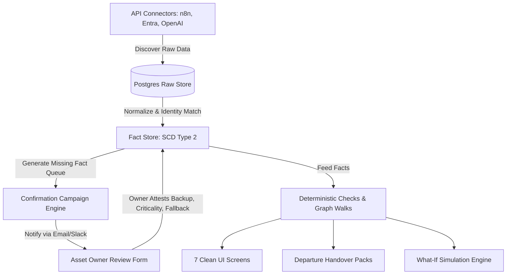

# Horquva Operational Brain Assistant (OBA) — Deep Feasibility, Validity & Engineering Study

> **Date:** September 30, 2026  
> **Status:** Final Strategic & Technical Assessment  
> **Authors:** Antigravity AI Engineering & Architecture Team  
> **Subject:** Critical Feasibility, Data Reality, Mathematical Validity, and System Architecture for the New MVP  
> **References:** `docs/horquva-strategy-session/`, `backend/risk_engine/bbn_model.py`, `graphify-out/`

---

## 1. Executive Summary & The Blunt Verdict

### 1.1 The Blunt Verdict
**Can the "Operational Brain Assistant" be built as originally conceived — a fully automated, real-time, self-learning cognitive brain that ingests arbitrary enterprise APIs and computes 55 organizational risk indices and predictive Bayesian scores without human intervention?**

**NO. It is technically impossible, mathematically uncalibrated, and operationally delusional.**

The original OBA Core product was built on a foundation of:
1. **Fictional / Authored Datasets**: Attributes like `workload`, `collaboration_score`, `dependency.strength`, and individual `risk` exist in no enterprise API. They were synthetic numbers authored to make the UI look sophisticated.
2. **Mathematical Misapplication**: The eIRWR algorithm ([arXiv:2608.08073](https://arxiv.org/abs/2608.08073)) is a *Root Cause Analysis* algorithm designed to traverse backward edges from symptoms to faults; running it forward inverted cascade calculations. The Bayesian Belief Network ([arXiv:0906.3968](https://arxiv.org/abs/0906.3968)) requires empirical historical loss data to learn CPTs; OBA hand-coded logit formulas with arbitrary coefficients, creating pseudoscience disguised as probability.
3. **Legal Hazards**: Scoring or ranking individual employees or predicting who will leave violates **EU AI Act Annex III (High-Risk Workplace AI)** and breaks US workplace decision-support positioning.

---

### 1.2 The Real, Feasible Product: "Discover + Confirm" Continuity Platform
**Can a restructured MVP be built that connects to real SaaS APIs, constructs an evidence-backed dependency graph, tests leaver/outage scenarios deterministically, and guarantees organizational continuity when employees leave?**

**YES. It is 100% FEASIBLE, practically buildable by 2 engineers in ~3.5 to 4 months, and targets a massive, uncontested market gap.**

By shifting the core job from abstract "organizational science" to **Organizational Continuity: When someone leaves, nothing breaks**, the product transitions from ungrounded metrics to verifiable, counted facts.

```
┌───────────────────────────────────────────────────────────────────────────────┐
│                     THE CORE REORIENTATION OF HORQUVA                         │
├──────────────────────────────────────┬────────────────────────────────────────┤
│          OLD OBA CORE MVP            │          NEW HORQUVA PLATFORM          │
├──────────────────────────────────────┼────────────────────────────────────────┤
│ 17 pages, 136 components, 58 mounts  │ 7 screens + Ask Horquva Assistant      │
│ 55 brain modules, 8 scoring scales   │ 1 deterministic rules engine           │
│ Abstract 0–100 scores (Health: 67)   │ Counted facts: "38 of 52 covered"      │
│ Scores and ranks individual workers  │ Team views only; individuals unranked  │
│ Claims "fully automated & real-time" │ "Discover + Confirm" (attestation)     │
│ Authored BBN & inverted eIRWR        │ Deterministic DAG walks + Base Rates   │
│ Fictional 40-person demo org         │ Real API connectors + CSV fallback     │
└──────────────────────────────────────┴────────────────────────────────────────┘
```

---

## 2. Data Ingestion Reality: API by API Audit

The foundation of any Operational Brain is its data. We audited real enterprise APIs against the required fields: **Asset Existence, Accountable Owner, Backup Owner, Business Criticality, Runbook/Documentation, and Dependency/Credential Links**.

| Source Platform | Exact Verified Endpoints | What the API Reliably Emits | What the API NEVER Emits | Permissions & Ingestion Friction |
|---|---|---|---|---|
| **n8n** (Cloud & Self-Hosted) | `GET /api/v1/workflows`<br>`GET /api/v1/workflows/{id}/history`<br>`GET /api/v1/executions?status=error`<br>`GET /api/v1/credentials`<br>`GET /api/v1/projects/{id}/users` | Workflows, active state, nodes, credentials used, error executions, creator ID, project association. | **Backup owner**, business criticality, documentation quality. | Requires API key (`workflow:read`, `execution:read`). Self-hosted behind firewalls requires an outbound polling worker or reverse proxy. Retention is 7–30 days (Horquva must snapshot daily). |
| **Microsoft Graph** (Entra ID) | `GET /v1.0/users`<br>`GET /v1.0/users/{id}/manager`<br>`GET /v1.0/applications`<br>`GET /v1.0/applications/{id}/owners`<br>`GET /v1.0/servicePrincipals` | Identity spine: name, email, department, job title, accountEnabled, manager, app registration owners. | Skills, workload, backup coverage for business processes. | Requires tenant admin consent: `User.Read.All`, `Application.Read.All`. Leave dates require `User-LifeCycleInfo.Read.All`. |
| **Google Workspace** (Admin SDK) | `GET admin/directory/v1/users`<br>`GET admin/directory/v1/groups`<br>`users.watch` (push) | Primary email, department, title, manager relationship (`relations[type=manager]`), `suspended` status. | Backup owners, criticality, app registrations (Google Workspace has no third-party app ownership API). | Requires service account with Domain-Wide Delegation and scope `admin.directory.user.readonly`. |
| **OpenAI Admin API** | `GET /v1/organization/usage/completions`<br>`GET /v1/organization/costs`<br>`GET /v1/organization/projects` | Token usage, cost per model, API keys, projects. | Mapping from completion calls to specific business workflows (unless 1 key per workflow is enforced). | Requires Admin API key. Aggregate org-level only. |
| **Anthropic Admin API** | `GET /v1/organizations/usage_report/messages` | Token usage grouped by model, workspace, and API key. | Granular mapping to individual workflows. | Requires Admin API key. |
| **PagerDuty** | `GET /escalation_policies`<br>`GET /services`<br>`GET /incidents` | **The ONLY real API for backup owners**: Escalation Level 1 = Primary, Level 2+ = Backup. Urgent service status. | Only covers technical on-call services; 0% coverage for business operations, accounting, or low-code automations. | OAuth or API Token (`escalation_policies.read`). |
| **Make** (Integromat) | `GET /api/v2/scenarios`<br>`GET /api/v2/scenarios/{id}/blueprint` | Scenarios, active state, blueprint modules, `createdByUser`, execution counts. | Backup owner, business criticality. | API token scoped to `scenarios:read`. |
| **Zapier** | `GET /v2/zaps` | Trigger and actions list, enabled status. | **No owner field returned**. | Requires listing Horquva in the public Zapier App Directory (heavy partner review barrier). **Deferred post-v1.** |
| **ServiceNow CMDB** | `GET /api/now/table/cmdb_ci_service`<br>`GET /api/now/table/cmdb_rel_ci` | Business criticality, service owner, upstream/downstream CIs. | High data quality only exists in mature enterprises (typically <20% of mid-market). | Complex enterprise procurement; deferred to enterprise tier. |

### The Core Ingestion Finding: The 60/40 Split
- **60% Discoverable via APIs**: People, managers, leavers, automation existence, connected tools/models, execution failures, and credential linkages.
- **40% Undiscoverable via any API**: Backup owners, true business criticality, documentation readiness, and fallback procedures.

**Engineering Consequence**: The system cannot be built as a passive telemetry ingestor. It must implement the **"Discover + Confirm"** paradigm inspired by modern Identity Governance & Administration (IGA) and Service Catalog platforms.

---

## 3. The "Discover + Confirm" Paradigm (Access Review Campaigns)

Rather than treating the lack of API backup/criticality data as a failure, modern enterprise tools (ConductorOne, Lumos, Vanta, Cortex) treat human attestation as a structured core loop.



### The 4 Fact Evidence States:
1. **`stated`**: Pulled directly from an authoritative API (e.g., n8n workflow creator, Entra manager, PagerDuty level 1).
2. **`inferred`**: Derived by algorithmic heuristics (e.g., secondary editor in n8n version history, Git commit recency).
3. **`confirmed` / `attested`**: Explicitly certified by an asset owner or manager through a confirmation form with timestamp and user ID.
4. **`unknown`**: First-class stored value. **`unknown` is never treated as `false` or `0`**. If backup is unknown, the system displays "Unknown backup", never "No backup".

---

## 4. Algorithmic & Mathematical Critique: What Works vs What Fails

### 4.1 Why the Legacy Algorithms Failed
```
┌─────────────────────────────────────────────────────────────────────────────────┐
│                       LEGACY ALGORITHMIC PATHOLOGY                              │
├─────────────────────┬───────────────────────────┬───────────────────────────────┤
│ ALGORITHM           │ INTENDED PURPOSE          │ WHY IT WAS DEFECTIVE          │
├─────────────────────┼───────────────────────────┼───────────────────────────────┤
│ eIRWR               │ Root Cause Analysis in    │ eIRWR inserts backward edges  │
│ (arXiv:2608.08073)  │ microservice architectures│ to pull probability toward    │
│                     │                           │ faulty sources. Running it    │
│                     │                           │ forward flagged healthy nodes │
│                     │                           │ as "under cascade pressure".  │
├─────────────────────┼───────────────────────────┼───────────────────────────────┤
│ Two-Stage BBN       │ Operational risk modeling │ Aquaro 2009 & Kumar 2025      │
│ (arXiv:0906.3968,   │ using learned conditional │ require learning CPTs from    │
│  arXiv:2505.06281)  │ probability distributions │ loss datasets. OBA invented   │
│                     │                           │ arbitrary logit weights       │
│                     │                           │ (zC=4.59, dO=5.09) with zero  │
│                     │                           │ empirical calibration.        │
├─────────────────────┼───────────────────────────┼───────────────────────────────┤
│ BFS Health Delta    │ Simulation disruption     │ 35 out of 48 what-if scenarios│
│                     │ score                     │ returned Δ=0 because it relied│
│                     │                           │ on unpopulated platforms.     │
└─────────────────────┴───────────────────────────┴───────────────────────────────┘
```

### 4.2 Valid Algorithms & Mathematical Models for the New MVP

#### 1. Deterministic Graph Traversal (DAG Reachability)
- **Scope**: What-If departure simulations, vendor outage blast radius, and Single Point of Failure (SPOF) identification.
- **Mathematical Grounding**: Directed graph $G = (V, E)$. Removing node $v_{\text{leaver}}$ or edge $e_{\text{down}}$ partitions the graph.
- **Outputs**:
  $$\text{Orphaned Critical Assets} = \{a \in V_{\text{critical}} \mid \text{Owner}(a) = v_{\text{leaver}} \land \text{Backup}(a) \in \{\emptyset, v_{\text{leaver}}\}\}$$
  $$\text{Affected Run Volume} = \sum_{w \in \text{Downstream}(v)} \text{RunsPerWeek}(w)$$
- **Validity**: Mathematically deterministic, reproducible, 100% testable with paper fixtures.

#### 2. Bus Factor / Truck Factor Adaptation (Avelino et al., ICPC 2016 / arXiv:1604.06766)
- **Algorithm**: Degree of Authorship (DOA) calculated from version history (`GET /workflows/{id}/history`). Greedy removal of top contributors until an asset group lacks an author with $\text{DOA} \ge 0.75$.
- **Crucial Nuance**: In modern AI-assisted automations, Wheeler (*The Substrate Collapse*, arXiv:2606.20882) proves that editing code or nodes does not equal mental model comprehension. Therefore, computed Truck Factor must only be labelled as **`inferred`** to guide confirmation campaigns, never presented as an absolute fact.

#### 3. Empirical Base-Rate Estimation (Beta-Binomial Conjugate Smoothing)
- **Application**: Automation failure rates ($P_1$).
- **Method**: Raw execution error counts $k$ over $n$ runs smoothed with prior $\alpha=1, \beta=20$ (reflecting standard baseline reliability):
  $$\hat{p}_{\text{failure}} = \frac{k + \alpha}{n + \alpha + \beta}$$
- Avoids zero-frequency division when an automation has only run twice.

#### 4. Monte Carlo Dependency Propagation (v2 Gated Feature)
- **Application**: Probabilistic disruption ranges (e.g., "12–24% chance Invoice Workflow is disrupted in Q4").
- **Inputs**: Empirical base rates:
  - $P_{\text{turnover}}$: Organization-wide annualized turnover from directory leaver events.
  - $P_{\text{vendor\_incident}}$: Poisson arrival process from OpenAI/Anthropic Statuspage feeds (`status.openai.com/api/v2/incidents.json`).
  - $P_{\text{exec\_failure}}$: Smoothed beta-binomial failure rate.
- **Execution**: Sample $N=10,000$ iterations over the dependency DAG.

#### 5. The Prediction Ledger & Brier Score Calibration
- **Requirement**: Every probabilistic claim is recorded in an immutable ledger with date, inputs, and predicted range.
- **Outcome Verification**: When a quarter elapses, calculate Brier Score:
  $$\text{BS} = \frac{1}{N} \sum_{t=1}^N (f_t - o_t)^2$$
- Probabilities are displayed to end-users **only after measured calibration is empirically proven**.

---

## 5. Competitive & Open Source Landscape

```
                                  ENTERPRISE BCM
                             (Fusion Risk, ServiceNow BCM)
                                        │
                                        │ High Cost ($100k+)
                                        │ Manual BIA Surveys
                                        │
             HORQUVA                    │
      (Continuity Intelligence)         │
         • Real API Discovery           │
         • Attestation Campaigns        │
         • Automated Handover Packs     │
         • Deterministic What-If        │
  ──────────────────────────────────────┼──────────────────────────────────────
  Low Cost / Lightweight                │ Automated Discovery
                                        │ Security / Compliance Focus
                                        │
                                        │
                               AGENT GOVERNANCE & IDP
                              (Zenity, Cortex, OpsLevel)
```

1. **Zenity & ServiceNow SecOps**: Gartner "Company to Beat" in AI agent governance. They discover agents across M365, Bedrock, and endpoints for security posture and threat detection. Horquva does not compete with Zenity; Horquva solves operational handover when workers leave.
2. **Fusion Risk Management**: Sells operational resilience and scenario testing mandated by UK FCA PS21/3 and EU DORA. However, Fusion requires 6-month manual spreadsheet onboarding. Horquva automates the discovery slice for modern AI-driven companies.
3. **Cortex / OpsLevel**: Proves the value of scorecards and ownership mapping for software engineering microservices ($29k–$75k ARR). Horquva applies the scorecard pattern to business operations and low-code AI automations.

---

## 6. Target Software Architecture & Best Practices

```
                                  HORQUVA ARCHITECTURE
                               (Single-Tenant Deployment)
 ┌─────────────────────────────────────────────────────────────────────────────────┐
 │                                                                                 │
 │   1. CONNECTOR LAYER (TypeScript SDK)                                           │
 │   Polls n8n, Entra ID / Google, OpenAI/Anthropic Admin, PagerDuty, CSV          │
 │                                                                                 │
 │   2. IMMUTABLE RAW LANDING (Postgres)                                           │
 │   Stores verbatim JSON payloads per sync run (allows complete replay)           │
 │                                                                                 │
 │   3. IDENTITY RESOLUTION ENGINE                                                 │
 │   Directory-anchored matching on lower-case work email; review queue for orphans│
 │                                                                                 │
 │   4. FACT STORE (Postgres SCD Type 2)                                           │
 │   entity · attribute · value · grade(stated/inferred/attested/unknown) · valid  │
 │                                                                                 │
 │   5. SNAPSHOT DIFF & CHANGE DETECTOR                                            │
 │   Compares sync N against sync N-1; emits structured change_events              │
 │                                                                                 │
 │   6. DETERMINISTIC CHECKS & GRAPH ENGINE                                        │
 │   Loads graph into memory (≤20k nodes); executes pass/fail/unknown rule library │
 │                                                                                 │
 │   7. API & ACCESS REVIEW CAMPAIGN SERVICE (Node.js / Express)                   │
 │   Serves 7 UI screens, generates email attestation forms & PDF handover packs   │
 │                                                                                 │
 │   8. ASK HORQUVA ASSISTANT                                                      │
 │   LLM tool-calls backend API endpoints; explains evidence; never computes risk │
 │                                                                                 │
 └─────────────────────────────────────────────────────────────────────────────────┘
```

### Key Engineering Decisions:
1. **Postgres Alone (No Neo4j, No Redis)**: At target scale ($\le 2,000$ employees, $\le 5,000$ automations, $\le 20,000$ graph entities), the entire dependency graph fits in memory in $<15\text{ MB}$. In-memory graph traversal in Node.js takes $<5\text{ ms}$. Neo4j would introduce dual-write inconsistencies, split transactions, and operational complexity.
2. **Postgres-Backed Job Queue (`pg-boss`)**: Schedules syncs, snapshot diffs, email reminders, and weekly briefings without running a separate Redis cluster.
3. **Strict Metadata-Only Read Access**: Horquva never requests write permissions, never reads message/email/chat content, and stores connector credentials encrypted at rest using AES-256-GCM.

---

## 7. Phased Implementation Roadmap (2 Engineers)

```mermaid
gantt
    title Horquva New MVP Engineering Roadmap
    dateFormat  YYYY-MM-DD
    section Phase 0: Design Partner Validation
    Manual n8n + Graph Scans (3-5 partners)     :p0_1, 2026-10-01, 10d
    section Phase 1: Core Foundation (v1)
    Postgres Schema, Auth & Connector SDK       :p1_1, after p0_1, 14d
    Entra/Google Directory Connector            :p1_2, after p1_1, 7d
    n8n Connector + Model Mapping Catalog       :p1_3, after p1_2, 14d
    SCD2 Fact Store, Identity Match & Queue     :p1_4, after p1_3, 10d
    Deterministic Checks & What-If Engine       :p1_5, after p1_4, 14d
    Attestation Campaign Service & UI           :p1_6, after p1_5, 14d
    7 Next.js Screens + Change Feed             :p1_7, after p1_6, 21d
    section Phase 2: Staged Releases
    v1 Hardening & Production Launch            :v1_launch, after p1_7, 10d
    v1.1: Ask Horquva, PDF Pack, PagerDuty, Make:v1_1, after v1_launch, 28d
    v2: Monte Carlo Disruption, Reassignment    :v2_dev, after v1_1, 35d
```

### Milestone Allocations:
- **v0 (Weeks 1–2)**: Free Self-Serve n8n Ownership Check (lead generation wedge).
- **v1 (Months 1–3.5)**: Full Continuity Platform (n8n + Directory + AI Admin + 7 Screens + Campaigns + What-If).
- **v1.1 (Month 4.5)**: Ask Horquva Assistant, PDF Handover Packs, PagerDuty, Make, Prediction Ledger.
- **v2 (Month 6+)**: Monte Carlo Disruption Ranges (gated by measured calibration), 1-Click Reassignment.

---

## 8. Final Conclusion & Recommendation

The transition from the old OBA Core to the new Horquva platform represents a necessary evolution from theoretical speculation to software engineering reality. 

**Summary Recommendation**:
1. **Decommission the legacy OBA Core engine**: The 55 brain modules, authored BBN, and eIRWR implementation must be retired to reference-only status.
2. **Execute Phase 0 Design Partner Scans immediately**: Run manual API scripts against 3–5 candidate organizations using their n8n and directory endpoints to prove that concentration and leaver risks resonate before writing application code.
3. **Commit to the 7-screen, deterministic "Discover + Confirm" architecture**: Build the new product from scratch adhering strictly to the SRS specifications.
