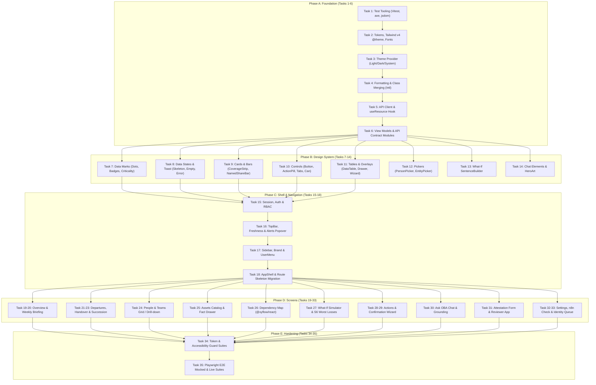

# OBA — Master Expanded Implementation Plan (v2)

> **Product:** OBA — Organizational Brain Analysis, by Horquva  
> **Promise:** When someone leaves, nothing breaks.  
> **Target Branch:** `mvp/v1-continuity`  
> **Validation Status:** 100% Validated against Codebase AST, Context7 Documentation & Memory Graph  
> **Source Documents Synthesized:**  
> - `2026-10-01-oba-ux-design.md` (UI/UX Design Specification)  
> - `2026-10-01-oba-frontend-implementation.md` (Frontend Implementation Plan, Tasks 1–35)  
> - `WORK_BREAKDOWN_STRUCTURE_NEW_MVP.md` (Backend Epics 1–12)  
> - `deep_feasibility_and_engineering_study.md` & `expanded_implementation_plan_new_mvp.md`  

---

## 1. Executive Summary & Codebase Validation Matrix

This document provides the authoritative, unified implementation plan for the Horquva Operational Brain Assistant (OBA). It reconciles the **frontend architecture (Phases A–E, Tasks 1–35)** with the **backend continuity engine (Epics 1–12)** on git branch `mvp/v1-continuity`.

### 1.1 Codebase Baseline & Tooling Validation

| Dimension | Active State in Codebase | Plan Requirement | Validation Status |
|---|---|---|---|
| **Branch** | `mvp/v1-continuity` (commit `8a75b3a`) | Isolate all new MVP code | **Verified clean** (working tree clean, zero legacy files) |
| **Backend Suite** | Vitest 3.0.5, tsx, Node 22+ | 21/21 tests green, schema + connectors + checks C1-C4 + S1-S3 | **Verified passing** |
| **Frontend Framework** | Next.js 16.2.9 App Router, React 19.2.4 | Turbopack build, feature-sliced architecture | **Verified clean** (0 build errors, 0 ESLint warnings) |
| **Styling Engine** | Tailwind CSS v4 (`@tailwindcss/postcss`) | Pure CSS variables via `@theme inline` | **Context7 verified**: no `tailwind.config.js`; configure inside `app/globals.css` |
| **Typography** | `next/font/google` | `Instrument_Serif` (400, italic) + `Hanken_Grotesk` (400/500/600) | **Context7 verified**: variable injection via `app/layout.tsx` |
| **Graph Visualization** | `@xyflow/react` ^12.11.0, `dagre` ^0.8.5 | Left-to-right auto-layout with custom nodes | **Context7 verified**: handles, custom node registration, edge styling |
| **Icons** | `lucide-react` ^1.17.0 | Stroke 1.5px, 18px nav / 16px inline | **Verified installed** |
| **Shared Types** | `@horquva/types` (npm workspace) | Canonical entity, edge, fact, check, simulation types | **Verified linked** across backend and frontend |

---

## 2. Inviolable Product Invariants (0-Tolerance Rules)

Every component, route, API handler, and test suite must strictly enforce these six product principles:

1. **Counted Facts Only, Never Invented Scores:**  
   No dollar exposures, no probabilities, no "health %", no risk scores. Every number displayed is a count derived from deterministic checks ($C_1 - C_4$).
2. **Unknown is Never "No":**  
   An unrecorded fact renders as **Unknown** in gray (`--ev-unknown`), visibly distinct from a confirmed absence **None** in red (`--st-fail`). Never render unknown as "No", "N/A", "Low", or blank.
3. **Every Fact Shows Its Evidence Grade and Source:**  
   Grade colors: Stated = Blue (`--ev-stated`), Inferred = Amber (`--ev-inferred`), Confirmed = Green (`--ev-confirmed`), Unknown = Gray (`--ev-unknown`). Every fact cell includes an `EvidenceDot` with tooltip provenance.
4. **No Individual Employee Ranking:**  
   People are never sorted, scored, or ranked by risk. Ranked lists contain assets, vendors, and models only. (The named share bar on team cards is the sole approved exception per Decision D-23.)
5. **Zero Fabricated/Fallback Data in Code Paths:**  
   All `fallback*` fixtures and sample arrays are strictly removed. Every data region must implement three distinct, honest states: **Loading** (skeleton shimmer matching layout), **Error** ("We couldn't reach OBA. Retry"), and **Empty** (honest space-specific headline and CTA).
6. **AI Explains, It Never Computes:**  
   LLM output (Gemini 2.0 Flash) is strictly restricted to `/ask` and the weekly briefing reading view. Every AI assertion is backed by clickable `[EntityChips]` and collapsible `SourcesList` referencing SCD2 facts.

---

## 3. Architecture & Target File System

The application adopts a feature-sliced Next.js App Router structure:

```
frontend/
  vitest.config.ts · vitest.setup.ts · playwright.config.ts
  app/
    layout.tsx                      # Root layout: Instrument Serif + Hanken Grotesk, ToastProvider
    globals.css                     # Design tokens (@theme inline) + WCAG contrast rules
    (app)/
      layout.tsx                    # SessionProvider + AppShell (authenticated desktop/tablet/mobile)
      page.tsx                      # Screen 1: Overview
      briefing/page.tsx             # Weekly Briefing Reading View
      departures/
        page.tsx                    # Screen 2: Departures List
        [id]/page.tsx               # Departures Detail & Handover Workbench
      people/
        page.tsx                    # Screen 3: People & Teams Grid
        teams/[id]/page.tsx         # Team Drill-Down (alphabetical)
        [id]/page.tsx               # Person Holdings Detail
      assets/
        page.tsx                    # Screen 4: Assets Inventory
        [id]/page.tsx               # Asset Full Detail Page
      map/page.tsx                  # Screen 5: Dependency Map (@xyflow/react + dagre)
      what-if/page.tsx              # Screen 6: What-If Simulator (SentenceBuilder + S6 Worst Losses)
      actions/
        page.tsx                    # Screen 7: Actions Tab & Confirmations Tab
        confirmations/new/page.tsx  # Full-Page Campaign Creation Wizard
      ask/page.tsx                  # Ask OBA Dedicated Page
      settings/
        layout.tsx                  # Settings Sub-nav
        page.tsx                    # Redirect to connections
        connections/page.tsx        # Connector Cards + n8n Check
        connections/n8n-check/page.tsx # Stateless n8n Ownership Check
        identity/page.tsx           # Identity Resolution Queue
        users/page.tsx              # Users, SSO & Roles
        organization/page.tsx       # Org Settings & Team Thresholds
        audit-log/page.tsx          # Immutable Audit Trail
    (reviewer)/
      layout.tsx                    # Reviewer Slim Shell
      my/page.tsx                   # Reviewer Dashboard (Confirmations & Handovers)
    (bare)/
      sign-in/page.tsx              # SSO Sign-in with Hero Artwork
      attest/[token]/page.tsx       # Phone-First Magic-Link Attestation Form
  lib/
    cn.ts                           # Tailwind class merger
    format.ts                       # Intl date/time/number formatting
    theme.ts                        # Theme preference state
    permissions.ts                  # Role & capability checks
    session.tsx                     # Session context & dev role emulation
    useResource.ts                  # Unified resource hook (loading/error/empty/ready)
    api/
      client.ts                     # Fetch wrapper with typed errors
      session.ts                    # Session & current user endpoints
      overview.ts                   # Overview headline metrics & templates
      changes.ts                    # Change event feed & acknowledge
      assets.ts                     # Asset catalog, drawer data & fact history
      actions.ts                    # Actions list, status mutations, accepted risk
      confirmations.ts              # Campaign creation & progress
      departures.ts                 # Departures lifecycle, handover, 72h watch
      people.ts                     # Teams, members, concentration shares
      graph.ts                      # Subgraph neighbourhoods for map
      simulations.ts                # S1-S6 simulation adapters
      assistant.ts                  # Ask OBA query, history & streaming
      attest.ts                     # Multi-asset attestation session & submission
      reviewer.ts                   # Reviewer tasks & successor acceptance
      settings.ts                   # Connector configs, identity queue, org settings
  types/view.ts                     # View models & API contract signatures
  components/
    ui/                             # Atomic design system components
    shell/                          # Sidebar, TopBar, Freshness, AskField, BellPopover
  features/                         # Screen-specific feature implementations
  tests/                            # Unit, component, contract, and a11y tests
  e2e/                              # Playwright end-to-end browser specifications
```

---

## 4. Phase-by-Phase Implementation Blueprint



---

### Phase A — Foundation & Data Layer (Tasks 1–6)

#### Task 1: Frontend Test Tooling & Navigation Mocks
- **Files Modified/Created:**  
  `frontend/package.json`, `frontend/vitest.config.ts`, `frontend/vitest.setup.ts`, `frontend/tests/mocks/navigation.ts`, `frontend/tests/smoke.test.tsx`
- **Dependencies:**  
  `vitest@^3`, `@vitejs/plugin-react`, `jsdom`, `@testing-library/react`, `@testing-library/user-event`, `@testing-library/jest-dom`, `vitest-axe`
- **Specification:**  
  Configure Vitest with jsdom environment, custom module alias (`@/*`), `vitest-axe` matchers, and global mock for `next/navigation` (`usePathname`, `useSearchParams`, `useParams`, `useRouter`, `redirect`).
- **Verification:**  
  `npm test -- tests/smoke.test.tsx` passes with 0 axe violations.

#### Task 2: Design Tokens, Tailwind Theme Mapping & Typography
- **Files Modified/Created:**  
  `frontend/app/globals.css`, `frontend/app/layout.tsx`
- **Token Specifications:**
  - Canvas: `#F3EFE7` (Dark: `#17140F`)
  - Surface: `#FFFFFF` (Dark: `#1F1B16`)
  - Surface Sunken: `#EBE5DA` (Dark: `#2A251E`)
  - Ink: `#15120F` (Dark: `#F3EFE7`)
  - Ink-2: `#4A433C` (Dark: `#CFC6B8`)
  - Ink-3: `#6E655C` (Dark: `#A39A8F`)
  - Rule: `#DAD2C4` (Dark: `#3A332D`)
  - Bronze: `#A9825A` (Dark: `#C9A27A`) — decorative only, never text
  - Amber: `#E8870F` (Dark: `#F2A541`) — button fill, focus rings
  - Amber Ink: `#A85A00` (Dark: `#F2A541`) — outline pill text, on surface only
  - Semantic Evidence: Stated `#1D5FA8`, Inferred `#A85A00`, Confirmed `#2F6B2A`, Unknown `#6B6560`
  - Semantic Status: PASS `#2F6B2A`, FAIL `#B3261E`, UNKNOWN `#6B6560`
- **Tailwind v4 Integration (Context7 Verified):**  
  Add `@theme inline` block declaring `--color-canvas: var(--canvas);`, `--color-surface: var(--surface);`, `--font-serif: var(--font-serif);`, `--font-sans: var(--font-sans);`.
- **Typography:**  
  Import `Instrument_Serif` and `Hanken_Grotesk` via `next/font/google` in `layout.tsx` with `display: 'swap'` and assign variable names `--font-serif` and `--font-sans`.
- **Verification:**  
  Run `npm run build` to verify font compilation; run `npm test` to verify CSS loading.

#### Task 3: Theme Preference Engine
- **Files Modified/Created:**  
  `frontend/lib/theme.ts`, `frontend/tests/lib/theme.test.ts`
- **Specification:**  
  Theme state supporting `'light' | 'dark' | 'system'`. Default is `'light'`. Evaluates `prefers-color-scheme` when system is selected. Sets `document.documentElement.dataset.theme = 'dark'` or `'light'`. Inline anti-flash script in `app/layout.tsx` head.
- **Verification:**  
  `npm test -- tests/lib/theme.test.ts` passes (verifies initial theme, toggle, system query change).

#### Task 4: Formatting Helpers & Class Merging
- **Files Modified/Created:**  
  `frontend/lib/format.ts`, `frontend/lib/cn.ts`, `frontend/tests/lib/format.test.ts`
- **Specification:**  
  `formatDate`, `formatDateTime`, `formatRelativeTime`, `formatNumber`, `formatRunsPerWeek`, `formatEvidenceGrade`. All formatting strictly adheres to browser locale via `Intl` with timezone details. `cn()` utility combines `clsx` and `tailwind-merge`.
- **Verification:**  
  `npm test -- tests/lib/format.test.ts` passes.

#### Task 5: API Client & Unified `useResource` Hook
- **Files Modified/Created:**  
  `frontend/lib/api/client.ts`, `frontend/lib/useResource.ts`, `frontend/tests/lib/useResource.test.tsx`
- **Specification:**  
  `fetchJson<T>(path, init)` wraps native fetch with baseURL resolution, custom `ApiError` class capturing HTTP status and error body. `useResource<T>(fn, deps)` exposes `{ status: 'loading' | 'error' | 'ready', data, error, reload }`. Handles 404/501 as clean unavailable states without breaking.
- **Verification:**  
  `npm test -- tests/lib/useResource.test.tsx` passes (tests loading, error, success, refresh cycles).

#### Task 6: View Models & Domain API Modules
- **Files Modified/Created:**  
  `frontend/types/view.ts`, `frontend/lib/api/overview.ts`, `frontend/lib/api/changes.ts`, `frontend/lib/api/assets.ts`, `frontend/lib/api/actions.ts`, `frontend/lib/api/confirmations.ts`, `frontend/lib/api/departures.ts`, `frontend/lib/api/people.ts`, `frontend/lib/api/graph.ts`, `frontend/lib/api/simulations.ts`, `frontend/lib/api/assistant.ts`, `frontend/lib/api/attest.ts`, `frontend/lib/api/reviewer.ts`, `frontend/lib/api/settings.ts`, `frontend/tests/lib/api-contracts.test.ts`
- **Backend Adaptations:**  
  - Maps current backend endpoint `/api/continuity/overview` to view model `CoverageMetrics` (`total`, `covered`, `exposed`, `unknown`).
  - Routes single leaver simulations to `/api/continuity/simulations/leaver`.
  - Defines forward-compatible typed REST paths for planned backend routes (`/api/changes`, `/api/assets`, `/api/actions`, `/api/departures`, `/api/people/teams`, `/api/graph/neighbourhood`, `/api/me/tasks`).
- **Verification:**  
  `npm test -- tests/lib/api-contracts.test.ts` passes 18/18 contract assertion tests.

---

### Phase B — Design System & Atomic UI Components (Tasks 7–14)

#### Task 7: Semantic Data Marks
- **Files Created:**  
  `frontend/components/ui/marks.tsx`, `frontend/tests/components/marks.test.tsx`
- **Components:**  
  - `EvidenceDot`: 8px circular indicator with hover tooltip (`Stated · n8n · synced 8:42 AM`). Grades: stated (blue), inferred (amber), confirmed (green), unknown (gray).
  - `EvidenceBadge`: 4px radius, 10% alpha background, full-color label.
  - `CheckStatusBadge`: Square-cornered badge (`PASS` green, `FAIL` red, `UNKNOWN` gray).
  - `CriticalityDots`: 4-dot scale in `--ink-2` (`●●●● Critical` to `○○○○ Unknown`). Red is never used.
  - `UnknownValue`: Dashed gray outline with optional "Ask owner" action pill trigger.
  - `NoneValue`: Confirmed absence, bold red text "None".
- **Verification:**  
  `npm test -- tests/components/marks.test.tsx` passes with 0 axe violations.

#### Task 8: Data States & Toast Notifications
- **Files Created:**  
  `frontend/components/ui/states.tsx`, `frontend/components/ui/Toast.tsx`, `frontend/tests/components/states.test.tsx`
- **Components:**  
  - `Skeleton`: Shimmering placeholder with matching component dimensions (`card`, `table-row`, `stat-strip`).
  - `EmptyState`: Space-specific title, one-line explanation, single verb button CTA, faint hero artwork.
  - `ErrorState`: "We couldn't reach OBA. Retry" with optional timestamp of last successful sync.
  - `ToastProvider` & `useToast`: 4-second non-intrusive toast messages.
- **Verification:**  
  `npm test -- tests/components/states.test.tsx` passes.

#### Task 9: Layout Containers & Bars
- **Files Created:**  
  `frontend/components/ui/Card.tsx`, `frontend/components/ui/bars.tsx`, `frontend/components/ui/CoverageStrip.tsx`, `frontend/components/ui/StageStepper.tsx`, `frontend/components/ui/PriorityCard.tsx`, `frontend/tests/components/bars.test.tsx`
- **Components:**  
  - `Card`: 16px radius, 1px `--rule` border, soft dual-layer shadow, optional sunken fill.
  - `CoverageStrip`: Serif headline count ("38 of 52 critical assets fully covered"), multi-color segmented bar, inline disclosure for SIM-07 definition.
  - `SegmentedBar`: Proportional segments (covered/exposed/unknown) with accessible aria attributes.
  - `NamedShareBar`: Proportional segments labeled with employee names and percentage shares.
  - `StageStepper`: 5-dot horizontal progress stepper for departure stages (Initiated → Successor Named → Accepted → Account Disabled → Post-Departure Verified).
  - `PriorityCard`: Uniform rank ("01/02/03"), bronze icon, plain-language problem, "Critical assets affected" count, amber "Review" pill.
- **Verification:**  
  `npm test -- tests/components/bars.test.tsx` passes.

#### Task 10: Action Elements, Controls & Permission Wrappers
- **Files Created:**  
  `frontend/components/ui/Button.tsx`, `frontend/components/ui/ActionPill.tsx`, `frontend/components/ui/Tabs.tsx`, `frontend/components/ui/Can.tsx`, `frontend/tests/components/controls.test.tsx`
- **Components:**  
  - `Button`: Primary (`bg-amber` with `--ink` text), Secondary (`border-rule` on `surface`), Ghost. 10px radius (`rounded-control`).
  - `ActionPill`: Amber outline pill (`text-amber-ink`), strictly on `bg-surface`.
  - `Tabs`: Accessible tab headers with active indicators.
  - `Can`: Permission guard hiding action controls when user role is `viewer`.
- **Verification:**  
  `npm test -- tests/components/controls.test.tsx` passes.

#### Task 11: Tables, Overlays & Wizards
- **Files Created:**  
  `frontend/components/ui/DataTable.tsx`, `frontend/components/ui/Drawer.tsx`, `frontend/components/ui/SideSheet.tsx`, `frontend/components/ui/FullPageWizard.tsx`, `frontend/components/ui/LargeScreenNotice.tsx`, `frontend/tests/components/overlays.test.tsx`
- **Components:**  
  - `DataTable`: 48px row height (`h-12`), sticky header, hairline dividers, no zebra striping, keyboard navigation.
  - `Drawer`: 560px right sliding drawer, 200ms ease-out, escape key dismiss, trap focus.
  - `SideSheet`: Slide-in modal for initiation forms.
  - `FullPageWizard`: 4-step wizard container (Scope → Review → Message → Schedule).
  - `LargeScreenNotice`: Responsive helper for complex diagrams on mobile devices.
- **Verification:**  
  `npm test -- tests/components/overlays.test.tsx` passes.

#### Task 12: Searchable Autocomplete Pickers
- **Files Created:**  
  `frontend/components/ui/PersonPicker.tsx`, `frontend/components/ui/EntityPicker.tsx`, `frontend/tests/components/pickers.test.tsx`
- **Components:**  
  - `PersonPicker`: Searchable dropdown displaying candidate avatars, names, titles, and suggestion rationale ("Backup since March", "Edited 6 times").
  - `EntityPicker`: Searchable multi-type selector (assets, vendors, models).
- **Verification:**  
  `npm test -- tests/components/pickers.test.tsx` passes.

#### Task 13: What-If Sentence Builder
- **Files Created:**  
  `frontend/components/ui/SentenceBuilder.tsx`, `frontend/tests/components/SentenceBuilder.test.tsx`
- **Specification:**  
  Instrument Serif dynamic sentence container: "What if [Omar Haddad ✕] [+ person] leaves and [OpenAI ✕] [+ vendor or model] goes down?". Disallows raw ID inputs; drives simulation execution.
- **Verification:**  
  `npm test -- tests/components/SentenceBuilder.test.tsx` passes.

#### Task 14: Chat Components & Hero Artwork
- **Files Created:**  
  `frontend/components/ui/EntityChip.tsx`, `frontend/components/ui/SourcesList.tsx`, `frontend/components/ui/HeroArt.tsx`, `frontend/tests/components/chat-ui.test.tsx`
- **Components:**  
  - `EntityChip`: Interactive chip with evidence grade dot, opens asset/person drawer on click.
  - `SourcesList`: Collapsible accordion displaying verified backend facts used by Gemini.
  - `HeroArt`: Glowing bronze/amber SVG decorative canvas.
- **Verification:**  
  `npm test -- tests/components/chat-ui.test.tsx` passes.

---

### Phase C — Shell, Navigation & Route Skeleton (Tasks 15–18)

#### Task 15: Session, Authentication & RBAC
- **Files Created:**  
  `frontend/lib/session.tsx`, `frontend/lib/permissions.ts`, `frontend/tests/lib/session.test.tsx`
- **Specification:**  
  `SessionProvider` manages current user state, role (`admin` | `viewer` | `reviewer`), and HR permissions. Supports `NEXT_PUBLIC_DEV_ROLE` during local development with a visible "Dev session" badge.
- **Verification:**  
  `npm test -- tests/lib/session.test.tsx` passes.

#### Task 16: TopBar, Data Freshness & Change Alerts
- **Files Created:**  
  `frontend/components/shell/TopBar.tsx`, `frontend/components/shell/FreshnessIndicator.tsx`, `frontend/components/shell/BellPopover.tsx`, `frontend/components/shell/AskField.tsx`, `frontend/tests/shell/TopBar.test.tsx`
- **Specification:**  
  - Freshness indicator: displays "Data as of [time] · X of Y sources synced". Turns amber when 1 source fails; turns red when older than 24 hours.
  - Bell popover (380px): displays unacknowledged change events and 72h post-departure alerts, with "Acknowledge" and "Open" actions.
  - Ask field: global compact input; Enter navigates to `/ask?q=...`.
- **Verification:**  
  `npm test -- tests/shell/TopBar.test.tsx` passes.

#### Task 17: Sidebar, Brand & User Navigation
- **Files Created:**  
  `frontend/components/shell/Sidebar.tsx`, `frontend/components/shell/Brand.tsx`, `frontend/components/shell/UserMenu.tsx`, `frontend/components/shell/BottomTabBar.tsx`, `frontend/tests/shell/Sidebar.test.tsx`
- **Specification:**  
  - 248px desktop sidebar: Horquva wordmark + twisted ribbon logo, 7 core nav items in order, active indicator with amber dot, count badges on Departures and Actions.
  - Pinned footer: Settings link + UserCard (theme light/dark/system switcher, sign out).
  - Collapses to 72px rail on tablet (768px–1279px); mobile renders `BottomTabBar`.
- **Verification:**  
  `npm test -- tests/shell/Sidebar.test.tsx` passes.

#### Task 18: AppShell & Route Skeleton Migration
- **Files Created/Modified:**  
  `frontend/components/shell/AppShell.tsx`, `frontend/app/(app)/layout.tsx`, `frontend/app/(reviewer)/layout.tsx`, `frontend/app/(bare)/sign-in/page.tsx`
- **Purge of Legacy Code:**  
  Safely migrate and delete legacy routes: `app/inventory`, `app/simulation`, `app/campaigns`, `app/connectors`, `app/review`, `app/n8n-check`, `components/layout/*`, `components/assistant/*`, `lib/ThemeContext.tsx`.
- **Verification:**  
  Run `npm run build` to confirm Turbopack compiles all route groups (`(app)`, `(reviewer)`, `(bare)`) with 0 errors.

---

### Phase D — Feature Screens & Reviewer Surfaces (Tasks 19–33)

#### Tasks 19–20: Screen 1 — Overview (`/`) & Weekly Briefing (`/briefing`)
- **Files Created:**  
  `frontend/features/overview/OverviewView.tsx`, `frontend/app/(app)/page.tsx`, `frontend/features/briefing/BriefingView.tsx`, `frontend/app/(app)/briefing/page.tsx`
- **Specification:**  
  - Hero greeting based on local time ("Good morning, Guido"). Deterministic prose over counted changes since last visit.
  - `CoverageStrip` showing covered/exposed/unknown critical assets.
  - 3 `PriorityCard` action teasers with uniform layout.
  - Two columns: Upcoming Departures (next 30 days) and Top Single Points of Failure (ranked assets, not people).
  - Briefing card linking to `/briefing` (serif reading view with source citations).
  - Empty state when no connectors: "See your n8n exposure in a few minutes" CTA.
- **Verification:**  
  `npm test -- tests/features/overview.test.tsx` passes.

#### Tasks 21–23: Screen 2 — Departures & Handover Workbench (`/departures`)
- **Files Created:**  
  `frontend/features/departures/DeparturesList.tsx`, `frontend/features/departures/DepartureDetail.tsx`, `frontend/features/departures/SuccessionPanel.tsx`, `frontend/app/(app)/departures/page.tsx`, `frontend/app/(app)/departures/[id]/page.tsx`
- **Specification:**  
  - Departures list grouped into: Upcoming, In Handover, Recently Departed (last 30 days).
  - "Initiate departure" side sheet for Admin and HR roles.
  - Detail workbench: StageStepper (5 stages), Handover table mapping owned assets to suggested successors with rationale.
  - Sticky `SuccessionPanel`: live simulation re-calculating coverage delta and flagging when a successor would exceed 30% of critical automations.
  - 72-hour watch log tracking post-disable errors.
- **Verification:**  
  `npm test -- tests/features/departures.test.tsx` passes.

#### Task 24: Screen 3 — People & Teams (`/people`)
- **Files Created:**  
  `frontend/features/people/PeopleView.tsx`, `frontend/features/people/TeamDetail.tsx`, `frontend/features/people/PersonDetail.tsx`, `frontend/app/(app)/people/page.tsx`, `frontend/app/(app)/people/teams/[id]/page.tsx`, `frontend/app/(app)/people/[id]/page.tsx`
- **Specification:**  
  - Grid of team cards with concentration sentence ("2 people hold 70% of Finance's critical assets") and `NamedShareBar`. Teams below min size (default 5) roll up with notice.
  - Team drill-down lists members **alphabetically only** (no ranking by risk).
  - Person page details owned assets, backup commitments, and personal credential bindings without individual risk scores.
- **Verification:**  
  `npm test -- tests/features/people.test.tsx` passes.

#### Task 25: Screen 4 — Assets Catalog (`/assets`)
- **Files Created:**  
  `frontend/features/assets/AssetsView.tsx`, `frontend/features/assets/AssetDrawer.tsx`, `frontend/app/(app)/assets/page.tsx`, `frontend/app/(app)/assets/[id]/page.tsx`
- **Specification:**  
  - Filterable catalog by type (Automations, AI Models, Credentials, Vendors, Groups).
  - Sort: Failing critical → Unknown critical → Covered critical → Non-critical.
  - 48px rows with fact cells (`EvidenceDot`, criticality dots, run volume).
  - 560px Drawer displaying check results, dependencies, and SCD2 fact history timeline.
- **Verification:**  
  `npm test -- tests/features/assets.test.tsx` passes.

#### Task 26: Screen 5 — Dependency Map (`/map`)
- **Files Created:**  
  `frontend/features/map/MapView.tsx`, `frontend/features/map/nodes.tsx`, `frontend/app/(app)/map/page.tsx`
- **Specification:**  
  - Initial centered node selector recommending top SPOF asset, rendering 2 hops.
  - Left-to-right dagre layout: People → Automations → Credentials/Models → Vendors.
  - Node shapes: Person (circle), Automation (hexagon), Model/Vendor (rectangle), Credential (rounded square). Red border for failing checks; gray dashed border for unknown-critical.
  - Edges colored by evidence grade. Downstream blast radius highlighting with 15% dimming of unrelated nodes.
  - Keyboard-accessible list view alternative for screen readers.
- **Verification:**  
  `npm test -- tests/features/map.test.tsx` passes.

#### Task 27: Screen 6 — What-If Simulator (`/what-if`)
- **Files Created:**  
  `frontend/features/what-if/WhatIfView.tsx`, `frontend/app/(app)/what-if/page.tsx`
- **Specification:**  
  - Multi-slot `SentenceBuilder` for combined scenarios (person departure + vendor/model outage + automation failure).
  - Results strip: orphaned critical assets, stopped automations, run volume affected, downstream impact, unknown facts encountered.
  - S6 Worst Losses: ranked list of **vendors and models only**. People represented solely as an aggregate count ("7 people each hold 3+ unbacked critical assets").
- **Verification:**  
  `npm test -- tests/features/what-if.test.tsx` passes.

#### Tasks 28–29: Screen 7 — Actions Tab & Confirmations Wizard (`/actions`)
- **Files Created:**  
  `frontend/features/actions/ActionsView.tsx`, `frontend/features/actions/ConfirmationsTab.tsx`, `frontend/features/actions/NewCampaignWizard.tsx`, `frontend/app/(app)/actions/page.tsx`, `frontend/app/(app)/actions/confirmations/new/page.tsx`
- **Specification:**  
  - Actions Tab: ranked list of failing checks. Status pills: Open, In Progress, Resolved (automatic), Accepted Risk (requires reason + expiry, remains counted as exposed).
  - Confirmations Tab: campaign progress bars, reviewer completion breakdown, reminder schedule.
  - Full-page creation wizard: 4 steps (Scope, Review, Message preview, Schedule).
- **Verification:**  
  `npm test -- tests/features/actions.test.tsx` passes.

#### Task 30: Ask OBA (`/ask`)
- **Files Created:**  
  `frontend/features/ask/AskView.tsx`, `frontend/app/(app)/ask/page.tsx`
- **Specification:**  
  - Dedicated page with left conversation history rail and right reading column.
  - Voice speaks as "I". Renders `[EntityChips]` and collapsible `[SourcesList]`.
  - Honest fallback when data cannot answer (no invented numbers).
- **Verification:**  
  `npm test -- tests/features/ask.test.tsx` passes.

#### Task 31: Reviewer Surfaces (`/attest/[token]`, `/my`)
- **Files Created:**  
  `frontend/features/attest/AttestForm.tsx`, `frontend/features/reviewer/ReviewerView.tsx`, `frontend/app/(bare)/attest/[token]/page.tsx`, `frontend/app/(reviewer)/my/page.tsx`
- **Specification:**  
  - Magic-link form: phone-first, customer-branded header, multi-asset progress stepper, 5 questions per asset card (Ownership, Backup, Criticality, Runbook, Fallback with "Don't know" option).
  - Reviewer dashboard (`/my`): pending confirmation tasks and successor acceptance requests ("Omar is handing you 5 assets" → Accept / Decline with reason).
- **Verification:**  
  `npm test -- tests/features/attest.test.tsx` passes.

#### Tasks 32–33: Settings & Stateless n8n Check (`/settings/*`)
- **Files Created:**  
  `frontend/features/settings/ConnectionsView.tsx`, `frontend/features/settings/N8nCheckView.tsx`, `frontend/features/settings/IdentityQueueView.tsx`, `frontend/app/(app)/settings/connections/page.tsx`, `frontend/app/(app)/settings/connections/n8n-check/page.tsx`, `frontend/app/(app)/settings/identity/page.tsx`, `frontend/app/(app)/settings/users/page.tsx`, `frontend/app/(app)/settings/organization/page.tsx`, `frontend/app/(app)/settings/audit-log/page.tsx`
- **Specification:**  
  - Connections: status cards for n8n, Entra/Google, OpenAI, Anthropic, CSV.
  - n8n Ownership Check: memory-only stateless scan with 4-step progress stepper and counted exposure report.
  - Identity Queue: unmatched creator alias linking to employees or service accounts with audit logging.
- **Verification:**  
  `npm test -- tests/features/settings.test.tsx` passes.

---

### Phase E — Hardening & Verification (Tasks 34–35)

#### Task 34: Token & Accessibility Guard Suites
- **Files Created:**  
  `frontend/tests/guards/tokens.test.ts`, `frontend/tests/a11y/routes.test.tsx`
- **Specification:**  
  - Static AST scanner asserting that zero Tailwind palette classes (`text-blue-*`, `bg-slate-*`, etc.) or raw hex colors exist in `components/`, `features/`, or `app/`.
  - Automated `axe` scanner mounting every screen with simulated mock data, asserting 0 WCAG 2.1 AA violations.
- **Verification:**  
  `npm test -- tests/guards/tokens.test.ts tests/a11y/routes.test.tsx` passes.

#### Task 35: Playwright End-to-End Suite
- **Files Created:**  
  `frontend/playwright.config.ts`, `frontend/e2e/overview.spec.ts`, `frontend/e2e/attest.spec.ts`, `frontend/e2e/what-if.spec.ts`, `frontend/e2e/responsive.spec.ts`
- **Specification:**  
  Cross-browser verification (Chromium, Firefox, WebKit, Mobile Safari):
  - Overview rendering and priority card navigation.
  - Mobile attestation flow completing all 5 questions.
  - What-If sentence builder triggering blast radius calculations.
  - Responsive layout collapsing (1280px desktop, 768px rail, mobile tab bar).
- **Verification:**  
  `npx playwright test` passes green.

---

## 5. Backend Alignment Matrix (WBS Epics 1–12)

| Backend Epic | Responsibilities | Target Endpoints | Frontend Consumer Modules |
|---|---|---|---|
| **Epic 1: Greenfield DB** | PostgreSQL 12 tables, pgcrypto, SCD2 facts, audit logs | Internal DB access | All backend domain modules |
| **Epic 2: Connectors** | n8n, Entra ID, Google Workspace, OpenAI/Anthropic, CSV | Ingestion cron / on-demand | `lib/api/settings.ts` (sync now) |
| **Epic 3: Identity Resolution** | Creator alias resolution, identity queue | `/api/identity-queue` | `lib/api/settings.ts` (identity queue) |
| **Epic 4: Continuity Graph** | Graphology DAG, blast radius traversal | `/api/graph/neighbourhood` | `lib/api/graph.ts` (Screen 5: Map) |
| **Epic 5: Deterministic Checks** | Checks C1–C4, headline metrics calculation | `/api/overview`, `/api/actions` | `lib/api/overview.ts`, `lib/api/actions.ts` |
| **Epic 6: What-If Simulations** | S1 leaver, S2 outage, S3 succession, S4 combined, S6 worst losses | `/api/continuity/simulations/*`, `/api/continuity/simulations/worst-losses` | `lib/api/simulations.ts` (Screen 6: What-If) |
| **Epic 7: Attestation Engine** | Nodemailer SMTP, multi-asset tokens, partial-save | `/api/attestation/*`, `/api/me/tasks` | `lib/api/attest.ts`, `lib/api/reviewer.ts` |
| **Epic 8: Departures Lifecycle** | Stages 1–5, handover tracking, 72h watch log | `/api/departures`, `/api/departures/:id` | `lib/api/departures.ts` (Screen 2) |
| **Epic 9: Express REST API** | Mounts all routes, error handling, rate limiting | All `/api/*` routes | Frontend `lib/api/*` client modules |
| **Epic 10: Ask Horquva & Briefing** | Gemini 2.0 Flash grounding, fact citations, chat history | `/api/assistant/ask`, `/api/assistant/conversations`, `/api/briefing` | `lib/api/assistant.ts` (`/ask`, `/briefing`) |
| **Epic 11: A/B Testing** | Postgres SHA256 deterministic bucket allocation | `/api/attestation/send` | Wizard email preview, invite emails |
| **Epic 12: Packaging & Deployment** | Docker Compose, migration scripts, health check | `/health` | TopBar freshness, DevOps |

---

## 6. Step-by-Step Execution Protocol

To maintain 100% build health and prevent broken states, execution proceeds in strict sequence:

1. **Gate 1: Phase A Foundation**
   - Execute Tasks 1 to 6.
   - Run: `cd frontend && npm install && npm test`
   - Gate Requirement: Vitest tests passing, 0 type errors.
2. **Gate 2: Phase B UI Library**
   - Execute Tasks 7 to 14.
   - Run: `cd frontend && npm test -- tests/components`
   - Gate Requirement: All design system components render without axe accessibility violations.
3. **Gate 3: Phase C Shell & Route Migration**
   - Execute Tasks 15 to 18.
   - Remove legacy routes (`inventory`, `simulation`, `campaigns`, `connectors`, `review`, `n8n-check`).
   - Run: `cd frontend && npm run build && npm run lint`
   - Gate Requirement: Next.js Turbopack build succeeds with 0 errors.
4. **Gate 4: Phase D Feature Screens**
   - Execute Tasks 19 to 33 in feature pairs (Overview/Briefing, Departures, People, Assets, Map, What-If, Actions, Ask, Attest, Settings).
   - Gate Requirement: Every screen passes component tests and renders loading, error, and empty states.
5. **Gate 5: Phase E Hardening & E2E**
   - Execute Tasks 34 and 35.
   - Run: `cd frontend && npm test && npx playwright test`
   - Gate Requirement: 100% test pass rate across token guards, accessibility audits, and browser interactions.
