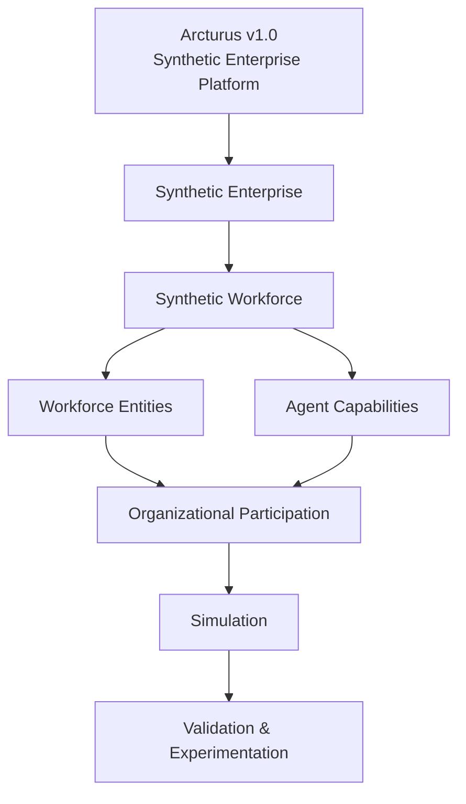
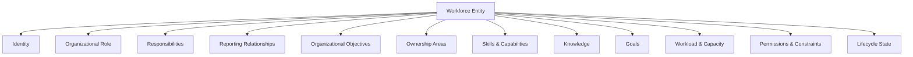
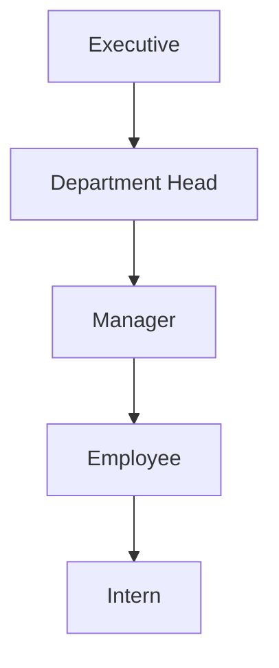
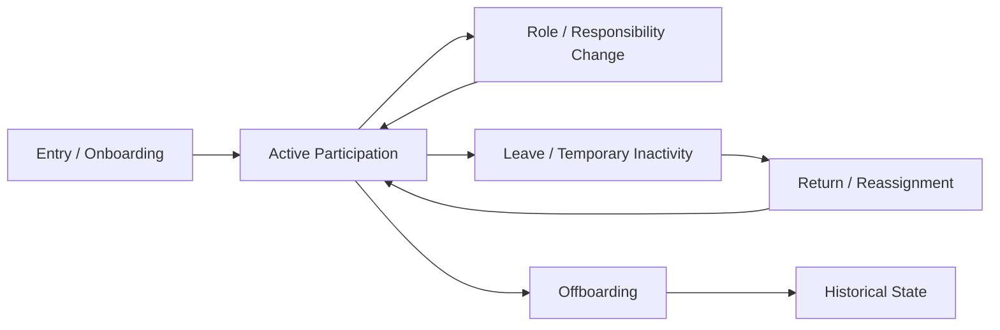
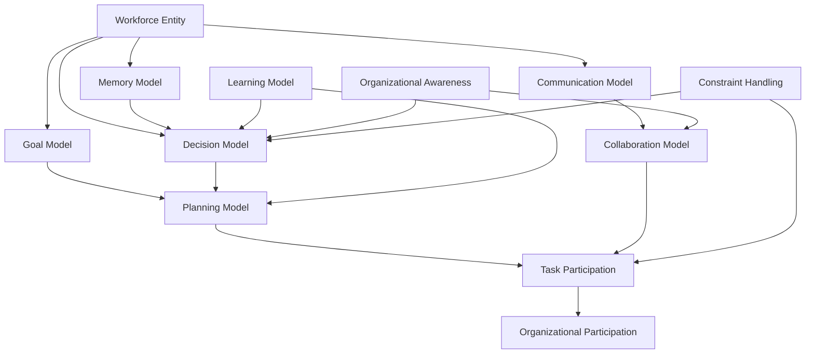
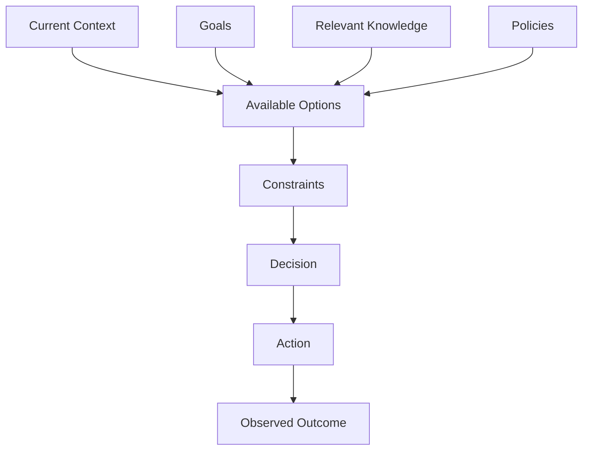
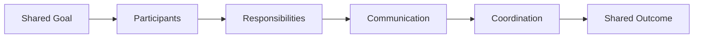
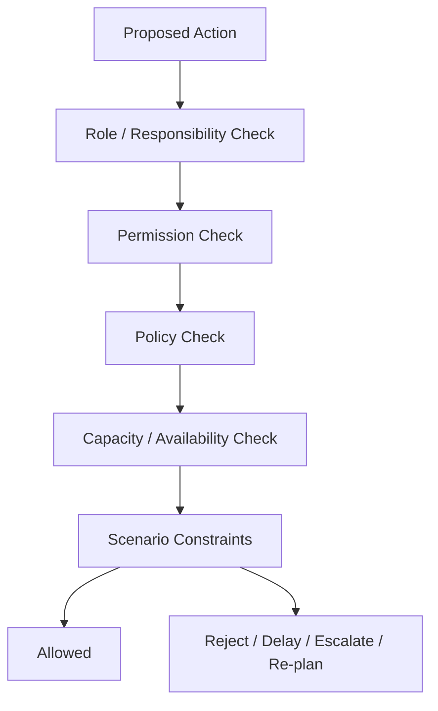
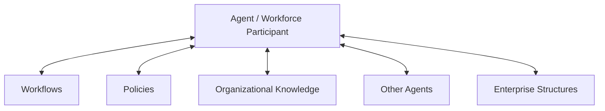
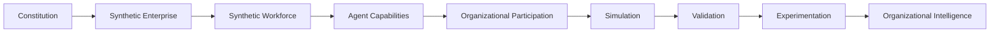

# Synthetic Workforce & Agent Platform Specification

> **Arcturus v1.0 · Week 2 · Constitutional Platform Architecture**  
> **Organization:** Horquva  
> **Status:** Final Week 2 Specification

---

## Table of Contents

1. [Platform Mission](#1-platform-mission)
2. [Week 2 Objective and Scope](#2-week-2-objective-and-scope)
3. [Platform Position in Arcturus](#3-platform-position-in-arcturus)
4. [Constitutional Principles](#4-constitutional-principles)
5. [Workforce Entity Architecture](#5-workforce-entity-architecture)
6. [Workforce Entity Catalog](#6-workforce-entity-catalog)
7. [Employee Profile and Organizational Attributes](#7-employee-profile-and-organizational-attributes)
8. [Organizational Responsibility Model](#8-organizational-responsibility-model)
9. [Workforce Relationship Model](#9-workforce-relationship-model)
10. [Workforce Lifecycle](#10-workforce-lifecycle)
11. [Agent Architecture](#11-agent-architecture)
12. [Agent Capability Models](#12-agent-capability-models)
13. [Organizational Participation](#13-organizational-participation)
14. [Cross-Platform Collaboration](#14-cross-platform-collaboration)
15. [Validation and Review](#15-validation-and-review)
16. [Research Foundation](#16-research-foundation)
17. [Week 2 Deliverable Traceability](#17-week-2-deliverable-traceability)
18. [Implementation Boundaries](#18-implementation-boundaries)
19. [Conclusion](#19-conclusion)
20. [References](#20-references)

---

# 1. Platform Mission

The **Synthetic Workforce & Agent Platform** defines the workforce and intelligent organizational participants required to bring synthetic enterprises to life.

The platform models workforce entities such as:

- employees;
- executives;
- managers;
- contractors;
- consultants;
- interns;
- customers;
- vendors;
- partners;
- AI assistants; and
- external organization representatives.

A workforce entity is more than a profile. It represents an organizational participant with a role, responsibilities, reporting relationships, objectives, ownership areas, capabilities, knowledge, goals, workload, capacity, permissions, constraints, and lifecycle state.

The Agent Platform provides the conceptual capabilities required for selected workforce entities to participate intelligently in organizational activities.

---

# 2. Week 2 Objective and Scope

## 2.1 Objective

Week 2 establishes the constitutional architecture of the Synthetic Workforce & Agent Platform.

The required work covers:

- workforce entities;
- employee models;
- agent capabilities;
- workforce lifecycle;
- organizational responsibilities;
- communication;
- memory;
- decision abstractions; and
- organizational participation.

The purpose is to create an engineering-ready foundation for realistic organizational simulation.

## 2.2 Scope Boundary

This specification defines **architecture and responsibilities**, not production autonomous-agent implementation.

It therefore does not prescribe:

- a particular AI algorithm;
- an LLM provider;
- an agent framework;
- a database;
- a programming language;
- a model-training method; or
- a deployment technology.

The conceptual models defined here can be implemented later while preserving the Arcturus constitutional architecture.

---

# 3. Platform Position in Arcturus

Arcturus is a synthetic enterprise platform intended to create scientifically grounded synthetic enterprises that can be modeled, simulated, tested, and validated.

The workforce platform provides the organizational participants that populate these enterprises.



## 3.1 Cross-Platform Dependencies

The Week 2 work identifies collaboration with the:

- **Synthetic Enterprise Platform** — enterprise structures and shared ontology;
- **Behavior Platform** — organizational behavior and dynamics;
- **Workflow Platform** — workflow participation;
- **Scenario Platform** — scenario generation and experimentation;
- **Organizational Brain (OBA)** — validated organizational intelligence;
- **Sentinel** — identity, security, governance, audit and trust;
- **Castor** — experience and journey models;
- **Altair** — operational and workflow models;
- **Antares** — research and organizational knowledge;
- **Vega** — growth, market and business models.

The workforce platform should integrate with these systems without duplicating their ownership.

---

# 4. Constitutional Principles

## 4.1 Science Before Assumption

Organizational behavior and conclusions should ultimately be grounded in measurable evidence.

## 4.2 Platforms Before Features

The workforce model should be reusable across synthetic enterprises rather than designed around one scenario.

## 4.3 Systems Before Scenarios

Core workforce systems should remain reusable across future scenarios.

## 4.4 Shared Ontology Before Individual Models

Workforce entities should align with the common enterprise ontology.

## 4.5 Validation Before Intelligence

Simulation outputs should be evaluated before being used as organizational intelligence.

## 4.6 Digital Twins Represent Reality

Organizational entities maintain representations of their evolving state so that change, replay, forecasting, and experimentation can be supported.

## 4.7 AI Assists, Humans Engineer

AI can accelerate engineering work, but engineering decisions and approvals remain human responsibilities.

## 4.8 Governance Enables Scientific Trust

Relevant simulation and organizational artifacts should remain traceable, versioned, auditable, and reproducible.

## 4.9 Continuous Learning Through Experimentation

Models should improve through controlled experimentation and validated evidence.

## 4.10 One Platform, One Scientific Standard

Workforce models should follow consistent modeling, execution, validation, measurement, and reporting standards.

---

# 5. Workforce Entity Architecture

A workforce entity represents an organizational participant.



This common model allows different workforce entity types to participate in the same organizational environment.

---

# 6. Workforce Entity Catalog

| Entity | Organizational Role | Core Responsibilities | Relationship Context | Objective / Ownership |
|---|---|---|---|---|
| **Employee** | Performs organizational work | Executes assigned responsibilities | Reports to manager/supervisor | Assigned work and outcomes |
| **Manager** | Coordinates people and work | Supervises, allocates, reviews and coordinates | Management hierarchy | Team/department objectives |
| **Executive** | Provides senior leadership | Strategic direction and decisions | Executive hierarchy | Organizational objectives |
| **Department Head** | Leads a department | Department planning and accountability | Reports to executive leadership | Department scope |
| **Contractor** | Performs contracted work | Delivers contracted responsibilities | Contractual relationship | Contract scope |
| **Consultant** | Provides specialist expertise | Advises and supports defined work | Advisory relationship | Specialist scope |
| **Intern** | Performs supervised work | Completes assigned learning/work activities | Reports to supervisor | Learning and assigned outcomes |
| **Customer** | External value recipient | Participates in customer interactions | External relationship | Customer outcomes |
| **Vendor** | External supplier | Provides products/services/resources | Supplier relationship | Delivery/service outcomes |
| **Partner** | Collaborative external participant | Performs agreed responsibilities | Partnership relationship | Shared objectives |
| **AI Assistant** | Supports organizational activities | Performs authorized assistance | Context-dependent relationship | Support objectives |
| **External Organization Representative** | Represents an external organization | Performs representative responsibilities | External relationship | External/shared objectives |

---

# 7. Employee Profile and Organizational Attributes

The Week 2 employee profile includes:

| Attribute | Purpose |
|---|---|
| **Identity** | Identifies the participant |
| **Position** | Defines organizational position |
| **Department** | Defines organizational unit |
| **Manager** | Defines formal reporting relationship |
| **Skills** | Represents competencies |
| **Experience** | Represents professional experience |
| **Certifications** | Represents qualifications |
| **Responsibilities** | Defines accountable work |
| **Goals** | Defines intended outcomes |
| **Workload** | Represents assigned work |
| **Capacity** | Represents ability to perform additional work |
| **Availability** | Represents participation availability |
| **Organizational Knowledge** | Represents relevant accessible knowledge |
| **Relationships** | Represents organizational connections |
| **Reporting Structure** | Represents hierarchy |
| **Permissions** | Defines authorized access/actions |
| **Constraints** | Defines applicable limits |

### Employee Model

```text
Employee
├── Identity
├── Position
├── Department
├── Manager
├── Skills
├── Experience
├── Certifications
├── Responsibilities
├── Goals
├── Workload
├── Capacity
├── Availability
├── Organizational Knowledge
├── Relationships
├── Reporting Structure
├── Permissions
└── Constraints
```

---

# 8. Organizational Responsibility Model

A responsibility defines what a workforce entity is accountable for.

```text
Responsibility
├── Owner
├── Description
├── Scope
├── Expected Outcome
├── Required Capabilities
├── Related Goals
├── Related Workflows
├── Relevant Knowledge
└── Constraints
```

The model should answer:

- Who owns the responsibility?
- What outcome is expected?
- Which capabilities are required?
- Which workflows are affected?
- Which goals does it support?
- What constraints apply?
- Which decisions are associated with it?
- Who may collaborate, approve, delegate, or escalate?

Responsibility ownership provides accountability for organizational simulation.

---

# 9. Workforce Relationship Model

Workforce entities operate through formal and informal organizational relationships.

## 9.1 Core Relationships

- Reports To
- Manages
- Collaborates With
- Advises
- Depends On
- Communicates With
- Supplies
- Partners With
- Serves
- Represents

## 9.2 Relationship Structure

```text
Relationship
├── Source Entity
├── Target Entity
├── Relationship Type
├── Scope
├── Status
└── Lifecycle Context
```

### Organizational Hierarchy



Formal hierarchy can coexist with cross-functional, advisory, supplier, customer, partner, and other relationships.

---

# 10. Workforce Lifecycle

The workforce is dynamic.



Lifecycle changes can include:

- onboarding;
- role assignment;
- promotion;
- department transfer;
- manager change;
- responsibility change;
- workload change;
- leave;
- reassignment;
- contract expiration; and
- offboarding.

A lifecycle change may affect reporting, responsibilities, permissions, relationships, knowledge access, workload, capacity, and availability.

---

# 11. Agent Architecture

The Agent Platform defines the conceptual architecture that allows selected workforce entities to participate intelligently.



This is a **conceptual architecture**. It does not prescribe a specific AI algorithm or technology.

---

# 12. Agent Capability Models

## 12.1 Goal Model

The goal model represents what an agent is trying to achieve.

```text
Goal
├── Description
├── Priority
├── Source
├── Desired Outcome
├── Dependencies
├── Constraints
└── Status
```

Goals may originate from organizational objectives, department objectives, role responsibilities, assigned tasks, or collaboration.

---

## 12.2 Decision Model

The decision model provides the conceptual structure for organizational decisions.



A decision should consider organizational context, goals, knowledge, policies, options, and constraints.

---

## 12.3 Memory Model

| Memory Area | Purpose |
|---|---|
| **Working Memory** | Current task and immediate context |
| **Episodic Memory** | Relevant previous events/interactions |
| **Semantic Memory** | General concepts and knowledge |
| **Organizational Memory** | Policies, procedures and decisions |
| **Interaction Memory** | Relevant communication/collaboration history |

This is a conceptual classification rather than a storage-technology requirement.

---

## 12.4 Communication Model

```text
Communication
├── Sender
├── Recipient
├── Type
├── Context
├── Content
├── Priority
└── Interaction Context
```

Possible communication types include:

- request;
- response;
- notification;
- delegation;
- escalation;
- approval request;
- status update;
- clarification; and
- knowledge sharing.

---

## 12.5 Planning Model

```text
Goal
  ↓
Task Decomposition
  ↓
Dependencies
  ↓
Priorities
  ↓
Available Participants
  ↓
Execution Sequence
  ↓
Monitoring
  ↓
Adaptation
```

Planning should respect workforce capabilities, workload, capacity, availability, responsibilities, permissions, and constraints.

---

## 12.6 Learning Model

The learning model represents conceptual adaptation from validated experience.

Potential inputs include:

- feedback;
- successful outcomes;
- unsuccessful outcomes;
- historical organizational events;
- changing organizational context; and
- policy changes.

Learning should be controlled and validated rather than treating every observed outcome as a valid learning signal.

---

## 12.7 Collaboration Model



Collaboration should respect organizational roles, responsibilities, permissions, knowledge boundaries, and constraints.

---

## 12.8 Task Participation

```text
Task
 ↓
Required Capability
 ↓
Candidate Participants
 ↓
Availability
 ↓
Capacity
 ↓
Responsibilities
 ↓
Permissions
 ↓
Assignment
 ↓
Execution
 ↓
Outcome
```

This provides the conceptual bridge between workforce entities and organizational workflows.

---

## 12.9 Organizational Awareness

Relevant organizational context may include:

- enterprise;
- department;
- reporting structure;
- organizational goals;
- responsibilities;
- policies;
- workflows;
- relevant workforce relationships;
- relevant organizational knowledge;
- available resources; and
- constraints.

Awareness should be scoped to organizational responsibility and permissions.

---

## 12.10 Constraint Handling



Possible outcomes include:

- execute;
- reject;
- delay;
- escalate;
- request approval;
- re-plan; or
- select an alternative.

---

# 13. Organizational Participation

Agents interact with the organizational environment.

The required participation areas are:

- **Workflows**
- **Policies**
- **Organizational Knowledge**
- **Other Agents**
- **Enterprise Structures**



The workforce platform provides participant context while other platforms retain ownership of their respective domains.

---

# 14. Cross-Platform Collaboration

## Synthetic Enterprise Platform

Workforce entities must align with enterprise structures and the shared enterprise ontology.

## Behavior Platform

Agent definitions should support realistic organizational dynamics.

## Workflow Platform

Workforce responsibilities, capabilities, availability, and constraints provide context for workflow participation.

## Scenario Platform

Workforce entities and agent capabilities should be reusable in scenario generation and experimentation.

## Organizational Brain

Validated workforce and simulation intelligence can contribute to the Organizational Brain rather than bypassing validation.

## Sentinel

Identity, security, governance, audit, and trust remain aligned with Sentinel's ownership.

## Cross-Platform Principle

> **Platform ownership establishes accountability — not isolation.**

Integration should preserve shared terminology, ontology, contracts, governance, and platform boundaries.

---

# 15. Validation and Review

Day 4 requires review of the complete Workforce & Agent Platform specification.

| Review Area | Validation Question |
|---|---|
| Workforce Completeness | Are all required workforce entities defined? |
| Organizational Relationships | Are reporting and other relationships represented? |
| Employee Attributes | Are the required employee attributes documented? |
| Agent Responsibilities | Are the required agent capabilities defined? |
| Documentation Quality | Is the specification clear and reusable? |
| Cross-Platform Compatibility | Does it align with downstream platform needs? |
| Architectural Compliance | Does it follow Arcturus v1.0? |
| Naming Consistency | Are terminology and names standardized? |

## Validation Scenarios

### Employee Availability Change

```text
Availability changes
        ↓
Workforce state changes
        ↓
Task participation may change
        ↓
Workload / capacity may be reassessed
        ↓
Workflow and organizational effects can be evaluated
```

### Manager Change

```text
Manager changes
        ↓
Reporting relationship changes
        ↓
Approval / communication context may change
        ↓
Organizational relationships are updated
```

### Department Transfer

```text
Department changes
        ↓
Reporting structure may change
        ↓
Responsibilities may change
        ↓
Permissions / knowledge context may change
        ↓
Workforce relationships are updated
```

---

# 16. Research Foundation

> **Research supports architectural reasoning; it does not replace the Week 2 Engineering Book requirements.**

The Week 2 work calls for research into organizational role structures, multi-agent systems, organizational simulation concepts, and decision frameworks.

## 16.1 Organizational Role Structures

Organizational role modeling commonly considers responsibilities, authority, reporting structures, competencies, and organizational units.

**Application to Arcturus:** Workforce entities should therefore be defined through organizational roles, responsibilities, reporting relationships, objectives, and ownership areas rather than only job titles.

## 16.2 Multi-Agent Systems

Multi-agent systems research provides concepts for multiple intelligent participants coordinating within a shared environment.

**Application to Arcturus:** Agents should be grounded in workforce entities and organizational relationships rather than modeled as isolated generic agents.

## 16.3 Organizational Simulation

Organizational simulation provides approaches for representing interacting participants, organizational structures, workflows, and environmental change.

**Application to Arcturus:** Workforce state, lifecycle, relationships, workload, goals, and constraints are useful dimensions for future organizational experiments.

## 16.4 Decision Frameworks

Decision frameworks commonly consider objectives, context, alternatives, constraints, information, actions, and outcomes.

**Application to Arcturus:** The conceptual Decision Model preserves these organizational dimensions without committing Week 2 to a particular AI algorithm.

## 16.5 Trustworthy AI

NIST's AI Risk Management Framework provides a general framework for managing AI risks and supporting trustworthy AI.

**Application to Arcturus:** Future intelligent workforce implementations should incorporate appropriate validation, governance, transparency, security, and accountability.

---

# 17. Week 2 Deliverable Traceability

| Required Deliverable | Covered In | Status |
|---|---|:---:|
| Constitutional Synthetic Workforce Architecture | Sections 5–6 | ✅ |
| Workforce Entity Catalog | Section 6 | ✅ |
| Employee Profile Specification | Section 7 | ✅ |
| Organizational Responsibility Model | Section 8 | ✅ |
| Workforce Relationship Model | Section 9 | ✅ |
| Workforce Lifecycle | Section 10 | ✅ |
| Agent Platform Conceptual Architecture | Section 11 | ✅ |
| Agent Capability Model | Section 12 | ✅ |
| Goal Model | Section 12.1 | ✅ |
| Decision Model | Section 12.2 | ✅ |
| Memory Model | Section 12.3 | ✅ |
| Communication Model | Section 12.4 | ✅ |
| Planning Model | Section 12.5 | ✅ |
| Learning Model | Section 12.6 | ✅ |
| Collaboration Model | Section 12.7 | ✅ |
| Task Participation | Section 12.8 | ✅ |
| Organizational Awareness | Section 12.9 | ✅ |
| Constraint Handling | Section 12.10 | ✅ |
| Organizational Participation | Section 13 | ✅ |
| Cross-Platform Workforce Review | Sections 14–15 | ✅ |
| Naming / Documentation Consistency | Entire document | ✅ |
| Architectural Compliance | Sections 3–4, 15 | ✅ |

---

# 18. Implementation Boundaries

This Week 2 document defines **what the platform represents and how its conceptual components relate**.

It deliberately does not lock the project to:

- specific AI algorithms;
- LLM providers;
- agent frameworks;
- databases;
- programming languages;
- model-training approaches;
- prompt formats; or
- deployment technologies.

Future implementation should preserve the constitutional architecture, platform ownership, shared ontology, validation requirements, and cross-platform boundaries.

---

# 19. Conclusion

The Synthetic Workforce & Agent Platform establishes the workforce foundation required for realistic synthetic enterprises in Arcturus.

The platform defines reusable organizational participants with:

- identity;
- organizational role;
- responsibilities;
- reporting relationships;
- skills;
- experience;
- certifications;
- goals;
- workload;
- capacity;
- availability;
- organizational knowledge;
- relationships;
- permissions; and
- constraints.

The Agent Platform extends these participants with conceptual capabilities for:

- goals;
- decisions;
- memory;
- communication;
- planning;
- learning;
- collaboration;
- task participation;
- organizational awareness; and
- constraint handling.

The resulting architecture creates a path from organizational structure to measurable simulation:



### Core Design Principle

> **Define the organizational participant first; define intelligence as a capability of that participant.**

This keeps intelligent behavior grounded in organizational reality while preserving the boundaries between workforce modeling, behavior, workflow, scenario engineering, simulation, validation, and organizational intelligence.

---

# 20. References

## Primary Source

1. **Horquva — Arcturus v1.0 · Week 2 Individual Engineering Book.**  
   Primary source for the Week 2 mission, responsibilities, workforce entities, employee attributes, agent architecture, organizational participation, review criteria, and deliverables.

## External Research

2. **ISO.** *ISO 30414:2025 — Human resource management — Requirements and recommendations for human capital reporting and disclosure.*  
   https://www.iso.org/standard/86106.html

3. **National Institute of Standards and Technology (NIST).** *Artificial Intelligence Risk Management Framework (AI RMF 1.0).*  
   https://www.nist.gov/publications/artificial-intelligence-risk-management-framework-ai-rmf-10

4. **Abbas, H. A., Shaheen, S. I., & Amin, M. H.** *Organization of Multi-Agent Systems: An Overview.*  
   https://arxiv.org/abs/1506.09032

5. **Wang, Y., et al.** *OrgAgent: Organize Your Multi-Agent System like a Company.*  
   https://arxiv.org/abs/2604.01020

---

## Document Status

**Arcturus v1.0 · Week 2 · Synthetic Workforce & Agent Platform**

> **AI may accelerate engineering. Only engineers may approve engineering.**
