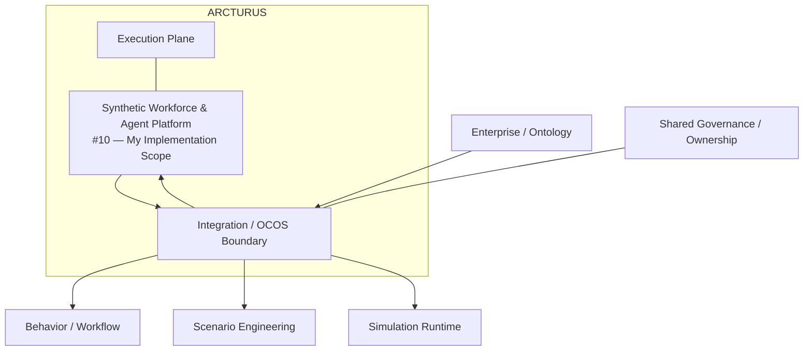
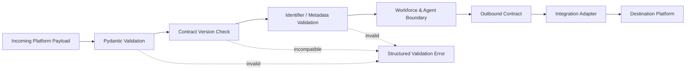
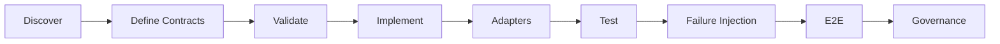
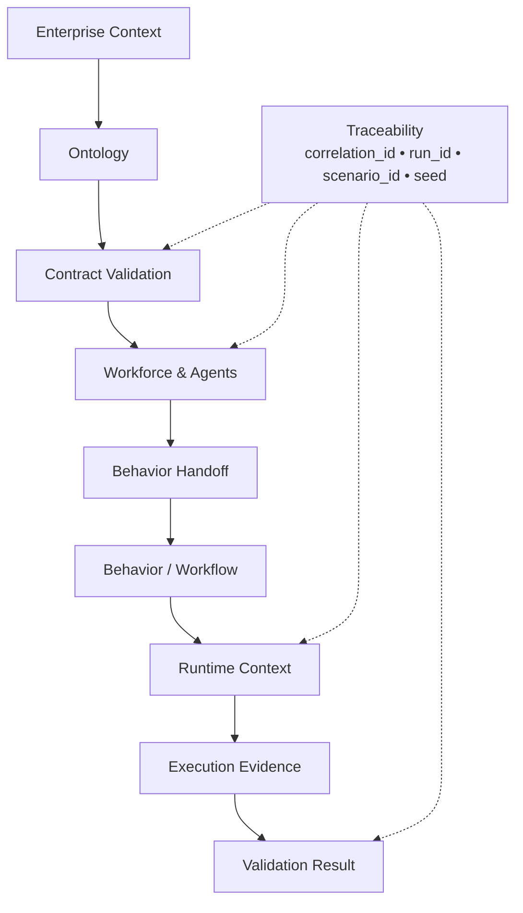
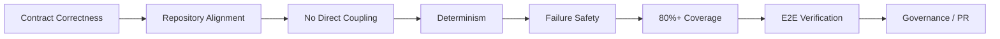

# 🌌 Arcturus v1.0 — Implementation Plan
## Synthetic Workforce & Agent Platform — Platform Integration Engineer

**Sprint:** Week 3 — Part-3: Core Platform Scaffolding & Execution Contracts  
**Duration:** 10 Days  
**Assigned Platform:** Synthetic Workforce & Agent Platform (#10)  
**Engineering Role:** Platform Integration Engineer  
**Owner:** Syeda Dua e Farwa Gulzar  
**Status:** Proposed Implementation Plan  

---

# 1. Platform Boundary & Ownership

## 1.1 Part-3 Objective

The objective of this implementation is to establish the **integration-ready scaffolding and execution contracts for the Synthetic Workforce & Agent Platform** while preserving Arcturus ownership boundaries.

The implementation will deliver a contract-first foundation that allows Workforce and Agent capabilities to exchange validated information with neighboring platforms through the repository's defined:

```text
/contracts/ocos-integration/
/schemas/integration/
/src/integration/
```

The implementation prioritizes:

1. Contract correctness.
2. Clear ownership boundaries.
3. Deterministic data exchange.
4. Traceable handoffs.
5. Failure-safe validation.
6. Testable integration adapters.
7. End-to-end integration readiness.

The goal is not to implement other platforms inside Workforce. The goal is to make the Workforce & Agent platform **interoperable without creating hidden coupling**.

---

## 1.2 Repository & Ownership Alignment

The repository structure supplied for Arcturus defines the following relevant architecture:

```text
Architecture Layer                 Repository Mapping

Execution Plane              →     /src/execution_plane
                                     /contracts/* (execution)
                                     /schemas/* (execution)

Integration & OCOS Boundary   →     /src/integration
                                     /contracts/ocos-integration
                                     /schemas/integration
```

The ownership map assigns:

- **#10 — Syeda Dua e Farwa Gulzar:** Synthetic Workforce & Agent Platform — **Assigned**
- **#1 and #8:** Integration & OCOS Boundary — shared ownership
- **#4, #6, and #10:** Execution Plane — shared ownership

Therefore, this plan does **not** claim ownership of the complete Integration/OCOS boundary. It defines the **Workforce & Agent platform's implementation responsibilities within and adjacent to that shared boundary**.

---

## 1.3 My Ownership

### I will implement

- Workforce/Agent integration-facing contracts.
- Pydantic validation for Workforce-owned handoffs.
- Workforce/Agent integration schemas.
- Workforce-facing adapters/stubs.
- Contract serialization/deserialization.
- Contract version checks.
- Correlation and execution-context propagation.
- Workforce → Behavior handoff support.
- Workforce → Scenario handoff support where required.
- Workforce → Runtime handoff support where required.
- Integration-level failure handling.
- Unit, contract, negative, and integration tests.
- Workforce-related E2E verification.
- Documentation of Workforce integration dependencies.

### I will coordinate with

| Platform / Area | Dependency |
|---|---|
| Enterprise / Ontology | Canonical organizational context required by Workforce |
| Behavior & Workflow | Behavior/workflow handoff contract |
| Scenario Engineering | Scenario participant/context contract |
| Simulation Runtime & Experiment | Execution context and run identifiers |
| Validation & Evaluation | Validation/evidence contract |
| Integration & OCOS | Shared boundary, contract governance, adapters/interfaces |
| Simulation Engineering Governance | Architectural/repository governance where required |

### I will not implement

- Enterprise/Ontology internal logic.
- Behavior & Workflow internal logic.
- Scenario generation or scenario business logic.
- Simulation Runtime internal execution logic.
- Validation/Evaluation algorithms.
- Global Integration/OCOS governance.
- Constitutional governance.
- Another platform's internal classes or services.

---

## 1.4 Boundary Rule

The implementation follows this rule:

```text
Platform Ownership
       ↓
Own Internal Logic
       ↓
Expose Contract
       ↓
Integration Boundary
       ↓
Consume Contract
       ↓
Destination Platform
```

It must never become:

```text
Platform A
      ↓
Direct Import
      ↓
Platform B Internal Implementation
```

This keeps ownership explicit and prevents shadow dependencies.

### 1.5 Ownership & Integration Boundary



**Boundary interpretation:** Workforce & Agent owns its platform logic and integration-facing implementation; the Integration/OCOS boundary remains a shared architectural boundary rather than becoming the ownership of a single platform.

---

# 2. Data Flow & Interface Contracts

## 2.1 Target Integration Flow

The Workforce & Agent platform will participate in the shared Part-3 chain:

```text
Enterprise
    ↓
Ontology
    ↓
Workforce & Agents          ← PRIMARY IMPLEMENTATION SCOPE
    ↓
Behavior
    ↓
Runtime
    ↓
Validation
```

The Scenario Engineering platform may provide scenario context between Workforce and Runtime where required by the agreed execution flow.

### 2.1.1 Contract & Data Flow



This flow makes validation a mandatory boundary step rather than an optional downstream check.

---

## 2.2 Contract Flow

```text
Incoming Contract
       ↓
Pydantic Validation
       ↓
Contract Version Check
       ↓
Context / Identifier Validation
       ↓
Workforce Processing Boundary
       ↓
Outbound Contract
       ↓
Adapter
       ↓
Next Platform
```

---

## 2.3 Proposed Workforce Integration Contracts

The following are **proposed implementation names** and will be finalized with the relevant owners during Days 1–2.

|     Contract                   |       Direction         |                   Purpose                             |
|---|---|---|
| `EnterpriseContext`            |        Inbound          | Validated organizational context required by Workforce |
| `WorkforceContext`             |        Outbound         | Validated workforce/agent context for downstream consumers |
| `BehaviorContext`              |        Inbound/Outbound | Contract boundary with Behavior & Workflow |
| `ScenarioContext`              |        Inbound          | Scenario information required for workforce participation |
| `AgentExecutionContext`        |        Outbound         | Workforce/agent information required by Runtime |
| `SimulationRunContext`         |        Inbound          | Runtime execution identifiers and context |
| `WorkforceEvidenceReference`   |        Outbound         | Traceable Workforce-related evidence reference |
| `ValidationResult`             |        Inbound          | Validation status/evidence where required |

---

## 2.4 Common Integration Metadata

Where applicable, contracts will contain common metadata:

```python
class IntegrationMetadata(BaseModel):
    contract_version: str
    correlation_id: str
    source_platform: str
    destination_platform: str
    timestamp: str
```

Execution-related contracts should preserve:

```text
run_id
scenario_id
experiment_id
seed
```

Workforce/Agent identifiers must remain stable across handoffs.

---

## 2.5 Contract Rules

Every contract must define:

- Required fields.
- Field types.
- Valid states/enums where applicable.
- Contract version.
- Source platform.
- Destination platform.
- Correlation identifier.
- Domain/entity identifier.
- Execution identifiers where applicable.

### Contract acceptance

```text
Valid schema
+ supported version
+ required identifiers
+ valid metadata
        ↓
      ACCEPT
```

### Contract rejection

```text
Invalid schema
OR unsupported version
OR missing required field
OR incompatible context
        ↓
      REJECT
```

No invalid payload should cross the next platform boundary.

---

# 3. Implementation Architecture

## 3.1 Repository Mapping

Implementation will follow the repository structure provided by the lead:

```text
arcturus/
│
├── contracts/
│   └── ocos-integration/
│       └── workforce/
│
├── schemas/
│   └── integration/
│       └── workforce/
│
├── src/
│   └── integration/
│       ├── adapters/
│       │   └── workforce/
│       ├── validators/
│       │   └── workforce/
│       ├── service.py
│       └── __init__.py
│
└── tests/
    └── integration/
        └── workforce/
```

> Exact subdirectories and filenames will be confirmed against the existing repository before implementation. No new top-level architectural layer will be introduced without approval.

---

## 3.2 Local Integration Processing

The Workforce-facing integration service will follow:

```text
Receive Payload
      ↓
Parse
      ↓
Pydantic Validation
      ↓
Version Compatibility
      ↓
Identifier / Metadata Validation
      ↓
Adapter
      ↓
Serialize
      ↓
Return Handoff
```

### Core implementation responsibilities

- Parse incoming payloads.
- Validate schemas.
- Validate contract versions.
- Preserve IDs.
- Propagate correlation metadata.
- Build outbound contracts.
- Serialize outbound payloads.
- Return structured errors.
- Avoid direct dependency on another platform's implementation.

---

# 4. 10-Day Coding & Integration Schedule

## 4.1 Implementation Pipeline



The implementation deliberately moves from **boundary discovery and contract definition** toward **working integration proof**, reducing the risk of building adapters against unstable interfaces.

## Day 1 — Boundary Discovery & Contract Inventory

### Tasks

- Map Workforce responsibilities against the repository ownership map.
- Identify immediate upstream/downstream dependencies.
- Identify which contracts are required for Part-3.
- Review existing repository contracts and schemas.
- Identify existing reusable models before creating new ones.
- Create a contract inventory.

### Deliverable

```text
Workforce Integration Contract Inventory
```

### Gate

No duplicate contract is created where an approved shared contract already exists.

---

## Day 2 — Pydantic Contract Definition & Lock

### Tasks

- Define base integration metadata.
- Define Workforce/Agent payloads.
- Define inbound/outbound handoffs.
- Define required identifiers.
- Define contract versions.
- Add valid/invalid fixtures.
- Validate serialization/deserialization.
- Review with relevant platform owners.
- Lock agreed contracts.

### Deliverables

```text
/contracts/ocos-integration/
/schemas/integration/
```

### Gate

All agreed Part-3 contracts validate successfully and ownership is documented.

---

## Days 3–4 — Workforce Integration Service

### Tasks

Implement:

- Payload parsing.
- Pydantic validation.
- Version compatibility checks.
- Metadata validation.
- Correlation ID propagation.
- Structured success/failure responses.
- Outbound contract generation.

### Deliverable

```text
/src/integration/service.py
```

### Gate

Valid payloads pass deterministically; invalid payloads fail without downstream propagation.

---

## Day 5 — Workforce Adapter Layer

### Tasks

Implement Workforce-facing adapter/stub interfaces for:

```text
Workforce → Behavior
Workforce → Scenario
Workforce → Runtime
```

where applicable to the agreed Part-3 flow.

### Deliverable

```text
/src/integration/adapters/workforce/
```

### Gate

Adapters consume and emit only approved contracts.

---

## Day 6 — Contract & Adapter Integration Tests

### Tests

- Contract validation.
- Serialization/deserialization.
- Version compatibility.
- Metadata propagation.
- Workforce → Behavior handoff.
- Workforce → Scenario handoff.
- Workforce → Runtime handoff.

### Deliverable

```text
/tests/integration/workforce/
```

### Gate

All happy-path integration tests pass.

---

## Day 7 — Failure Injection

### Negative tests

Test:

- Missing required fields.
- Wrong field types.
- Malformed payloads.
- Unsupported contract versions.
- Invalid states.
- Missing identifiers.
- Invalid correlation IDs.
- Incompatible execution context.
- Invalid destination.
- Unexpected payload structure.

### Gate

Every defined invalid input produces a controlled failure.

---

## Day 8 — Traceability & Determinism Verification

### Tasks

Verify that:

```text
correlation_id
source_platform
destination_platform
contract_version
```

remain traceable.

For execution-related flows verify:

```text
scenario_id
experiment_id
run_id
seed
```

remain consistent.

### Gate

The same valid input produces the same normalized integration output.

---

## Day 9 — Cross-Platform E2E Integration Spike

### Objective

Demonstrate Workforce participation in:

```text
Enterprise
    ↓
Ontology
    ↓
Workforce
    ↓
Behavior
    ↓
Runtime
    ↓
Validation
```

### Test



The E2E spike proves not only that the handoffs work, but that the execution context can be traced across the chain.

### Deliverable

One reproducible E2E run with traceable identifiers.

### Gate

All required handoffs succeed without direct cross-platform imports.

---

## Day 10 — Governance, Review & PR

### Tasks

- Run complete test suite.
- Verify coverage.
- Verify contract compliance.
- Verify no direct imports.
- Verify repository paths.
- Verify documentation.
- Perform manual AI-code review.
- Complete DoD checklist.
- Obtain relevant owner/CODEOWNER review.
- Open PR against:

```text
initiative/arcturus
```

### Final Gate

Green build + approved contracts + passing E2E + required review.

---

# 5. Dependencies & Collaboration Plan

## 5.1 Dependency Matrix

| Dependency | Needed From | Needed By | Risk if Delayed |
|---|---|---|---|
| Enterprise context contract | Enterprise/Ontology | Day 2 | Contract lock delayed |
| Behavior handoff contract | Behavior & Workflow | Day 2–5 | Adapter implementation blocked |
| Scenario participant contract | Scenario Engineering | Day 2–5 | Scenario integration blocked |
| Runtime execution contract | Simulation Runtime | Day 2–5 | E2E blocked |
| Validation/evidence contract | Validation & Evaluation | Day 2–9 | Final E2E validation blocked |
| Shared integration boundary rules | Integration/OCOS owners | Day 1–2 | Architecture mismatch |

---

## 5.2 Collaboration Rule

Cross-platform collaboration is required when:

- A shared contract changes.
- A schema ownership boundary changes.
- A required identifier changes.
- An adapter changes another platform's expected interface.
- An architectural path changes.
- A contract version changes.

No cross-domain change should be silently introduced.

---

# 6. Quality Gates & Definition of Done

### 6.0 Quality-Gate Pipeline



A release candidate proceeds to the final PR only after each gate is satisfied.


## Gate 1 — Contract Correctness

- [ ] Pydantic models validate valid payloads.
- [ ] Invalid payloads are rejected.
- [ ] Required fields are explicit.
- [ ] Contract version is defined.
- [ ] Ownership is documented.

## Gate 2 — Repository Alignment

- [ ] Contracts are under `/contracts/ocos-integration/`.
- [ ] Schemas are under `/schemas/integration/`.
- [ ] Implementation is under `/src/integration/`.
- [ ] Tests are under `/tests/integration/`.
- [ ] No unauthorized top-level architecture is introduced.

## Gate 3 — No Direct Coupling

- [ ] No imports of another platform's internal implementation.
- [ ] All cross-platform communication uses approved contracts/adapters.
- [ ] No shadow integration path exists.

## Gate 4 — Determinism

```text
Same Input
+
Same Contract Version
+
Same Context
        ↓
Same Normalized Output
```

## Gate 5 — Failure Safety

- [ ] Malformed payloads fail.
- [ ] Missing fields fail.
- [ ] Invalid versions fail.
- [ ] Invalid identifiers fail.
- [ ] Incompatible contexts fail.
- [ ] Failures are structured and traceable.

## Gate 6 — Test Coverage

Target:

> **Minimum 80% code coverage**

Required test groups:

```text
Contract Tests
Serialization Tests
Validation Tests
Adapter Tests
Negative Tests
E2E Tests
```

## Gate 7 — E2E

The Workforce platform successfully participates in:

```text
Enterprise → Ontology → Workforce → Behavior → Runtime → Validation
```

with valid contracts and traceable identifiers.

## Gate 8 — Governance

- [ ] Documentation complete.
- [ ] AI-assisted code manually verified.
- [ ] Relevant platform owners reviewed.
- [ ] CODEOWNER approval obtained where required.
- [ ] PR opened against `initiative/arcturus`.

---

# 7. Risks & Mitigations

| Risk | Impact | Mitigation |
|---|---|---|
| Contract changes after implementation | High | Lock contracts by Day 2 |
| Duplicate schemas | Medium | Search existing contracts before creating new ones |
| Direct platform coupling | High | Contract-only communication rule |
| Missing downstream dependency | High | Dependency matrix + early owner review |
| Invalid payload propagation | High | Pydantic validation at every boundary |
| E2E delay | High | Build mock fixtures before Day 9 |
| Ambiguous ownership | High | Use repository ownership map before implementation |
| AI-generated incorrect code | Medium | Manual review + tests + requirement traceability |
| Repository structure mismatch | High | Validate paths against official repository map before PR |

---

# 8. AI-Assisted Development Verification

AI may accelerate:

- Pydantic boilerplate.
- Repetitive adapter scaffolding.
- Unit-test generation.
- Negative-test generation.
- Debugging.
- Documentation drafting.

AI must **not** determine architecture or ownership automatically.

Every AI-assisted change must be:

1. Reviewed manually.
2. Understood by the implementer.
3. Tested against the approved contract.
4. Checked against repository ownership.
5. Verified before PR submission.

---

# 9. Final Deliverables

By the end of the 10-day sprint, the Workforce & Agent implementation should provide:

### Contracts

```text
/contracts/ocos-integration/
```

### Schemas

```text
/schemas/integration/
```

### Integration Implementation

```text
/src/integration/
```

### Tests

```text
/tests/integration/workforce/
```

### Documentation

- Workforce integration boundary.
- Contract inventory.
- Handoff matrix.
- Dependency matrix.
- Test evidence.
- E2E integration evidence.

### Final Engineering Outcome

```text
                    ARCTURUS
                       │
                       ▼
              Workforce & Agents
                       │
              ┌────────┴────────┐
              │                 │
         Contracts          Adapters
              │                 │
              └────────┬────────┘
                       ▼
               Integration / OCOS
                       │
          ┌────────────┼────────────┐
          ▼            ▼            ▼
      Behavior      Scenario      Runtime
                                      │
                                      ▼
                                  Validation
```

---

# 10. Definition of Done — Final Checklist

- [ ] Ownership boundary confirmed.
- [ ] Part-3 scope confirmed.
- [ ] Existing repository structure reviewed.
- [ ] Contract inventory completed.
- [ ] Pydantic contracts defined.
- [ ] Contracts reviewed and locked.
- [ ] Integration schemas implemented.
- [ ] Workforce-facing integration logic implemented.
- [ ] Workforce adapters implemented.
- [ ] Contract validation implemented.
- [ ] Serialization/deserialization verified.
- [ ] Version compatibility verified.
- [ ] Traceability metadata preserved.
- [ ] Negative tests implemented.
- [ ] Minimum 80% coverage achieved.
- [ ] E2E integration spike completed.
- [ ] No direct cross-platform imports.
- [ ] No unauthorized repository paths introduced.
- [ ] AI-assisted code manually audited.
- [ ] Documentation completed.
- [ ] Relevant owners reviewed changes.
- [ ] CODEOWNER approval obtained where required.
- [ ] PR opened against `initiative/arcturus`.
- [ ] Green build and final DoD achieved.

---

# 🏛️ Implementation Strategy

> **Discover → Contract → Validate → Implement → Adapt → Test → Inject Failures → Integrate E2E → Govern**

The implementation deliberately keeps **Workforce & Agent ownership inside its assigned boundary**, while using the shared Integration/OCOS boundary for controlled interoperability.

The success criterion is not simply that code exists.

The success criterion is:

> **A Workforce & Agent implementation that is contract-first, repository-aligned, testable, traceable, deterministic, and capable of participating safely in the Arcturus execution chain without creating cross-platform coupling.**
