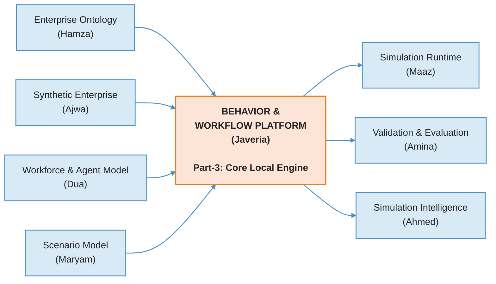
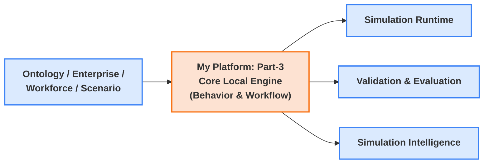
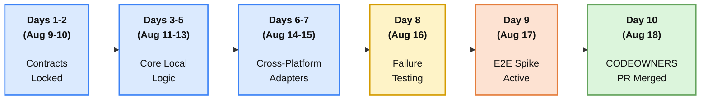

# Arcturus 10-Day Sprint: Platform Implementation Plan

_Version 1.0_

Context: Week 3 (Part-3: Core Platform Scaffolding & Execution Contracts)

**Strict Deadline: Aug 9, 2026 → Aug 18, 2026 (10 Days)**

🏛️ Behavior & Workflow Platform - Implementation Plan

# Platform Boundary & Ownership

- - **Platform Name:** Behavior & Workflow Platform
    - **Platform Owner:** Javeria Rafhan
    - **My Core Part-3 Objective:** Stand up the executable Behavior & Workflow foundation and its core execution engine - domain models, guarded state machine, ownership resolution, event emission, and a process/task orchestration engine with dependency resolution, SLA/escalation, and failure/recovery - all as locked Pydantic contracts and local logic, with no cross-platform live wiring beyond adapter stubs.
    - beyond adapter stubs.

### What I Own (My Platform Boundary)

- - - Execution-layer domain models: Workflow, Process, Activity, Task, Approval, Handoff, Queue, SLA, Escalation, Completion, Failure (reference Ontology IDs, never redefine them)
      - Task/Activity/Process state machine (created → ready → assigned → executing → waiting → completed, + failure/cancel/escalation/retry/blocked paths)
      - Task ownership resolver (role, org unit, capability, availability, delegation)
      - Workflow event emission on every transition
      - Process Definition Loader, Activity/Task Generator, Task Orchestrator, Dependency Resolver, SLA & Escalation Monitor, Failure & Recovery Handler

### What I Do NOT Own (Strict Non-Overlap - this sprint)

- - - Organizational Behavior handlers (Communication, Collaboration, Decision, Leadership, Accountability) - deferred, orig. Part-4
      - Behavior↔workflow feedback loop, bottleneck emergence, adaptive execution - deferred, orig. Part-5
      - Two-way Runtime integration, deterministic clock, replay/recovery, observability layer - deferred, orig. Part-6
      - Canonical entity/relationship definitions (Ontology - Hamza), enterprise/department context (Enterprise - Ajwa), participant data (Workforce - Dua), scenario triggers (Scenario

- Maryam)

- - - Simulation execution (Runtime - Maaz), scientific scoring (Validation - Amina), insight generation (Intelligence - Ahmed)

## Platform Boundary Diagram

# Data Flow & Interface Contracts (Handoff Matrix)

## Inbound Handoffs (What I Consume)

| **Source Platform**                  | **Consumed Contract / Payload**                       | **Purpose**                                       | **File Location in Repo** |
| ------------------------------------ | ----------------------------------------------------- | ------------------------------------------------- | ------------------------- |
| Enterprise Ontology  (Hamza)   | Canonical entity/relationship  IDs              | Reference in domain  models, never redefine | .../contracts/ontology/   |
| Synthetic Enterprise  (Ajwa)   | Enterprise / department  context                | Task ownership resolution  scope            | .../contracts/enterprise/ |
| Workforce & Agent  Model (Dua) | Participant capability,  availability, workload | Ownership resolution,  assignment           | .../contracts/workforce/  |
| Scenario Model (Maryam)              | Scenario trigger / context                            | Process instantiation                             | .../contracts/scenario/   |

## Outbound Handoffs (What I Emit)

| **Destination Platform**               | **Produced Contract / Payload**                    | **Purpose**                                       | **File Location in Repo**   |
| -------------------------------------- | -------------------------------------------------- | ------------------------------------------------- | --------------------------- |
| Simulation Runtime  (Maaz)       | WorkflowEventPayload                               | Structured task/workflow  transition events | .../contracts/simulation/   |
| Validation & Evaluation  (Amina) | ExecutionEvidencePackage                           | Test/coverage evidence for  Quality Gate    | .../contracts/evaluation/   |
| Simulation Intelligence  (Ahmed) | WorkflowOutcomeStub (stub  only this sprint) | Placeholder for future  insight generation  | .../contracts/intelligence/ |

# The 10-Day Coding & Integration Schedule

## Days 1-2 (Aug 9-10): Schema Decoupling & Contract Registration

- - **Coding Tasks:** Code Pydantic schemas for Workflow, Process, Activity, Task, Approval, Handoff, Queue, SLA, Escalation, Completion, Failure. Inherit from master SimulationContext to preserve Run IDs/seeds. Reference Ontology entities by ID only.
    - **Deliverable:** /contracts/behavior_workflow/ folder with validated base_models.py.
    - **Definition of Done:** Builds clean, no syntax errors; schema spot-checked against Ontology IDs for zero redefinition.

## Days 3-5 (Aug 11-13): Core Local Engine Programming

### Task / Activity / Process State Machine

```mermaid
flowchart LR

    created["created"] --> ready["ready"]
    ready --> assigned["assigned"]
    assigned --> executing["executing"]
    executing --> waiting["waiting"]
    waiting --> completed["completed"]

    ready --> cancelled["cancelled"]
    assigned --> blocked["blocked"]
    blocked --> executing

    executing --> failed["failed"]
    failed --> executing

    waiting --> escalated["escalated"]
    failed --> escalated
    escalated --> completed

    ready -. "cancelled" .-> cancelled
    assigned -. "unavailable<br/>participant" .-> blocked
    executing -. "error" .-> failed
    failed -. "retry" .-> executing
    waiting -. "SLA breach" .-> escalated
    failed -. "retries<br/>exhausted" .-> escalated
    escalated -. "escalation resolved" .-> completed

    classDef normal fill:#dceeff,stroke:#3984c6,stroke-width:2px,color:#111;
    classDef success fill:#d9f2d0,stroke:#55a447,stroke-width:2px,color:#111;
    classDef cancelled fill:#eeeeee,stroke:#999,stroke-width:2px,color:#111;
    classDef blocked fill:#fff0c2,stroke:#d8a62a,stroke-width:2px,color:#111;
    classDef failed fill:#ffd9d6,stroke:#d9534f,stroke-width:2px,color:#111;
    classDef escalated fill:#f5cccc,stroke:#d9534f,stroke-width:2px,color:#111;

    class created,ready,assigned,executing,waiting normal;
    class completed success;
    class cancelled cancelled;
    class blocked blocked;
    class failed failed;
    class escalated escalated;
```

- - - State machine implementation with guarded transitions for Task/Activity/Process (per diagram above).
      - Task Ownership Resolver (role, org unit, capability, availability, delegation) against Workforce/Enterprise fixtures.
      - Event emission on every transition.
      - Process Definition Loader + Activity/Task Generator.
      - Task Orchestrator (creation, queueing, prioritization, assignment, execution, waiting, handoff, completion).
      - Dependency Resolver (real precondition evaluation across task chains).
    - **Deliverable:** Working internal platform service classes + first vertical slice (Enterprise → Department

→ Task → Assignment → Execution → Completion → Event) against local mock fixtures.

- - **Definition of Done:** All internal logic passes unit tests using local mock data; every legal/illegal state transition covered; ownership resolver returns correct results for ≥10 fixture scenarios with zero hard-coded IDs; vertical slice runs end-to-end.

## Days 6-7 (Aug 14-15): Cross-Platform Adapter Implementation

- - **Coding Tasks:** Build SLA & Escalation Monitor and Failure & Recovery Handler. Write inbound/outbound adapters connecting core logic to neighbors' mock data stubs (Ontology, Enterprise, Workforce, Scenario upstream; Runtime, Validation downstream).
    - **Deliverable:** Functional integration stubs; SLA monitor + failure handler modules.
    - **Definition of Done:** Platform correctly parses/serializes payloads generated by immediate upstream and downstream partner stubs; failed tasks retry per policy, preserve state, and propagate to dependents without silently disappearing.

## Day 8 (Aug 16): Scientific Verification & Failure Injection

- - **Coding Tasks:** Write the automated test suite. Negative tests proving the system fails recoverably: invalid transitions, unavailable workers, broken dependencies, malformed/out-of-bounds payloads.
    - **Deliverable:** Automation suite under /tests/behavior_workflow/.
    - **Definition of Done:** Minimum 80% code coverage; platform correctly rejects malformed JSON or out-of-bounds configurations with a traced ValidationError.

## Day 9 (Aug 17): Cross-Platform E2E Integration Spike

- - **Coding Tasks:** Run the live, multi-platform execution pipeline in the shared container space - one process/task run through the joint chain.
    - **Deliverable:** Executable integration run producing a clean telemetry trace.
    - **Definition of Done:** Platform executes successfully inside the chain: Enterprise → Ontology → Workforce → Behavior & Workflow → Runtime → Validation.

## Day 10 (Aug 18): Governance Review, DoD Sign-Off, & Merging

- - **Coding Tasks:** Open PR targeting initiative/arcturus.
    - **Deliverable:** Approved, green-build PR on GitHub.
    - **Definition of Done:** Automated checks pass, the 10-Point DoD checklist is "Yes," and the domain CODEOWNER has reviewed and merged the branch.

# Quality Gates & Definition of Done (DoD)

1. **Deterministic Execution Check:** Running the local engine twice with the same seed/context parameters must produce identical state transitions.
2. **Schema Invalidation Assertion:** The platform's entry point must throw a ValidationError and log a trace when incoming payloads violate Pydantic model configurations.
3. **No Shadow Paths:** Zero direct imports of other platforms' core logic - all boundaries mediated by

/contracts/ or /schemas/.

1. **State Machine Integrity:** Every legal transition passes, every illegal transition is rejected - verified by unit tests, not manual inspection.
2. **Ownership Resolution Correctness:** Owner/approver/escalation-target/accountable-unit resolved correctly for ≥10 fixture scenarios, with zero hard-coded employee IDs.
3. **AI Scaffolding Verification:** Every AI-assisted block of code has been manually audited, verified, and trace-tested, and is defensible in peer review.