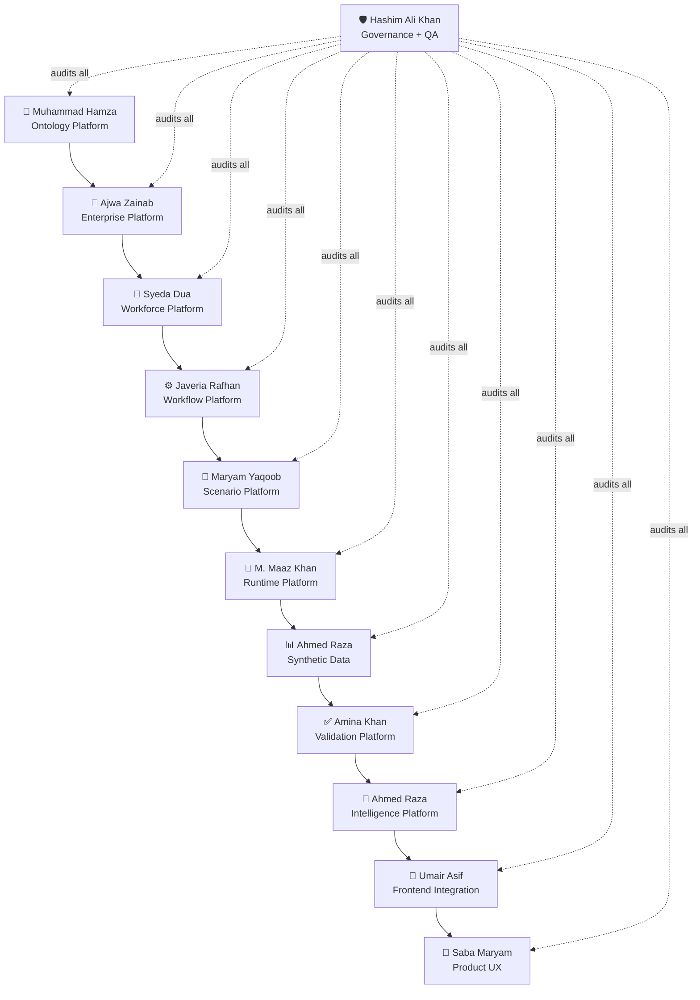

# Arcturus Week 4 — 7-Day Sprint Implementation Plan

## Executive Summary

This is a **7-day end-to-end sprint plan** for the Arcturus Simulation Platform that takes the system from its current baseline (171 passing tests, governance tooling, contract models) to a **fully functional, live product** with real simulation execution, evidence-grounded intelligence, and a polished production frontend.

---

## What We Are Building — In Simple Terms

**Arcturus is a simulation engine that lets you create a fake company, populate it with fake employees, give them tasks and workflows, run the simulation forward in time, and then analyze what happened — all backed by real evidence, not guesswork.**

Think of it like SimCity, but for organizations:
1. **Define the Company** → org chart, departments, roles, policies (Ontology + Enterprise)
2. **Hire the People** → synthetic workers with skills, availability, constraints (Workforce + Agents)
3. **Assign the Work** → tasks, workflows, dependencies, handoffs (Behavior & Workflow)
4. **Set the Scenario** → "What if 30% of senior engineers leave?" (Scenario Engineering)
5. **Run the Simulation** → clock ticks forward, events happen, state changes (Runtime)
6. **Collect the Data** → every event, state change, and outcome is recorded (Synthetic Data)
7. **Validate the Results** → did the simulation produce scientifically valid outcomes? (Validation)
8. **Generate Intelligence** → what does this mean for the organization? (Intelligence)
9. **Show the User** → dashboards, evidence viewers, real-time monitoring (Frontend UI)

---

## What We Are Building — In Technical Terms

### Tech Stack Decisions (Confirmed)

| Layer | Technology | Location |
| :--- | :--- | :--- |
| **Simulation Engine** | Python 3.13 · Pydantic models · in-memory state machines | `ecosystem/applications/arcturus/src/` |
| **Backend API** | **FastAPI** (new) · Server-Sent Events (SSE) for live streaming · REST for control | `ecosystem/applications/arcturus/api/` |
| **Database** | **SQLite** (`WAL` mode + 30s busy timeout) local DB for state, checkpoints, events, evidence | `ecosystem/applications/arcturus/data/` |
| **Frontend** | **Next.js 16 + React 19 + TypeScript + Tailwind 4** (new standalone app) | `ecosystem/applications/arcturus/web/` |
| **AI/LLM** | **Google Gemini API** (via `.env` with deterministic mock fallback `DEGRADED`) | Integrated via `google-generativeai` SDK |
| **Testing** | **pytest** (unit + integration chain tests) | `ecosystem/applications/arcturus/tests/` |
| **Governance** | Existing compliance scanner, import boundary checker, path enforcer | `ecosystem/applications/arcturus/src/governance/` |

### Canonical Pipeline (Technical)

```text
User creates Experiment via Frontend
    → FastAPI receives experiment config via REST POST
        → Background async worker task launched (`asyncio.create_task`)
            → OntologyController resolves domain model (Hamza)
                → EnterpriseGenerator builds org structure (Ajwa)
                    → WorkforceService materializes agents (Syeda)
                        → WorkflowService assigns tasks with dependencies (Javeria)
                            → ScenarioEngine compiles runtime config (Maryam)
                                → RuntimeEngine advances clock/ticks (Maaz)
                                    → Events emitted to EventBus (drop-oldest circular queue)
                                        → GenerationService builds synthetic data corpus (Ahmed)
                                            → ValidationEngine evaluates evidence (Amina)
                                                → IntelligenceService generates assessments via Gemini / Mock fallback (Ahmed)
                                                    → Frontend receives live updates via SSE stream (Umair + Saba)
```

---

## Team Dependency Map — Who Needs What From Whom

Understanding this is **critical** for the sprint schedule. If Ajwa's Enterprise output isn't ready, Syeda can't generate workforce, Javeria can't assign tasks, and the whole pipeline stalls.



### Critical Dependency Chains

| Downstream Owner | Depends On | What They Need (Contract) | Must Be Ready By |
| :--- | :--- | :--- | :--- |
| **Ajwa** (Enterprise) | **Hamza** (Ontology) | `OntologySnapshot`, `EntityReference`, domain type enums | Day 1 end |
| **Syeda** (Workforce) | **Ajwa** (Enterprise) | `EnterpriseStructure` with departments, teams, roles | Day 2 morning |
| **Javeria** (Workflow) | **Syeda** (Workforce) | `WorkforcePopulation` with agent IDs, capabilities, availability | Day 2 end |
| **Maryam** (Scenario) | **Javeria** (Workflow) | `WorkflowTemplate` with task definitions, dependency graph | Day 3 morning |
| **Maaz** (Runtime) | **Maryam** (Scenario) | `ScenarioConfig` compiled and runtime-ready | Day 3 end |
| **Ahmed** (Data) | **Maaz** (Runtime) | `SimulationEventStream`, `StateSnapshot` per tick | Day 4 morning |
| **Amina** (Validation) | **Ahmed** (Data) | `SyntheticDataCorpus` with lineage metadata | Day 4 end |
| **Ahmed** (Intelligence) | **Amina** (Validation) | `ValidationResult` with `VALIDATED/REJECTED/INCONCLUSIVE` | Day 5 morning |
| **Umair** (Integration) | **FastAPI endpoints** + **all platform outputs** | REST endpoints + SSE stream returning real data | Day 3-5 progressive |
| **Saba** (UX) | **Umair** (Integration) | Working API clients, TypeScript types, state management hooks | Day 4-5 progressive |

---

## Repository Structure — New Files & Folders

Below is the complete file/folder plan for what gets created this sprint. Items marked `[EXISTS]` are already in the repo; everything else is `[NEW]`.

```
ecosystem/applications/arcturus/
├── api/                                          [NEW] FastAPI Backend
│   ├── __init__.py
│   ├── main.py                                   # FastAPI app entry point
│   ├── config.py                                 # Settings, DB path, Gemini API key (.env)
│   ├── database.py                               # SQLite connection (WAL mode + busy timeout)
│   ├── models/                                   # SQLAlchemy/Pydantic DB models
│   │   ├── __init__.py
│   │   ├── experiment.py
│   │   ├── checkpoint.py
│   │   ├── event.py
│   │   └── evidence.py
│   ├── routers/                                  # FastAPI route modules
│   │   ├── __init__.py
│   │   ├── experiments.py                        # CRUD + execution trigger (REST)
│   │   ├── ontology.py                           # Ontology queries
│   │   ├── enterprise.py                         # Enterprise generation
│   │   ├── workforce.py                          # Workforce materialization
│   │   ├── workflows.py                          # Workflow execution
│   │   ├── scenarios.py                          # Scenario compilation
│   │   ├── runtime.py                            # Simulation control (start/pause/resume/step)
│   │   ├── events.py                             # Live SSE event stream (`/api/events/{id}`)
│   │   ├── synthetic_data.py                     # Data corpus retrieval
│   │   ├── validation.py                         # Validation results
│   │   ├── intelligence.py                       # Intelligence assessments
│   │   └── governance.py                         # Compliance reports
│   ├── services/                                 # Business logic orchestration
│   │   ├── __init__.py
│   │   ├── experiment_orchestrator.py            # End-to-end experiment lifecycle (async task)
│   │   ├── intelligence_service.py               # Gemini API + mock fallback integration
│   │   └── event_bus.py                          # In-process pub/sub (drop-oldest circular queue)
│   └── requirements.txt                          # fastapi, uvicorn, sqlalchemy, google-generativeai
│
├── data/                                          [NEW] SQLite Database
│   ├── .gitkeep
│   └── arcturus.db                               # Auto-created by database.py in WAL mode
│
├── web/                                           [NEW] Standalone Next.js Frontend
│   ├── package.json
│   ├── tsconfig.json
│   ├── next.config.ts
│   ├── postcss.config.mjs
│   ├── tailwind.config.ts
│   ├── app/
│   │   ├── layout.tsx                            # Root layout with navigation
│   │   ├── page.tsx                              # Dashboard / home
│   │   ├── globals.css
│   │   ├── experiments/
│   │   │   ├── page.tsx                          # Experiment list
│   │   │   └── [id]/
│   │   │       └── page.tsx                      # Experiment detail + live monitor
│   │   ├── scenarios/
│   │   │   └── page.tsx                          # Scenario configuration
│   │   ├── workforce/
│   │   │   └── page.tsx                          # Workforce population viewer
│   │   ├── workflows/
│   │   │   └── page.tsx                          # Workflow execution viewer
│   │   ├── runtime/
│   │   │   └── page.tsx                          # Real-time simulation monitor
│   │   ├── evidence/
│   │   │   └── page.tsx                          # Evidence & data viewer
│   │   ├── validation/
│   │   │   └── page.tsx                          # Validation results
│   │   └── intelligence/
│   │       └── page.tsx                          # Intelligence assessments
│   ├── components/
│   │   ├── ui/                                   # Reusable UI primitives
│   │   │   ├── Button.tsx
│   │   │   ├── Card.tsx
│   │   │   ├── Badge.tsx
│   │   │   ├── StatusIndicator.tsx
│   │   │   ├── DataTable.tsx
│   │   │   └── LoadingSpinner.tsx
│   │   ├── layout/
│   │   │   ├── Sidebar.tsx
│   │   │   ├── Header.tsx
│   │   │   └── PageContainer.tsx
│   │   ├── experiments/
│   │   │   ├── ExperimentCard.tsx
│   │   │   ├── ExperimentTimeline.tsx
│   │   │   └── CreateExperimentModal.tsx
│   │   ├── runtime/
│   │   │   ├── ClockDisplay.tsx
│   │   │   ├── EventStream.tsx
│   │   │   └── StateViewer.tsx
│   │   ├── evidence/
│   │   │   ├── EvidenceTable.tsx
│   │   │   └── LineageGraph.tsx
│   │   ├── validation/
│   │   │   ├── ValidationSummary.tsx
│   │   │   └── QualityGateIndicator.tsx
│   │   └── intelligence/
│   │       ├── AssessmentCard.tsx
│   │       └── ConfidenceIndicator.tsx
│   ├── lib/
│   │   ├── api-client.ts                         # Typed API client (fetch wrapper)
│   │   ├── websocket-client.ts                   # WebSocket connection manager
│   │   └── types.ts                              # Shared TypeScript interfaces
│   ├── hooks/
│   │   ├── useExperiment.ts
│   │   ├── useSimulationStream.ts
│   │   └── useValidation.ts
│   └── services/
│       └── arcturus-api.ts                       # Service layer wrapping api-client
│
├── contracts/                                     [EXISTS] — extend with new files
│   ├── experiment/
│   │   └── base_models.py                         [NEW] Experiment lifecycle contracts
│   ├── provenance/
│   │   └── base_models.py                         [NEW] Lineage + provenance contracts
│   └── ocos-integration/
│       └── boundary_contract.py                   [NEW] OBA/OCOS boundary definitions
│
├── src/                                           [EXISTS] — extend existing platforms
│   ├── control_plane/
│   │   ├── ontology/                              [EXISTS] — harden + add graph queries
│   │   ├── enterprise/                            [EXISTS] — harden + add contract output
│   │   └── scenarios/                             [EXISTS] — harden + add AI generation
│   ├── execution_plane/
│   │   ├── workforce/                             [EXISTS] — harden + agent lifecycle
│   │   └── workflows/                             [EXISTS] — harden + dependency blocking
│   ├── evaluation_plane/                          [EXISTS] — harden + quality gates
│   ├── simulation/                                [EXISTS] — harden + clock/tick/checkpoints
│   ├── synthetic_data/                            [EXISTS] — harden + corpus management
│   ├── experimentation/                           [EMPTY] — implement experiment lifecycle
│   ├── causal_reality/                            [EMPTY] — implement first slice
│   ├── lineage/                                   [EMPTY] — implement provenance tracking
│   └── integration/                               [EXISTS] — extend chain orchestrations
│
└── tests/                                         [EXISTS] — extend from 171 tests
    ├── api/                                        [NEW] FastAPI endpoint tests
    ├── intelligence/                                [NEW] Gemini integration tests
    └── e2e/                                        [NEW] End-to-end pipeline chain tests
```

---

## Day-by-Day Sprint Plan

---

# DAY 0 — Architecture Alignment (The "Missing Blueprints")

**Theme**: Before a single line of feature code is written, Hashim and Maaz must align on the exact execution models, database schemas, and protocols that will glue the 11 platforms together.

---

### 1. SQLite Schema & Concurrency Strategy (Mapped to Contracts)
**Owner**: Hashim
All tables map exactly to `SimulationContext` and platform contracts. Database connection uses **WAL mode** and a **30-second busy timeout** to prevent concurrency locks:
```python
# api/database.py initialization
connection.execute("PRAGMA journal_mode=WAL;")
connection.execute("PRAGMA busy_timeout=30000;")
```

```sql
CREATE TABLE experiments (
    -- Maps to SimulationContext.experiment_id (str)
    id TEXT PRIMARY KEY,
    name TEXT NOT NULL,
    -- Maps to SimulationContext.global_seed
    seed INTEGER NOT NULL,
    -- Maps to SimulationContext.config
    config JSON NOT NULL,
    -- Maps to ExecutionStatus enum
    status TEXT NOT NULL DEFAULT 'CREATED',
    created_at TIMESTAMP DEFAULT CURRENT_TIMESTAMP,
    started_at TIMESTAMP,
    completed_at TIMESTAMP
);

CREATE TABLE simulation_runs (
    -- Maps to SimulationContext.run_id (UUID)
    run_id TEXT PRIMARY KEY,
    experiment_id TEXT NOT NULL REFERENCES experiments(id),
    trace_id TEXT NOT NULL,
    status TEXT NOT NULL,
    started_at TIMESTAMP DEFAULT CURRENT_TIMESTAMP,
    ended_at TIMESTAMP
);

CREATE TABLE simulation_events (
    -- Maps to SimulationEventPayload
    event_id TEXT PRIMARY KEY,
    run_id TEXT NOT NULL REFERENCES simulation_runs(run_id),
    tick INTEGER NOT NULL,
    event_type TEXT NOT NULL,
    affected_entities JSON NOT NULL,
    observed_state_changes JSON NOT NULL,
    created_at TIMESTAMP DEFAULT CURRENT_TIMESTAMP
);

CREATE TABLE synthetic_artifacts (
    -- Maps to SyntheticArtifactContract
    artifact_id TEXT PRIMARY KEY,
    run_id TEXT NOT NULL REFERENCES simulation_runs(run_id),
    artifact_type TEXT NOT NULL,
    content JSON NOT NULL,
    metadata JSON NOT NULL,
    lifecycle_state TEXT NOT NULL,
    provenance JSON NOT NULL,
    created_at TIMESTAMP
);

CREATE TABLE validation_results (
    -- Maps to ValidationResultContract
    run_id TEXT NOT NULL REFERENCES simulation_runs(run_id),
    passed_rules JSON NOT NULL,
    failed_rules JSON NOT NULL,
    flagged_rules JSON NOT NULL,
    final_status TEXT NOT NULL, -- 'validated', 'rejected', 'inconclusive'
    reason TEXT,
    evaluated_at TIMESTAMP DEFAULT CURRENT_TIMESTAMP,
    PRIMARY KEY (run_id)
);
```

### 2. Simulation Execution Model & Event Bus
**Owner**: Maaz & Hashim
The simulation runs asynchronously in a background task (`asyncio.create_task`) so it does not block the FastAPI web server. The Event Bus uses a **drop-oldest circular buffer** (capacity 2000) so frontend subscribers always receive the freshest state.

```python
# The Event Bus (Hashim) - api/services/event_bus.py
class EventBus:
    def __init__(self):
        self._subscribers: dict[str, list[asyncio.Queue]] = {}
    
    async def subscribe(self, experiment_id: str) -> asyncio.Queue:
        queue = asyncio.Queue(maxsize=2000)
        self._subscribers.setdefault(experiment_id, []).append(queue)
        return queue
        
    async def publish(self, experiment_id: str, event_type: str, payload: dict):
        msg = {"type": event_type, "experiment_id": experiment_id, "payload": payload}
        for q in self._subscribers.get(experiment_id, []):
            if q.full():
                try:
                    q.get_nowait()  # Drop oldest event to guarantee fresh streaming
                except asyncio.QueueEmpty:
                    pass
            try:
                q.put_nowait(msg)
            except asyncio.QueueFull:
                pass
```

```python
# The Execution Loop (Maaz) - Runs in background task via asyncio.create_task
async def run_simulation_async(context: SimulationContext, engine: RuntimeEngine, bus: EventBus):
    while engine.status == ExecutionStatus.RUNNING:
        # Run sync step in thread pool to prevent event loop blocking
        state = await asyncio.to_thread(engine.step)
        
        # Publish tick event to SSE stream
        await bus.publish(context.experiment_id, "TICK", state)
        
        # Allow other tasks to run, simulate clock tick rate
        await asyncio.sleep(0.5) 
```

### 3. Experiment Orchestrator State Machine (`asyncio.create_task`)
**Owner**: Hashim
The orchestrator drives the pipeline asynchronously in a background task, emitting state transitions to the EventBus at each step.
**States**: `CREATED -> INIT_ONTOLOGY -> INIT_ENTERPRISE -> INIT_WORKFORCE -> INIT_WORKFLOW -> INIT_SCENARIO -> RUNNING_SIMULATION -> GENERATING_DATA -> VALIDATING -> ASSESSING -> COMPLETED / FAILED`

### 4. Real-Time Streaming & Control Protocol (SSE + REST)
**Owner**: Hashim & Umair
- **Streaming (Server -> Client)**: Fast, native Server-Sent Events (`GET /api/events/{experiment_id}`) using browser `EventSource`.
- **Control (Client -> Server)**: Standard REST endpoints (`POST /api/runtime/{id}/start`, `pause`, `resume`, `step`).

```typescript
// SSE Message Types received by web/hooks/useSimulationStream.ts
type SSEEvent = 
  | { type: 'STAGE_CHANGE'; experiment_id: string; stage: string }
  | { type: 'TICK'; experiment_id: string; payload: { tick: number, artifacts: any[] } }
  | { type: 'EVENT'; experiment_id: string; payload: SimulationEventPayload }
  | { type: 'STATUS_UPDATE'; experiment_id: string; status: ExecutionStatus }
  | { type: 'ERROR'; experiment_id: string; error_code: string; message: string }
```

### 5. Gemini API Contract with Deterministic Fallback
**Owner**: Ahmed
- Key managed via `.env` (`GEMINI_API_KEY`).
- **Offline / Degraded Mode**: If key is missing or API errors, falls back to deterministic rule-based evaluation and marks assessment status as `DEGRADED (MOCK)` — preventing any test/build blockage.

```python
# contracts/evaluation/intelligence_models.py
class StructuredAssessment(ContractEnvelope):
    assessment_summary: str = Field(..., description="Executive summary of findings")
    confidence_score: float = Field(..., ge=0.0, le=1.0)
    risk_factors: list[str] = Field(default_factory=list)
    recommendations: list[str] = Field(default_factory=list)
    evidence_citations: list[str] = Field(..., description="List of synthetic artifact IDs supporting this claim")
    generation_mode: str = Field(default="GEMINI", description="'GEMINI' or 'DEGRADED_MOCK'")

# Gemini Instruction
GEMINI_SYSTEM_PROMPT = """
You are an Arcturus Simulation Intelligence Agent. 
You will be provided with VALIDATED synthetic evidence (artifacts and metrics) from a workforce simulation.
Analyze the organizational health and risks.
CRITICAL: You must cite specific artifact_ids from the evidence provided. Do not hallucinate data.
"""
```

### 6. Python -> TypeScript Sync Strategy
**Owner**: Hashim & Umair
- Hashim will implement a `scripts/sync_types.py` script using `pydantic2ts` to convert `contracts/**/*.py` into `web/lib/generated-types.ts`.
- This script runs as a pre-commit check and CI validation step.

### 7. Global API Error Contract
**Owner**: Hashim
```python
class APIErrorResponse(BaseModel):
    error_code: str
    message: str
    platform_source: str # Matches ArcturusValidationError.platform_source
    timestamp: datetime
```

### 8. Platform Architectural Standards & Decisions Matrix
Before implementing features, all platform owners must adhere to these locked architectural patterns:

| Platform / Owner | Core Architectural Pattern | Failure & State Policy | Integration Standard |
| :--- | :--- | :--- | :--- |
| **Ontology** (Hamza) | Pure Python in-memory adjacency list for graph traversal. Zero heavy graph dependencies. | Entities are immutable snapshots with integer `version`. State changes create new version snapshots. | Outputs `OntologySnapshot` contract consumed by Enterprise and Scenarios. |
| **Enterprise** (Ajwa) | Deterministic generation using isolated local `random.Random(seed)` instances (never global `random`). | Structural constraints verified declaratively via Pydantic `@model_validator`. | Emits `EnterpriseStructure` contract with validated division/department/team trees. |
| **Workforce** (Syeda) | Agent capability vectors represented as `dict[str, float]` (scores between 0.0 and 1.0). | Workforce produces static initial population; dynamic state mutations (fatigue, availability) are runtime-managed. | Emits `WorkforcePopulation` contract with explicit capability vectors. |
| **Workflow** (Javeria) | DAG cycle check enforced via Kahn’s algorithm (topological sort) on initialization. | Task worker absence transitions task to `BLOCKED`/`ESCALATED` and emits an escalation event. | Emits `WorkflowTemplate` with strict dependency graphs. |
| **Scenario** (Maryam) | Precondition resolution evaluated against workforce/enterprise data prior to runtime. | Unresolvable preconditions trigger immediate `INCOMPATIBLE_SCENARIO` error. Gemini scenarios validated via `ScenarioConfig.model_validate_json()`. | Emits compiled `ScenarioConfig` runtime payload. |
| **Runtime** (Maaz) | Asynchronous tick loop (`asyncio.sleep(0.5)`) advancing discrete clocks. | In-memory state snapshots every tick; full SQLite checkpoints saved every 10 ticks and on pause/completion. | Emits `SimulationEventStream` to EventBus; exposes REST step endpoint `POST /api/runtime/{id}/step`. |
| **Synthetic Data** (Ahmed) | Deterministic lineage hashing `hash(experiment_id, seed, tick, event_id, entity_id)` attached to every artifact. | Missing lineage or unvalidated inputs are quarantined and rejected from trusted corpus. | Emits `SyntheticDataCorpus` with complete ancestry metadata. |
| **Validation** (Amina) | Strict tri-state classification: `VALIDATED` (coverage ≥ 90%, 0 critical fails), `REJECTED` (any critical fail), `INCONCLUSIVE` (insufficient sample/non-critical flags). | Artifacts missing provenance are instantly marked `REJECTED` with `MissingProvenanceError`. | Emits `ValidationResult` with explicit evaluation metrics. |
| **Intelligence** (Ahmed) | Evidence-grounded Gemini prompts constructed from aggregate `ValidationResult` + top 20 flagged artifacts (avoiding raw event floods). | If `GEMINI_API_KEY` is missing or API errors, falls back to deterministic rule-based analysis labeled `DEGRADED (MOCK)`. | Emits `StructuredAssessment` citing exact `evidence_id`s. |
| **Frontend** (Umair) | React 19 + Next.js 16 consuming Server-Sent Events (`EventSource`) for streaming + standard REST for control. | Automatic reconnection with state catch-up via `GET /api/experiments/{id}`. | Reactive state via custom hooks (`useSimulationStream`, `useExperiment`). |
| **UX & Design** (Saba) | Unified color tokens: Emerald Green (`#10B981`) = VALIDATED/COMPLETED, Rose Red (`#F43F5E`) = REJECTED/FAILED, Amber (`#F59E0B`) = INCONCLUSIVE/DEGRADED, Sky Blue (`#0EA5E9`) = RUNNING. | Visual hierarchy: Raw Verified Evidence cards visually distinct from AI-Generated Intelligence cards. | Standardized UI primitives across all platform pages. |
| **Governance & QA** (Hashim) | Asynchronous Orchestrator driving pipeline states via `asyncio.create_task` with SQLite WAL mode. | Catch-all orchestrator boundary recording `FAILED` and broadcasting `ERROR` event. | Automated `scripts/sync_types.py` verification in CI and pytest boundaries. |

---

# DAY 1 — Foundation, Contracts & Upstream Platforms

**Theme**: Lock the foundation. Hamza delivers Ontology contracts. Ajwa delivers Enterprise generation. Hashim sets up FastAPI skeleton + SQLite + governance gates. Umair scaffolds the frontend. Saba designs the information architecture.

---

## Hashim Ali Khan — Governance + Infrastructure Setup

### What He's Building (Simple)
Setting up the new backend server (FastAPI), the database (SQLite in WAL mode), and updating governance rules so the new code follows all the rules from day one.

### What He's Building (Technical)
FastAPI application skeleton with SQLite database initialization (`PRAGMA journal_mode=WAL; PRAGMA busy_timeout=30000;`), updated import boundary rules for the new `api/` and `web/` directories, and CI-ready governance scanning.

### Input
- Existing governance tooling in [`src/governance/`](file:///c:/data/Horquva/OBA-Core-Horquva/ecosystem/applications/arcturus/src/governance)
- Current compliance scanner, path enforcer, import boundary checker

### Output / Deliverables

| # | Deliverable | File/Folder | Status Test |
| :--- | :--- | :--- | :--- |
| 1 | FastAPI app skeleton | `api/main.py`, `api/config.py` | `uvicorn api.main:app` starts on port 8000 |
| 2 | SQLite database module (WAL mode) | `api/database.py` | Tables auto-created in WAL mode on startup |
| 3 | DB schema models | `api/models/experiment.py`, `checkpoint.py`, `event.py`, `evidence.py` | Import without errors |
| 4 | API requirements | `api/requirements.txt` | `pip install -r requirements.txt` succeeds |
| 5 | Updated governance rules | `src/governance/import_boundary_checker.py` | New `api/`, `web/` paths recognized |
| 6 | Experiment contract | `contracts/experiment/base_models.py` | Pydantic models validate |
| 7 | Provenance contract | `contracts/provenance/base_models.py` | Pydantic models validate |
| 8 | OBA/OCOS boundary stubs | `contracts/ocos-integration/boundary_contract.py` | 🔵 FOUNDATION interfaces defined |

### Tests to Write
- `tests/governance/test_api_boundaries.py` — verify new `api/` imports follow rules
- `tests/api/test_database_init.py` — verify SQLite tables and WAL mode are created correctly
- `tests/api/test_app_startup.py` — verify FastAPI app starts and returns health check

---

## Muhammad Hamza — Enterprise Ontology Platform

### What He's Building (Simple)
The dictionary of everything the simulated company can contain — what types of departments exist, what roles are possible, what relationships connect them. Think of it as the "rules and vocabulary" that every other platform must use.

### What He's Building (Technical)
Hardening the ontology controller to serve canonical domain snapshots, adding graph query resolution using a pure Python in-memory adjacency list for downstream consumers (Enterprise, Scenarios), and implementing entity lifecycle versioning where state updates generate immutable snapshot versions with an integer `version` property.

### Input
- Existing ontology models in [`src/control_plane/ontology/`](file:///c:/data/Horquva/OBA-Core-Horquva/ecosystem/applications/arcturus/src/control_plane/ontology)
- Existing contracts in [`contracts/ontology/`](file:///c:/data/Horquva/OBA-Core-Horquva/ecosystem/applications/arcturus/contracts/ontology)

### Output / Deliverables

| # | Deliverable | File/Folder | Consumed By |
| :--- | :--- | :--- | :--- |
| 1 | Hardened `OntologySnapshot` contract | `contracts/ontology/ontology_snapshot_contract.py` | Ajwa (Enterprise), Maryam (Scenario) |
| 2 | Graph query resolution (in-memory adjacency list) | `src/control_plane/ontology/ontology_runtime.py` | Ahmed (Intelligence context) |
| 3 | Entity lifecycle versioning (immutable versioned snapshots) | `src/control_plane/ontology/ontology_controller.py` | Maaz (Runtime state tracking) |
| 4 | Relationship constraint validation | `src/control_plane/ontology/relationship_engine.py` | Ajwa (structural validation) |
| 5 | FastAPI ontology router | `api/routers/ontology.py` | Umair (Frontend) |

### Tests to Write
- `tests/ontology/test_ontology_snapshot_export.py` — verify snapshot contains all required entity types
- `tests/ontology/test_graph_queries.py` — verify relationship traversal returns correct paths
- `tests/ontology/test_entity_versioning.py` — verify version increments on state change

### ⚠️ BLOCKER PREVENTION
Hamza must deliver `OntologySnapshot` export and the `EntityReference` contract by **end of Day 1** so Ajwa can consume them on Day 2 morning.

---

## Ajwa Zainab — Synthetic Enterprise Platform

### What He's Building (Simple)
Given the vocabulary from Ontology (what types of departments/roles exist), Ajwa generates an actual company structure — "TechCorp has an Engineering division with 3 departments, each with 2 teams of 5 people."

### What He's Building (Technical)
Hardening the enterprise generator to consume `OntologySnapshot` contracts (not hardcoded types), implementing structural constraint validation via Pydantic `@model_validator`, ensuring strict determinism via isolated local `random.Random(seed)` instances, and outputting `EnterpriseStructure` payloads for Syeda's workforce platform.

### Input
- **From Hamza (Day 1)**: `OntologySnapshot`, `EntityReference` contracts
- Existing enterprise models in [`src/control_plane/enterprise/`](file:///c:/data/Horquva/OBA-Core-Horquva/ecosystem/applications/arcturus/src/control_plane/enterprise)
- Existing contracts in [`contracts/enterprise/`](file:///c:/data/Horquva/OBA-Core-Horquva/ecosystem/applications/arcturus/contracts/enterprise)

### Output / Deliverables

| # | Deliverable | File/Folder | Consumed By |
| :--- | :--- | :--- | :--- |
| 1 | Ontology-consuming generator (with local RNG) | `src/control_plane/enterprise/enterprise_generator.py` | Internal |
| 2 | `EnterpriseStructure` output contract | `contracts/enterprise/base_models.py` | Syeda (Workforce) |
| 3 | Multi-seed deterministic variation support | `src/control_plane/enterprise/enterprise_generator.py` | Maaz (Experiment A vs B) |
| 4 | Structural constraint validation (`@model_validator`) | `src/control_plane/enterprise/enterprise_adapters.py` | Amina (Validation) |
| 5 | FastAPI enterprise router | `api/routers/enterprise.py` | Umair (Frontend) |

### Tests to Write
- `tests/control/test_enterprise_from_ontology.py` — verify generator consumes real ontology snapshot
- `tests/control/test_enterprise_variation.py` — verify different seeds produce different structures deterministically
- `tests/control/test_enterprise_constraints.py` — verify invalid structures are rejected

### ⚠️ BLOCKER PREVENTION
Ajwa starts building the generator in parallel with hardcoded test ontology on Day 1. Switches to consuming Hamza's real `OntologySnapshot` by Day 1 EOD / Day 2 AM. Must deliver `EnterpriseStructure` output by **Day 2 morning** so Syeda can start workforce generation.

---

## Umair Asif — Frontend Scaffolding

### What He's Building (Simple)
Setting up the new web application shell — the sidebar navigation, the page layout, the basic structure that all the screens will live in.

### What He's Building (Technical)
Initializing a standalone Next.js 16 + React 19 + TypeScript + Tailwind 4 application under `ecosystem/applications/arcturus/web/`. Building the typed REST API client library, Server-Sent Events (`EventSource`) stream manager with auto-reconnection and state catch-up, TypeScript type definitions mirroring Python Pydantic contracts, and the app shell (layout, sidebar, routing).

### Input
- Existing frontend reference in [`frontend/`](file:///c:/data/Horquva/OBA-Core-Horquva/frontend) for design patterns
- Week 4 spec: [Umair_Asif.md](file:///c:/data/Horquva/OBA-Core-Horquva/ecosystem/applications/arcturus/docs/week4/Umair_Asif.md)

### Output / Deliverables

| # | Deliverable | File/Folder |
| :--- | :--- | :--- |
| 1 | Next.js project initialization | `web/package.json`, `web/tsconfig.json`, `web/next.config.ts` |
| 2 | App shell with sidebar navigation | `web/app/layout.tsx`, `web/components/layout/Sidebar.tsx` |
| 3 | TypeScript type definitions | `web/lib/types.ts` |
| 4 | Typed REST API client | `web/lib/api-client.ts` |
| 5 | SSE stream client (`EventSource`) | `web/lib/sse-client.ts` |
| 6 | Placeholder pages for all routes | `web/app/experiments/`, `scenarios/`, `workforce/`, etc. |

### Tests
- Manual: `npm run dev` starts on port 3002, all routes render without errors
- Build: `npm run build` compiles with zero TypeScript errors

---

## Saba Maryam — Information Architecture & Design System

### What She's Building (Simple)
The visual language of Arcturus — what colors mean "validated" vs "rejected," how loading states look, how evidence is distinguished from intelligence. Think of it as the "design blueprint" that makes every screen look and feel consistent.

### What She's Building (Technical)
Creating a design system with UI primitives (Card, Badge, StatusIndicator, DataTable, LoadingSpinner), defining the information architecture, establishing token color mappings (`VALIDATED`/`COMPLETED`: Emerald `#10B981`, `REJECTED`/`FAILED`: Rose `#F43F5E`, `INCONCLUSIVE`/`DEGRADED`: Amber `#F59E0B`, `RUNNING`: Sky Blue `#0EA5E9`), and enforcing visual hierarchy separating verified evidence from AI intelligence.

### Input
- Week 4 spec: [Saba_Maryam.md](file:///c:/data/Horquva/OBA-Core-Horquva/ecosystem/applications/arcturus/docs/week4/Saba_Maryam.md)
- Umair's app shell (Day 1 parallel work)

### Output / Deliverables

| # | Deliverable | File/Folder |
| :--- | :--- | :--- |
| 1 | Design tokens (colors, spacing, typography) | `web/app/globals.css` |
| 2 | UI primitives | `web/components/ui/Button.tsx`, `Card.tsx`, `Badge.tsx`, `StatusIndicator.tsx`, `DataTable.tsx`, `LoadingSpinner.tsx` |
| 3 | Layout components | `web/components/layout/Header.tsx`, `PageContainer.tsx` |
| 4 | Status color mapping tokens | Emerald Green (`VALIDATED`), Rose Red (`REJECTED`), Amber (`INCONCLUSIVE`), Sky Blue (`RUNNING`) |
| 5 | Loading/Empty/Error state templates | Reusable across all pages |

---

# DAY 2 — Workforce, Workflow & Scenario Platforms

**Theme**: The middle of the pipeline comes alive. Syeda materializes workforce from Ajwa's enterprise. Javeria assigns workflows. Maryam compiles scenarios. Hamza & Ajwa continue hardening and write API routers.

---

## Syeda Dua E Farwa Gulzar — Workforce & Agent Platform

### What She's Building (Simple)
Given the company structure (departments, teams, roles), Syeda fills those roles with actual simulated people — each with a name, skills, availability schedule, manager, and workload capacity.

### What She's Building (Technical)
Hardening the workforce service to consume `EnterpriseStructure` contracts from Ajwa, materializing `WorkerAgent` instances with capability vectors formatted as `dict[str, float]` (scores 0.0 to 1.0), availability windows, and manager-report relationships. WorkforceService creates the initial static `WorkforcePopulation` snapshot while delegating dynamic runtime fatigue/availability mutations to Maaz's runtime engine.

### Input
- **From Ajwa (Day 1-2)**: `EnterpriseStructure` with departments, teams, roles
- Existing models in [`src/execution_plane/workforce/`](file:///c:/data/Horquva/OBA-Core-Horquva/ecosystem/applications/arcturus/src/execution_plane/workforce)
- Existing contracts in [`contracts/execution/workforce/`](file:///c:/data/Horquva/OBA-Core-Horquva/ecosystem/applications/arcturus/contracts/execution/workforce)

### Output / Deliverables

| # | Deliverable | File/Folder | Consumed By |
| :--- | :--- | :--- | :--- |
| 1 | Enterprise-consuming workforce generator | `src/execution_plane/workforce/workforce_service.py` | Internal |
| 2 | `WorkforcePopulation` output contract (`dict[str, float]` capabilities) | `contracts/execution/workforce/base_models.py` | Javeria (Workflow) |
| 3 | Agent capability & availability model | `src/execution_plane/workforce/workforce_adapters.py` | Maryam (Scenario) |
| 4 | Experiment state isolation | `src/execution_plane/workforce/workforce_service.py` | Maaz (Runtime) |
| 5 | FastAPI workforce router | `api/routers/workforce.py` | Umair (Frontend) |

### Tests to Write
- `tests/execution/workforce/test_workforce_from_enterprise.py` — verify workers are generated from real enterprise structure
- `tests/execution/workforce/test_workforce_isolation.py` — verify Experiment A workers don't contaminate Experiment B
- `tests/execution/workforce/test_agent_capabilities.py` — verify capability vectors match role requirements

---

## Javeria Rafhan — Behavior & Workflow Platform

### What She's Building (Simple)
Given the workers and their capabilities, Javeria creates task assignments and workflow pipelines — "Task A must be done before Task B can start, and only a Senior Engineer can do Task A."

### What She's Building (Technical)
Hardening the workflow service to enforce strict task dependency blocking using Kahn’s algorithm (topological sort) for DAG cycle detection, implementing state machine transitions (`created → ready → assigned → executing → completed/failed/blocked/escalated`), emitting escalation events when assigned workers are unavailable, and outputting `WorkflowTemplate` contracts.

### Input
- **From Syeda (Day 2)**: `WorkforcePopulation` with agent IDs, capabilities
- Existing models in [`src/execution_plane/workflows/`](file:///c:/data/Horquva/OBA-Core-Horquva/ecosystem/applications/arcturus/src/execution_plane/workflows)
- Existing contracts in [`contracts/execution/workflows/`](file:///c:/data/Horquva/OBA-Core-Horquva/ecosystem/applications/arcturus/contracts/execution/workflows)

### Output / Deliverables

| # | Deliverable | File/Folder | Consumed By |
| :--- | :--- | :--- | :--- |
| 1 | Dependency-enforcing workflow engine (Kahn's DAG cycle check) | `src/execution_plane/workflows/workflow_service.py` | Internal |
| 2 | Task state machine & escalation handler | `src/execution_plane/workflows/workflow_adapters.py` | Maaz (Runtime events) |
| 3 | `WorkflowTemplate` output with dependency graph | `contracts/execution/workflows/base_models.py` | Maryam (Scenario), Maaz (Runtime) |
| 4 | Workflow event emitter | `src/execution_plane/workflows/workflow_service.py` | Ahmed (Synthetic Data) |
| 5 | FastAPI workflows router | `api/routers/workflows.py` | Umair (Frontend) |

### Tests to Write
- `tests/execution/workflows/test_dependency_blocking.py` — verify Task B cannot execute until Task A completes
- `tests/execution/workflows/test_state_transitions.py` — verify all valid/invalid transitions
- `tests/execution/workflows/test_workflow_events.py` — verify events are emitted on state changes
- `tests/execution/workflows/test_dag_cycle_detection.py` — verify circular dependencies are rejected with WorkflowCycleDetectedError

---

## Maryam Yaqoob — Scenario Engineering Platform

### What She's Building (Simple)
Maryam takes a "what-if" question and turns it into a concrete simulation configuration — "What if 30% of senior engineers leave?" becomes: remove these specific workers, recalculate workloads, trigger these cascading workflow failures.

### What She's Building (Technical)
Hardening the scenario engine to resolve preconditions against real enterprise/workforce data (triggering an explicit `INCOMPATIBLE_SCENARIO` error on invalid preconditions), compiling runtime-ready `ScenarioConfig` payloads with parameter variations, and integrating Google Gemini for AI-assisted scenario generation with deterministic `ScenarioConfig.model_validate_json()` validation gates.

### Input
- **From Javeria (Day 2)**: `WorkflowTemplate` with task definitions
- **From Syeda (Day 2)**: `WorkforcePopulation` for constraint resolution
- **From Ajwa (Day 1-2)**: `EnterpriseStructure` for organizational context
- Existing scenarios in [`src/control_plane/scenarios/`](file:///c:/data/Horquva/OBA-Core-Horquva/ecosystem/applications/arcturus/src/control_plane/scenarios)

### Output / Deliverables

| # | Deliverable | File/Folder | Consumed By |
| :--- | :--- | :--- | :--- |
| 1 | Precondition resolution engine (with `INCOMPATIBLE_SCENARIO` error) | `src/control_plane/scenarios/scenario_engine.py` | Internal |
| 2 | `ScenarioConfig` compiled output | `contracts/control/scenario_models.py` (new) | Maaz (Runtime) |
| 3 | Gemini-assisted scenario generation | `src/control_plane/scenarios/ai_scenario_generator.py` (new) | Internal |
| 4 | Deterministic validation gate (`model_validate_json`) | `src/control_plane/scenarios/scenario_validator.py` (new) | Amina (Validation) |
| 5 | FastAPI scenarios router | `api/routers/scenarios.py` | Umair (Frontend) |

### Tests to Write
- `tests/scenario_engineering/test_precondition_resolution.py` — verify scenarios resolve against real workforce
- `tests/scenario_engineering/test_scenario_compilation.py` — verify compiled config matches runtime schema
- `tests/scenario_engineering/test_ai_scenario_validation.py` — verify AI-generated scenarios pass deterministic gates
- `tests/scenario_engineering/test_incompatible_preconditions.py` — verify unresolvable conditions return INCOMPATIBLE_SCENARIO error

---

## Hashim Ali Khan — Day 2 Governance & API Wiring

### Day 2 Tasks

| # | Task | Output |
| :--- | :--- | :--- |
| 1 | Wire Hamza's ontology router into FastAPI | `api/main.py` updated with `/api/ontology` mount |
| 2 | Wire Ajwa's enterprise router into FastAPI | `api/main.py` updated with `/api/enterprise` mount |
| 3 | Implement experiment CRUD endpoints | `api/routers/experiments.py` — create, list, get, delete experiments |
| 4 | SQLite experiment persistence | Experiments saved to `data/arcturus.db` |
| 5 | Run compliance scanner on new code | All new files pass import boundary + path checks |

---

## Umair Asif — Day 2 API Client & Hooks

### Day 2 Tasks

| # | Task | Output |
| :--- | :--- | :--- |
| 1 | Implement experiment API client methods | `web/lib/api-client.ts` — `createExperiment()`, `listExperiments()`, `getExperiment()` |
| 2 | Build `useExperiment` hook | `web/hooks/useExperiment.ts` — manages experiment state |
| 3 | Build Experiment List page | `web/app/experiments/page.tsx` — lists experiments with status badges |
| 4 | Build Create Experiment modal | `web/components/experiments/CreateExperimentModal.tsx` |

---

## Saba Maryam — Day 2 Experiment UI Polish

### Day 2 Tasks

| # | Task | Output |
| :--- | :--- | :--- |
| 1 | Experiment card component | `web/components/experiments/ExperimentCard.tsx` — shows status, timestamps, config summary |
| 2 | Experiment timeline component | `web/components/experiments/ExperimentTimeline.tsx` — visual pipeline progress |
| 3 | Status badge design finalization | `RUNNING` = pulsing blue, `COMPLETED` = green, `FAILED` = red, `BLOCKED` = amber |

---

# DAY 3 — Simulation Runtime & Real-Time Streaming

**Theme**: The simulation actually runs. Maaz implements the clock/tick engine. Hashim wires WebSocket/SSE streaming. Upstream platforms (Hamza, Ajwa, Syeda, Javeria) finish API router integration.

---

## Muhammad Maaz Khan — Simulation Runtime & Experiment Platform

### What He's Building (Simple)
The "time machine" of the simulation. Maaz makes the clock tick forward, processes events at each tick, changes the state of the simulated world, and can save/restore the simulation at any point (like save states in a video game).

### What He's Building (Technical)
Hardening the runtime engine to advance discrete simulation clocks (configurable tick delay, default 500ms), process tick-level events from the scenario config, mutate entity runtime states, maintain in-memory snapshots per tick, and persist full JSON checkpoints to SQLite every 10 ticks and upon pause/completion. Exposes simulation control via REST (`POST /api/runtime/{id}/step`, `start`, `pause`, `resume`).

### Input
- **From Maryam (Day 2-3)**: `ScenarioConfig` compiled payload
- Existing runtime in [`src/simulation/`](file:///c:/data/Horquva/OBA-Core-Horquva/ecosystem/applications/arcturus/src/simulation)

### Output / Deliverables

| # | Deliverable | File/Folder | Consumed By |
| :--- | :--- | :--- | :--- |
| 1 | Tick-advancing runtime loop (500ms default rate) | `src/simulation/runtime_engine.py` | Internal |
| 2 | Event processing per tick | `src/simulation/runtime_engine.py` | Ahmed (Synthetic Data) |
| 3 | Checkpoint save/restore (10-tick interval + on complete/pause) | `src/simulation/checkpoint_store.py` | Experiment recovery |
| 4 | `SimulationEventStream` output | `contracts/simulation/base_models.py` | Ahmed (Data), EventBus |
| 5 | Experiment lifecycle state machine | `src/experimentation/experiment_manager.py` (new) | Hashim (API), Umair (Frontend) |
| 6 | FastAPI runtime router (with `/step` endpoint) | `api/routers/runtime.py` | Umair (Frontend) |

### Tests to Write
- `tests/simulation/test_clock_advancement.py` — verify tick count increments correctly
- `tests/simulation/test_event_processing.py` — verify events are processed in correct order
- `tests/simulation/test_checkpoint_restore.py` — verify state restoration matches original at 10-tick boundary
- `tests/simulation/test_experiment_isolation.py` — verify Experiment A and B don't share state
- `tests/simulation/test_step_control.py` — verify manual single-tick stepping via REST

---

## Hashim Ali Khan — Day 3 SSE Streaming & Runtime Wiring

### Day 3 Tasks

| # | Task | Output |
| :--- | :--- | :--- |
| 1 | Implement SSE event endpoint | `api/routers/events.py` — streams tick events, state changes (`/api/events/{id}`) |
| 2 | Implement event bus | `api/services/event_bus.py` — in-process pub/sub (drop-oldest circular queue) |
| 3 | Wire runtime router | `api/routers/runtime.py` — start/pause/resume/step REST endpoints |
| 4 | Wire workforce + workflow + scenario routers | `api/main.py` updated with all Day 2 platform routers |
| 5 | Experiment orchestrator (first pass) | `api/services/experiment_orchestrator.py` — async task driving pipeline stages |

---

## Umair Asif — Day 3 Real-Time UI Integration

### Day 3 Tasks

| # | Task | Output |
| :--- | :--- | :--- |
| 1 | SSE client implementation | `web/lib/sse-client.ts` — native EventSource wrapper |
| 2 | `useSimulationStream` hook | `web/hooks/useSimulationStream.ts` — reactive state from SSE stream |
| 3 | Runtime monitor page | `web/app/runtime/page.tsx` — live clock, event stream, state viewer |
| 4 | Experiment detail page | `web/app/experiments/[id]/page.tsx` — shows experiment config + live status |

---

## Saba Maryam — Day 3 Runtime Visualization Components

### Day 3 Tasks

| # | Task | Output |
| :--- | :--- | :--- |
| 1 | Clock display component | `web/components/runtime/ClockDisplay.tsx` — shows current tick, elapsed time |
| 2 | Event stream component | `web/components/runtime/EventStream.tsx` — scrolling live event log |
| 3 | State viewer component | `web/components/runtime/StateViewer.tsx` — entity state cards |
| 4 | Scenario config viewer | `web/app/scenarios/page.tsx` — displays scenario parameters |
| 5 | Workforce viewer | `web/app/workforce/page.tsx` — org chart style workforce display |

---

## Hamza, Ajwa, Syeda, Javeria, Maryam — Day 3 Cleanup

All upstream platform owners spend Day 3 afternoon:
- Writing remaining unit tests for edge cases
- Ensuring their FastAPI routers return properly shaped JSON matching TypeScript types
- Fixing any contract mismatches discovered during integration
- Adding error handling for invalid inputs (Part 6 failure engineering begins)

---

# DAY 4 — Synthetic Data, Evidence & Validation

**Theme**: The data layer comes alive. Ahmed converts runtime events into structured data. Amina validates results. The evidence pipeline produces real, traceable outputs.

---

## Ahmed Raza — Synthetic Data & Data Factory Platform

### What He's Building (Simple)
Every time something happens in the simulation (a task is completed, a worker is reassigned, a workflow fails), Ahmed captures it as structured data with a complete "family tree" — you can trace every data point back to exactly which experiment, seed, config, tick, and event produced it.

### What He's Building (Technical)
Hardening the generation service to consume `SimulationEventStream` from Maaz's runtime, producing `SyntheticDataCorpus` artifacts with deterministic lineage hashing `hash(experiment_id, seed, tick, event_id, entity_id)` attached to every record. Implementing the trusted corpus boundary (accepted vs. quarantined data) and preparing the data factory output for Amina's validation engine.

### Input
- **From Maaz (Day 3)**: `SimulationEventStream`, `StateSnapshot` per tick
- Existing synthetic data service in [`src/synthetic_data/`](file:///c:/data/Horquva/OBA-Core-Horquva/ecosystem/applications/arcturus/src/synthetic_data)

### Output / Deliverables

| # | Deliverable | File/Folder | Consumed By |
| :--- | :--- | :--- | :--- |
| 1 | Event-consuming data generator | `src/synthetic_data/generation_service.py` | Internal |
| 2 | `SyntheticDataCorpus` with deterministic lineage | `contracts/synthetic_data/base_models.py` | Amina (Validation) |
| 3 | Trusted corpus boundary (accept/reject) | `src/synthetic_data/generation_adapters.py` | Ahmed (Intelligence) |
| 4 | Lineage tracker & ancestry resolver | `src/lineage/lineage_tracker.py` (new) | All platforms |
| 5 | FastAPI synthetic data router | `api/routers/synthetic_data.py` | Umair (Frontend) |

### Tests to Write
- `tests/synthetic_data/test_event_to_corpus.py` — verify events are correctly transformed to data points
- `tests/synthetic_data/test_lineage_completeness.py` — verify every data point has deterministic lineage hash
- `tests/synthetic_data/test_corpus_boundary.py` — verify rejected data is excluded from trusted corpus

---

## Amina Khan — Validation & Evaluation Platform

### What She's Building (Simple)
Amina is the "quality inspector." She takes the data Ahmed produced and checks: Is this scientifically valid? Do the numbers make sense? Did the simulation actually prove what it claims to prove? She stamps everything as `VALIDATED`, `REJECTED`, or `INCONCLUSIVE`.

### What She's Building (Technical)
Hardening the validation engine to evaluate `SyntheticDataCorpus` against quality gates and metric thresholds using strict tri-state criteria:
- `VALIDATED`: Coverage ≥ 90%, zero critical rule failures.
- `REJECTED`: Any critical rule fail, or missing lineage metadata (`MissingProvenanceError`).
- `INCONCLUSIVE`: Non-critical rule flags or sample size below minimum tick threshold.
Ensures validation results output explicit reasoning for every determination.

### Input
- **From Ahmed (Day 4)**: `SyntheticDataCorpus` with lineage metadata
- Existing validation engine in [`src/evaluation_plane/`](file:///c:/data/Horquva/OBA-Core-Horquva/ecosystem/applications/arcturus/src/evaluation_plane)

### Output / Deliverables

| # | Deliverable | File/Folder | Consumed By |
| :--- | :--- | :--- | :--- |
| 1 | Quality gate evaluation engine | `src/evaluation_plane/validation_engine.py` | Internal |
| 2 | `ValidationResult` with tri-state classification | `contracts/evaluation/base_models.py` | Ahmed (Intelligence) |
| 3 | Cross-domain consistency checker & lineage verifier | `src/evaluation_plane/validation_adapters.py` | Hashim (Governance) |
| 4 | Metric computation (coverage, accuracy, consistency) | `src/evaluation_plane/validation_engine.py` | Frontend |
| 5 | FastAPI validation router | `api/routers/validation.py` | Umair (Frontend) |

### Tests to Write
- `tests/evaluation/test_quality_gates.py` — verify quality gate thresholds
- `tests/evaluation/test_tri_state_classification.py` — verify VALIDATED/REJECTED/INCONCLUSIVE logic
- `tests/evaluation/test_cross_domain_consistency.py` — verify data consistency across platforms
- `tests/evaluation/test_missing_lineage_rejection.py` — verify artifacts missing provenance fail immediately with MissingProvenanceError
- `tests/evaluation/test_no_silent_pass.py` — verify failures are never silently converted to passes

---

## Hashim Ali Khan — Day 4 Data & Validation API Wiring

### Day 4 Tasks

| # | Task | Output |
| :--- | :--- | :--- |
| 1 | Wire synthetic data router | `api/main.py` — mount `/api/synthetic-data` |
| 2 | Wire validation router | `api/main.py` — mount `/api/validation` |
| 3 | Implement SQLite evidence persistence | `api/models/evidence.py` — store validation results in DB |
| 4 | Extend experiment orchestrator | `api/services/experiment_orchestrator.py` — add data generation + validation steps |
| 5 | Mid-sprint compliance scan | Run full governance scan on all new code |

---

## Umair Asif — Day 4 Evidence & Validation UI

### Day 4 Tasks

| # | Task | Output |
| :--- | :--- | :--- |
| 1 | Evidence API client methods | `web/lib/api-client.ts` — `getEvidence()`, `getValidationResults()` |
| 2 | Evidence viewer page | `web/app/evidence/page.tsx` — data corpus with lineage display |
| 3 | Validation results page | `web/app/validation/page.tsx` — quality gates, tri-state badges |
| 4 | `useValidation` hook | `web/hooks/useValidation.ts` |

---

## Saba Maryam — Day 4 Evidence & Validation Components

### Day 4 Tasks

| # | Task | Output |
| :--- | :--- | :--- |
| 1 | Evidence table component | `web/components/evidence/EvidenceTable.tsx` — sortable, filterable data points with lineage |
| 2 | Lineage graph component | `web/components/evidence/LineageGraph.tsx` — visual trace from experiment → data point |
| 3 | Validation summary component | `web/components/validation/ValidationSummary.tsx` — aggregate pass/fail/inconclusive counts |
| 4 | Quality gate indicator | `web/components/validation/QualityGateIndicator.tsx` — visual gate status |

---

# DAY 5 — Intelligence, Gemini Integration & Cross-Platform Integration

**Theme**: The crown jewel — Intelligence assessments powered by Google Gemini. Ahmed builds the evidence-grounded intelligence slice. Hashim runs end-to-end integration testing. Frontend wires up the complete flow.

---

## Ahmed Raza — Simulation Intelligence Platform

### What He's Building (Simple)
Ahmed takes all the validated evidence and asks Google Gemini: "Based on this simulation data, what does it mean for the organization? What risks were revealed? What recommendations can we make?" — but critically, every conclusion must be traceable back to specific evidence. No making things up.

### What He's Building (Technical)
Building the first evidence-grounded Intelligence slice using the Google Gemini API with deterministic rule-based fallback. To avoid context overflows and high latency, the service constructs structured prompts from Amina's aggregate `ValidationResult`, summary metrics, and the top 20 flagged/critical artifacts (rather than raw event floods). Wraps the response in a `StructuredAssessment` contract with confidence scores, evidence citations, and a `generation_mode` field (`GEMINI` or `DEGRADED_MOCK`). Enforces the anti-hallucination boundary: `No Validated Evidence → No Trusted Assessment`.

### Input
- **From Amina (Day 4)**: `ValidationResult` with `VALIDATED` classification
- **From Hamza (Day 1)**: Ontology context for organizational semantics
- Google Gemini API key (environment variable via `.env`)

### Output / Deliverables

| # | Deliverable | File/Folder | Consumed By |
| :--- | :--- | :--- | :--- |
| 1 | Intelligence service with Gemini + Mock fallback | `api/services/intelligence_service.py` | FastAPI router |
| 2 | Structured prompt builder (summarized metrics + top 20 artifacts) | `api/services/intelligence_service.py` | Internal |
| 3 | `StructuredAssessment` output contract | `contracts/evaluation/intelligence_models.py` (new) | Frontend |
| 4 | Anti-hallucination boundary enforcement | `api/services/intelligence_service.py` | All consumers |
| 5 | Evidence citation linking | Each assessment cites specific `evidence_id` values | Frontend |
| 6 | FastAPI intelligence router | `api/routers/intelligence.py` | Umair (Frontend) |
| 7 | Causal reality first slice | `src/causal_reality/causal_engine.py` (new) | Intelligence enrichment |

### Tests to Write
- `tests/intelligence/test_gemini_integration.py` — verify Gemini API call with mocked response
- `tests/intelligence/test_anti_hallucination.py` — verify empty evidence produces NO assessment (not a fake one)
- `tests/intelligence/test_evidence_citations.py` — verify every assessment references real evidence IDs
- `tests/intelligence/test_confidence_qualification.py` — verify confidence scores reflect evidence strength
- `tests/intelligence/test_degraded_mock_fallback.py` — verify offline fallback mode runs deterministically and marks status as DEGRADED

---

## Hashim Ali Khan — Day 5 End-to-End Chain Testing

### Day 5 Tasks

| # | Task | Output |
| :--- | :--- | :--- |
| 1 | Wire intelligence router | `api/main.py` — mount `/api/intelligence` |
| 2 | Complete experiment orchestrator | Full pipeline: Ontology → Enterprise → Workforce → Workflow → Scenario → Runtime → Data → Validation → Intelligence |
| 3 | End-to-end chain test | `tests/e2e/test_full_pipeline.py` — single test that runs the complete pipeline |
| 4 | Anti-static data audit | Verify no hardcoded/static data appears in any live pipeline output |
| 5 | Freshness verification | Run Experiment A and Experiment B with different seeds, verify different outputs |

---

## Umair Asif — Day 5 Intelligence UI & Full Flow

### Day 5 Tasks

| # | Task | Output |
| :--- | :--- | :--- |
| 1 | Intelligence API client methods | `web/lib/api-client.ts` — `getIntelligenceAssessments()` |
| 2 | Intelligence page | `web/app/intelligence/page.tsx` — assessment cards with evidence links |
| 3 | Full experiment flow | Create experiment → start → monitor → view evidence → validation → intelligence |
| 4 | Stale-data protection | Ensure Experiment A responses don't overwrite Experiment B state |
| 5 | Refresh survival | Page refresh preserves current experiment context |

---

## Saba Maryam — Day 5 Intelligence & Dashboard Components

### Day 5 Tasks

| # | Task | Output |
| :--- | :--- | :--- |
| 1 | Assessment card component | `web/components/intelligence/AssessmentCard.tsx` — shows assessment, confidence, evidence links |
| 2 | Confidence indicator component | `web/components/intelligence/ConfidenceIndicator.tsx` — visual confidence gauge |
| 3 | Dashboard overview page | `web/app/page.tsx` — aggregate view: active experiments, recent results, validation summary |
| 4 | Clear visual separation | Simulation Results vs Validated Evidence vs Intelligence Assessments are visually distinct sections |

---

# DAY 6 — Failure Engineering, Edge Cases & UI Polish

**Theme**: Break everything on purpose. Test invalid inputs, service outages, and edge cases. Polish the UI to production quality. Every failure must be reported honestly.

---

## All Platform Owners — Failure Engineering

Each platform owner spends Day 6 testing their platform's failure modes:

### Hamza (Ontology)
- Invalid entity types → honest error, not silent fallback
- Circular relationships → detected and rejected
- Test: `tests/ontology/test_failure_modes.py`

### Ajwa (Enterprise)
- Empty ontology snapshot → error, not empty enterprise
- Invalid constraint combinations → detailed rejection message
- Test: `tests/control/test_enterprise_failures.py`

### Syeda (Workforce)
- Empty enterprise structure → error with explanation
- Role with no matching capabilities → `BLOCKED` status
- Test: `tests/execution/workforce/test_workforce_failures.py`

### Javeria (Workflow)
- Circular task dependencies → detected, rejected
- Agent unavailable for assigned task → escalation event emitted
- Test: `tests/execution/workflows/test_workflow_failures.py`

### Maryam (Scenario)
- Unresolvable preconditions → scenario marked `INVALID`
- AI-generated scenario failing validation → rejected with explanation
- Test: `tests/scenario_engineering/test_scenario_failures.py`

### Maaz (Runtime)
- Mid-simulation crash → checkpoint restoration works
- Clock overflow → handled gracefully
- Test: `tests/simulation/test_runtime_failures.py`

### Ahmed (Data + Intelligence)
- Empty event stream → empty corpus (not fabricated data)
- Gemini API timeout → assessment marked `UNAVAILABLE` (not fake assessment)
- Zero validated evidence → NO intelligence generated
- Test: `tests/synthetic_data/test_data_failures.py`, `tests/intelligence/test_intelligence_failures.py`

### Amina (Validation)
- Corrupted data point → `REJECTED` with reason
- Mixed valid/invalid corpus → partial validation with detailed report
- Test: `tests/evaluation/test_validation_failures.py`

---

## Hashim Ali Khan — Day 6 Governance & Compliance Hardening

### Day 6 Tasks

| # | Task | Output |
| :--- | :--- | :--- |
| 1 | OBA/OCOS boundary contract finalization | `contracts/ocos-integration/boundary_contract.py` — 🔵 FOUNDATION interfaces |
| 2 | Anti-static data runtime audit | Automated scan for hardcoded fixtures in live paths |
| 3 | Full compliance scanner run | All new code passes all governance checks |
| 4 | Code ownership validation | Verify each platform owner's files are in correct directories |
| 5 | Status classification audit | Verify every capability has honest status label |

---

## Umair Asif — Day 6 Error Handling & Race Condition Protection

### Day 6 Tasks

| # | Task | Output |
| :--- | :--- | :--- |
| 1 | API error handling | All API calls show meaningful error messages (not generic "something went wrong") |
| 2 | Race condition protection | Late Experiment A responses don't overwrite active Experiment B |
| 3 | Loading/Empty/Error states | Every page handles loading, empty data, and API errors gracefully |
| 4 | SSE reconnection | Automatic reconnect on connection drop |
| 5 | Refresh survival testing | Every page survives browser refresh without data loss |

---

## Saba Maryam — Day 6 Production UI Polish

### Day 6 Tasks

| # | Task | Output |
| :--- | :--- | :--- |
| 1 | Dark mode refinement | Consistent dark theme across all screens |
| 2 | Micro-animations | Smooth transitions, loading shimmer effects, hover states |
| 3 | Responsive layout | All screens work on desktop and tablet viewports |
| 4 | Empty state designs | Beautiful empty states with call-to-action ("Create your first experiment") |
| 5 | Error state designs | Honest error displays — `FAILED` is red and clear, not hidden |
| 6 | Workflow dependency visualization | DAG-style workflow view showing task dependencies |
| 7 | Evidence → Validation → Intelligence visual flow | Clear visual progression through the evidence pipeline |

---

# DAY 7 — Golden Acceptance Run, Final Evidence Package & Release

**Theme**: The entire pipeline runs end-to-end from the UI. Every platform owner verifies their slice. Evidence is collected and packaged. The sprint is closed.

---

## Golden Acceptance Run — Full Team Participation

### The Run
1. **Saba/Umair** → Open the Arcturus UI, click "Create Experiment"
2. **Hamza** → Ontology resolves → domain model loaded → UI shows ontology graph
3. **Ajwa** → Enterprise generates → org structure materialized → UI shows departments
4. **Syeda** → Workforce populates → agents created → UI shows team members
5. **Javeria** → Workflows assigned → tasks with dependencies → UI shows task board
6. **Maryam** → Scenario compiled → "30% attrition" configured → UI shows scenario params
7. **Maaz** → Runtime starts → clock ticks → **SSE streams live events to UI**
8. **Ahmed** → Synthetic data generated → corpus with lineage → UI shows evidence table
9. **Amina** → Validation runs → quality gates evaluated → UI shows VALIDATED/REJECTED badges
10. **Ahmed** → Gemini intelligence → structured assessments → UI shows intelligence cards
11. **Hashim** → Governance scan passes → compliance report green → experiment marked complete

### Verification Criteria

| Criterion | Required |
| :--- | :--- |
| Experiment creates from UI | ✅ |
| Pipeline executes without manual intervention | ✅ |
| Live events stream to UI via SSE | ✅ |
| Evidence has complete lineage (experiment → tick → event → data point) | ✅ |
| Validation produces honest VALIDATED/REJECTED/INCONCLUSIVE | ✅ |
| Intelligence cites specific evidence IDs | ✅ |
| Different seeds produce different results | ✅ |
| Same seed + config reproduces identical results | ✅ |
| Invalid inputs produce honest errors (not fake success) | ✅ |
| Governance scanner reports COMPLIANT | ✅ |

---

## Hashim Ali Khan — Day 7 Final Evidence Package

### Day 7 Tasks

| # | Task | Output |
| :--- | :--- | :--- |
| 1 | Run golden acceptance test | `tests/e2e/test_golden_acceptance.py` |
| 2 | Generate compliance report | Full scanner output saved to `docs/week4/evidence/compliance_report.md` |
| 3 | Run deterministic reproducibility test | Same seed → same results across 3 runs |
| 4 | Verify all 171+ tests pass | Full pytest suite with new tests |
| 5 | Final status classification report | Per-platform status audit |
| 6 | Package sprint evidence | `docs/week4/evidence/sprint_summary.md` |

---

## All Team Members — Day 7 Individual Verification

Each team member runs their platform's test suite and produces a brief verification report:

| Owner | Tests to Run | Evidence to Produce |
| :--- | :--- | :--- |
| **Hamza** | `pytest tests/ontology/` | Ontology snapshot export sample |
| **Ajwa** | `pytest tests/control/` | Enterprise structure diff (Seed A vs Seed B) |
| **Syeda** | `pytest tests/execution/workforce/` | Workforce population sample with capabilities |
| **Javeria** | `pytest tests/execution/workflows/` | Workflow dependency blocking proof |
| **Maryam** | `pytest tests/scenario_engineering/` | Compiled scenario config sample |
| **Maaz** | `pytest tests/simulation/` | Checkpoint save/restore proof, tick progression log |
| **Ahmed** | `pytest tests/synthetic_data/ tests/intelligence/` | Data corpus with lineage, Gemini assessment sample |
| **Amina** | `pytest tests/evaluation/` | Validation report with tri-state classifications |
| **Umair** | Frontend `npm run build` + manual test | All pages render, API calls succeed |
| **Saba** | Visual QA checklist | Screenshots of all screens in all states |
| **Hashim** | Full `pytest` + compliance scanner | Final pass/fail report |

---

## Expected Test Count at Sprint End

| Test Area | Existing | New (Estimated) | Total |
| :--- | :---: | :---: | :---: |
| Ontology | 4 | 6 | 10 |
| Enterprise/Control | 8 | 6 | 14 |
| Workforce | 10 | 6 | 16 |
| Workflows | 28 | 6 | 34 |
| Scenario Engineering | 16 | 6 | 22 |
| Simulation/Runtime | 10 | 8 | 18 |
| Synthetic Data | 22 | 6 | 28 |
| Validation/Evaluation | 12 | 8 | 20 |
| Intelligence | 0 | 8 | 8 |
| Governance | 8 | 4 | 12 |
| API/Integration | 14 | 10 | 24 |
| E2E | 0 | 4 | 4 |
| **TOTAL** | **171** | **~78** | **~249** |

---

## Risk Register

| Risk | Impact | Mitigation |
| :--- | :--- | :--- |
| Gemini API rate limits / downtime | Intelligence slice blocked | Fall back to deterministic rule-based assessments; mark as `DEGRADED (MOCK)` |
| Contract mismatch between Python and TypeScript types | Frontend shows wrong data | Hashim runs `scripts/sync_types.py` alignment check on Day 3 and Day 5 |
| SQLite concurrent access under load | Data corruption / lock | `PRAGMA journal_mode=WAL;` + 30s busy timeout configured in `database.py`; SSE events use in-memory EventBus |
| Upstream platform delays (Hamza/Ajwa) blocking downstream | Pipeline stall | Hardcoded test fixtures available from Day 1 as fallback; switch to real contracts ASAP |
| Frontend scope creep (full polish in 7 days) | Sprint overrun | Saba prioritizes core screens first; animations and polish are Day 6 tasks |

---

## Sprint Success Criteria

> [!IMPORTANT]
> The sprint is **SUCCESSFUL** if and only if:
> 1. A user can create an experiment from the UI, run it, and see intelligence assessments — all without manual backend intervention
> 2. Every data point in the evidence table has traceable lineage back to its source experiment
> 3. `pytest` reports **all tests passing** (target: ~249 tests)
> 4. Governance compliance scanner reports **COMPLIANT**
> 5. Two experiments with different seeds produce **different results**
> 6. The same experiment re-run with identical seed produces **identical results**
> 7. Invalid inputs produce **honest errors**, not fake success

---

## Daily Standup Checkpoints

| Day | Morning Check | EOD Deliverable |
| :--- | :--- | :--- |
| **Day 1** | Sprint kickoff; confirm Gemini API key works | Ontology contracts + Enterprise generator + FastAPI skeleton + Frontend scaffold |
| **Day 2** | Ajwa confirms ontology consumption works | Workforce + Workflow + Scenario + Experiment CRUD |
| **Day 3** | Maryam confirms scenario compilation | Runtime engine + SSE streaming + Live monitoring UI |
| **Day 4** | Maaz confirms runtime events flowing | Synthetic data + Validation + Evidence UI |
| **Day 5** | Ahmed confirms Gemini integration works | Intelligence assessments + Full pipeline orchestrator + Dashboard |
| **Day 6** | All platforms confirm failure modes tested | Error handling + UI polish + Compliance scan |
| **Day 7** | Golden run preparation | **Golden acceptance run + Evidence package + Sprint close** |
